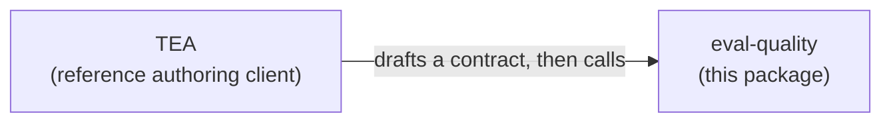

# `eval-quality`

### `eval-quality` does three things

1. **Compile**: validate and normalize an eval spec into a machine-readable artifact.
2. **Seal**: render the Markdown brief for the independent evaluator while hiding the planted bug and the scoring answer.
3. **Score**: compare the evaluator’s completed findings with the hidden bug signature to determine whether the bug was actually caught.

### What is the eval spec?

It is the test.

More precisely, it is the evaluator’s instructions for how to expose a failure and what evidence counts as finding it.

It defines:

- the behavior being evaluated;
- the probes the evaluator should perform;
- the evidence it should inspect;
- the negative behavior it must rule out;
- the oracle that determines pass or fail.

For example:

> Send malformed input.
> Confirm the request fails.
> Inspect the full response body.
> Confirm the expected error.
> Verify that no record was created.

The planted bug might be:

> The API returns the correct error but still creates the record.

A weak eval checks only the response and misses the bug.

A strong eval checks the response **and** persistence, so it catches the bug.

### Caveman version

**Write the eval. Hide the bug. See if the eval catches it.**

## Elaboration

**Compile disciplined agent eval contracts, then check whether those contracts can catch known bugs.**

An agent can produce an answer that reads as correct and is materially wrong. An eval can make the same mistake.

Weak oracle:

```text
Check malformed input is handled correctly.
```

An evaluator given that instruction sends one malformed request, sees an error come back, and reports success. The record that should never have been created was created anyway. Nobody looked.

Strong oracle:

```text
Send malformed input. Verify the request fails, inspect the full response body,
confirm the specific error, and confirm no record was created.
```

A passing eval says little when the contract never asked for the probe that would expose the failure. So the first thing worth testing is whether the eval can catch a failure you already know about.

```text
product spec
  → Behavioral Evaluation Contract
  → known defect or gameability probe
  → independent evaluator
  → per-oracle evidence and a gate decision
```

## What each part provides

`eval-quality` provides:

- the Behavioral Evaluation Contract schema
- the oracle vocabulary and authoring rules
- the contract compiler
- the environment pre-flight
- Eval Contract strength scoring
- versioned evidence output and PASS / WAIVED / CONCERNS / FAIL governance

The caller provides:

- execution of its chosen agent, harness, or person
- repeated trials
- cost accounting
- the live system and environment-probe implementation
- a sealed run record returned for ingestion

`eval-quality` executes nothing: it never spawns a process, calls a model, drives a system under test,
or invokes a judge. Its pure stages are compile, seal, ingest, pre-flight, score, and emit. Pre-flight
probes the fixture through the environment-probe port, so a contract that declares a fixture reset
needs the caller's probe policy to authorize that operation's method as well as the read methods
every other pre-flight leg uses. Engine integration is a later adapter behind a port, not a v0
dependency. See
[ADR-004](_bmad-output/planning-artifacts/architecture/architecture-eval-quality-2026-07-29/ADR-004-execution-boundary.md).

## Who it is for

Teams shipping AI agents, coding skills, review bots, MCP-based assistants, or automated test-generation systems, and teams operating human-on-the-loop or dark-factory delivery.

Use `eval-quality` when all three are true:

- An agent, skill, or model judgment is involved.
- A plausible-looking output can still be materially wrong.
- Observable evidence or probes can expose the wrong behavior.

Deterministic work does not need it and already has cheaper, stronger evidence from unit, integration, contract, E2E and performance testing.

## Behavioral Evaluation Contracts

A **Behavioral Evaluation Contract** is a versioned specification of the behaviors to probe, the evidence to collect, the negative cases to exercise, and the rules that decide whether the system passes or fails. **Eval Contract** is the shorthand used from here on. The individual checks inside it are **oracles**. The contract carries no prescribed action sequence; the evaluator chooses its own path.

The authoring discipline is a small set of rules that survived the experiments: separate the success indicator from the body, read the whole body, probe malformed and negative inputs, verify per record, and cross-check sibling parameters and sibling tools.

A compiler enforces these rules mechanically against the contract artifact, in three classes. Structural errors fail compilation. Coverage gaps score down without blocking. A waived pattern is allowed when it records the named rule, a rationale, a machine-checkable condition, and the approval.

## How Eval Contract strength scoring works

Do not trust a contract because it looks thorough. Put a known defect behind it, run the evaluator, and ask whether the contract's oracles caused the defect to be caught.

Two probe classes go behind a contract, and a strong contract rejects both:

- **Defect probes**, where the behavior is simply wrong.
- **Gameability probes**, where the behavior looks compliant while dodging the oracle's intent. A test that raises coverage while asserting nothing is the familiar version of this.

Probes come from qualified historical defects or verified controlled mutations. The corpus separates a visible development set from an immutable sealed set for each scoring version.

Every required oracle check resolves to exactly one state, and the state travels with the result, so
"the check reported" is never sufficient on its own: `caught`, `confirmed`, `missed`,
`passed-clean-control`, `false-positive`, `abstained`, `bypassed`, `unreached`, `oracle-error`,
`judge-error`, `infrastructure-error`, or `not-applicable`.

A required oracle that missed, abstained, errored, or is absent prevents PASS, and a high overall score never overrides it. An infrastructure error or a failed environment pre-flight is not a behavioral result at all; it invalidates the run and is re-executed rather than scored.

## Using it

`eval-quality` is its own repository and package, not a plugin inside another framework.

The **library** is the primary surface. It exports the contract schema, the oracle vocabulary, the compiler, the scorer, the pre-flight, and the evidence types. The published typed schema is what lets coding agents author contracts correctly by default, which is how the discipline scales beyond the people who went looking for the tool.

The **CLI** wraps the same library for callers that cannot import TypeScript: CI jobs, GitHub Actions, PR-review and unit-test bots, other frameworks' skills, and any agent permitted to run a shell command.

```bash
eval-quality compile   # validate a contract against the authoring discipline
eval-quality preflight # verify the measurement environment before scoring
eval-quality score     # score an ingested run record, report per-oracle outcomes
```

Commands are non-interactive by default, emit machine-readable output, and exit with a code reflecting the gate verdict. The library and CLI expose the same capabilities and produce the same versioned evidence artifact.

## Relationship with BMad and TEA

The dependency runs one way: TEA uses `eval-quality`, and `eval-quality` knows nothing about TEA.



TEA is the reference authoring client. It reads BMad planning artifacts, notices eval-relevant work, drafts a contract, and calls this package. It is not co-installed, and `eval-quality` holds no knowledge of TEA, BMad, or any planning-artifact format.

Any human, bot, CI job, skill, or other framework can author a contract and use `eval-quality` directly. The discipline still applies, because the compiler judges the artifact rather than trusting whoever produced it.

Evaluator runs remain isolated to prevent builder-context leakage and preserve traceability. Stronger contract oracles produced the measured detection improvement.

## Evidence and limitations

Holding the model, the budget, the system, and the defects fixed, and changing only how the Eval Contract was authored, sealed-evaluator detection moved from **0.33 to 1.00** across three naturally occurring defects, three repetitions per arm, 19 scored runs.

Both experiment rounds missed at least one preregistered gate. Round 1 recorded `DARK-FACTORY REJECTED`; round 2 block 1 recorded `CONTRACT-DISCIPLINE NOT SUPPORTED`, failing one gate of five on a single unreplicated clean control. The separation comes from two of the three defects, since both arms detected the third in every repetition, and both separating cases carry a recorded measurement-layer confound. The sample covers three defects, one system, and one model. This supports a product-direction decision at narrow scale. Certification would require broader replication.

Read the [product brief](_bmad-output/planning-artifacts/briefs/brief-eval-quality-2026-07-17/brief.md) for the product rationale and the [PRD](_bmad-output/planning-artifacts/prds/prd-eval-quality-2026-07-17/prd.md) for build requirements. The experiment record includes the [round 1 verdict](experiments/hypothesis-validation/DECISION.md), [round 2 results](experiments/hypothesis-validation/PHASE2-RESULTS.md), [metric summary](experiments/hypothesis-validation/results/summary.md), and [protocol](experiments/hypothesis-validation/HYPOTHESIS_VALIDATION_PLAN.md).

## Architecture status

The [architecture spine](_bmad-output/planning-artifacts/architecture/architecture-eval-quality-2026-07-29/ARCHITECTURE-SPINE.md) is **split by pipeline half. The compile-and-seal half is epic-ready; the score half is not.** Gate C closed at zero blocking authoring points and 14 of 14 declaration-only predicates. Gate D's generated-current-fields arm matched the hand-written positive control at 3 of 3 seeded-defect catches, so `seal` joins the stage-one order without adding an evidence-precondition field.

Contract strength scoring has been open since [ADR-007](_bmad-output/planning-artifacts/architecture/architecture-eval-quality-2026-07-29/ADR-007-compile-score-split.md): three rounds of external review established that the catch rate was 1.00 by construction, because nothing matched a finding to the defect its probe seeded. That input now exists and the mapping that reads it is owed to a reference implementation.

Contract compilation was declared ready in ADR-007 and a fourth review withdrew that claim in [ADR-008](_bmad-output/planning-artifacts/architecture/architecture-eval-quality-2026-07-29/ADR-008-compile-half-owed-to-calibration.md). The named calibration is now complete. The absent local-only mut2 arm was reconstructed from its recorded base, reproduced its prior black-box behavior, and ran under a pre-registered three-arm, three-repetition design. All three arms composed filters and detected the seeded defect in every valid repetition. This closes the calibration gate narrowly; it does not generalize the historical 0.33-to-1.00 effect beyond one behavior and one controlled mutation.

Both are documented as defects rather than dressed as decisions, because four rounds have shown that a confidently worded revision is the thing that goes wrong here.

The decision record, in order: [ADR-001](_bmad-output/planning-artifacts/architecture/architecture-eval-quality-2026-07-22/ADR-001-evaluator-isolation-boundary.md) on evaluator isolation, [ADR-002](_bmad-output/planning-artifacts/architecture/architecture-eval-quality-2026-07-22/ADR-002-contract-authoring-discipline.md) on why authoring discipline is the product, [ADR-003](_bmad-output/planning-artifacts/architecture/architecture-eval-quality-2026-07-29/ADR-003-measurement-mechanics.md) on measurement mechanics, [ADR-004](_bmad-output/planning-artifacts/architecture/architecture-eval-quality-2026-07-29/ADR-004-execution-boundary.md) on why this package executes nothing, [ADR-005](_bmad-output/planning-artifacts/architecture/architecture-eval-quality-2026-07-29/ADR-005-review-round-corrections.md) and [ADR-006](_bmad-output/planning-artifacts/architecture/architecture-eval-quality-2026-07-29/ADR-006-interaction-plan.md) on what review and hand-authoring corrected, [ADR-007](_bmad-output/planning-artifacts/architecture/architecture-eval-quality-2026-07-29/ADR-007-compile-score-split.md) on the split, [ADR-008](_bmad-output/planning-artifacts/architecture/architecture-eval-quality-2026-07-29/ADR-008-compile-half-owed-to-calibration.md) on why the other half stopped claiming to be finished too, and [ADR-009](_bmad-output/planning-artifacts/architecture/architecture-eval-quality-2026-07-29/ADR-009-adversarial-gate-corrections.md) on the seventeen places where two conforming implementations still disagreed. Review triage lives in [`reviews/`](_bmad-output/planning-artifacts/architecture/architecture-eval-quality-2026-07-29/reviews/).

## Not building now

Deferred until the contract layer is in real use: claim-to-evidence lineage, semantic checkpoint scoring, process and outcome separation, and first material error attribution.

Out of scope entirely: a new eval engine, a hosted service, a dashboard or GUI, multimodal evaluators, automatic prompt repair, and a generic judge-calibration platform.

## Development

```bash
npm install
npm run validate            # typecheck, lint, docs, shareable, spine, vectors, schemas, registries, AD-31 table, layers, tests
npm run build               # emit to dist/
npm run lint:fix            # auto-fix with Biome
npm run generate:schemas    # rebuild schemas/*.schema.json from the Zod source
npm run check:schemas       # fail if the committed schemas differ from the source by one byte
npm run check:ad5-registry  # fail if the failure-code list drifts from the AD-5 table
npm run generate:ad31-table # rebuild docs/ad31-coverage-predicates.generated.md from the predicates
npm run check:ad31-table    # fail if the committed AD-31 table differs from the builder by one byte
npm run build:shareable     # render the planning artifacts to self-contained HTML
npm run test:conformance    # run the published port conformance suite against every shipped adapter
```

`schemas/` holds the twelve published JSON Schema documents, generated from the Zod definitions and
committed. They are the contract for consumers who do not read TypeScript, so they are proven
equivalent to the source rather than assumed to be: a byte-exact drift check, a rejection suite
asserting the validator keyword and instance path for every negative fixture, a differential check
comparing Zod's verdict against a third-party validator's over a generated corpus, and a
keyword-mutation sweep that deletes each published constraint and requires some fixture to notice.
Edit the Zod schema and regenerate; never hand-edit a file under `schemas/`.

The `eval-quality/conformance` subpath publishes the port boundary: the four port types, the message
shapes they carry, and an executable conformance suite. An adapter is conforming when
`runCorpusPortConformance`, `runClockPortConformance`, `runFileSystemPortConformance`, or
`runEnvironmentProbePortConformance` returns a report whose `passed` is true, which is the definition
rather than a paraphrase of one; each returns a report instead of asserting, so the suite carries no
test framework and runs under whichever one you already use.

```ts
import { runCorpusPortConformance, type CorpusPort } from 'eval-quality/conformance'
```

The suite drives a subject through four scenarios and checks six assertions per port method: a
mechanism failure is a typed fault, exactly one underlying call happens on success and on failure, an
aborted signal rejects promptly, an in-band error value is thrown rather than returned, and a
successful call returns a response the published schema accepts. The environment-probe port adds
thirteen more from AD-35's default-deny target policy. `npm run test:conformance` runs the suite
against the three adapters this package ships and against an in-repository probe subject that exists
only as the suite's own subject.

`docs/ad31-coverage-predicates.generated.md` holds AD-31's published predicate table, emitted from
the seven relevance predicates and their seven satisfaction twins run over a hand-authored contract
corpus. It is generated by `npm run generate:ad31-table` and guarded by `npm run check:ad31-table`,
a byte-exact drift check that fails when a predicate changes and the committed document does not, so
the table is evidence the predicates produce rather than documentation kept beside them. Regenerate
rather than hand-edit it.

`build:shareable` renders this README, the product brief, the PRD, the architecture spine, all nine ADRs, and every document those pages link to (contributing, code of conduct, security, licence, and the four experiment records) to `_bmad-output/shareable/` as standalone styled HTML for sharing outside the repo. Rendering the linked documents is what lets a recipient without repository access follow the evidence, contribution, security, and licence links instead of hitting a 404; anything that has no page of its own, such as a directory, is marked in the export as needing repository access. Regenerate rather than hand-edit those files: `check:shareable` fails the build when the committed export is stale or carries a repository URL that is not the canonical one. Mermaid diagrams render as code blocks there, which is a known limitation.

## Contributing

See [CONTRIBUTING.md](CONTRIBUTING.md) and our [Code of Conduct](CODE_OF_CONDUCT.md).

## Security

See [SECURITY.md](SECURITY.md). Please do not open a public issue for vulnerabilities.

## License

Apache-2.0 &copy; Murat Ozcan. See [LICENSE](LICENSE).
