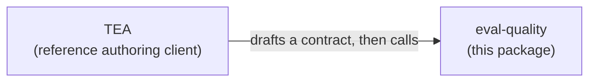

# `eval-quality`

**[Documentation](https://bmad-code-org.github.io/bmad-eval-quality/)** ·
[Getting started](https://bmad-code-org.github.io/bmad-eval-quality/tutorials/getting-started/) ·
[CLI reference](https://bmad-code-org.github.io/bmad-eval-quality/reference/cli-commands/) ·
[npm](https://www.npmjs.com/package/eval-quality)

```bash
npx eval-quality --help
```

### `eval-quality` does four things

1. **Compile**: validate and normalize an eval contract into a machine-readable artifact.
2. **Seal**: render the brief for the independent evaluator while hiding the planted bug and scoring answer.
3. **Preflight**: verify baseline environment readiness and probe reachability before running an evaluator.
4. **Score**: compare the evaluator's completed findings against the hidden bug signature and mint a versioned evidence artifact.

It executes nothing. No agent, no judge, and no system under test runs inside it; your harness runs the evaluation and hands over a sealed run record.

### What is the evaluation contract?

It is the test.

More precisely, it is the evaluator’s instructions for how to expose a failure and what evidence counts as finding it. The long name is Behavioral Evaluation Contract; the docs shorten it to eval contract or evaluation contract.

It defines:

- the behavior being evaluated;
- the probes the evaluator should perform;
- the evidence it should inspect;
- the negative behavior it must rule out;
- the oracle that determines pass or fail.

For example:

> Send malformed input.
> Confirm the request fails.
> Inspect the full response body.
> Confirm the expected error.
> Verify that no record was created.

The planted bug might be:

> The API returns the correct error but still creates the record.

A weak eval checks only the response and misses the bug.

A strong eval checks the response **and** persistence, so it catches the bug.

### Caveman summary

Write the eval. Hide the bug. See if the eval catches it.

## The core flow, in eight nouns

Every run of an evaluation walks the same order:

```text
evaluation contract → probe → observation → preflight → evidence → oracle → rubric → score / verdict
```

| Noun | What it is | Example |
| --- | --- | --- |
| **Evaluation contract** | What we want to measure: the behaviors, the checks, the interfaces a probe may touch, and the bounds a run stays inside. | "A PATCH that reports success has persisted the change." |
| **Probe** | How to poke the system to produce evidence: a test case, a call, a step. In scoring, a probe also names the defect it seeded. | "Update note n-1, then read it back." |
| **Observation** | What actually happened when the system was poked: the recorded status, headers, and body of one call. | `PATCH` returned 200 with the new title; the later `GET` returned the old one. |
| **Preflight** | Whether the environment and the observations are fit for meaningful measurement. | Both operations reachable, the fixture reset, the clean control clean. |
| **Evidence** | The recorded output, trajectory, and artifacts from the evaluation run: what the evaluator saw and what it claimed. | A finding citing the two observations above. |
| **Oracle** | The assertion: the relation that has to hold over the evidence. | The title sent equals the title read back. |
| **Rubric** | The grading guide for judgment-heavy quality, with anchored criteria a judge scores against. The judge runs outside the package and its scores arrive in the sealed run record. | Present only when a contract declares one. |
| **Score / verdict** | The combined result: did the evaluation catch the planted defect? `PASS`, `WAIVED`, `CONCERNS`, or `FAIL`, or Invalid when the run produced no verdict. | `FAIL`, exit code 2. |

The word evidence is used twice on purpose. The evidence in the flow is what the evaluator produced, and it reaches `score` inside a sealed run record. The evidence artifact is what `score` mints at the end: the outcomes, the verdict, the strength vector, and the exit code.

The four commands sit on that flow like this:

| Command | Reads | Writes |
| --- | --- | --- |
| `compile` | an authored contract | `eval-contract.json`, checked against the schema and the discipline rules |
| `seal` | a contract | `sealed-evaluator-brief.json`, the contract minus everything that would give the answer away |
| `preflight` | a contract, a probe list, observations | `preflight-verdict.json`, fit or unfit to measure |
| `score` | a sealed run record, the contract, a probe, the preflight verdict, a scoring policy, a caller-attested corpus digest, and the isolation manifest and evaluator configuration the record was produced under | `evidence-artifact.json`, and the verdict's own exit code |

## Elaboration

Compile disciplined agent eval contracts, then check whether those contracts can catch known bugs.

An agent can produce an answer that reads as correct and is materially wrong. An eval can make the same mistake.

Weak oracle:

```text
Check malformed input is handled correctly.
```

An evaluator given that instruction sends one malformed request, sees an error come back, and reports success. The record that should never have been created was created anyway. Nobody looked.

Strong oracle:

```text
Send malformed input. Verify the request fails, inspect the full response body,
confirm the specific error, and confirm no record was created.
```

A passing eval says little when the contract never asked for the probe that would expose the failure. Testing whether the eval can catch a failure you already know about is the first check worth running.

The loop that does that is a twin run. Keep the contract, the probes, the oracles, and the scoring policy fixed. Run the evaluator once against the clean system and once against the same system carrying one known defect. Score both runs. The contract is strong when the clean run passes and the mutated run degrades, and it has a blind spot when both stay green.

## What each part provides

`eval-quality` provides:

- the Behavioral Evaluation Contract schema
- the oracle vocabulary and authoring rules
- the contract compiler
- the environment pre-flight
- Eval Contract strength scoring: the AD-7 rate vector and dominance relation, implemented in
  `src/core/score/strength.ts` and reached by the `score` command
- PASS / WAIVED / CONCERNS / FAIL governance: both verdict ladders, implemented and total in
  `src/core/score/ladder.ts`, and the `score` command's own exit code
- versioned evidence output: `evidence-artifact.json`, implemented in `src/core/emit/emit.ts` and
  minted by the `score` command

The caller provides:

- execution of its chosen agent, harness, or person
- repeated trials
- cost accounting
- the live system and environment-probe implementation
- a sealed run record returned for ingestion

`eval-quality` executes nothing: it never spawns a process, calls a model, drives a system under test,
or invokes a judge. Its six stages are compile, seal, ingest, pre-flight, score, and emit, all pure,
and every one is reachable through the CLI and the library alike. That list is the declared stage
order; on the clock, ingest follows the evaluator run, so it sits after pre-flight and just before
score. Compile, seal, and pre-flight each
have their own command and their own exported function. `ingest`, `score`, and `emit` are reached
through the one `score` command and the one exported `runScore` call that chains them, per AD-14's
rule that a command exposes no more than the library itself calls. Pre-flight probes the fixture through the environment-probe port, so a contract that declares a fixture reset
needs the caller's probe policy to authorize that operation's method as well as the read methods
every other pre-flight leg uses. Engine integration is a later adapter behind a port. See
[ADR-004](_bmad-output/planning-artifacts/architecture/architecture-eval-quality-2026-07-29/ADR-004-execution-boundary.md).

## Who it is for

Teams shipping AI agents, coding skills, review bots, MCP-based assistants, or automated test-generation systems, and teams operating human-on-the-loop or dark-factory delivery.

Use `eval-quality` when all three are true:

- An agent, skill, or model judgment is involved.
- A plausible-looking output can still be materially wrong.
- Observable evidence or probes can expose the wrong behavior.

Deterministic work does not need it and already has cheaper, stronger evidence from unit, integration, contract, E2E and performance testing.

## Behavioral Evaluation Contracts

A **Behavioral Evaluation Contract** is a versioned specification of the behaviors to probe, the evidence to collect, the negative cases to exercise, and the rules that decide whether the system passes or fails. **Eval Contract** is the shorthand used from here on. The individual checks inside it are **oracles**. The contract carries no prescribed action sequence; the evaluator chooses its own path.

The authoring discipline is a small set of rules that survived the experiments: separate the success indicator from the body, read the whole body, probe malformed and negative inputs, verify per record, and cross-check sibling parameters and sibling tools.

A compiler enforces these rules mechanically against the contract artifact, in three classes. Structural errors fail compilation. Coverage gaps score down without blocking. A waived pattern is allowed when it records the named rule, a rationale, a machine-checkable condition, and the approval.

Rubrics compile under the same discipline: an anchored scale, a bounded length, named failure-mode penalties, rubric identifiers unique across the contract and criterion identifiers unique inside their own rubric, every criterion stating a question, and every criterion's evidence pointer resolving against the declared interfaces. Authored rubric text that asks a judge to grade the subject's own stated reasoning fails a closed-vocabulary check over the wording.

## How Eval Contract strength scoring works

The `score` command and its `runScore` library call compute it; `npm run generate:worked-example`
runs the same functions over the committed worked chain, and the
[Read a Scored Run](https://bmad-code-org.github.io/bmad-eval-quality/tutorials/read-a-scored-run/)
tutorial reads the result field by field. Do not trust a contract because it looks thorough. Put a known defect behind it, run the evaluator, and check whether the contract's oracles caused the defect to be caught.

Two probe classes go behind a contract, and a strong contract rejects both:

- **Defect probes**, where the behavior is simply wrong.
- **Gameability probes**, where the behavior looks compliant while dodging the oracle's intent. A test that raises coverage while asserting nothing is the familiar version of this.

Probes come from qualified historical defects or verified controlled mutations. The corpus separates a visible development set from an immutable sealed set for each scoring version. Only the development set exists today; the sealed set is part of the design and ships in no release yet.

Every required oracle check resolves to exactly one state, and the state travels with the result, so
"the check reported" is never sufficient on its own: `caught`, `confirmed`, `missed`,
`passed-clean-control`, `false-positive`, `abstained`, `bypassed`, `unreached`, `oracle-error`,
`judge-error`, `infrastructure-error`, or `not-applicable`.

A required oracle that missed, abstained, errored, or is absent prevents PASS, and a high overall score never overrides it. An infrastructure error or a failed environment pre-flight is not a behavioral result at all; it invalidates the run, and the run is re-executed.

Repeated runs of one probe are trials, and they reduce to one result per probe before any rate is computed. The `score` stage takes a trial set; the `score` command and `runScore` hand it one sealed run record per call, so a run scored from the published surface completes one trial, and against a policy declaring a minimum of three, as the worked example's does, its strength vector is reported and marked non-comparable.

## Using it

`eval-quality` is its own repository and package, with no framework around it.

The **library** is the primary surface. It exports the artifact types, the compiler, the pre-flight, `runScore`, the canonical digest, the lineage validator, and the failure-code and verdict registries. The Zod schemas themselves are not exported; they are published as JSON Schema under `eval-quality/schemas/*`. The published typed schema is what lets coding agents author contracts correctly by default, which is how the discipline scales beyond the people who went looking for the tool.

The **CLI** wraps the same library for callers that cannot import TypeScript: CI jobs, GitHub Actions, PR-review and unit-test bots, other frameworks' skills, and any agent permitted to run a shell command.

### What the CLI Commands Do

- **`compile`**: Typechecks an authored `eval-contract.json`. Verifies that all behaviors, oracles, rubrics, and sensitivity witnesses comply with structural and authoring rules.
- **`seal`**: Generates a `sealed-evaluator-brief.json` by stripping secret defect signatures, planted answers, and author commentary. The brief carries only the directions and safety bounds the evaluator needs.
- **`preflight`**: Reduces caller-supplied probe observations against the contract to verify environment baseline readiness and probe reachability. All four of `--contract`, `--probes`, `--observations`, and `--run-id` are required. Halts early with exit code `3` if the environment is unready. `schemas/probe.schema.json` gives the shape of one probe in the list; each observation echoes a planned leg's id back as `probeId`, and the getting-started tutorial writes six by hand.
- **`score`**: Chains ingest, score, and emit over one sealed run record, minting `evidence-artifact.json` and exiting with the AD-21 verdict's own exit code. `schemas/sealed-run-record.schema.json` gives the record's shape, and the committed worked chain under `_bmad-output/planning-artifacts/architecture/architecture-eval-quality-2026-07-29/spike-worked-example/` carries one, scored. `--record`, `--contract`, `--probe`, `--preflight-verdict`, `--policy`, and `--corpus-digest` are required; `--isolation-manifest` and `--evaluator-configuration` are each optional and their absence invalidates the run and the command still parses; `--private-manifest` is optional and, when given, each entry's declared digest is checked against its resolved bytes. `--corpus-root` names the directory a private reference resolves under, and is required only when `--private-manifest` or a private-storage isolation-manifest reference is actually present.

### Running the CLI

Every command runs through `npx` without installing anything:

```bash
npx eval-quality compile --in contract.json --out ./eval-out

npx eval-quality seal --in contract.json --out ./eval-out

npx eval-quality preflight --contract contract.json \
  --probes probes.json --observations observations.json \
  --run-id 2026-08-28-a --out ./eval-out

npx eval-quality score --record record.json --contract contract.json \
  --probe probe.json --preflight-verdict preflight-verdict.json \
  --policy policy.json --corpus-digest <digest> \
  --out ./eval-out
```

Every command is non-interactive: no prompt, no terminal check, and no behaviour that differs when
stdin is a pipe. Each one is a single call into the library plus artifact serialization.

**Input and output.** `--in` is the only input that falls back to stdin: `compile` and `seal` read it
when `--in` is left out. `-` names stdin explicitly on any input, and at most one input may be `-` per
invocation. `compile` and `seal` each take one input; `preflight` takes three, all required; `score`
takes eight, three of them optional (`--isolation-manifest`, `--evaluator-configuration`, and
`--private-manifest`). Without `--out` the artifact goes to stdout, so a command composes with a pipe.
An `--out` ending in `.json` is a file path; anything else is a directory, and the artifact is
written to `<target>/<kind>.json` where `kind` is `eval-contract`, `sealed-evaluator-brief`,
`preflight-verdict`, or `evidence-artifact`. Diagnostics and errors go to stderr, always, so stdout
carries the artifact alone.

**Exit codes.**

| Exit Code | Meaning |
| --- | --- |
| `0` | success, and every verdict other than FAIL or a promoted CONCERNS |
| `1` | CONCERNS promoted by `--strict` |
| `2` | FAIL |
| `3` | invalid: a failed pre-flight, or any other AD-21 invalidating condition |
| `4` | structural failure |
| `5` | runtime fault |
| `64` | usage error |

`--strict` never promotes a CONCERNS whose firing conditions are all evidence conditions: those
conditions report that the measurement fell short of the policy. Codes 1 and 2 report a verdict
`score`'s ladder resolved, read directly off `LadderResolution.exitCode`; every other invalidating
condition behind code 3 is reachable through `score` too, alongside the failed pre-flight `preflight`
itself reports.

`--strict` is the gate-promotion flag and is accepted on every command. `--strict-inputs` and
`--no-strict-inputs` are a different switch: they set the compiler's input strictness, which is on
by default, and `preflight` and `score` each reject both with exit `64` because neither has a compile
step.

**The published JSON Schema.** A consumer that does not read TypeScript validates against the
twelve generated documents, published at the `eval-quality/schemas/*` subpath:

```ts
import spec from 'eval-quality/schemas/eval-contract.schema.json' with { type: 'json' }
```

The import attribute is required: ESM on Node 22 and 24 both throw `ERR_IMPORT_ATTRIBUTE_MISSING`
without it. The development corpus ships the same way, at `eval-quality/corpus/dev/`, so an adopter
can read real compiled contracts and one compiled-and-sealed pair without cloning this repository.
`eval-quality/adapters` is one of the five published subpaths, holding the three reference adapters
the conformance suite runs against.

Eleven of the twelve published schemas carry a `schemaVersion`. `artifact-reference` is exempt: it
is embedded inside other artifacts, so it has no version to break.

`schemaVersion` is declared as any integer at or above 1, so a document at an unexpected version
parses. The bumps in the next release each add a required field, which is why an older document
fails; the version itself is compared in exactly one place, `validateLineageChain`, over
lineage-chain members, and nowhere on the command path. The package is pre-1.0, so pin exactly.
`CHANGELOG.md` records what each release breaks.

## Relationship with BMad and TEA

The dependency runs one way: TEA uses `eval-quality`, and `eval-quality` knows nothing about TEA.



TEA is the reference authoring client. It reads BMad planning artifacts, notices eval-relevant work, drafts a contract, and calls this package. It is not co-installed, and `eval-quality` holds no knowledge of TEA, BMad, or any planning-artifact format.

Any human, bot, CI job, skill, or other framework can author a contract and use `eval-quality` directly. The discipline still applies, because the compiler judges the artifact, whoever produced it.

Evaluator runs remain isolated to prevent builder-context leakage and preserve traceability. Stronger contract oracles produced the measured detection improvement.

### Real-World Walkthrough: Testing a `bmad-tea` Knowledge Harness
1. Author an `eval-contract.json` declaring required knowledge step files (e.g. `playwright-utils-mandate.md`).
2. Run `eval-quality compile --in contract.json` to validate contract structure and discipline rules.
3. Run `eval-quality seal --in contract.json --out ./run` to generate `sealed-evaluator-brief.json`.
4. Probe the harness's environment and run `eval-quality preflight` over the observations; a verdict that does not pass is exit `3`, and the run stops there.
5. Pass `sealed-evaluator-brief.json` to `bmad-tea` to execute the task without seeing answer keys, once against the clean harness and once against a harness with one known step file removed.
6. Seal each evaluator run into a `sealed-run-record.json` and run `eval-quality score` over it with the probe that names the removed file as the seeded defect. The clean run should pass; the mutated run should degrade, and the exit code says which.

## Evidence and limitations

Holding the model, the budget, the system, and the defects fixed, and changing only how the Eval Contract was authored, sealed-evaluator detection moved from **0.33 to 1.00** across three naturally occurring defects, three repetitions per arm, 19 scored runs.

Both experiment rounds missed at least one preregistered gate. Round 1 recorded `DARK-FACTORY REJECTED`; round 2 block 1 recorded `CONTRACT-DISCIPLINE NOT SUPPORTED`, failing one gate of five on a single unreplicated clean control. The separation comes from two of the three defects, since both arms detected the third in every repetition, and both separating cases carry a recorded measurement-layer confound. The sample covers three defects, one system, and one model. This supports a product-direction decision at narrow scale. Certification would require broader replication.

Read the [product brief](_bmad-output/planning-artifacts/briefs/brief-eval-quality-2026-07-17/brief.md) for the product rationale and the [PRD](_bmad-output/planning-artifacts/prds/prd-eval-quality-2026-07-17/prd.md) for build requirements. The experiment record includes the [round 1 verdict](experiments/hypothesis-validation/DECISION.md), [round 2 results](experiments/hypothesis-validation/PHASE2-RESULTS.md), [metric summary](experiments/hypothesis-validation/results/summary.md), and [protocol](experiments/hypothesis-validation/HYPOTHESIS_VALIDATION_PLAN.md).

## Architecture status

The [architecture spine](_bmad-output/planning-artifacts/architecture/architecture-eval-quality-2026-07-29/ARCHITECTURE-SPINE.md) is split by pipeline half, and its own status line still reads that the compile-and-seal half is epic-ready while the score half is not. The code has moved past that line. Epic 7 delivered AD-21, AD-33, and AD-40 as pure functions with generated tables, and epic 8 shipped the `ingest`, `score`, and `emit` stages, the `score` command, and `runScore` over them, which closes every item the spine's *Owed to the reference implementation* section listed. The `score` stage consumes a trial set; the command and `runScore` hand it one record per call, so a run scored from the published surface completes one trial, and whenever the policy's declared minimum exceeds one its strength vector is reported and marked non-comparable. Gate C closed at zero blocking authoring points and 14 of 14 declaration-only predicates. Gate D's generated-current-fields arm matched the hand-written positive control at 3 of 3 seeded-defect catches, so `seal` joins the stage-one order without adding an evidence-precondition field.

Contract strength scoring has been open since [ADR-007](_bmad-output/planning-artifacts/architecture/architecture-eval-quality-2026-07-29/ADR-007-compile-score-split.md): three rounds of external review established that the catch rate was 1.00 by construction, because nothing matched a finding to the defect its probe seeded. That input now exists, and so does the mapping that reads it: `src/core/score/witness.ts` is AD-40's witness match, delivered by epic 7. What is still owed is its validation against the block-2 replication, which the spine records as committed and not yet run.

Contract compilation was declared ready in ADR-007 and a fourth review withdrew that claim in [ADR-008](_bmad-output/planning-artifacts/architecture/architecture-eval-quality-2026-07-29/ADR-008-compile-half-owed-to-calibration.md). The named calibration is now complete. The absent local-only mut2 arm was reconstructed from its recorded base, reproduced its prior black-box behavior, and ran under a pre-registered three-arm, three-repetition design. All three arms composed filters and detected the seeded defect in every valid repetition. This closes the calibration gate narrowly; it does not generalize the historical 0.33-to-1.00 effect beyond one behavior and one controlled mutation.

Both are documented as defects, because four rounds have shown that a confidently worded revision is the thing that goes wrong here.

The decision record, in order: [ADR-001](_bmad-output/planning-artifacts/architecture/architecture-eval-quality-2026-07-22/ADR-001-evaluator-isolation-boundary.md) on evaluator isolation, [ADR-002](_bmad-output/planning-artifacts/architecture/architecture-eval-quality-2026-07-22/ADR-002-contract-authoring-discipline.md) on why authoring discipline is the product, [ADR-003](_bmad-output/planning-artifacts/architecture/architecture-eval-quality-2026-07-29/ADR-003-measurement-mechanics.md) on measurement mechanics, [ADR-004](_bmad-output/planning-artifacts/architecture/architecture-eval-quality-2026-07-29/ADR-004-execution-boundary.md) on why this package executes nothing, [ADR-005](_bmad-output/planning-artifacts/architecture/architecture-eval-quality-2026-07-29/ADR-005-review-round-corrections.md) and [ADR-006](_bmad-output/planning-artifacts/architecture/architecture-eval-quality-2026-07-29/ADR-006-interaction-plan.md) on what review and hand-authoring corrected, [ADR-007](_bmad-output/planning-artifacts/architecture/architecture-eval-quality-2026-07-29/ADR-007-compile-score-split.md) on the split, [ADR-008](_bmad-output/planning-artifacts/architecture/architecture-eval-quality-2026-07-29/ADR-008-compile-half-owed-to-calibration.md) on why the other half stopped claiming to be finished too, and [ADR-009](_bmad-output/planning-artifacts/architecture/architecture-eval-quality-2026-07-29/ADR-009-adversarial-gate-corrections.md) on the seventeen places where two conforming implementations still disagreed. Review triage lives in [`reviews/`](_bmad-output/planning-artifacts/architecture/architecture-eval-quality-2026-07-29/reviews/).

## Not building now

Deferred until the contract layer is in real use: claim-to-evidence lineage, semantic checkpoint scoring, process and outcome separation, and first material error attribution.

Out of scope entirely: a new eval engine, a hosted service, a dashboard or GUI, multimodal evaluators, automatic prompt repair, and a generic judge-calibration platform.

## Development

Node `>=22.20.0`, which `package.json` declares as the engine floor. `zod` is the only production
dependency.

```bash
npm install
npm run validate            # build, typecheck, lint, docs, doc invocations, shareable, spine, vectors, schemas, both code registries, the AD-21, AD-31 and AD-33 tables, layers, lineage, boundary, corpus, worked chain, website deps, tests with coverage
npm run build               # emit to dist/
npm run lint:fix            # auto-fix with Biome
npm run test:coverage       # run the suite and fail below AD-30's 90 percent statement and branch floor on core/
npm run generate:schemas    # rebuild schemas/*.schema.json from the Zod source
npm run check:schemas       # fail if the committed schemas differ from the source by one byte
npm run check:ad5-registry  # fail if the compile-time failure-code list drifts from the AD-5 table
npm run check:ad28-registry # fail if the runtime fault-code list drifts from the AD-28 table
npm run check:lineage       # fail if a module outside the stage table writes an artifact's lineage fields
npm run check:boundary      # fail if anything the tarball carries references the planning system that produced it
npm run generate:ad21-table # rebuild docs/ad21-verdict-decision.generated.md from the two verdict ladders
npm run check:ad21-table    # fail if the committed AD-21 table differs from the builder by one byte
npm run generate:ad31-table # rebuild docs/ad31-coverage-predicates.generated.md from the predicates
npm run check:ad31-table    # fail if the committed AD-31 table differs from the builder by one byte
npm run generate:ad33-table # rebuild docs/ad33-outcome-decision.generated.md from the decision procedure
npm run check:ad33-table    # fail if the committed AD-33 table differs from the builder by one byte
npm run generate:dev-corpus # rebuild corpus/dev/ from the contract fixtures through the shipped compile and seal
npm run check:corpus        # fail if the committed corpus differs from the builder by one byte
npm run generate:worked-example # rebuild the spike worked chain by running the compile, seal, score, and emit functions over it
npm run check:worked-example    # fail if the committed worked chain differs from the builder by one byte
npm run build:shareable     # render the planning artifacts to self-contained HTML
npm run test:conformance    # run the published port conformance suite against every shipped adapter
```

`schemas/` holds the twelve published JSON Schema documents, generated from the Zod definitions and
committed. They are the contract for consumers who do not read TypeScript, so they are proven
equivalent to the source: a byte-exact drift check, a rejection suite
asserting the validator keyword and instance path for every negative fixture, a differential check
comparing Zod's verdict against a third-party validator's over a generated corpus, and a
keyword-mutation sweep that deletes each published constraint and requires some fixture to notice.
Edit the Zod schema and regenerate; never hand-edit a file under `schemas/`.

Every artifact the library hands back is deep-frozen, so it cannot be changed in place. This package
is ES modules, which are always strict, so an attempt throws a `TypeError` there; a sloppy-mode
caller sees the write fail silently. A revision is minted as a new artifact carrying its parent's
digest and a revision count one greater. `check:lineage` fails the build when a lineage field is
written outside `src/core/schemas/`, `src/core/lineage/`, and the modules the AD-24 stage table
names as that artifact's producer, which today are `src/core/seal/seal.ts`,
`src/core/preflight/reduce.ts`, and `src/core/emit/emit.ts`.

The `eval-quality/conformance` subpath publishes the port boundary: the four port types, the message
shapes they carry, the AD-28 `RUNTIME_FAULT_CODES` registry and `RuntimeFaultCode` type a conforming
adapter throws against, and an executable conformance suite. An adapter is conforming when
`runCorpusPortConformance`, `runClockPortConformance`, `runFileSystemPortConformance`, or
`runEnvironmentProbePortConformance` returns a report whose `passed` is true, which is the definition;
each returns a report, so the suite carries no test framework and runs under whichever one you
already use.

```ts
import { runCorpusPortConformance, type CorpusPort } from 'eval-quality/conformance'
```

The suite drives a subject through four scenarios and checks six assertions per port method: a
mechanism failure is a typed fault, exactly one underlying call happens on success and on failure, an
aborted signal rejects promptly, an in-band error value is thrown as a fault, and a
successful call returns a response the published schema accepts. The environment-probe port adds
thirteen more from AD-35's default-deny target policy. `npm run test:conformance` runs the suite
against the three adapters this package ships and against an in-repository probe subject that exists
only as the suite's own subject.

`docs/ad21-verdict-decision.generated.md` holds AD-21's two published verdict ladders, production and
contract-scoring, emitted from the rule tables in `src/core/score/ladder.ts` together with the
fixtures that exercise them, and guarded by `npm run check:ad21-table`. Each row carries its
condition, its rung, the guard in prose, and whether `--strict` may promote it.

`docs/ad31-coverage-predicates.generated.md` holds AD-31's published predicate table, emitted from
the seven relevance predicates and their seven satisfaction twins run over a hand-authored contract
corpus. It is generated by `npm run generate:ad31-table` and guarded by `npm run check:ad31-table`,
a byte-exact drift check that fails when a predicate changes and the committed document does not, so
the table is evidence the predicates produce. A hand edit fails the check; regenerate.

`docs/ad33-outcome-decision.generated.md` holds AD-33's published decision table: the ten
invalidating conditions, the twenty-row outcome ladder, the two waiver rules, the eight
corroboration rules, the named structural constraints with the infeasible input pairs derived from
them, and five censuses over the fixture set. It is generated by `npm run generate:ad33-table` and
guarded by `npm run check:ad33-table`, the same byte-exact drift check, and the builder refuses to
publish a census cell at zero, so a rule or a state losing its last fixture fails the build. AD-33
puts a cell-per-input-tuple table out of arithmetic reach, so what is published is the enumerated
output of the total function itself. A hand edit fails the check; regenerate.

`build:shareable` renders this README, the product brief, the PRD, the architecture spine, all nine ADRs, and every document those pages link to (contributing, code of conduct, security, licence, and the four experiment records) to `_bmad-output/shareable/` as standalone styled HTML for sharing outside the repo. Rendering the linked documents is what lets a recipient without repository access follow the evidence, contribution, security, and licence links; anything that has no page of its own, such as a directory, is marked in the export as needing repository access. A hand edit fails the check; regenerate: `check:shareable` fails the build when the committed export is stale or carries a repository URL that is not the canonical one. Mermaid diagrams render as code blocks there, which is a known limitation.

## Contributing

See [CONTRIBUTING.md](CONTRIBUTING.md) and our [Code of Conduct](CODE_OF_CONDUCT.md).

## Security

See [SECURITY.md](SECURITY.md). Please do not open a public issue for vulnerabilities.

## License

Apache-2.0 © Murat Ozcan. See [LICENSE](LICENSE).
