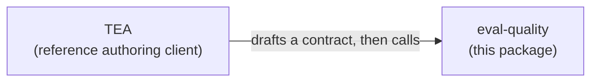

# `eval-quality`

**[Documentation](https://bmad-code-org.github.io/bmad-eval-quality/)** ·
[Start here](https://bmad-code-org.github.io/bmad-eval-quality/tutorials/getting-started/) ·
[CLI reference](https://bmad-code-org.github.io/bmad-eval-quality/reference/cli-commands/) ·
[npm](https://www.npmjs.com/package/eval-quality)

Write the eval. Hide the bug. See if the eval catches it.

```bash
npx eval-quality --help
```

## The idea

An AI evaluation can pass and prove nothing. It sends a request, sees something plausible come back, and reports success while the failure it was written to catch sits right next to the thing it looked at. That is a blind spot, and a green run never shows you one.

Mutation testing finds blind spots in ordinary tests: keep the tests fixed, plant a known defect in the code, run the tests again, and ask whether they caught it. `eval-quality` points the same idea at evaluations.

```text
clean system    → evaluation → should pass
mutated system  → evaluation → should degrade
                                    ↓
                       did the evaluation catch it?
```

An evaluation that caught the planted defect is sensitive to that failure. One that stayed green has a blind spot, and now you know where.

## The evaluation contract

The contract is the test: the evaluator's instructions for how to expose a failure and what evidence counts as finding it. The long name is Behavioral Evaluation Contract; the docs shorten it to eval contract. It is a JSON document that declares:

- the behavior being evaluated;
- the probes the evaluator should perform;
- the evidence it should inspect;
- the negative behavior it must rule out;
- the oracle that decides pass or fail.

For example:

> Send malformed input.
> Confirm the request fails.
> Inspect the full response body.
> Confirm the expected error.
> Verify that no record was created.

The planted bug might be:

> The API returns the correct error but still creates the record.

A weak eval checks only the response and misses the bug.

A strong eval checks the response **and** persistence, so it catches the bug.

## The core flow, in eight nouns

Every run of an evaluation walks the same order:

```text
evaluation contract → probe → observation → preflight → evidence → oracle → rubric → score / verdict
```

| Noun | What it is | Example |
| --- | --- | --- |
| **Evaluation contract** | What we want to measure: the behaviors, the checks, the interfaces a probe may touch, and the bounds a run stays inside. | "A PATCH that reports success has persisted the change." |
| **Probe** | How to poke the system to produce evidence: a test case, a call, a step. In scoring, a probe also names the defect it seeded. | "Update note n-1, then read it back." |
| **Observation** | What actually happened when the system was poked: the recorded status, headers, and body of one call. | `PATCH` returned 200 with the new title; the later `GET` returned the old one. |
| **Preflight** | Whether the environment and the observations are fit for meaningful measurement. | Both operations reachable, the fixture reset, the clean control clean. |
| **Evidence** | The recorded output, trajectory, and artifacts from the evaluation run: what the oracles resolve against. | A finding citing the two observations above. |
| **Oracle** | The assertion: the relation that has to hold over the evidence. | The title sent equals the title read back. |
| **Rubric** | The grading guide for judgment-heavy quality, with anchored criteria a judge scores against. The judge runs outside the package and its scores arrive in the sealed run record. | Present only when a contract declares one. |
| **Score / verdict** | The combined result: did the evaluation catch the planted defect? `PASS`, `WAIVED`, `CONCERNS`, or `FAIL`, or Invalid when the run produced no verdict. | `FAIL`, exit code 2. |

The word evidence is used twice on purpose. The evidence in the flow is what the evaluator produced, and it reaches `score` inside a sealed run record. The evidence artifact is what `score` mints at the end: the outcomes, the verdict, the strength vector, and the exit code.

## What the tool does

`eval-quality` is a Node package and a command line binary. It gives you four commands, which sit on the flow like this:

| Command | Reads | Writes |
| --- | --- | --- |
| `compile` | an authored contract | `eval-contract.json`, checked against the schema and the discipline rules |
| `seal` | a contract | `sealed-evaluator-brief.json`, the contract minus everything that would give the answer away |
| `preflight` | a contract, a probe list, observations | `preflight-verdict.json`, fit or unfit to measure |
| `score` | a sealed run record, the contract, a probe, the preflight verdict, a scoring policy, a caller-attested corpus digest, and the isolation manifest and evaluator configuration the record was produced under | `evidence-artifact.json`, and the verdict's own exit code |

It executes nothing. No agent, no judge, and no system under test runs inside it. You run the agent or harness, the repeated trials, and the live system with its environment probe, and you hand over a sealed run record. `eval-quality` compiles, seals, preflights, and scores.

## Who it is for

Teams shipping AI agents, coding skills, review bots, MCP-based assistants, or automated test-generation systems, and teams that let agents ship with little or no human review.

Use `eval-quality` when all three are true:

- An agent, skill, or model judgment is involved.
- A plausible-looking output can still be materially wrong.
- Observable evidence or probes can expose the wrong behavior.

Deterministic work does not need it and already has cheaper, stronger evidence from unit, integration, contract, E2E and performance testing.

## The authoring discipline

A contract carries no prescribed action sequence; the evaluator chooses its own path. What the contract fixes is seven rules that survived the experiments: separate the success indicator from the body, read the whole body, probe malformed and negative inputs, verify per record, cross-check sibling parameters and sibling tools, check for omissions and completeness, and read a state change back after writing it.

The compiler enforces those rules against the contract artifact, in three classes. Structural errors fail compilation. Coverage gaps score down without blocking. A waived rule is allowed when the waiver records the rule name, a rationale, a machine-checkable condition, and the approval.

Rubrics compile under the same discipline: an anchored scale, named criteria that each state a question, and evidence pointers that resolve against the declared interfaces.

## How contract strength is scored

Do not trust a contract because it looks thorough. Put a known defect behind it, run the evaluator, and check whether the contract's oracles caused the defect to be caught.

Three probe classes go behind a contract, and a strong contract catches all three:

- **Defect probes**, where the behavior is simply wrong.
- **Gameability probes**, where the behavior looks compliant while dodging the oracle's intent. A test that raises coverage while asserting nothing is the familiar version of this.
- **Zero-action probes**, where the system does nothing and reports success.

Canary probes and clean controls are run too, and never enter the strength vector.

Every required oracle check resolves to exactly one of twelve states, and the state travels with the result: `caught`, `confirmed`, `missed`, `passed-clean-control`, `false-positive`, `abstained`, `bypassed`, `unreached`, `oracle-error`, `judge-error`, `infrastructure-error`, or `not-applicable`. A required oracle that missed, abstained, errored, or is absent prevents PASS, and a high overall score never overrides it. An infrastructure error or a failed pre-flight invalidates the run; run it again.

A caught defect is decided by evidence. A finding counts as detection only when the probe's declared defect signature matches an observation the finding cites; the evaluator's own claim does not settle it.

Repeated runs of one probe are trials, reduced to one result per probe before any rate is computed. The `score` command and `runScore` hand the stage one sealed run record per call, so against a policy that asks for more than one trial the strength vector is reported and marked non-comparable.

[The full walkthrough](https://bmad-code-org.github.io/bmad-eval-quality/how-to/author-behavioral-contracts/) reads a scored run field by field, down to its verdict and exit code.

## Using it

Node.js 22.20.0 or newer. `zod` is the only production dependency.

```bash
npm install eval-quality
```

Every command runs through `npx`:

```bash
npx eval-quality compile --in contract.json --out ./eval-out

npx eval-quality seal --in contract.json --out ./eval-out

npx eval-quality preflight --contract contract.json \
  --probes probes.json --observations observations.json \
  --run-id 2026-08-28-a --out ./eval-out

npx eval-quality score --record record.json --contract contract.json \
  --probe probe.json --preflight-verdict preflight-verdict.json \
  --policy policy.json --corpus-digest <digest> \
  --out ./eval-out
```

Every command is non-interactive. Without `--out` the artifact goes to stdout, so a command composes with a pipe. An `--out` ending in `.json` is a file path; anything else is a directory, and the artifact lands at `<target>/<kind>.json`. Diagnostics and errors go to stderr, so stdout carries the artifact alone.

**Exit codes.**

| Exit Code | Meaning |
| --- | --- |
| `0` | success, and every verdict other than FAIL or a promoted CONCERNS |
| `1` | CONCERNS promoted by `--strict` |
| `2` | FAIL |
| `3` | invalid: a failed pre-flight, or any other AD-21 invalidating condition |
| `4` | structural failure |
| `5` | runtime fault |
| `64` | usage error |

`--strict` never promotes a CONCERNS whose firing conditions are all evidence conditions: those report that the measurement fell short of the policy. Codes 1 and 2 come from `score`'s verdict ladder. Code 3 comes from a failed pre-flight, which `preflight` reports, or from any other invalidating condition `score` finds.

`--strict` is accepted on every command. `--strict-inputs` and `--no-strict-inputs` are a different switch: they set the compiler's input strictness, on by default, and only `compile` and `seal` accept them.

The [CLI reference](https://bmad-code-org.github.io/bmad-eval-quality/reference/cli-commands/) has every flag, every parsing rule, and the package exports.

**The library** exports the same stages as functions, plus the artifact types, the canonical digest, the lineage validator, and the failure-code and verdict registries. The schemas are published as JSON Schema under `eval-quality/schemas/*`, which is what lets a coding agent author contracts correctly by default:

```ts
import spec from 'eval-quality/schemas/eval-contract.schema.json' with { type: 'json' }
```

The import attribute is required: ESM on Node 22 and 24 both throw `ERR_IMPORT_ATTRIBUTE_MISSING` without it. The development corpus ships the same way, at `eval-quality/corpus/dev/`, so you can read twenty-two real contracts and one compiled-and-sealed pair without cloning this repository.

Version 1.0 is out and the published surface is stable: a breaking change to a command, an export, or a schema is a major version bump. `compile` refuses a contract whose `schemaVersion` differs from the one this build reads, so check the stamp on anything you did not author against this version. `CHANGELOG.md` records what each release breaks.

## Relationship with BMad and TEA

TEA is the BMad Test Architect. The dependency runs one way: TEA uses `eval-quality`, and `eval-quality` knows nothing about TEA.



TEA is the reference authoring client. It reads BMad planning artifacts, notices eval-relevant work, drafts a contract, and calls this package. Any human, bot, CI job, skill, or other framework can author a contract and use `eval-quality` directly. The compiler judges the artifact, whoever produced it.

### Example: testing a `bmad-tea` knowledge harness

1. Author an `eval-contract.json` declaring the required knowledge step files (for example `playwright-utils-mandate.md`).
2. Run `eval-quality compile --in contract.json` to check the contract's structure and discipline rules.
3. Run `eval-quality seal --in contract.json --out ./run` to produce `sealed-evaluator-brief.json`.
4. Probe the harness's environment and run `eval-quality preflight` over the observations. A verdict that does not pass is exit `3`, and the run stops there.
5. Hand `sealed-evaluator-brief.json` to `bmad-tea` to execute the task without seeing answer keys, once against the clean harness and once against a harness with one known step file removed.
6. Seal each evaluator run into a `sealed-run-record.json` and run `eval-quality score` over it with the probe that names the removed file as the seeded defect. The clean run should pass; the mutated run should degrade, and the exit code says which.

## Evidence and limitations

Holding the model, the budget, the system, and the defects fixed, and changing only how the eval contract was authored, sealed-evaluator detection moved from **0.33 to 1.00** across three naturally occurring defects, three repetitions per arm, 19 scored runs.

Both experiment rounds missed at least one preregistered gate; round 2 failed one gate of five on a single unreplicated clean control. The separation comes from two of the three defects, since both arms detected the third in every repetition, and both separating cases carry a recorded measurement-layer confound. The sample covers three defects, one system, and one model. This supports a product-direction decision at narrow scale. Certification would require broader replication.

Read the [product brief](_bmad-output/planning-artifacts/briefs/brief-eval-quality-2026-07-17/brief.md) for the product rationale and the [PRD](_bmad-output/planning-artifacts/prds/prd-eval-quality-2026-07-17/prd.md) for build requirements. The experiment record includes the [round 1 verdict](experiments/hypothesis-validation/DECISION.md), [round 2 results](experiments/hypothesis-validation/PHASE2-RESULTS.md), [metric summary](experiments/hypothesis-validation/results/summary.md), and [protocol](experiments/hypothesis-validation/HYPOTHESIS_VALIDATION_PLAN.md).

The design record is the [architecture spine](_bmad-output/planning-artifacts/architecture/architecture-eval-quality-2026-07-29/ARCHITECTURE-SPINE.md), its nine decision records, and the review triage in [`reviews/`](_bmad-output/planning-artifacts/architecture/architecture-eval-quality-2026-07-29/reviews/).

## Not building now

Deferred until the contract layer is in real use: claim-to-evidence lineage, semantic checkpoint scoring, process and outcome separation, and first material error attribution.

Out of scope entirely: a new eval engine, a hosted service, a dashboard or GUI, multimodal evaluators, automatic prompt repair, and a generic judge-calibration platform.

## Development

```bash
npm install
npm run validate            # the whole gate: build, typecheck, lint, every drift check, tests with coverage
npm run build               # emit to dist/
npm run test                # run the suite once
npm run lint:fix            # auto-fix with Biome
npm run test:conformance    # run the published port conformance suite over the shipped adapters
```

Several files are generated from the code and guarded byte for byte, so a hand edit fails the build. Regenerate them:

| Generated | Rebuild | Guard |
| --- | --- | --- |
| `schemas/*.schema.json`, from the Zod source | `npm run generate:schemas` | `npm run check:schemas` |
| `corpus/dev/`, from the contract fixtures | `npm run generate:dev-corpus` | `npm run check:corpus` |
| `docs/ad21-verdict-decision.generated.md`, the two verdict ladders | `npm run generate:ad21-table` | `npm run check:ad21-table` |
| `docs/ad31-coverage-predicates.generated.md`, the coverage predicates | `npm run generate:ad31-table` | `npm run check:ad31-table` |
| `docs/ad33-outcome-decision.generated.md`, the outcome decision procedure | `npm run generate:ad33-table` | `npm run check:ad33-table` |
| the committed worked chain | `npm run generate:worked-example` | `npm run check:worked-example` |
| `_bmad-output/shareable/`, this README, CONTRIBUTING, and the planning artifacts as standalone HTML | `npm run build:shareable` | `npm run check:shareable` |

Every artifact the library hands back is deep-frozen. A revision is a new artifact carrying its parent's digest and a revision count one greater, and `npm run check:lineage` fails the build when a lineage field is written outside the modules that own it. `npm run check:boundary` fails it when anything the tarball carries references the planning system that produced it.

`eval-quality/conformance` publishes the port boundary: the four port types, the fault registry a conforming adapter throws against, and an executable conformance suite that returns a report and runs under whichever test framework you already use. The [CLI reference](https://bmad-code-org.github.io/bmad-eval-quality/reference/cli-commands/) describes the ports and the suite.

[CONTRIBUTING.md](CONTRIBUTING.md) covers the gate and the release process.

## Contributing

See [CONTRIBUTING.md](CONTRIBUTING.md) and our [Code of Conduct](CODE_OF_CONDUCT.md).

## Security

See [SECURITY.md](SECURITY.md). Please do not open a public issue for vulnerabilities.

## License

Apache-2.0 © Murat Ozcan. See [LICENSE](LICENSE).
