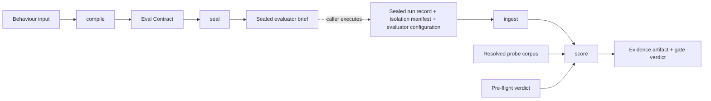
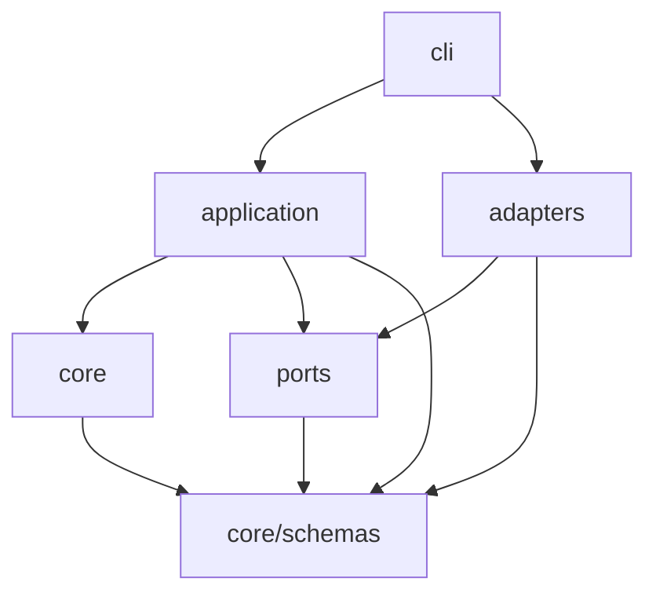

# Architecture Spine — eval-quality

**Revision 9 takes the product decision revision 8 deliberately left open: every operation declares its
own closed response descriptor.** The operation inventory now carries method, path template,
state-change marker, request shape, response descriptor, channel role per pointer named by that
descriptor, and nominated success indicator. AD-20 rule 2 therefore has a truthful denominator: the
required keys of the descriptor belonging to the operation a step invokes. The alternative —
denominating coverage by the permitted keys of one interface-wide union — was rejected because the
export-API authoring test showed the ordinary multi-shape case: operations returning a job resource, a
page of rows, and an error share no required key, so the rule would be satisfied by reading nothing.
This closes Owed-to-calibration item 4, makes all fourteen AD-31 predicates declaration-only, and
intentionally invalidates the response shape carried by the historical worked example. That example
remains deliberately inconsistent until the reference reducer regenerates it; it is not hand-edited
into apparent conformance.

**Gate D closes calibration item 1 in revision 9.** Against the reconstructed mut2 system, the
hand-written positive control, prose generated from AD-3's current fields, and the same generation
augmented with an evidence precondition each issued composed-filter probes and detected the seeded
defect in three of three valid repetitions. The pre-registered two-of-three reducer therefore selects
the Arm 2 branch: AD-3's current field set carries this behavior without an added
evidence-precondition dimension, the generator is part of the product, and `seal` joins the epic
order. This is one behavior of one reconstructed controlled mutation, not a general replication of
the historical 0.33-to-1.00 effect.

**Revision 8 closes the sign-off gate and changes no decision.** Revisions 6 and 7 answered rounds three
and four; revision 8 is the gate those rounds were for, and the whole of it is mechanical. Three
compile-time prohibitions now cite the AD-5 code they fail under, which the spine linter's new
code-citation rule found. AD-19 supplies value spaces for three declarations it named and left unshaped —
channel roles, expected cardinality, and the reference-set declaration — each found by hand-authoring a
second contract against a cursor-paginated asynchronous API rather than by reading. AD-31's citation to a
channel-roles declaration is now satisfiable, which was the fourth instance of the signature AD-40 carried
in round four and the first one a script rather than a reviewer caught. The one thing it does not do is
decide AD-20 rule 2's denominator; that is recorded as **Owed to the calibration re-run** item 4, gates
nothing, and is a product decision rather than a repair. **The gate sentence below dates from revision 5:
read it with ADR-009's exemption, under which the calibration spike is the next unit of work and no
review round is.**

**Revision 5, and it withdraws the claim revision 4 was built on.** Revision 2 answered four external
reviews producing 79 findings. Revision 3 answered ten findings from hand-authoring the first contract.
Revision 4 answered round 2's 50 findings by splitting the spine: `compile` was declared a build
substrate and sent to epics, `score` was recorded as open. Round 3 put four reviewers against that
revision, produced 24 findings, and returned a fourth consecutive do-not-build — the first one that
blocks `compile`. The triage in `reviews/triage-round-three.md` reduces them to ten root causes, six of
them compile-side.

**ADR-007 sent `compile` to epics on one sentence, and three reviewers falsified it independently.** The
sentence was that `compile` "is the half that matches the measured 0.33-to-1.00 effect". It does not. The
contracts behind that effect declare an MCP interface this package rejects at compile time; the oracle
content that *caused* the effect has no field in AD-3's structure and no seat on the sealed brief; and
AD-31, a stage-one requirement, is published only from an artifact that `score` alone can regenerate. Any
one withdraws the sentence. Together they say the compile/score boundary was drawn in the wrong place —
not that splitting was the wrong idea. Every reviewer who commented on the split endorsed it.

**So this revision does to `compile` what revision 4 did to `score`.** The seven root causes with concrete
named fixes are closed below. The one that prose cannot settle — whether generated prose still carries
what made the measured contracts win — is recorded in **Owed to the calibration re-run** as an open
defect, together with the generator design that is downstream of it. `score` keeps its own section
unchanged in kind, with AD-40 corrected. **No epic touches either half.** ADR-008 records the decision and
amends ADR-007.

Revision 2's structural principle still holds: an AD carries only a contract two independently built units
could resolve incompatibly, and cardinalities live in the Structural Seed. Revision 4 added a second: an AD
that promises a table nobody has built is not a decision. Revision 5 adds a third, learned the same way:
**an AD may not cite calibration against evidence that does not exist.** Three did — AD-3 against a corpus
this package cannot compile, AD-5 against an experimental arm that was never run, and AD-40 against a
blinded adjudication that belongs to a different experiment. All three citations are corrected below.

## Design Paradigm

**An artifact-typed pipeline inside a hexagonal boundary.** Core stages are pure functions over
versioned artifacts. Every impure edge is a port the caller supplies. One thin orchestration layer is
the only place a port is awaited.



The dotted edge is the product boundary: eval-quality composes and judges artifacts, and never runs
the thing being judged.

**Buildable order.** ADR-002's suggested order puts strength scoring second, before pre-flight and
before the isolation work. That order is impossible, because `score` consumes an ingested run record and
a pre-flight verdict, and the scoring version needs the fixture digest pre-flight produces. The
buildable order is `compile` → `seal` and `ingest` → `preflight` → `score` → `emit` → `cli`. Stage one is
`compile` **and `seal`** together, per AD-38: the generated evaluator-facing prose is the artifact AD-3
calls load-bearing, `seal` is what emits it, and a stage one ending at the Eval Contract stops one stage
short of the thing whose fidelity the whole calibration argument turns on. Revision 4 made that mistake.

## Invariants & Rules

Dependency direction — an arrow means "may import". Absence of an arrow is a prohibition.



`core/` imports `core/schemas` and nothing else outside itself — not `ports/`, not `adapters/`, not
`cli/`. The `CORE` node in the diagram above is the whole `core/` subtree, `core/schemas` included: an
import between two modules inside that one node — `core/compile/` reading `core/evaluate/`,
`core/seal/` reading `core/compile/`, either reading `core/schemas` — is a same-layer dependency and
stays permitted exactly as the single-node diagram already draws it. The prohibition binds
dependencies leaving `core/` for `ports/`, `application/`, `adapters/`, or `cli/`, and direct external
or Node-builtin dependencies outside the two named exceptions (`zod` from `core/schemas`, `createHash`
from `node:crypto` in `src/core/canonical/digest.ts`) — never a submodule of `core/` importing another.
Story 4.4's dependency-direction checker enforces exactly this reading; a later amendment that wants
`core/`'s submodules treated as separate layers must pair that stricter rule with the refactor it would
require, not encode it against the current single-node tree. `ports/` imports `core/schemas` only.
Nothing imports `cli/`.

### AD-1 — The core is pure; impurity enters only through a port

- **Binds:** all modules
- **Prevents:** filesystem, network, clock, or subprocess access leaking into compilation and scoring, which makes a score irreproducible and untestable without live fixtures
- **Rule:** every core function is pure and deterministic: identical inputs yield identical results, with no observation of or effect on anything outside them. Core functions are not total — a schema-parse failure or an exhausted evaluation budget throws a typed fault per the error convention, which is a domain error rather than an impurity, and a fault never becomes a verdict. No module under `core/` imports `node:fs`, `node:child_process`, `node:net`, or `node:http`, reads the clock, or generates randomness. `node:crypto` is permitted in `core/` because digesting is deterministic, and there is deliberately no digest port. Impurity arrives as port implementations the caller supplies, awaited only in `application/` per AD-34. Mutating a system under test, including seeding a defect, is outside the package entirely.

### AD-2 — eval-quality never executes an evaluator, an agent, a judge, or the system under test

- **Binds:** VFR-3, VFR-4, VFR-5, VFR-7, package dependency policy
- **Prevents:** the package growing an agent runner, provider adapters, or container orchestration — the scope the Non-Goals forbid and the reason an existing engine was to be reused
- **Rule:** the package emits a sealed evaluator brief and ingests a sealed run record, isolation manifest, and evaluator configuration. Executing agents, judges, and the system under test is the caller's responsibility, and judge results therefore arrive inside the run record rather than through a port the package calls. No provider or model SDK is a dependency, required or optional. No module in the package performs network I/O, and v0 ships no network adapter at all — the environment-probe port is the only interface across which observations of a live system enter, and every implementation of it is the caller's, governed by AD-35 and proven by AD-37's suite. Revision 1 named the prober as "the single exception" while shipping a fetch adapter, which meant the package both did and did not perform network I/O; the exception is deleted rather than narrowed, and the conformance suite is what makes a caller-owned prober practical.

### AD-3 — An oracle is a prose intent and an enforceable expression, and both are authored

- **Binds:** contract schema, compiler, scorer, ADR-002 Decision 1
- **Prevents:** enforcing the authoring discipline against a field with no measured relationship to detection. The measured effect came from prose oracles a sealed evaluator read; a contract with a rigorous expression and a lazy intent is exactly the contract that failed in the experiments, and revision 1 would have compiled it clean
- **Rule:** every oracle carries a **direction** and a `check`. Both are required. `check` is an expression tree in the operator vocabulary: the mechanically enforceable surface and a corroboration signal recorded beside the outcome, never the source of an outcome state, which AD-40 and AD-33 assign to the evaluator's findings. The direction is what the sealed evaluator reads, and it is **structured, not free prose**: declared evidence targets naming the channels and steps at issue, the relation asserted between them, a polarity, a scope, and the negative domain the evaluator should also explore. The evaluator-facing prose is *generated* from that structure by `seal`, with optional author commentary carried alongside as documentation that no predicate reads and that **never reaches the sealed brief**, since a channel the evaluator reads and no predicate audits is the free-prose channel this AD exists to close.

  **The relation vocabulary is AD-4's operator set and nothing wider, and only three fields are subject to the alignment predicate.** The direction's declared relation is drawn from the same closed operator vocabulary `check` uses, so AD-31's alignment is structural containment — every evidence target and relation the direction declares must appear in `check`, and `check` may be stronger — rather than a translation between two relation languages. An oracle omitting `check` or omitting its structured direction fails compilation under `oracle-missing-channel`; a direction whose evidence targets, relation, or polarity are not contained in `check` fails under `direction-check-misaligned`.

  **Containment is computed after quantifier substitution, not over the literal operand text, because the literal reading rejects the oracle AD-4's quantifiers exist to make writable.** A direction declaring `/interactions/list/response-body/items/status` against `for-all(/interactions/list/response-body/items, equality(@/status, "active"))` contains that target only after the bound variable is substituted. `check` is therefore normalised first, so `@/status` becomes the fully rooted pointer. Scope and negative domain are the evaluator-facing channel's own content and are not subject to the alignment predicate. Alignment binds evidence targets, relation, and polarity only.

  **Gate D establishes sufficiency for B-002 on the reconstructed mut2 arm, and no wider claim.** Prose generated from these five fields issued composed-filter probes and detected the seeded defect in three of three valid repetitions, matching the hand-written v2 positive control under the pre-registered reducer. The evidence-precondition arm also detected three of three, so this behavior supplies no evidence that a sixth field is necessary. Other disciplined oracles still carry evidence-set, world-population, or negative-sufficiency content that this spike did not exercise; the transcribed calibration corpus remains the place to test those, not a reason to add a field from conjecture.

  Revision 3 required instead that `intent` be prose which "directs the evaluator at the same evidence" as `check`, and made AD-31's compiler decide whether it did. That was undecidable: the package has no semantic model, parser, or port that can rule on whether arbitrary prose and an expression mean the same thing, so a rigorous `check` paired with the intent "verify that this operation works" passed every syntactic compiler while failing the rule as written. Structuring the direction replaces adjudication with construction — alignment between the two channels is now a computation over two declared structures, which is what AD-31 can actually check. It also closes the intent channel as a scripting bypass under AD-5, since the generator emits no imperative sequence: the shipped O-001 intent of the worked example was itself an imperative script ("change a note's title, then read that note back… the read must be an independent call"), which no registry could have caught.

  This supersedes the free-text `oracle` string of the experiments' contract version 1 and revision 3's free-text `intent`. The measured effect came from prose oracles a sealed evaluator read, so the generator's output is the load-bearing artifact and its templates must be calibrated rather than invented.

  **What the templates are calibrated against, stated precisely, because revision 4 cited a corpus this package cannot compile.** Every contract in the phase-2 block that produced the 0.33-to-1.00 result declares an MCP tool interface, which AD-10 places outside v0 and AD-5 rejects at compile time under `unsupported-interface-kind`. v0 stays `api`-only, so the calibration corpus is **API-shaped transcriptions** of the measured contracts, held in the repository as fixtures, and the templates are calibrated against that translation rather than against the instrument. That is a weaker claim than revision 4 made and it is the true one. Two consequences are recorded rather than glossed: a transcription is not the measured artifact, so nothing here establishes that the effect survives the interface change; and the one clean single-variable oracle intervention in the whole record — the `cc-h0-03` v1/v2 pair, where changing one oracle moved a sealed run from PASS with zero composed-filter actions to FAIL with the seeded defect detected — declares `api` already, so it is calibration data v0 can compile today without any transcription. AD-38 names the re-run that has to pass before either half is epic-ready.

  **The measured effect carries its own qualifications wherever it is cited.** It is 0.33 against 1.00 pooled over three cases with separation on two, since both arms detected the third in three of three; both separating cases carry a recorded measurement-layer confound; and the block's own preregistered decision was **CONTRACT-DISCIPLINE NOT SUPPORTED**, failing one of five gates on a single unreplicated clean control. The experiment record discloses all of this and reads the failure as a harness defect rather than a contract misjudgement, which is defensible. Recording it here is not a hedge: a product whose purpose is making evaluation quality falsifiable cannot cite its own central number as settled fact in the one AD whose rule text depends on it. Any catch rate calibrated against this block names the block-2 replication as a dependency rather than assuming it.

### AD-4 — One closed operator vocabulary with fully specified semantics

- **Binds:** contract schema, compiler, scorer, published schema, CLI
- **Prevents:** input-side and output-side checking drifting into two vocabularies; an operator whose arity, dialect, or comparison semantics two implementers fill in differently; and an expression tree with no way to express a composite condition
- **Rule:** the operator set is closed at `equality`, `deep-equality`, `containment`, `existence`, `absence`, `regex`, `set-membership`, `ordering`, `count-tolerance`, `shape`, `covers-by-key`, the connectives `all`, `any`, and `not`, and the collection quantifiers `for-all` and `for-any`. Connectives make the tree a tree; without them a guarded condition cannot be expressed at all. The quantifiers range over the elements of a collection pointer and bind an element variable addressed by the relative pointer form of AD-26 — without them "every record in the response is complete" is inexpressible and only "the first one is" can be written, which is exactly the spot-check the per-record discipline rule exists to forbid. A bound element variable is a deliberate and bounded step toward an expression language: quantifiers may not nest more than one level, failing compilation under `quantifier-nesting-exceeded`; the bound variable is the only relative addressing that exists; and no arithmetic, projection, or user-defined function accompanies it. Each operator declares a fixed arity and operand types in the published schema, and the same operators apply to call inputs and to parsed outputs.

  **Resolution is three-valued, and the third value is an invariant over operands rather than a rule about particular operators.** Every node resolves to `true`, `false`, or **`insufficient-evidence`**. The third resolves on exactly one condition: **an operand denoting a collection that is empty.** That is the closed introduction set, it is a property of the operand and not a judgement about the operator holding it, and so the value arrives for every operator now in the closed set and for every operator a future schema version adds, without a further decision. **`absent` is deliberately not an introduction condition**, and AD-26's rule stands unchanged: `existence` resolves false against it, `absence` true, and every comparison false. A pointer that does not resolve is a missing field, which is a defect the contract detected and one of the three cases the measured effect rests on; routing it here would convert that detection into an abstention and lose a catch the instrument is supposed to record. An empty collection is the opposite situation — the evidence channel worked and had nothing in it — and only that case is "nothing was checked". **A pointer the declared response descriptor types as a collection, which resolves `absent`, counts as an empty collection for this invariant**, and that is the one place the two rules meet. Without it the invariant covers the empty page and leaves the missing page open, so `not(for-any(/…/entries, existence(@/retractedAt)))` would resolve true against a response carrying no `entries` key at all and certify that nothing was retracted — the same fail-open spelling of the same soft-delete oracle, one operand over, which is exactly how this defect survived the previous three revisions. The cost is taken deliberately: a wholly missing collection surfaces as `abstained` rather than as a detected defect. It still prevents PASS, so nothing is lost except the sharper label, and a scalar pointer resolving `absent` is untouched and remains a catch. An operand the declared response descriptor types as a non-collection stays a **compile-time** failure under `quantifier-over-non-collection` and never reaches resolution, because the compiler can see it from the declaration and rejecting it before a run is strictly more fail-closed than resolving it during one; that case has exactly one disposition and it is this one.

  **Why a third value rather than a fourth patch.** Revisions 4, 5, and 6 each fixed this per operator — `for-all` over empty, then `for-any`, then `covers-by-key` — and each time the next operator in the closed set was a fresh hole, because two logically equivalent spellings of one intent disagreed on empty evidence. `for-all(page, absence(@/retractedAt))` resolved false and failed closed, while `not(for-any(page, existence(@/retractedAt)))` resolved true and certified, over the same empty page, using only the closed vocabulary above. That second spelling is the natural English phrasing of a soft-delete filter, a tenant-isolation check, and a data-leak check, which is to say the highest-severity oracle an author writes. Stating the doctrine per operator is what made the connectives a hole while the quantifiers were being patched.

  **Propagation is total over the three connectives and no connective can absorb the value.** `not(insufficient-evidence)` is `insufficient-evidence`. `all` resolves `false` if any operand resolved false, otherwise `insufficient-evidence` if any operand resolved it, otherwise `true` — a single genuine failure stays decisive, because a detected defect is information and discarding it would hide the thing the product exists to find. `any` resolves `insufficient-evidence` if any operand resolved it, otherwise `true` if any operand resolved true, otherwise `false`. That last rule is deliberately weaker than logical disjunction, and it is the point: a disjunction that certifies on the strength of one branch while another branch examined nothing is precisely the escape the previous revisions left open. **No combination of `all` or `any` resolves satisfying when any operand resolved `insufficient-evidence`.**

  **The value is terminal and never satisfies.** A `check` whose root resolves `insufficient-evidence` does not satisfy its assertion under either polarity, including `expects-violation`, so an oracle cannot be discharged by an absence of evidence in either direction. It resolves to `abstained` under AD-6 — a behavioural failure that prevents PASS — rather than to `not-applicable`, which is excluded from every count and would be this defect wearing a new label. Each node's resolution and, where it is `insufficient-evidence`, the introduction condition that fired, are recorded in the evidence, because a resolution that reads as `false` on disk erases the distinction the value exists to carry, and the difference between "checked and held" and "nothing was checked" is the whole subject of this product.

  **There is no v0 spelling for "this collection may legitimately be empty", and that is deliberate.** Revisions 4 through 6 directed such an author to write the emptiness case with `count-tolerance` under a connective; that direction is struck here, in this paragraph and in `covers-by-key`'s below, because it reintroduced the defect it was prescribed to avoid. `any(count-tolerance(coll, 0, 0), for-all(coll, absence(…)))` was satisfied by an endpoint returning zero rows to every request, which is the worked example's `notes: []` defect restored by its own remedy. Under the invariant above both operands resolve `insufficient-evidence` over an empty collection and so does the disjunction. An author who believes emptiness is correct behaviour is asserting something about the world population, not something a check expression should quietly encode. Gate D did not exercise legitimate emptiness and changes no rule here.

  `covers-by-key(expected, actual, expectedKey, actualKey)` is the single bounded relational operator, admitted because AD-20's omission-and-completeness rule is otherwise unwritable in its own grammar. **It is a bijection, not an injection, and revision 4's weaker statement is corrected here.** It holds when the two collections have equal cardinality *and* every element of `expected` has a distinct element of `actual` agreeing on the named keys — so it detects omission, duplicate padding, and unexpected extra records. Revision 4 required only the distinct match and then claimed it "detects both omission and duplicate-padding"; a direct implementation of the stated relation returns true when `actual` carries unexpected rows, or repeats a row, after every expected element has already been matched. An injection detects omission alone. Revision 3's original defect was a response of `[n-1, n-1, n-1]` omitting two of three records; the bijection is what actually closes it. Its `expected` operand is a **reference-set operand** under AD-26 rather than an interaction pointer, because a contract-declared reference set has no interaction to be rooted at. **Its degenerate cases need no rule of their own and are worked examples of the invariant above.** `covers-by-key` over two empty collections resolves `insufficient-evidence`, because an operand denoting an empty collection is an introduction condition; taken as a bare relation it would satisfy both clauses — cardinality zero equals zero, and the distinct match is vacuous over no elements — and report a completeness rule discharged against no evidence, which is the `notes: []` defect again. An `absent` operand on either side resolves **false** under AD-26's rule rather than `insufficient-evidence`, because a collection that is missing entirely is a detected defect and not an empty examination. Revision 6 stated the empty case as a special case of this operator; they are stated here as consequences so that the next operator admitted to the vocabulary inherits them. Duplicate keys inside either collection are an authoring fault rather than a resolution: the operator's contract is a bijection on the named keys, a repeated key makes "a distinct element agreeing on the named keys" satisfiable more than one way, and the two implementations that pick different pairings report different outcomes from one record, so a duplicate key within `expected` or within `actual` fails compilation under `malformed-operator-expression` where the reference set is contract-declared, and resolves false at scoring time where the duplicate is in the observed response, since a response repeating a key is behaviour the contract should catch. An element missing the named key resolves false rather than erroring, consistent with AD-26's treatment of `absent`. `covers-by-key` is deliberately one operator rather than a general relational algebra: it takes one reference-set operand and one collection pointer with two key names, admits no expression on either side, and nests inside no quantifier — the last failing compilation under `quantifier-nesting-exceeded`. Its fixtures cover positive, missing, duplicate, unexpected, duplicate-key, and empty-set cases. `deep-equality` is structural over canonical JSON per AD-27, never serialization-based. `count-tolerance` is absolute unless a declared `relative` flag is set. `regex` is the ECMA-262 dialect, always fully anchored, with backreferences and lookbehind rejected at compile time under `malformed-operator-expression`, which also fires on wrong arity and on an operand type the operator does not accept, and a match-step budget from the scoring policy whose breach is a fault, not an outcome state. `shape` is a closed descriptor of required keys, permitted keys, and per-key JSON type, never an embedded JSON Schema. Evaluation is total, never short-circuiting: every node is evaluated so the evidence records why the whole tree resolved as it did. Adding an operator is a contract-schema version bump, never a caller-side extension. Strict mode is a compile-and-score mode, on by default, failing under `undeclared-mandatory-input` on an input the contract did not declare, and selected only by explicit argument or flag. `ordering` constrains observed output only and may never encode a sequence of actions the evaluator must perform.

### AD-5 — One coded registry of compile-time failures, and only structural errors block

- **Binds:** compiler, every AD that defines a compile-time prohibition, VFR-2
- **Prevents:** two compilers each inventing their own answer to what fails compilation, and an AD commanding a compile-time check that the registry does not list — which in revision 1 left the forbidden-input floor and the rubric penalty rule enforceable by one implementer and invisible to another
- **Rule:** every compile-time failure has a stable code in this registry, and any AD imposing a compile-time check cites that literal code rather than describing a new one. **The codes are the registry; revision 4 wrote sixteen prose descriptions, called them a registry, and supplied no code at all, which left the Errors convention's stable-code requirement unsatisfiable and two implementations free to invent incompatible vocabularies.** Each code below is emitted by `compile` and carries the artifact path that produced it, per the Errors convention, with one named exception: `brief-exceeds-scripting-bound` is emitted by the post-generation brief-scripting audit AD-16 commands, not by `compile` itself, since it fires after `seal` has already generated the brief `compile` never sees. The artifact-path and Errors-convention half of this sentence still holds for that code exactly as for the other twenty-two.

  | Code | Fires when | Cited by |
  | --- | --- | --- |
  | `missing-requirement-linkage` | a behaviour declares no requirement or risk identifier | AD-19 |
  | `no-observable-success-criterion` | a behaviour declares no observable success criterion | AD-19 |
  | `unreachable-check-evidence` | an oracle's `check` addresses evidence unreachable through the declared interfaces; or a captured input binding names a step, or a step's operation, the contract does not declare; or it addresses a response-body value the referenced operation declares no determinate scalar type for; or the captured and bound types are unequal, either one being indeterminate included | AD-19, AD-26 |
  | `malformed-operator-expression` | wrong arity, an operand type the operator does not accept, or a rejected regex construct | AD-4, AD-26 |
  | `quantifier-over-non-collection` | a quantifier's operand is typed a non-collection by the invoked operation's response descriptor | AD-4 |
  | `quantifier-nesting-exceeded` | a quantifier appears inside a quantifier, or `covers-by-key` appears inside one | AD-4 |
  | `unresolved-reference-set` | a reference-set operand names an identifier the contract does not declare | AD-26 |
  | `duplicate-operation-signature` | two declared operations share a method and path template after parameter-name erasure | AD-19, AD-40 |
  | `undeclared-mandatory-input` | strict mode meets an input the contract did not declare, or a binding naming a principal it did not declare | AD-4 |
  | `oracle-missing-channel` | an oracle omits `check` or omits its structured direction | AD-3 |
  | `direction-check-misaligned` | the direction's evidence targets, relation, or polarity are not contained in `check` | AD-3, AD-31 |
  | `unsupported-interface-kind` | a declared interface kind is `web`, `cli`, or `mcp` | AD-10 |
  | `nested-temporal-clause` | a temporal clause names a step that carries one | AD-39 |
  | `plan-exceeds-scripting-bound` | the interaction plan violates the published graph predicate below | AD-39 |
  | `binding-cycle` | a cycle over the capture and temporal-clause edges together that contains at least one captured input binding, a step capturing from itself included | AD-39 |
  | `captured-channel-undeclared` | a captured input binding names any channel but `response-body`, the one channel a response descriptor declares structure for | AD-39, AD-26 |
  | `rubric-scores-reasoning-prose` | a criterion scores chain-of-thought or stated-reasoning prose | AD-17, AD-22 |
  | `rubric-unanchored` | an unanchored scale, unbounded length, or missing named failure-mode penalties | AD-22 |
  | `rubric-evidence-unreachable` | a criterion's evidence is unreachable through the declared interfaces | AD-22 |
  | `forbidden-input-floor-incomplete` | the forbidden-input list omits a member AD-16 makes mandatory | AD-16 |
  | `scoped-reference-resolves-forbidden` | a scoped resource reference resolves to a forbidden input | AD-16 |
  | `waiver-incomplete` | a waiver omits any required part | AD-6, AD-21 |
  | `brief-exceeds-scripting-bound` | the emitted brief's generated direction prose exceeds the contract's declared bound on enumerated probe steps | AD-16 |

  Adding a class is an amendment to this AD and to no other, and an AD that commands a compile-time check without adding a code here is a defect in that AD. The published schema's failure-code enumeration is generated from this table, not maintained beside it.

  **The citation requirement runs both ways, and revision 5 satisfied only one of them.** This rule says an AD imposing a compile-time check cites the literal code rather than describing a new one. Counting every occurrence of all seventeen revision-5 codes across this document, thirteen appeared exactly once — inside this table and nowhere else — so the `Cited by` column asserted citations the named ADs did not contain, and an implementer reading AD-3, AD-4, or AD-26 straight through met prose descriptions of checks with no code attached, which is the condition this AD exists to prevent one indirection over. Every commanding AD now cites its codes literally, and the `Cited by` column is a back-reference to citations that exist rather than a claim about them. Three checks were commanded with no code at all and now have one: `quantifier-nesting-exceeded` for AD-4's one-level nesting bound and its prohibition on `covers-by-key` inside a quantifier, both of which were stated as flat prohibitions with no failure mode; `unresolved-reference-set` for a reference-set operand naming an identifier no contract declares, which AD-26's `absent` resolution does not cover because `absent` is defined over pointers and a dangling identifier is an authoring fault rather than missing evidence; and `duplicate-operation-signature`, which exists because AD-40 resolves a defect signature against a contract's operation inventory by method and path template, so two operations sharing one after parameter-name erasure make that resolution ambiguous, and a contract carrying that ambiguity must fail compilation rather than let the scorer bind by inventory order.

  **The scripting boundary is reduced to what has a predicate, and the rest moves into reasoning where unenforceable prose is harmless.** Revision 4 replaced "a prescribed action sequence anywhere in the contract" with four prohibited shapes and gave only one of them a predicate; the other three — an exhaustive trace, a fixed full path, and any step whose ordering the behaviour's meaning does not require — are the same class of phrase the replacement was congratulating itself for removing, and the last is a judgement about behaviour meaning that no component of this package can compute. The enforceable boundary is a **published executable graph predicate over the declared interaction plan**, failing under `plan-exceeds-scripting-bound`, and it covers depth, width, shared anchors, disjoint pairs, and exhaustive operation inventories. Depth alone was not enough: sixty-four independent `write-N`/`read-N` pairs, each individually a legitimate witness relation and none deeper than one level, encode a complete action inventory and passed revision 4's only mechanical check. What the boundary protects is unchanged in intent — a contract may declare the **witness relations** a behaviour needs, and may not enumerate the interface — but the line is now drawn by a predicate a second implementer can run rather than by a phrase they must interpret.

  **The boundary is calibrated against authored adversarial fixtures, because the arm revision 4 cited never existed.** Revision 4 committed the line to "the experiments' three actual contract arms — plain, disciplined, and scripted — with accept fixtures from the first two and reject fixtures from the third". The block has **two** arms. A search of the entire experiment record for a scripted contract, run, or fixture returns nothing, and the word means something else in this project's vocabulary — a pre-existing test suite used as a comparison baseline, on different tasks, itself never executed. So there was nothing to draw reject fixtures from, and the newest blocking check in the compile half was calibrated against evidence that does not exist. Accept fixtures come from the two real arms as transcribed under AD-3. Reject fixtures are **authored deliberately, one per shape the graph predicate rejects, held in the repository**, and the count that gets through them is the boundary's stated strength. If a scripted arm is ever run, it becomes calibration data; the boundary does not wait for it.

  Schema-parse failure is a fault, not a structural error, so "only structural errors block" has one meaning. A structural error fails compilation and emits no contract artifact. Coverage classes are the discipline rules of AD-20, fired by AD-31; a coverage gap emits the artifact with the gap recorded and never blocks. A validated waiver requires the named rule, an explicit rationale, a machine-checkable context condition where one exists, the recorded approval, and an RFC 3339 expiry; a waiver omitting any of them fails compilation under `waiver-incomplete`.

### AD-6 — The outcome state carries the result, and the state set is closed

- **Binds:** scorer, evidence artifact, gate verdict
- **Prevents:** behavioural results being pooled with evaluator, judge, and infrastructure failures; a run in which nothing was probed reporting as a pass; and an unbounded re-execution loop presented as recovery
- **Rule:** every required check resolves to exactly one of `caught`, `confirmed`, `missed`, `passed-clean-control`, `false-positive`, `abstained`, `bypassed`, `unreached`, `oracle-error`, `judge-error`, `infrastructure-error`, `not-applicable`, assigned by AD-33. `confirmed` and `unreached` were added in revision 3 after hand-authoring the first contract: `confirmed` records an oracle that correctly established correct behaviour on a probe whose defect lies elsewhere, which is the common case on any defect probe and previously had no legal state at all, forcing `passed-clean-control` to be misused for it; `unreached` records an oracle whose declared interaction steps the evaluator never produced, which is an evidence condition rather than a verdict about the system. Four states are behavioural failures that prevent PASS: `missed`, `abstained`, `bypassed`, and `false-positive` — a contract that fires on correct behaviour is defective whichever probe it fires on, which also restores agreement with the PRD. **`abstained` is where AD-4's `insufficient-evidence` resolution lands**, and until now the state was named in this list and defined nowhere: an oracle that was evaluated but whose expression examined no evidence has abstained from reaching a verdict, which is neither a detection nor a confirmation. Placing it among the behavioural failures rather than among the evidence conditions is a deliberate choice and not an inherited one, because the alternative — routing it through AD-21 as `unreached` — means `--strict` never promotes it and a build passes green on a contract whose highest-severity oracle examined an empty collection. That is the outcome AD-4's three-valued resolution exists to prevent, so it prevents PASS here. The state set stays closed at twelve; the resolution value is AD-4's and does not become a thirteenth member. An absent required check prevents PASS on the same footing. Three states are not behavioural results at all and invalidate the run: `oracle-error`, `judge-error`, `infrastructure-error`. `unreached` is neither: it routes through AD-21 as an evidence condition. No state belongs to two groups; the remaining four are behavioural successes or exclusions. A run in which no required check resolved is invalid, never PASS. `not-applicable` is legal in exactly two cases and is excluded from every count: against an unexpired waiver satisfying AD-5, and against a probe AD-40 records as unexercised. The second is named here rather than left to the waiver rule because an unexercised probe has no waiver and needs none — nobody decided to skip it, the evaluator simply never invoked its home operation — and the alternative readings put it in `unreached`, which AD-21 treats as an evidence condition about a *declared step*, or left it stateless, which this AD's own closure forbids. Repeated runs are trials, never retries. The scoring policy declares a minimum trial count, defaulting to three because that is what the instrument behind the measured effect used, and a re-execution cap, defaulting to two. Every artifact records its trial count, its invalidated attempts, and each attempt's reason, including on a PASS. A run completing fewer than the declared minimum has its own rung in AD-21 rather than falling through, since revision 2 required a minimum, computed rates against it, and left short runs unmapped. Exceeding the re-execution cap resolves under AD-21 as a statement that the harness is unfit, never that the contract is weak.

### AD-7 — Contract strength is a rate vector and a dominance relation, never a weighted number

- **Binds:** scorer, evidence artifact, VFR-7
- **Prevents:** an uncalibrated composite becoming the artifact people compare while per-oracle diagnostics go unread; a contract scored over more trials falsely dominating one scored over fewer; redundant oracles inflating a class count; a growing corpus voiding every prior comparison; and an unchanged revision reporting as a failed comparison
- **Rule:** the reported result is per-oracle outcomes, outcome-state counts per oracle category, recorded coverage gaps, and the recorded severity of each behaviour. The dominance vector holds, per probe class, the **catch rate**: unique qualified probe identifiers resolving `caught` under AD-40 over unique qualified probe identifiers exercised, across the declared trial count. **A probe is `exercised` when the evaluator itself invoked its signature's home operation**, per AD-40, counting neither harness baselines nor calls the record shows never completing; a probe whose home operation the evaluator never invoked leaves both numerator and denominator instead of scoring, and its required check resolves `not-applicable` so that AD-6's closed state set still covers every check. That is the definition revision 4 left the denominator without and revision 5 left short of a state. **How several trials of one probe reduce to one probe result is an open defect, not a decision — see Owed to the reference implementation, item 1.** Three readings of "across the declared trial count" are defensible, they disagree on identical data, and one of them is the retry anti-pattern AD-6 forbids; nothing in this AD should be read as having settled it. Rates, not counts, because raw counts let trial count masquerade as contract quality; unique probe identifiers, not checks, because ten oracles mapped to one probe are one probe. Raw counts and the trial count are recorded alongside so any consumer can recompute, and the denominator is named in the artifact so two consumers cannot derive two different recalls. The relation is four-valued: `a-dominates-b`, `b-dominates-a`, `equivalent` on component-wise equality, and `incomparable`. A contract that missed a behaviour at or above the scoring policy's severity floor never dominates one that caught it, regardless of the rest of the vector; that is a constraint on the relation, not a weight. Comparability is a declared key — the scoring policy digest plus the corpus digest restricted to the probes both results cover — and is deliberately weaker than the AD-11 scoring version, so adding a probe narrows a comparison to the intersection and records the excluded probes rather than voiding every prior result. Canary probes and clean controls never enter the vector. No weighting, no percentage, no severity-weighted composite anywhere. This supersedes the brief's "an aggregate score summarizes them" and the aggregate half of the PRD's dual gate; the per-clause half stands alone.

### AD-8 — Sealed corpora are resolved, never shipped

- **Binds:** corpus-provider port, scorer, evidence artifact, VFR-7
- **Prevents:** publication defeating the holdout, since an in-tree case is readable by every contract author and is absorbed into model training data
- **Rule:** the repository contains the scoring mechanism and the visible development set only. Sealed evaluation sets resolve through the corpus-provider port from a caller-owned location outside the repository, indexed by a private-artifact manifest mapping each opaque reference to its digest and artifact kind and carrying the sanitization policy applied to it. The core recomputes every per-artifact digest from the resolved bytes and treats a mismatch against the manifest as an invalidating fault; a manifest digest is never a trusted label. A result references a sealed set and every private artifact by digest and opaque reference, never by content or path. Emitting sealed-case content into any artifact, log, or error message is a defect.

### AD-9 — Ground truth is earned by qualification, and every probe declares its class and its control status

- **Binds:** probe schema, corpus, scorer, VFR-7
- **Prevents:** a mined fix commit being trusted when its own test already passed at the parent commit, which was true of 2 of the 18 commits mined in block 1; and a known-clean control having no representation, which in revision 1 made two outcome states unreachable and the AD-30 fixture matrix unsatisfiable
- **Rule:** a probe declares exactly one class — `defect`, `gameability`, `zero-action`, or `canary` — and a boolean `expectedClean`, ratifying the prior art's record-level field rather than adding a fifth class that would distort the dominance vector. A historical probe qualifies only with recorded fail-before and pass-after evidence at a causally isolated fix boundary, with the oracle stable across both revisions. A controlled mutation qualifies only with its source and operator, target artifact, expected observable failure, baseline pass, mutated fail, and verified rollback or cleanup. A gameability probe qualifies by demonstrating that a compliant-looking degenerate response satisfies a naive oracle and is rejected by a disciplined one. A canary qualifies by demonstrating that non-detection indicts the corpus or fixture rather than the contract. A clean control qualifies by recorded baseline-pass evidence at a revision with no known defect in the probed interface, and its legal states are exactly `passed-clean-control` and `false-positive`. Every probe declares the behaviour it exercises and the defect it seeds **as a machine-readable defect signature under AD-40**, ratifying the prior art's defect-to-behaviour-to-oracle chain. Revision 3 made this declaration in prose and claimed it made per-oracle outcomes computable while AD-33 never read it, which is precisely why `missed` was unreachable. All carry artifact and commit digests. An unqualified probe cannot enter a sealed set.

### AD-10 — Pre-flight is a compiled plan, a probed observation, and a pure verdict

- **Binds:** pre-flight, scorer, environment-probe port
- **Prevents:** an unverified fixture producing a scored result — the failure mode behind all ten harness defects found in postmortem — and a pre-flight failure being read as a signal about the contract
- **Rule:** the plan derives from the interfaces the contract's probes exercise. Probing happens only through the environment-probe port under AD-35. The verdict is a pure function of the returned observations and is bounded to: declared interfaces present and actually matched; **input sensitivity, mandatory per declared operation** rather than per interface. Revision 1's hedge "where it applies" was rightly deleted, because one of the ten harness defects was a request-body-blind stub that passes a presence check and a clean-control check — but revision 3 then bound the check to the interface, which let an identifier-blind read operation pass on the strength of a body-sensitive sibling and made the check impossible to perform at all on a read-only interface, where AD-35's safe-method rule forbids the state-changing requests a body-differential needs. Per operation, the differential is over whatever channel that operation declares under AD-19, selected by that operation's declared state-change marker: a path or query parameter where the marker is false, a body where it is true.

  **The predicate is a declared witness pair over a volatile-excluded projection, not whole-response inequality, because inequality is neither necessary nor sufficient.** Revision 4 fixed the scope of this check and left its predicate wrong. Sending "two distinct inputs and asserting the responses differ" fails a genuinely sensitive operation whenever the two probe values happen to agree — two distinct nonexistent identifiers both return the same 404 — and passes an input-blind operation whose response carries a volatile field such as a request identifier. The verdict then depends on arbitrary probe values and incidental response data. Each input-bearing operation therefore declares **typed sensitivity witnesses**: a pair of inputs and the AD-4 relation their responses are expected to satisfy, evaluated over that operation's response descriptor after excluding the volatile pointers AD-11 requires the operation to declare. A witness relation resolving `insufficient-evidence` under AD-4 fails the pre-flight rather than passing it, which invalidates the run: a sensitivity check that examined nothing has not established sensitivity, and pre-flight is the one place where invalidating is the cheap outcome. Positive and input-blind negative fixtures are required per operation shape, including a safe read whose only input is a path parameter. An operation declaring no inputs in any channel is exempt and records the exemption; per-run state reset, verified differentially by observing, mutating through a declared operation whose state-change marker is true, resetting, and asserting the first and third observations match, with a repeated read as the immutability branch when the contract declares no such operation; known-clean control behaviour; the declared seeded faults being the only anomalous responses in scope; and **every declared seeded fault being observed to fire**, since a declared fault that never manifests yields a vacuous probe and scores the contract `missed` for a defect the fixture never presented. Probe semantics are declared per interface kind; v0 supports `api` and fails compilation honestly under `unsupported-interface-kind` for `web`, `cli`, and `mcp` rather than leaving three kinds to implementer invention. The verdict carries the fixture digest of AD-11 as a required field. Probing a fixture is not executing the system under test. A failed pre-flight invalidates the run and never becomes a contract verdict.

### AD-11 — Version identity is computed from named inputs, and every score names its scoring version

- **Binds:** all artifacts, scorer, published surface
- **Prevents:** scores being compared across a changed corpus, fixture, evaluator, or policy; and a reader believing an identity is trustworthy when three of its inputs are caller-attested
- **Rule:** three identities. Every artifact carries an integer `schemaVersion` under that exact name. Package SemVer governs code. The scoring version is computed by the scorer per AD-27 as a digest over a domain-separated canonical object with named fields for the contract schema version, corpus digest, fixture digest, evaluator configuration digest, and scoring policy digest — a named object rather than a concatenated tuple, because revision 1 mixed an integer with four digest strings and gave no serialization for the integer, which let two conforming scorers compute different versions from identical inputs. The scoring version itself is never caller-supplied. Three of its inputs are: the corpus digest is recomputed from resolved bytes per AD-8, the fixture digest is emitted by pre-flight per AD-10, and the evaluator configuration digest is computed on ingest from the artifact of AD-24 — and none of the three proves the caller used what it declared, which AD-32 states as the trust boundary rather than leaving it implied. The fixture digest covers a named closed projection of pre-flight observations, excluding pointers the contract declares volatile, so an undeclared volatile field fails pre-flight loudly instead of fragmenting every scoring version. Adding an optional field is a `schemaVersion` bump recorded in the field's own description; removing or retyping is breaking. Readers accept an equal `schemaVersion` only and throw `schema-version-mismatch` outside that, because closing every artifact's control objects makes a higher version a hard rejection anyway. Breaking changes are disclosed on release for the whole caller-facing surface: every interchange artifact that carries a `schemaVersion`, which is eleven of the twelve (contract schema, rubric, sealed brief, sealed run record, isolation manifest, evaluator configuration, probe schema, private artifact manifest, pre-flight verdict, scoring policy, evidence artifact; `artifact-reference` is the twelfth and is exempt, carrying `carriesLineage: false` and so no version to break), **both code registries — AD-5's compile-time codes and AD-28's runtime faults** — and the CLI command, flag, and exit-code contract.

### AD-12 — Sealed-set integrity is validated, not enforced, and rotation is additive

- **Binds:** corpus-provider port, scoring policy, VFR-7
- **Prevents:** revealing, repairing, and rerunning against the same supposedly held-out set, which converts scoring into tutoring — and, equally, a reader believing the package prevents that when it structurally cannot
- **Rule:** a sealed set is immutable for its scoring version, checked against recomputed digests rather than a declared label. Rotation is additive: retiring a case into the development set creates a new scoring version rather than mutating the old one. A sealed-set miss may inform the next version only after the current evaluation closes. The package is stateless, so it validates a caller-presented lineage chain — length consistent with the declared revision, no repeated digest, no gap — and emits evidence of compliance. It does not and cannot enforce the remediation cap globally: a digest detects changed bytes and cannot detect that unchanged probe content was revealed to its author and reused, and a caller who mints a fresh lineage resets the count. The cap therefore lives in the scoring policy, defaults to three revisions, is checked against the presented chain, and is recorded in the evidence artifact as a caller-attested figure. Enforcement across evaluations is the adopter's governance, stated plainly here so nobody relies on a guarantee that does not exist.

### AD-13 — Zod is the schema source of truth, and the published JSON Schema must be proven constraint by constraint

- **Binds:** all artifacts, published surface, continuous integration
- **Prevents:** a constraint that exists only as a Zod refinement being believed by a non-TypeScript consumer who cannot see it, and a rejection suite that passes while the constraint it exists to protect has vanished
- **Rule:** each artifact schema is defined once in Zod and exported to a self-contained JSON Schema Draft 2020-12 file, with shared shapes duplicated into local definitions rather than cross-file references. Export uses output mode, because the published schemas describe artifacts as consumers receive them. The reason recorded in revision 3 — that input mode omits `additionalProperties` — holds only for a plain `z.object()`: verified on the pin that `.strict()` objects emit the keyword identically in both modes, and every control object this project writes is strict per the Consistency Conventions, so the stated reason never applies to one. It does apply to the named `JsonValue` container, whose `additionalProperties` is schema-valued rather than false and which is therefore the one shape whose export mode matters — another reason the byte-exact drift check rather than the mode argument is what protects the keyword. The byte-exact drift check is what actually protects the keyword, and the reason is corrected here because it is what a future maintainer would rely on to decide whether switching modes is safe. The generator synthesises `$id`; verified on 2026-07-29 against the pin that Zod 4.4.3 emits neither `id` nor `$id`, at the root or nested, with or without `.meta({ id })` — though `.meta({ id })` does name the `$defs` key, so it is set deliberately and never left to inference under a byte-exact drift check. Constraints Zod cannot express are carried by a named, enumerated constraint-injection table in the generator, one entry per constraint, each paired with its fixture; verified that `z.array()` exposes no `contains` API at all, so the prior art's `contains` on the forbidden-input list has no native form and a `.refine()` is silently dropped. **Operator arity is one of those constraints and needs a table entry per tuple**: verified on the pin that a native tuple export loses exact arity, so Zod rejected one-operand and three-operand `equality` while the exported schema accepted both, and that injecting `minItems` alongside `items: false` on each `prefixItems` tuple closes the differential to zero disagreements with each injected keyword killed by its own mutation. The named `JsonValue` container of the Consistency Conventions is the one deliberate exception to the strict-object audit, and it is exempt by name rather than by the audit failing to notice it. Conditional prior-art constraints are re-expressed as discriminated unions, which changes the published shape from `if`/`then` to `oneOf`; that restructuring is expected, not a surprise mid-epic. Proof is per constraint, not per fixture: every negative case is a valid positive fixture mutated to violate exactly one target constraint, and the test asserts the expected validator keyword and instance path, because a reject-all schema passes every naive negative fixture and a multi-violation fixture stays rejected after one constraint vanishes. Every conditional branch carries a positive case. Continuous integration runs the rejection suite, a byte-exact drift check, a differential check comparing Zod acceptance against published-schema acceptance over generated inputs, and a keyword-mutation check that removes each keyword from the generated schema and requires at least one fixture to fail — the only self-auditing form of "every constraint has a fixture". `schemas/` and `corpus/` are excluded from the formatter so lint and drift cannot fight.

### AD-14 — The CLI is an adapter with no logic of its own

- **Binds:** CLI, library, VFR-8
- **Prevents:** a capability being reachable through one surface and not the other, which VFR-8 defines as a defect, and a second implementation accumulating behind the command surface
- **Rule:** each command translates arguments into one orchestration call plus artifact serialization, and holds no validation, scoring, or policy logic. Commands are non-interactive, default to machine-readable output, accept and emit every artifact as either a file path or stdin and stdout, never mutate an input in place, expose strict mode and `--strict` gate promotion as explicit flags, and set an exit code per AD-21. The package declares a `bin` entry, and the published tarball exports the library, a subpath for the generated JSON Schema, a subpath for the port conformance suite of AD-37, and the development corpus.

### AD-15 — Nothing in the package knows about BMad, TEA, or planning artifacts

- **Binds:** all modules
- **Prevents:** the dependency inverting, and capabilities that only the reference client can reach
- **Rule:** no module references BMad, TEA, a planning-artifact path, or an epic or story format, and none is a dependency. VFR-1 detection lives in the TEA client. A capability reachable only through TEA is a defect in this boundary.

### AD-16 — A prohibited input or an unaccounted isolation manifest invalidates a run; neither downgrades a verdict

- **Binds:** brief emission, ingest, isolation-manifest validation, VFR-3
- **Prevents:** spec prose, source, repository paths, builder context, comparator output, or the adjudicated answer key reaching the evaluator and silently turning a sealed run into an informed one still reported as sealed
- **Rule:** the contract's forbidden-input list is closed at the prior art's seven members and all seven are the mandatory floor: original spec, source code, repository, builder transcript, implementation logs, comparator results, and human labels. Revision 1 stopped at five, omitting the two that matter most — an evaluator that saw the adjudicated labels is informed by definition. No scoped resource reference may resolve to any of them. An omitted floor member fails compilation under `forbidden-input-floor-incomplete` and a scoped reference resolving to one fails under `scoped-reference-resolves-forbidden`. The sealed brief carries the contract's behaviours, the generated evaluator-facing directions of AD-3, permitted interfaces, and scoped resource references — plus budgets and safety limits, since the caller who executes needs the ceilings the manifest reports against — and never a prescribed action sequence. It never carries author commentary, the interaction plan, or the plan's step identifiers, which stay with the compiler and scorer per AD-39.

  **How a generated direction names an observation without naming a step is decided here, because revision 4 required both and permitted neither.** AD-3's evidence targets name "the channels and steps at issue" and the prose is generated from that structure by `seal`; this rule forbids step identifiers on the brief. Both could not hold. If the generator emitted step references the seal was void and ordering was readable off the brief; if it stripped them, a direction over two observations of one operation could not say which is which — "compare the title you sent against the title you read back" collapses into the ambiguity ADR-006 exists to remove. The resolution is a **derived reference vocabulary**: `seal` renders each evidence target as a descriptive reference derived from the step's operation and selection predicate — "the response you obtained when you sent an invalid identifier" — never as the identifier itself. The mapping from step to phrase is one-way.

  **That vocabulary is not yet satisfiable for the temporal case that forced it, and Gate D moves the choice into `seal`'s explicit acceptance criteria rather than leaving it as a pre-epic gate.** AD-39 defines a step's selection predicate as an input binding plus an optional temporal clause. Rendering the clause discloses order; dropping it collapses baseline and read-back into the same phrase. `seal` must test a relational dependency phrase and, if none survives its fixtures, record a bounded ordering disclosure and amend AD-39 explicitly. **A direction's negative domain is emitted as an unordered set, never as an enumeration in declaration order.** The brief is byte-identical under reordering, achieved by sorting rendered members by canonical form before emission. The brief-side scripting audit runs after generation, carries its own AD-5 code, `brief-exceeds-scripting-bound`, and a declared bound on enumerated probe steps, and is acceptance work for `seal`; a declaration-side graph check cannot substitute for it. The isolation manifest's required fields are enumerated in its schema, seeded from the prior art's fifteen, and account for each forbidden input by name. `core/ingest` is the enforcement point: an absent, unparseable, incomplete, or violating manifest invalidates the run and records the reason. None of these ever becomes a CONCERNS verdict or a scored result.

### AD-17 — Judge conduct is enforced on ingest, and reasoning prose is never a scored signal

- **Binds:** ingest, rubric artifact, evidence artifact, VFR-5
- **Prevents:** a broken judge being scored as bad behaviour, truncation quietly removing the evidence that contradicts the verdict, and a rubric criterion scoring narrative that research shows does not reflect the computation behind it
- **Rule:** judge results arrive inside the sealed run record and are validated on ingest; the package never calls a judge. A conforming run record shows one judge call scoring all named rubric criteria, and an unparseable or malformed judge response is recorded as `judge-error`, which invalidates the run rather than becoming a low score. Rubrics are self-contained, so the judge receives the rubric and the evidence and not the product spec. No criterion may score chain-of-thought or stated-reasoning prose. Truncation is deterministic, disclosed with its bound, and must retain evidence contradicting the leading verdict; a case that cannot be bounded without discarding disconfirming material is reported incomplete. Evidence that is incomplete, truncated past its disclosed bound, unavailable, or internally inconsistent is an explicit condition in AD-21's table and can never produce PASS.

### AD-18 — Secrets and subject data never enter a package artifact, and publication is blocked by a mechanism

- **Binds:** all package artifacts, published examples, release pipeline
- **Prevents:** evidence files carrying credentials or real personal data into a public repository, which is unrecoverable once pushed; and a one-click publish contradicting a policy stated only in prose
- **Rule:** artifacts produced or published by this package carry structural facts, verdicts, digests, and references. Credentials, tokens, real names, email addresses, account identifiers, and transaction content are excluded; where evidence must refer to them it stores a digest or an opaque reference resolved through AD-8's manifest. This binds published examples and test fixtures as strictly as real runs. It does not retroactively govern the closed experiment record under `experiments/`, which is exempt. Publication is blocked by an explicit guard in the release workflow, not by policy alone, until the work-related intellectual-property question is resolved in writing.

### AD-19 — The contract declares enough for the predicates to be decidable

- **Binds:** contract schema, compiler, sealed brief, VFR-2
- **Prevents:** a contract that compiles while omitting the fields the executing caller depends on, since the brief is the only channel to them; and a discipline rule that cannot be evaluated because the declaration it reads does not exist — which in revision 1 made two of the five rules permanently and unavoidably relevant
- **Rule:** an Eval Contract carries behaviour goals with severity, requirement and risk identifiers, a per-behaviour observable success criterion, oracles, rubrics, permitted black-box interfaces with a logical identifier per AD-35, and an operation inventory per interface declaring for each operation its **method**, **path template**, **state-change marker**, request shape, closed response descriptor, **channel role** for each pointer that descriptor names, nominated success indicator, and volatile pointers per AD-11. It also carries declared sibling groups over parameters and operations with an explicit empty group permitted, declared expected cardinality and reference sets for each collection location, a declared interaction plan of named steps governed by AD-39, test-data setup and cleanup rules, safety limits, budgets, and evidence requirements. The success indicator and the sibling groups exist because AD-31's predicates for rule 1 and rule 5 are otherwise undecidable from any declaration; expected cardinality and reference sets exist because rule 6's satisfaction predicate and AD-4's `covers-by-key` have nothing to reconcile against without them.

  **Method, path template, state-change marker, and observable success criterion are named in that list because four other decisions read them and revision 6's list did not contain them.** AD-40 resolved a defect signature by asserting that "method and path template are declared per operation under AD-19", which was the load-bearing repair by which it withdrew an unsatisfiable citation, and it rested on a declaration that did not exist. AD-20's rule 7 fires on a declared state change and asserted that it fires "from declarations AD-19 requires", leaving its relevance predicate three defensible readings. AD-5 makes `no-observable-success-criterion` a blocking code against a field the contract had no place for. AD-10 distinguishes "a path or query parameter for a safe read, a body for a write" and refers to a declared write interface, neither of which was declarable. An AD may not cite a declaration that does not exist, for the same reason it may not cite calibration against evidence that does not exist. **Method** is the closed set `GET`, `HEAD`, `POST`, `PUT`, `PATCH`, `DELETE`, `OPTIONS`, since AD-40 compares methods and an open string is two implementations. **Path template** spells parameters as `{name}` in braces and nothing else, because AD-40 compares templates as literal segments plus parameter positions and that comparison is not implementable against an unstated syntax; two implementations must not disagree over whether `/notes/{id}` and `/notes/:id` are one template. The **state-change marker** is a per-operation boolean declaring whether the operation is intended to change state, which is what rule 7's relevance predicate reads and what separates AD-10's safe read from its write. The **observable success criterion** is per behaviour and is not the nominated success indicator: the indicator is a pointer within a response shape saying where success is visible in one operation's output, while the criterion is a statement of what observable condition means the behaviour as a whole was met. `no-observable-success-criterion` therefore fires on exactly one condition — a behaviour carrying no criterion — and never on an empty oracle list, which was the other defensible reading and produced a different schema.

  **Three of those declarations were named without a value space, and revision 7 supplied none, so hand-authoring a second contract had to invent all three.** A field named but unshaped is the same defect as a field cited but absent: two authors write two schemas, and the AD-31 predicate that reads the field cannot be written at all. **Channel roles** are a per-pointer value from the closed set `success-indicator`, `diagnostic`, `payload`, and `collection`, declared per operation for every pointer that operation's response descriptor names; AD-31 lists channel roles among the declarations it reads and this list did not contain them, which is the same signature AD-40's withdrawn citation carried one revision earlier. **Expected cardinality** is a mode from the closed set `exact`, `at-most`, and `page-bounded`, carrying an integer bound for the latter two and an integer count for the first — because rule 6's satisfaction predicate has to branch on whether the collection is returned whole or paged, and an integer alone has no true value for a page: a cursor-paginated endpoint returning twenty of ninety-seven rows makes any declared count false on either the page or the result set, which is how a correct server failed the completeness oracle before the injection form existed. `page-bounded` is what makes the injection form the required satisfaction and the bijection an error, and `exact` is what makes the bijection required; without the mode the predicate is a coin toss between two forms that report opposite outcomes on one contract. **A reference set** is declared as an identifier, the key names its members are compared on, and the members themselves as objects carrying at least those keys. AD-26 specified the reference-set *operand* down to its single key and left the *declaration* it resolves against unstated, so `unresolved-reference-set` fired against a declaration with no shape, and `covers-by-key`'s `expectedKey` had nothing to name. Members are objects rather than scalars because `covers-by-key` compares on named keys; a `set-membership` operand against the same set reads the single named key, so one declared form serves both operators and the injection form of AD-20's rule 6 needs no second field.

  **The response descriptor is per operation.** Round 4 found rule 2 satisfaction undecidable for want of a definition of "the whole body", and hand-authoring the export API established that one interface-wide union descriptor is vacuous in the ordinary multi-shape case: operations returning a job resource, a page of rows, and an error share no required key. The per-operation descriptor gives `requiredKeys` a truthful value, gives rule 2 an exact denominator, and makes pointer reachability, collection typing, channel roles, success indicators, and volatile-pointer exclusion resolve through the operation named by the interaction-plan step. This intentionally invalidates the old artifact shape rather than preserving a rule satisfied by reading nothing.

  **The request shape declares transport channels, not a flat key map.** Each operation declares its inputs grouped into `path`, `query`, `header`, and `body`, each with required keys, permitted keys, and per-key JSON type. Revision 3 carried a single undifferentiated key map, which left three things broken at once: `call-inputs` had no defined structure to address under AD-26, no header could be declared or referenced by any oracle, and the authorization and tenant-scoping rules AD-20 defers to v0.1 need a principal that lives in a header — so that deferral would have arrived as a breaking grammar change rather than the additive version bump AD-20 promises. Declaring the channels now costs one schema field and keeps the promise additive. A `header` channel declaration never carries a credential value, per AD-18; it names the header and its type. An explicit empty sibling group is a declaration, so a genuinely sibling-free contract is decidably clean rather than failing closed. Rubrics are optional and a contract with none compiles: the judge path is a capability, not an obligation, and AD-17's judge-conduct rules bind only when a rubric names criteria. That is stated because a zero-rubric contract satisfied every rule in revision 2 while leaving it unclear whether it was meant to. A missing requirement or risk linkage fails compilation under `missing-requirement-linkage` and a missing observable success criterion under `no-observable-success-criterion`; every other omitted required field fails schema validation before the compiler runs. Two operations whose method and path template collide after parameter-name erasure fail under `duplicate-operation-signature`, because AD-40 resolves a defect signature against this inventory and a collision leaves the binding ambiguous.

### AD-20 — Seven discipline rules, closed by version, and the taxonomy is extensible by design

- **Binds:** compiler, scorer, evidence artifact, ADR-002 Decision 1
- **Prevents:** the product's measured claim resting on nothing enforceable, and a closed enumeration being read as complete coverage of contract discipline when every one of its original members inspects a single present response
- **Rule:** the oracle categories are the five the measured effect is attributed to — separate the success indicator from the response body, read the whole body, probe malformed and negative inputs, verify per record rather than by spot-check, and cross-check sibling parameters and operations for the same asymmetry — plus two the reviews showed no rule reaches: verify omission and completeness by establishing what should be present and reconciling against it, and verify a declared state change or side effect through an independent read-back rather than the write's own response. All four reviewers found the same shape of gap; the operator vocabulary already carries `absence` with no rule pointing an author at it. Both additions fire from declarations AD-19 requires, which is true as of this revision and was not before it: rule 7's relevance predicate reads the per-operation state-change marker AD-19 now declares, and it previously had no field at all, which left it three defensible readings that fired differently on one contract. Rule 6 is satisfied through `covers-by-key` against a declared reference set for a collection returned whole, and through the injection form of AD-26 for a page of a larger result set — the word "only" stood here through revision 6 and was false for every paginated endpoint, since `covers-by-key` is a bijection and a page never equals the reference set. Rule 6 was unwritable when added in revision 3, which is why the worked example carries no oracle for it and why its coverage predicate had nothing to fire against. This enumeration is AD-5's coverage-gap taxonomy and AD-7's category axis. Authorization and tenant scoping, and idempotency across repeated calls, are knowingly out of v0 because they need principal and call-sequence declarations the contract does not carry; the enumeration is therefore the v0 measured taxonomy, and extending it is an expected contract-schema version bump rather than an exceptional amendment.

  **Rule 2 satisfaction has an operation-scoped denominator.** For every interaction-plan step addressed
  by a whole-body oracle, the required evidence targets in both the direction and `check` cover every
  required key of the response descriptor belonging to the operation that step invokes. Coverage is
  never computed against an interface-wide union and never against permitted keys.

### AD-21 — One total decision table, four verdicts, and exit codes outside the verdict range for faults

- **Binds:** scorer, gate verdict, CLI, VFR-5, VFR-8
- **Prevents:** a condition with no rung falling through to PASS — which in revision 1 gave a green gate to an evaluator recommendation of FAIL and to unavailable evidence — and a CI runner unable to distinguish a considered verdict from a crash
- **Rule:** every run declares its mode, and the mode is an input to derivation. In `production` mode the subject is the system under test and the verdict answers whether it is shippable. In `contract-scoring` mode the subject is the **contract**: the probe is knowingly defective, so a `caught` outcome is the contract succeeding and an evaluator recommendation of FAIL is expected rather than informative. Conflating the two makes every scoring run report FAIL while the contract performed perfectly, which is what hand-authoring the first evidence artifact produced — a FAIL verdict with zero behavioural failures. In scoring mode the verdict is therefore about contract adequacy, derived from the outcome states, coverage gaps, and AD-7's vector, and the system-directed recommendation is recorded as an input rather than promoted to a rung. The two verdicts never share a field.

  **The rungs below are the production-mode ladder, and the mode separation they sit inside is incomplete — see Owed to the reference implementation.** Two of them promote an ingested evaluator recommendation unconditionally, which contradicts the paragraph above in scoring mode, so the same sealed artifact derives CONCERNS or FAIL depending on which sentence a reader obeys. That is two exit codes apart and it is not a wording problem: it means the two modes need separate input types and separate ladders rather than one ladder with a preamble, and mode has to be fixed before ingest and enter identity rather than appearing first in the evidence artifact. Within a mode, derivation is total over every outcome state, evidence-integrity state, evaluator recommendation, coverage condition, waiver state, remediation state, and pre-flight state. No condition is unmapped and PASS is a rung rather than an `otherwise`. Precedence, first match wins. **Invalid:** any AD-6 invalidating state, a failed pre-flight, an unaccounted isolation manifest under AD-16, an unrecognised evaluator recommendation value, a re-execution cap breach under AD-6, a required oracle carrying no disposition in the run record under AD-23, or no required check resolved. The record carries every condition that fired and every behavioural failure already resolved, so a persistent judge fault cannot mask a real regression indefinitely. **FAIL:** any AD-6 behavioural failure at or above the scoring policy's severity floor, an ingested evaluator recommendation of FAIL, evidence that is incomplete, over-truncated, unavailable, or internally inconsistent under AD-17, or a presented lineage chain that is internally inconsistent under AD-12. **CONCERNS:** a behavioural failure below the severity floor, an unsatisfied coverage gap at or above the floor, a finding whose confidence falls below the policy threshold, an ingested recommendation of CONCERNS, a run that completed fewer trials than the policy's declared minimum, or any oracle resolving `unreached`. The last two are evidence conditions: the measurement is thinner than the policy asked for, which is not a claim that the system is broken and not a clean bill of health either, and both mark the strength vector non-comparable. **WAIVED:** every required check resolved and at least one resolved `not-applicable` against an unexpired waiver, so a mostly-waived run is distinguishable on a dashboard from one that caught everything. **PASS:** every required oracle carries a disposition, every required check resolved, and none of the above. A coverage gap below the severity floor is recorded and does not move the verdict, which makes PASS reachable for a single-operation contract. An expired waiver reinstates its gap. Exit codes: PASS zero, WAIVED zero, CONCERNS zero, FAIL two, invalid three, structural compile failure four, thrown fault five. CONCERNS is the human-on-the-loop disposition and exits zero because exit one is indistinguishable from a crash and a fatal advisory gate gets `|| true`, which discards FAIL with it; `--strict` promotes CONCERNS to one — **except a CONCERNS whose only firing conditions are evidence conditions, which `--strict` never promotes.** A run that resolved `unreached` or fell short of the declared minimum trial count is a statement that the measurement was thinner than the policy asked for, not a claim about the system, and this AD already says so; letting `--strict` fail a build on it turns an evidence condition into a verdict about the system and hands contract authors the punishment route AD-39 closes. Every other CONCERNS promotes as before. A command producing no verdict never exits inside the verdict range. Severity routes but never weights: no numeric threshold governs a verdict except the confidence bound and the severity floor named in the scoring policy.

### AD-22 — Rubrics are authored to rules the compiler checks

- **Binds:** rubric artifact, compiler, VFR-2
- **Prevents:** a rubric that asks a sealed evaluator a question it cannot answer from observable evidence, which manufactures a verdict from nothing
- **Rule:** a rubric declares anchored scale levels, named failure-mode penalties, and a bounded length, and every criterion must be answerable from evidence reachable through the contract's declared interfaces. An unanchored scale, an unbounded length, or missing named failure-mode penalties fail compilation under `rubric-unanchored`; a criterion whose evidence is unreachable fails under `rubric-evidence-unreachable`; and a criterion scoring chain-of-thought or stated-reasoning prose fails under `rubric-scores-reasoning-prose`. Rubrics and criteria are addressable identifiers so a finding can cite one.

### AD-23 — Every observation records its provenance, and every finding cites what it belongs to

- **Binds:** ingest, evidence artifact, VFR-4
- **Prevents:** losing the distinction the product's central finding rests on — what a sealed evaluator detects beyond the pre-canned baseline — and a finding that cannot be resolved to an outcome state because nothing says which oracle it answers
- **Rule:** each ingested observation carries a provenance of `baseline` for a pre-canned or deterministic test and `evaluator-chosen` for an action the evaluator selected, and a finding type of `defect`, `observation`, or `confirmation`. Every finding cites the oracle and the probe it belongs to, which is what makes AD-33's mapping and AD-7's per-oracle outcomes computable at all; a finding citing no oracle is retained as an uncited finding rather than discarded, since it is often the evaluator-chosen detection this AD exists to preserve. **Every `defect` finding additionally carries the identifiers of the observations it relies on and its verbatim quoted evidence with that evidence's channel, both schema-required, per AD-40** — citation of an oracle and a probe proves which run produced a finding and never that the finding detected anything, which is why revision 4's mapping had a signature to match and nothing to match it against. A conforming run record additionally carries **one disposition per required oracle** — the evaluator's own statement of held, violated, or not-attempted. Without it, silence is ambiguous between "judged fine and not worth filing", "declined to judge", and "never got to it", which resolve to three different outcome states; hand-authoring the first run record made that ambiguity concrete. A missing disposition invalidates under AD-21 rather than defaulting to any state. Only `defect` findings enter a detection measure. Baseline evidence is ingested as evidence and never as a prescribed path.

### AD-24 — Every artifact declares its lineage and its predecessor, and every stage declares its signature

- **Binds:** all schemas, published surface, every stage
- **Prevents:** a concept the experiment record depends on being lost in translation; a new artifact reusing a prior-art name for a different thing; and two implementations disagreeing on which stage owns an output — revision 1 gave the Evidence Artifact to both `score` and `emit`
- **Rule:** the spine fixes the stage-signature table, not the artifact count. Every stage declares its exact inputs, its single owned output, and its lineage edges, and exactly one stage owns each artifact; the Evidence Artifact belongs to `emit`, and `score` produces the outcome and verdict values `emit` serializes. Interchange artifacts — those crossing the package boundary in either direction — are versioned, schema-published, and enumerated in the Structural Seed's inventory; internal stage products such as the probe plan and ingested observations are typed but need not be published. Each published artifact declares in its description either the prior-art schema it succeeds or an explicit absence of prior art, and the correspondences are recorded once in the inventory rather than rediscovered per artifact. The Sealed Run Record succeeds the experiments' run-result schema and keeps its run identifier, condition arm — retained as an opaque caller label with no product semantics — findings, action-log reference, resource use, invalidation reason, evaluator recommendation as a closed enum, and per-finding confidence on a declared scale. The Evaluator Configuration is a first-class published artifact carrying the sealed-brief digest, opaque evaluator identity, model snapshot, system-prompt digest, decoding and sampling parameters, tool and permission inventory, budgets, seed where supported, and judge configuration, with the trial index deliberately excluded so trials pool into one scoring version; ingest computes its digest from the artifact and invalidates the run when it is absent or incomplete. Adding an interchange artifact is a Structural Seed change plus a schema version bump, not a spine amendment. Artifacts are immutable and lineage is explicit per AD-29. The experiments' evaluator-result and trace-label schemas belong to the deferred semantic layer and their names are not reused.

### AD-25 — Every dependency is permissively licensed, checked across the whole graph

- **Binds:** package manifest, continuous integration
- **Prevents:** a copyleft or proprietary dependency reaching a package whose publication already turns on an intellectual-property question — and a licence gate that fails on its own toolchain and is therefore switched off
- **Rule:** the SPDX allowlist is MIT, Apache-2.0, ISC, BSD-2-Clause, BSD-3-Clause, and 0BSD, and a disjunctive expression satisfies it when any operand does. Revision 1 permitted MIT and Apache-2.0 only, which the current lockfile already violates through ISC in `picocolors`, `siginfo`, `signal-exit`, and `yaml`, BSD-3-Clause in `source-map-js`, and Biome's own `MIT OR Apache-2.0`. Continuous integration scans the full runtime and development transitive graph and reports the exact dependency path for a violation. A copyleft or proprietary licence anywhere in that graph fails the build. The runtime dependency set is deliberately minimal and its current membership is recorded in the Structural Seed rather than frozen here.

### AD-26 — One addressing grammar over interactions, and absent evidence is an observation rather than an error

- **Binds:** contract schema, compiler, scorer, published schema
- **Prevents:** the compiler's reachability check and the scorer's evaluator reading the same expression differently; a whole defect class becoming permanently unscoreable — revision 1 resolved a missing field to `oracle-error`, which invalidates and prescribes re-execution over deterministic inputs, so a missing navigable reference could never be caught even though it is one of the three measured cases; and four of AD-20's seven rules being inexpressible, because revision 2's roots each named a single response while malformed-input, sibling cross-check, omission, and state-change read-back are all inherently multi-observation. Hand-authoring one contract against a toy API left three of five oracles with no writable `check`, which under AD-3 and AD-5 meant the contract could not compile at all
- **Rule:** every operand addressing evidence is an RFC 6901 JSON Pointer rooted at a declared interaction step: `/interactions/{stepId}/` followed by one of the closed channel vocabulary `response-body`, `response-headers`, `response-status`, `call-inputs`, `stdout`, `stderr`, `exit-code`. Under `call-inputs` the next segment is one of the four transport channels AD-19 declares — `path`, `query`, `header`, `body` — so a request operand is addressed as `/interactions/write/call-inputs/body/title`; revision 3 rooted `call-inputs` directly on a key name, which had no declared structure to resolve against. A step identifier resolves against the contract's declared interaction plan per AD-19 and AD-39, which is what makes a read-back oracle writable: it compares `/interactions/write/call-inputs/body/title` against `/interactions/read-back/response-body/note/title`. Inside a quantifier the bound element is addressed by the relative form `@/` plus a pointer, and that is the only relative addressing in the grammar. No dot-path, no wildcard, no expression language.

  An operand addressing evidence unreachable through the declared interfaces fails compilation under `unreachable-check-evidence`.

  **A second, typed operand form addresses contract-declared reference sets, and it is not a pointer.** A reference-set operand is the single-keyed object `{ "referenceSet": <identifier> }` and carries nothing else: revision 5 said it "names a declared collection location and its reference set by identifier", which named two things and specified neither key, so two implementations publishing `additionalProperties: false` schemas around one-key and two-key shapes each reject contracts the other accepts. The collection location was redundant in any case, since `covers-by-key`'s `actual` operand is already the collection pointer and no other position admits this form. It never carries a JSON Pointer and never resolves against an interaction. An identifier the contract does not declare fails compilation under `unresolved-reference-set` rather than resolving to `absent`, because `absent` is defined over pointers that do not resolve against observed evidence and a dangling declaration is an authoring fault the compiler can see. The form in any position other than the three named above fails under `malformed-operator-expression` as an operand type the operator does not accept. It exists because revision 4 added `covers-by-key` to make AD-20's rule 6 writable and AD-19's reference sets to make it satisfiable, and then left the two unable to address each other: applying this grammar's closed parser to the three plausible spellings accepts `/interactions/list/response-body/items` and rejects both `/reference-sets/items` and `/contract/referenceSets/items`, so the operator that exists to reconcile against a declared expectation had no legal way to name it. Keeping the form typed and distinct rather than widening the pointer root is deliberate: a pointer root that sometimes means an interaction and sometimes means the contract is the ambiguity this AD exists to prevent. **A reference-set operand is legal as `covers-by-key`'s `expected` operand and as the set operand of `set-membership` or `containment`, including inside a quantifier's predicate.** Revision 6 admitted it in the first position only, and that made AD-20's rule 6 dischargeable on nothing larger than a single page. `covers-by-key` is a bijection requiring equal cardinality, correctly so, since that is what detects duplicate padding and unexpected rows; but a page of twenty drawn from a hundred matching records never equals its reference set, so the completeness oracle resolved false against a perfectly correct server, and no other route existed — the injection `for-all(page, set-membership(@/id, {"referenceSet": X}))` was rejected twice over, once by the legality restriction and once by the no-nesting rule. Every other escape was closed too: declaring a twenty-member reference set for one page needs an assumption about the server's total order that no field carries and that `ordering` cannot express, and reconciling the union of pages needs the arithmetic the grammar prohibits. The bijection remains the completeness property for a collection returned whole; the injection is the soundness property for a page, which is the strongest true statement available about one page. A reference-set operand is a non-relative operand and is legal inside a quantifier predicate for that reason: it denotes contract-declared data rather than evidence, so it needs no interaction to be rooted at and does not make the predicate a second quantification. A pointer that does not resolve yields the distinct value `absent`, which is not `null`. `absent` is a legitimate operand for every operator: `existence` resolves false against it, `absence` resolves true, and every comparison resolves false, which under AD-33 makes a missing field a detectable defect rather than a broken measurement. A type mismatch between operands likewise resolves false rather than erroring, since a runtime type defect is behaviour the contract should catch, not a fault in the contract; coercion remains prohibited. `oracle-error` is reserved for genuine authoring faults the compiler could not detect: an operand type the schema admitted but the operator cannot accept, or an impossible operator application.

### AD-27 — One canonical digest computation over a restricted value domain

- **Binds:** all artifacts, scorer, corpus-provider port, AD-8, AD-11, AD-12
- **Prevents:** two implementations computing different digests from identical inputs, which would make every scoring version disagree, every comparison `incomparable`, and every sealed set look mutated
- **Rule:** an artifact digest is SHA-256 over the RFC 8785 canonical JSON serialization of the artifact. No artifact carries its own digest, so there is no exclusion rule to interpret; digests live only in referring artifacts and in the Artifact Reference. A composite digest is SHA-256 over the canonical serialization of a domain-separated object with a fixed protocol tag and named fields, never a concatenation of member strings and never over a mixed-type tuple. Digests render as `sha256:` plus 64 lowercase hexadecimal characters. A digest over anything that is not JSON is SHA-256 over its bytes, and a directory digest is a composite over its members ordered by path. Because AD-25 keeps the runtime set minimal and no audited JCS implementation is a dependency, the canonicalizer is written here and the two rules implementers get wrong are fixed explicitly: numbers serialize per ECMAScript `Number.prototype.toString`, and object keys sort by UTF-16 code unit rather than code point. Cross-language canonicalization vectors are a required CI fixture.

### AD-28 — Every port has the same contract shape

- **Binds:** `ports/`, `adapters/`, `application/`, CLI
- **Prevents:** adapter authors and core authors building incompatibly at a boundary that is named but unspecified — differing error signalling, retry behaviour, or assumptions about who validates what crosses
- **Rule:** every port method is asynchronous and returns a promise of a schema-valid artifact or throws a typed fault carrying a stable machine code from the runtime fault registry below; a port never returns a partial success or an in-band error value.

  **The runtime fault registry is defined here, because six decisions cite it as normative and revision 4 defined it nowhere.** AD-1, AD-11, AD-21, AD-37, AD-8, and the Errors convention all require a stable machine code from "the published fault registry"; AD-5's registry is compile-time codes only and says so in its first sentence. This is the same defect AD-5 was rewritten this revision to fix, one boundary over, and it is worse here than there: AD-37 publishes the fault vocabulary to adapter authors outside this repository, and a conformance suite that asserts "a failure throws the declared fault type with a machine code" cannot assert *which* code without one. Every fault carries its code and the artifact path that produced it.

  | Code | Thrown when | Commanded by |
  | --- | --- | --- |
  | `schema-parse-failure` | an artifact does not parse or does not validate against its published schema | AD-1, AD-5, AD-13 |
  | `schema-version-mismatch` | a reader meets a `schemaVersion` other than the one it accepts | AD-11 |
  | `non-canonicalizable-value` | a hashed artifact carries a non-finite number, an unsafe integer, a lone surrogate, or a duplicate object key | AD-36, AD-27 |
  | `digest-mismatch` | bytes resolved through the corpus port do not match the manifest digest | AD-8 |
  | `budget-exhausted` | an evaluation budget or safety limit is reached | AD-1, AD-4, AD-19 |
  | `port-failure` | a caller-supplied port implementation throws or rejects | AD-28 |
  | `port-contract-violation` | a port returns a partial success, an in-band error value, or an artifact failing boundary validation | AD-28, AD-37 |
  | `forbidden-target` | the probe port is directed at a target AD-35's default-deny policy excludes, including on redirect | AD-35 |
  | `aborted` | an abort signal is honoured mid-flight | AD-28, AD-37 |
  | `operator-cannot-accept-operand` | an operator receives an operand value or expression parameter it cannot accept | AD-4 |

  Adding a class is an amendment to this AD and to no other, and **an AD that commands a thrown fault without adding a code here is a defect in that AD** — the same audit rule AD-5 carries for compile-time codes, stated here so the two registries stay symmetric and neither becomes the other's dumping ground. The two vocabularies are disjoint: a compile-time failure is a structural error that emits no artifact, and a fault is thrown. AD-21 assigns exit codes outside the verdict range to faults, and the published enumeration is generated from this table. A port performs no retries and no back-off; re-execution is decided under AD-6's trial and cap rules. Every port method accepts an abort signal and must honour it. The orchestration layer validates every artifact crossing a port boundary in both directions before handing it to `core/`, and a port fault during probing or ingest is an invalidating condition under AD-21 rather than a behavioural result. Ports are implemented by the caller; the reference adapters are conveniences, never a required path, and conformance is defined by AD-37 rather than by reading this rule.

### AD-29 — Artifacts are immutable, and lineage is explicit

- **Binds:** all artifacts, every stage
- **Prevents:** two writers producing conflicting revision lineages for what is nominally the same artifact, and a revision that cannot be traced to what it revised
- **Rule:** an artifact is created once and never edited in place. A revision is a new artifact carrying a parent digest and a revision count one greater than its parent's; the stage that produces an artifact owns those two fields per AD-24's table, and no other stage may set them. Revision counts are per lineage, not global. Two artifacts with the same parent digest and revision count and different content are a conflict to surface, never to merge. The package validates a presented chain and does not track lineage across invocations, per AD-12.

### AD-30 — The test strategy is part of the contract

- **Binds:** all modules, continuous integration
- **Prevents:** the pure core's testability advantage being spent, and a published schema whose constraints were never proven to reject anything
- **Rule:** `core/` is tested only with in-memory artifact fixtures and faked ports, and no test performs filesystem I/O outside a temporary directory or network I/O beyond a loopback fixture server it started itself — that carve-out exists solely for AD-37's suite, which cannot assert a network policy without a network. Statement and branch coverage on `core/` is at least 90 percent, which is a constraint rather than an aspiration because `core/` is pure functions over in-memory artifacts; `adapters/` and `cli/` are excluded from that floor and covered by AD-37's conformance suite instead. Every published constraint has its single-mutation negative fixture per AD-13. Every AD-6 outcome state, every AD-21 verdict, every AD-31 predicate, and every AD-33 output cell has at least one fixture that produces it, positive and negative; AD-33's are generated over its input space rather than hand-written, per that AD. Four fixture corpora are named rather than left implicit, because each replaces a calibration revision 4 asserted and could not perform: **AD-31's contract fixture corpus**, one contract per discipline rule per relevance-and-satisfaction combination, which is what frees stage one of a score-side dependency; **AD-5's authored adversarial reject fixtures**, one per shape the scripting graph predicate rejects, since the arm revision 4 cited never ran; **AD-3's transcribed calibration corpus** of API-shaped measured contracts; and **AD-10's sensitivity witnesses**, positive and input-blind negative, per operation shape including a safe read whose only input is a path parameter. Composite-digest and cross-language canonicalization golden vectors are required fixtures, including the exact decimals this repository's own artifacts carry, per AD-36.

  Two fixture families exist specifically because the non-determinism that will hurt this product is in the scorer rather than in the tests: score a fixed run record repeatedly and assert byte-identical evidence, and score it again with the observation array permuted and assert identical outcomes. Burn-in and the no-quarantine rule below are aimed at flaky tests and would have passed three times over the ambiguous observation matching that round 2 found, because an arbitrary tie-break is stable within a process. The permutation family is the one that catches it. Changed specs burn in three times in CI. A non-deterministic test in `core/` is a defect in `core/`, never a test to quarantine. Continuous integration runs at the exact runtime floor and at the development version, so the floor is a tested guarantee rather than a declaration.

### AD-31 — Coverage relevance and satisfaction are published predicates that fail closed

- **Binds:** compiler, AD-5, AD-19, AD-20
- **Prevents:** two compilers disagreeing on when a discipline rule applies or when it is satisfied; and a contract that declares almost nothing rendering every rule irrelevant and scoring clean
- **Rule:** each AD-20 rule has an exact relevance predicate and an exact satisfaction predicate over the declarations AD-19 requires — interface kind, operation inventory, and per operation its request shape and transport channels, response descriptor and channel roles, nominated success indicator, collection locations with their expected cardinality and reference sets — plus sibling groups. Relevance is computed from declarations only, never inferred from the oracles. Satisfaction is computed over the structured direction and `check` pair per AD-3, and is a comparison of two declared structures rather than a judgement about prose: the rule's required evidence targets, relation, and polarity must appear in both channels. Rule 2 satisfaction additionally requires those targets to cover the required keys of the response descriptor belonging to the operation each addressed step invokes. All fourteen relevance-and-satisfaction predicates are therefore declaration-only. Revision 3 required the compiler to decide whether prose "directs the evaluator at the same evidence" as an expression, which no component of this package can compute; structuring the direction is what makes this predicate implementable at all.

  The fourteen predicates are **generated and published from the reference implementation, not asserted here**. Revision 3 promised a normative table and shipped none, and on the one contract that exists the predicates under-fired on two of seven rules with nothing surfacing it — a contract declaring sibling operations and a collection location was scored with one gap. Publication means the table is emitted by the implemented predicates and regenerated in CI.

  **Publication is exercised against a compile-side contract fixture corpus, never against the worked example, and this is the correction that frees stage one.** Revision 4 said the table was published by being "exercised against the worked example"; Owed item 7 says the worked example may only be regenerated from the reference reducer; the reducer is Owed items 1 through 3, all score-side, all covered by the rule that no epic touches `score` until they close. That is a closed cycle, and it backed a *blocking* compile error, since `direction-check-misaligned` is an AD-5 code whose predicate lives here. These predicates need no run record, no probe, and no outcome state — they read declarations and the direction/`check` pair — so the corpus they are published against is a set of hand-authored contracts, one per discipline rule per relevance-and-satisfaction combination, which stage one can produce on day one. The worked example's end-to-end chain is the right publication target for AD-33 and AD-40 and the wrong one for these. A coverage-gap record names the relevance predicate that fired and the satisfaction predicate that failed, so a gap is diagnosable rather than a label. Where a declaration is absent, or is present but resolves to an enumerated indeterminate descriptor state, the rule is relevant and its absence is a coverage gap; "unspecific" is that enumerated set and nothing broader. Under-declaration therefore costs coverage rather than earning a clean result, while an explicit empty declaration is an answer rather than a gap.

### AD-32 — The caller is a possibly-buggy integration, and the trust boundary is stated

- **Binds:** ingest, scorer, every artifact the caller supplies, VFR-5, VFR-7
- **Prevents:** the same finding being resolved three different ways because nothing says how much the package trusts its inputs — and a reader treating a score as tamper-evident when three of its identity inputs are caller-attested
- **Rule:** the package treats a caller as a possibly-buggy integration, not as a trusted recorder and not as an adversary. It therefore verifies everything internally verifiable and nothing that requires attestation: schema validity, cross-artifact agreement, recomputed digests, lineage consistency, and declared-versus-observed consistency, each failing loudly and invalidating rather than degrading a verdict. The evaluator configuration digest must agree between the sealed run record and the isolation manifest, and disagreement invalidates, so a substitution takes two deliberate contradictions rather than one omission. What the package cannot do is prove that an external runner used the configuration it declared, that a corpus was not revealed to a contract author, or that a presented lineage is complete. Every artifact that reports a score states which of its inputs were caller-attested. An adversarial trust model would require independent attestation or a runner boundary the package owns, and ADR-004 rules the latter out for v0; upgrading the trust model is a spine amendment, not a hardening exercise.

### AD-33 — The evaluator's findings resolve outcome states, and every check declares its polarity

- **Binds:** scorer, ingest, AD-6, AD-7, AD-23, ADR-002 Decision 1
- **Prevents:** the two incompatible scorers revision 1 specified — one evaluating the author's own assertion, one mapping evaluator findings — and an expression whose result has no defined meaning, where `equality(/status, 200)` resolving false reads as `caught` to one implementer and `missed` to another, inverting the score
- **Rule:** an outcome state is resolved from the ingested evaluator findings of AD-23, mapped to oracles by their required citations. That preserves what the experiments measured: a sealed evaluator reading a prose intent, choosing its own probes, and filing findings. Every `check` declares one polarity, `expects-hold` or `expects-violation`, so its resolution has a defined meaning; `expects-hold` is the default and means the expression describes correct behaviour, so a false resolution is evidence of a defect. The mapping to the twelve AD-6 states reads the evaluator's per-oracle disposition, finding presence, **the AD-40 defect-signature match**, check resolution over AD-4's three values rather than two, probe class, `expectedClean`, step reachability, and waiver state. The signature match is the input revision 3 lacked, and without it `missed` was unreachable and the catch rate was 1.00 by construction.

  **This mapping is implemented as a reference decision procedure and its table is generated from that procedure, not asserted here.** Revision 3 promised "a published total table with a fixture per cell" and shipped none, and round 2 established that the promise as worded is unmeetable: over a thousand cells with a positive and negative fixture each is arithmetically out of reach, and four cells were undecidable from the spine regardless of effort. What is required instead is a total *function* — reachability resolving before disposition, every disposition citing supporting observations, and an unsupported disposition invalidating cross-artifact agreement rather than being believed — whose enumerated output is published and whose cells are covered by generated fixtures over the input space rather than hand-written per cell. Building it against the worked chain plus synthetic records is the first score-side task, and it would have caught that the chain shipped in revision 3 records an oracle as `confirmed`/`agrees` whose step matches zero observations and whose disposition narrates a rejection appearing in no observation. Two cells are fixed here rather than left to the table, because they are genuine two-way choices: a satisfied `zero-action` probe resolves `caught`, never `passed-clean-control`, which belongs to a known-clean control; and a finding citing no oracle is recorded as an uncited finding on the artifact rather than discarded or forced into a state, since discarding it would hide exactly the evaluator-chosen detection AD-23 exists to preserve. Every outcome records a corroboration value from the closed set `agrees`, `disagrees`, and `not-evaluable` — the third covering an oracle whose `check` could not be evaluated on this run because its steps were unreached. **That is not the same condition as AD-4's `insufficient-evidence` and the two are kept distinct**: `not-evaluable` means the expression never ran, while `insufficient-evidence` means it ran to completion and found nothing to examine. Merging them would let a check that executed against an empty collection report as though the evaluator had simply not gone there, which is the distinction AD-4's third value was introduced to preserve, so a check resolving `insufficient-evidence` records a corroboration value of `disagrees` where the evaluator filed a finding and `agrees` where it did not, and never `not-evaluable`. A `disagrees` never silently resolves the state and never moves the verdict on its own: it is diagnostic information about either the oracle or the evaluator, and discarding it would hide both. The enumeration is closed because filling the first evidence artifact by hand produced three ad-hoc values for this field, which is how two implementations end up with two vocabularies.

### AD-34 — Stages are pure plan-and-reduce pairs, and one orchestration layer awaits ports

- **Binds:** `core/`, `application/`, `ports/`, CLI, VFR-8
- **Prevents:** two incompatible published library surfaces for the same primary integration surface — one where a stage is async and takes ports, one where it is sync over resolved artifacts — which differ in signature, imports, error paths, and test boundaries
- **Rule:** a stage needing external observation is a pure synchronous pair: a plan function from artifacts to a request description, and a reduce function from that plan plus observations to the next artifact. `core/` contains only such functions and imports `core/schemas` alone from outside itself, on the same single-`core`-graph-node reading the dependency-direction rule above states: a stage in one `core/` submodule reading a pure helper in another remains a same-layer import and does not violate this sentence. `application/` is the only layer that imports both `core/` and `ports/`, is the only place a port is awaited, holds no decision logic, and validates artifacts in both directions per AD-28. Both the library's public surface and the CLI sit on `application/`, so there is one published shape rather than two. This generalizes the plan-and-reduce split AD-10 already requires of pre-flight instead of leaving it as one stage's local pattern.

### AD-35 — The probe port is a policed network boundary with default-deny targets

- **Binds:** environment-probe port, adapters, AD-10, AD-19, continuous integration
- **Prevents:** a contract arriving through a pull request naming a loopback service, a private address, or a cloud metadata endpoint and being probed with the CI runner's network authority — and a body-sensitivity check issuing state-changing requests against an unintended target
- **Rule:** a contract names logical interface identifiers only and never a URL, host, or port. The caller maps those identifiers to authorized targets through configuration outside the contract, so a contract cannot choose what is contacted. An adapter denies by default and permits only what that mapping names: loopback, private, link-local, and metadata addresses are denied unless the mapping explicitly authorizes that exact target — explicitly, because a fixture on localhost is the normal case and a blanket loopback ban would make the product untestable, while an implicit loopback allowance is what lets a pull-requested contract reach an unintended local service. Schemes and methods are likewise allowlisted per target. Every redirect and every resolved address is revalidated against the same policy rather than only the initial target, and elapsed time, redirect count, request bytes, and response bytes are capped. A denied target is a typed fault, never a pre-flight observation, so a blocked probe cannot read as a fixture defect. Differential body-sensitivity probes use only methods the mapping marks safe for that target.

### AD-36 — Hashed artifacts live in a value domain both sides can canonicalize

- **Binds:** all published schemas, AD-13, AD-27
- **Prevents:** a non-JavaScript producer emitting an artifact its own parser preserves and its schema accepts, which a JavaScript scorer silently rounds before hashing — verified that `9007199254740993` parses in JavaScript as `9007199254740992`, so two conforming implementations disagree on the canonical bytes of the same artifact
- **Rule:** RFC 8785 compatibility is a schema invariant, not a convention. Every number in a hashed artifact is a **finite IEEE 754 double-precision value**, with integers additionally restricted to the safe-integer range; any larger integer, and any value needing exact decimal semantics such as money, is carried as a string with its own declared format. Revision 3 said "the safe-integer range or an exactly representable decimal", which had two readings and no schema predicate: read mathematically it rejects ordinary JSON decimals, including every one in this architecture's own reference artifacts — `0.95`, `0.99`, `0.8`, `0.04`, and even `62.5` all fail, since none survives a literal exact-decimal test — while read as a binary64 round-trip it accepts them. Two conforming implementations would have built two different validators for hashed artifacts. RFC 8785 itself requires JSON numbers expressible as binary64 and recommends strings for higher precision, which is what this rule now says. Lexical pre-parse checks are stated separately from value validation, and cross-language positive and negative vectors are required for every numeric field entering a digest. Lone surrogates and duplicate object keys are rejected before schema validation rather than at canonicalization time. The restriction is expressed in the published schema so a non-TypeScript producer is told the rule rather than discovering it through a digest mismatch. A rule that rejects the architecture's own reference artifacts is a rule nobody will implement as written, so AD-30's fixtures include the exact numbers this repository ships.

### AD-37 — A conforming adapter is defined by an executable suite, not by prose

- **Binds:** `ports/`, `adapters/`, published surface, continuous integration
- **Prevents:** the load-bearing boundary of the product being implemented by strangers against prose with nothing to check them against — and an adapter author adding a well-intentioned internal retry that erases the anomalous responses pre-flight exists to detect
- **Rule:** the package publishes an executable conformance suite at a documented subpath, and running it is the definition of a conforming adapter. Every port asserts at minimum: a failure throws the declared fault type with a machine code rather than returning an in-band error; exactly one underlying call occurs per port invocation, which is what catches an internal retry; an abort signal mid-flight rejects promptly; and the returned artifact validates against the published schema. The probe port additionally asserts AD-35's default-deny behaviour, including on redirect. Continuous integration runs the suite against every shipped adapter, and against an in-repository probe adapter that exists only as the suite's own subject, since AD-2 ships no network adapter and an unexercised suite rots. This ships in v0, because the first external adapter will be written before a later version could add it. AD-13's own argument generalizes: a constraint no test can execute is a constraint the architecture does not have.

### AD-38 — The adoption path is staged, and the caller's boundary ships as a worked example

- **Binds:** published tarball, development corpus, documentation, VFR-7, VFR-8
- **Prevents:** the half of the product carrying most of the architecture being unreachable on day one, with nothing telling an adopter that — and a caller reverse-engineering the run-record shape from a schema before they can produce one
- **Rule:** the spine states the stages rather than implying them. Stage one is **`compile` and `seal`** against no corpus: it needs AD-3, AD-4, AD-5, AD-13, AD-16, AD-19, AD-20, AD-22, AD-26, AD-31, and AD-39, and nothing else. AD-39 was missing from revision 4's list while two of AD-5's blocking codes cite it and AD-26's step identifiers resolve through it, so the list was closed with "nothing else" around a decision stage one cannot compile without. `seal` is in it because AD-3's generated direction is the load-bearing artifact and `seal` emits it; revision 4 ended stage one at the Eval Contract, one stage before the thing its own calibration argument turns on. **No stage-one requirement may cite an artifact produced by `score`** — an invariant stated so the next revision cannot reintroduce silently what revision 4 introduced through AD-31, whose publication target moves to a compile-side fixture corpus for exactly this reason. Stage two — `score` — needs a qualified corpus, a caller-run evaluator, a pre-flight-passing fixture, and the reference implementation that **Owed to the reference implementation** names. **Stage one is epic-ready as of Gate D; stage two is not.** The calibration spike remains throwaway evidence rather than stage-one implementation. Its Arm 2 result establishes that prose generated from AD-3's current fields can carry B-002's discipline; production `seal` now joins the epic order and must satisfy this AD's complete stage-one list.

  **Gate D restores stage one's epic-ready status on measured evidence, not on revision 4's assertion.** The generated-current-fields arm and hand-written positive control each detected the reconstructed B-002 defect in three of three valid repetitions; the evidence-precondition arm did no better. The result is intentionally narrow, but it closes the named gate and selects `seal` rather than an AD-3 field-set amendment. The tarball ships a visible development corpus with at least one qualified probe per class, per `expectedClean` state, **and per AD-20 discipline rule**, labelled visible and therefore diagnostic rather than a holdout, so every scorer path is exercisable on day one. The per-rule requirement is new: the corpus covered probe classes while nothing required a contract exercising each discipline rule as satisfied or gapped, and on the one contract that exists two of seven rules went unaddressed and unreported. It also ships one worked end-to-end example — a sealed brief, a conforming sealed run record, an isolation manifest, and an evaluator configuration — because the caller's boundary is the package's whole adoptability and no document currently describes it. Corpus mining and qualification tooling is named in Deferred rather than assumed, since ADR-002 promised it as part of the scoring feature and no stage provides it.

### AD-39 — The interaction plan constrains relationships between observations, never the evaluator's path

- **Binds:** contract schema, compiler, sealed brief, AD-4, AD-16, AD-19, AD-26, ADR-002 Decision 1
- **Prevents:** the one change that makes multi-observation oracles expressible also reintroducing a prescribed path. A declared plan of named steps is one careless sentence away from being that prescription, and the careless version would dismantle the product's central mechanism while looking like a schema improvement. **The prohibition is by design, not by measurement, and revision 4's claim otherwise is withdrawn:** it said "prescribing the path is what the scripted condition did, and an independent evaluator choosing its own path is what beat it", and no scripted condition was ever run against these tasks. The design reasoning stands on its own and the run records do support it — the disciplined arm's separating detections came from adversarial probes the contract never enumerated, so evaluator-chosen path selection is the mechanism the negative domain depends on
- **Rule:** a contract declares interaction steps so that oracles can name which observations a relationship holds between. A step is a **selector over observations the evaluator produced**, not an instruction, and it declares exactly three things: an identifier; the operation it refers to; and a selection predicate over that operation's observations, composed of an input binding and an optional temporal clause naming an earlier step. Input-binding values are literals or one of the closed matchers `any` and `type-violating`, the latter being what makes a malformed-input oracle selectable without the contract dictating the malformed value. **The two are tagged and never share a value space**: a literal is written `{ "literal": <JsonValue> }` and a matcher `{ "matcher": "any" | "type-violating" }`. Revision 5 left them untagged, which made the binding `{"title": "type-violating"}` mean the matcher to one implementation and the string to another, gave the literal string `type-violating` no spelling at all, and propagated straight into AD-40, whose probe-side condition duplicates this grammar and therefore flipped a witness match between `caught` and `missed` on the same record. The temporal clause is necessary rather than indulgent: a read-back oracle needs "the read of this resource that follows the write", and without it the baseline read and the read-back are the same operation with the same inputs and cannot be told apart — which is the original inexpressibility in a new costume. A temporal clause stays on the right side of the line because ordering is part of what the behaviour *means*: "did the write persist" is inherently "read after write". It selects among observations by their recorded relation to each other, and never instructs.

  **A temporal clause may name only a step that carries no temporal clause of its own**, bounding every chain at one level and failing compilation under `nested-temporal-clause` otherwise. **Depth is not sufficient on its own, and AD-5's graph predicate bounds width alongside it under `plan-exceeds-scripting-bound`.** Verified by execution against revision 4: an eight-step plan with one root and seven temporal children, and sixty-four independent `write-N`/`read-N` pairs, both reported zero violations. Every edge was legal, every pair was individually a legitimate witness relation, and the plan was a complete action inventory. A bound on chain depth constrains how *deep* a script runs and says nothing about how *wide* it spreads, which is the same prohibition-without-a-predicate defect one level over. Without that bound the plan was a path in disguise, and the enforcement route was not instruction but punishment: nothing limited plan length or `after` depth, so eight chained steps with oracles naming the late ones satisfied every rule as written while any evaluator taking a different path left those oracles `unreached`, which reached CONCERNS, which `--strict` promoted to a failed build. The contract could not command a path but could fail every evaluator that did not follow one — and because AD-16 keeps step identifiers out of the brief, the evaluator was graded against a script it could not see or diagnose. One level permits read-after-write, which is the case that forced the clause into existence, and forbids the chain. AD-21 closes the other half by removing `unreached` from `--strict` promotion. Three consequences follow and each is enforced. The plan never reaches the evaluator: AD-16's sealed brief carries the contract's behaviours, generated directions, interfaces, and permitted resources, the step identifiers stay behind in the compiler and scorer, and a direction names an observation through AD-16's derived reference vocabulary rather than through the identifier. **Whether that holds for a temporal pair is open, not settled** — a step's selection predicate includes its temporal clause, so rendering the predicate discloses the ordering and omitting it collapses the pair, and AD-16 records the unresolved half as owed. No ordering is readable off a brief whose oracles need no temporal disambiguation, which is the case this claim is now limited to. The evaluator remains free to obtain the observations however it chooses, in any order, with any additional calls. And a step whose observation the evaluator never produced does not fail the oracle — it makes that oracle's disposition unreached, which AD-21 handles as an evidence condition rather than a behavioural failure, because "the evaluator did not do the thing" is not "the system is broken". A contract that declares steps no evaluator could plausibly reach is a coverage problem to surface, never a script to enforce.

  **What a step means when it matches more than one observation is not decided here, and revision 3's claim that it was is withdrawn.** "A step matches by operation and input binding, never by position in the run" is a prohibition without a rule: it forbids the only tie-break the run record can express while supplying no other, and in the worked example two steps each matched two observations, so a first-match scorer and a last-match scorer bound different evidence and produced opposite answers from one sealed record. The temporal clause has the same problem one level down, since nothing in the run record orders observations except array position. Selection is therefore listed in **Owed to the reference implementation** with the shape of the fix — a recorded monotonic sequence, declared selector cardinality, ambiguity as a named condition, and the selected observation identifiers recorded on every outcome — because it determines whether the instrument is deterministic and cannot be settled by asserting a sentence.

### AD-40 — Detection is proven by matching a finding to the defect its probe seeded

- **Binds:** probe schema, scorer, AD-6, AD-7, AD-9, AD-23, AD-33, VFR-7
- **Prevents:** the catch rate being 1.00 by construction. Round 2 found this twice from opposite directions and it is the worst defect any review of this architecture has produced. Backward: AD-33's declared inputs cannot distinguish an oracle that correctly confirmed an untouched behaviour from one that failed to detect the seeded defect — disposition `held`, no defect finding, probe class `defect`, `expectedClean` false, steps reached, no waiver are identical across both, and the only remaining input is check resolution, which AD-3 forbids as the source of an outcome state. A table obeying AD-3 must therefore give both rows the same answer: choose `confirmed` and every non-detection scores as success, choose `missed` and every correct confirmation scores as a behavioural failure. Forward: a finding's probe citation proves which run produced it, not that it detected that probe's target, so a possibly-buggy evaluator under AD-32 can cite the right probe on an unrelated defect and produce `caught` while the seeded defect goes undetected. Either way `missed` is unreachable, and a detection instrument that cannot record non-detection measures nothing
- **Rule:** a probe declares a **defect signature** for the defect it seeds: the interface kind, the defect's home operation as a method and path template, the observable channel it manifests in, and the discriminating condition that distinguishes it from correct behaviour. AD-9 already requires every probe to declare "the behaviour it exercises and the defect it seeds" and claims this makes per-oracle outcomes computable; the signature is that declaration made machine-readable, and AD-33 reads it.

  **The signature is rooted in transport identity, not in AD-26's grammar, and revision 4's citation of that grammar is withdrawn as unsatisfiable.** It failed three independent ways, each settled by construction. AD-26 roots every operand at `/interactions/{stepId}/` and a step identifier resolves against the contract's declared plan — but this AD requires the signature's author to be the probe seeder, who must never see the contract, so the required vocabulary consisted of identifiers its required author is forbidden to know. Invented identifiers bind to nothing, since observations carry an observation identifier, an operation identifier, and call inputs, and never a step identifier. And step identifiers are contract-relative while a corpus is not: a signature rooted in one contract's `write` and `read-back` resolves nothing against another's `update-note` and `verify-note`, so contract-relative identifiers can never appear in a sealed-corpus field regardless of who writes them. Method and path template are declared per operation under AD-19 and are contract-independent, so the scorer resolves a signature against any contract's operation inventory mechanically. **Resolution erases parameter names before comparing**, so a corpus signature on `/notes/{id}` binds a contract declaring `/notes/{noteId}`: the templates are compared as their literal segments plus parameter positions, never as strings, because a signature is authored against a corpus and parameter naming is exactly the contract-local choice this paragraph moved off. Two operations in one contract that collide after that erasure make the binding ambiguous, and AD-5's `duplicate-operation-signature` fails the contract at compile time rather than letting the scorer bind by inventory order — which was the alternative, and it silently produced `missed` and a failed strict build for an evaluator that had found the defect and cited it on the second of the two operations.

  **The discriminating condition carries a response-side operand, because revision 5 enumerated a grammar that cannot discriminate and then required of it something the grammar could not express.** The condition was written over operation, input binding, and optional ordering — all of them selectors over what was *sent* — while the qualification rule below demands the condition "name the response channel or at least two channels". Both sentences were revision 5's. Under the grammar as enumerated a condition can only say which call was made, so a probe seeding a 500 on a malformed title is satisfied by the observation in which the system correctly returned 400, and a finding about an unrelated defect that cites that observation resolves `caught` — catch rate 1.00 read off the evidence that the system behaved correctly, which is the failure mode named at the top of this AD arriving through the field added to close it. Read the other way, no condition can name a channel at all, every signature fails qualification, no required check resolves, and AD-6 invalidates every run. The condition is therefore a **selector over observations paired with a predicate over the selected observation's response**: the selector is AD-39's tagged grammar of operation, input binding, and optional ordering, duplicated on the corpus side rather than borrowed from the contract; the predicate is an expression in AD-4's closed operator vocabulary over AD-26's response channels, rooted at the selected observation rather than at a step identifier. Reusing AD-4 rather than inventing a probe-side relation language is deliberate: a second vocabulary is a second set of degenerate cases to fix, and AD-4's are already fixed and fixtured. Probe-side rooting is what keeps the signature contract-independent, so nothing here reopens the three failures the previous paragraph settled.

  **A probe resolves `caught` only when a mapping identifies its seeded defect among the findings cited against it.** A defect finding that maps to no seeded signature is an unexpected real defect, preserved as its own finding under AD-23 and never counted as a catch. A seeded signature that no finding maps to is `missed`, which is what makes the state reachable. An oracle that correctly established correct behaviour on a probe whose seeded defect lies elsewhere is `confirmed`, and the two are now distinguishable by an input that exists. The signature's precondition also defines **exercised** for AD-7's denominator, which was otherwise undefined: a probe is exercised when the *evaluator* invoked its signature's home operation, and an unexercised probe leaves both numerator and denominator rather than scoring. **Two qualifications revision 5 omitted, each of which moved a verdict on its own.** Only evaluator-initiated invocations count: an operation appearing solely in a harness baseline, a fixture set-up call, or an aborted in-flight call the run record shows never completing is not the evaluator having exercised anything, and counting those made a probe the evaluator never touched score `missed` and fail a strict build — punishing the contract for the evaluator's path choice, which is the route AD-39 was rewritten to remove. And "leaves both numerator and denominator" is not a state, while AD-6 requires every required check to resolve to exactly one of its twelve; three conforming mappings existed and reported three different results. An unexercised probe's required check resolves **`not-applicable`**, which AD-6 already excludes from every count, and AD-6's restriction of that state to an unexpired waiver is amended here to admit this one case, named explicitly rather than by widening the state.

  **The mapping is a deterministic witness match, and the hedge revision 4 placed here is withdrawn along with the false premise under it.** A finding counts as detection if and only if it cites at least one observation satisfying the signature's discriminating condition; a detection claim citing no witness is an invalidating declared-versus-observed inconsistency under AD-32; and a manifested signature with no claiming finding is `missed`. **Because that condition is an AD-4 expression it can resolve `insufficient-evidence`, and what that means for manifestation is fixed here rather than left to the two readings it otherwise admits.** It never counts as detection, since only a satisfying resolution does. It also does not manifest the signature, so it does not produce `missed`: scoring `missed` would blame the contract for a response the condition could not examine, and that is the catch rate lying in the direction this AD exists to prevent, one sign over. A probe whose signature resolves `insufficient-evidence` against every observation of its home operation therefore never manifested at all, which is a **vacuous probe** — the corpus presented no defect to detect — and its required check resolves **`infrastructure-error`**, which is one of AD-6's three states that are not behavioural results and invalidate the run, so it inherits AD-21's existing invalid rung and needs no new one. That is the same footing as AD-10's declared seeded fault never observed to fire, and it is the honest classification: the corpus failed to present a defect, which is a fact about the instrument rather than about the contract. AD-7's denominator does not have to arbitrate whether such a probe was exercised, because an invalidated run produces no dominance vector at all. Revision 4 declined determinism on the grounds that "the instrument behind the measured effect used blinded human adjudication after sealing". It did not. That block's detection rule was a mechanical containment test over quoted evidence, and its `detected` field was written by the orchestrator; blinded adjudication belongs to an earlier round on a different system, and even there the one comparison this architecture cites records its reviewer as acting under a disclosed no-second-reviewer deviation. Two experiments had been merged into one sentence, and that sentence was the reason half the product was not epic-ready. Run as a reference procedure over the real trace, the mechanical witness match reproduced that round's human adjudication exactly, naming the same decisive action and the same leaked record. What is genuinely not mechanical is **citation provenance**, not mapping semantics: a caller who fabricates a citation to a genuinely witnessing observation is indistinguishable from a caller who detected, and that is the trust class AD-32 already declares and AD-12's remediation cap already labels. The catch rate is therefore recorded as caller-attested by AD-32's existing mechanism, and residual trust is recorded as trust rather than as a reason to leave the mapping unspecified. **The match is committed but not yet validated:** no run exists whose records preserve the evidence a deterministic mapping needs, because the sealed records carry an orchestrator paraphrase rather than the evaluator's quotation. Validating it against the block-2 replication is a named dependency, not an assumption.

  **The mapping's finding-side operand is declared here, because revision 4 declared the signature and never declared what it matches against.** AD-23 required a finding to cite its oracle and its probe; AD-24's run-record inheritance named findings, confidence, and provenance. Neither carried the evidence a signature must be checked against, so the mapping had one operand. Every `defect` finding now carries both: the **identifiers of the observations it relies on**, which is what the witness match resolves against and what AD-33 records on the outcome, and the **verbatim quoted evidence with its channel**, which is what makes the match auditable and what allows detection to be re-derived against historical records that predate the identifier requirement. Both are schema-required.

  **Identifiers govern and quotation audits, because requiring both operands without ranking them left the disagreement case with three conforming answers.** A finding citing observation `o1` while quoting text that appears only in `o2` resolved `missed` under an identifier-primary reading, `caught` under the quotation-containment procedure this AD endorses for historical records, and no verdict at all under the sentence above making an unwitnessed detection claim an AD-32 inconsistency — and all three readings quote this AD. The rule is that the witness match resolves over cited identifiers alone. Quotation is checked against them rather than searched for: quoted evidence that appears in no cited observation is a **declared-versus-observed inconsistency under AD-32 and invalidates the run**, because a finding whose own two operands disagree is evidence the reporting path is broken, not evidence about the system under test, and silently preferring either operand would let a broken reporter score. The containment procedure over quotation remains defined for exactly one purpose — re-deriving detection from records written before identifiers were required — and a result so derived is recorded as reconstructed rather than measured, never pooled with a measured catch rate. A signature's discriminating condition must name the response channel or at least two channels, checked at corpus qualification time rather than left to authoring taste: a condition that collapses to "the evidence contains the string I sent" is satisfied by a finding that merely echoes its own input, and the real corpus contains a repetition where exactly that scored a false catch against ground-truth non-detection. A lazily authored signature is unfalsifiable in precisely the way a lazily authored oracle is, which is this product's own thesis arriving one level up.

  **This AD depends on two recorded-open items and says so rather than letting an implementer discover it.** A defect that manifests only across a *pair* of observations — a write whose response is correct by design and a read-back that discriminates — cannot be signed by a single-observation condition, and pairing needs the monotonic sequence of Owed item 2 and the captured-value matcher of Owed item 3. Verified by execution: a reference mapping over the worked chain flips `caught` to `missed` under reversed observation order. Single-observation defects are fully signable today; pair defects are not, and no epic should assume otherwise.

  Because the signature is authored by whoever seeds the defect and never by the contract author, it is a sealed-corpus field under AD-8 and never reaches a brief, a contract, or an evaluator. Publishing it would hand the answer key to the party being measured.

## Consistency Conventions

| Concern | Convention |
| --- | --- |
| Naming | Artifact types are `PascalCase` nouns matching their schema title. Pipeline stages are single verbs: `compile`, `seal`, `ingest`, `preflight`, `score`, `emit`. Ports are `PascalCase` ending in `Port`; adapters name their mechanism, as in `LocalCorpusAdapter`. Files are `kebab-case.ts`, one artifact or stage per file. |
| Identifiers | Behaviours `B-`, oracles `O-`, probes `P-`, waivers `W-`, defects `D-`, findings `F-`, rubrics `R-`, rubric criteria `RC-`, each followed by at least three digits, zero-padded, never renumbered within an artifact version. The prior art's `{3,}` quantifier is ratified; of the eight prefixes only `B-`, `D-`, and `F-` exist in the prior art and the other five are new. External requirement and risk linkage is an opaque caller-supplied string paired with its scheme. Run identifiers are caller-supplied opaque strings; scoring versions are computed per AD-11 and never supplied. |
| Digests | Every digest is the literal string form `sha256:` followed by 64 lowercase hexadecimal characters, computed per AD-27 over the value domain of AD-36. |
| Data and formats | JSON only, UTF-8, Draft 2020-12, additive extension governed by AD-11. **`additionalProperties` is false on every *control* object and schema-valued on the one named *value* container.** Control objects are the artifact shapes this project defines, where every key is known; `JsonValue` is the single named recursive container for data whose keys are the caller's — expression literals, declared reference-set members, and every ingested response body — and it carries `additionalProperties: { "$ref": "#" }`, which is what `z.json()` emits on the pin. Revision 4 said false everywhere, and applied literally that rejects every non-empty object: verified that substituting `false` into the recursive value schema rejects `{"title":"hello"}` and `[{"id":1}]` while accepting only `{}`, so the convention forbade artifacts the architecture's own worked example already carries. AD-13's strict-object audit distinguishes the two by name, and its differential fixtures include non-empty object literals and nested arrays of objects. Dates are RFC 3339 in UTC. An absent value is explicit `null`, never an omitted key; `absent` in AD-26's sense is a resolution outcome and never a stored value. Enumeration values are lowercase kebab-case, ratifying the prior art, except the verdicts PASS, WAIVED, CONCERNS, and FAIL, which stay uppercase. Severity is the closed vocabulary `low`, `material`, `critical`, ratifying `eval-contract.schema.json`. |
| Errors | Two disjoint kinds, never merged. A finding is data inside an artifact and carries an outcome state and a finding type. A fault is a thrown typed error carrying a stable machine code from AD-28's runtime fault registry and the artifact path that produced it; a compile-time failure is neither, and carries a code from AD-5's separate registry. A fault never becomes a verdict, and a finding never throws. Ports signal failure only by throwing, per AD-28. |
| State | No module holds mutable state between stages, and the package holds none between invocations. Immutability and lineage are governed by AD-29; the limits that statelessness imposes on enforcement are stated in AD-12 and AD-32. |
| Logging | The library never writes to stdout or stderr; diagnostics go to a caller-supplied sink, which is a plain callback rather than a port because it returns nothing the core reads. Only the CLI adapter writes to a stream. Every diagnostic carries the run identifier and the stage that emitted it. |
| Configuration | Scoring policy, remediation cap, confidence threshold, severity floor, minimum trial count, re-execution cap, strict mode, and corpus location are explicit arguments or an explicit policy artifact. The Scoring Policy's required fields are enumerated in its schema, and the default policy ships as a published artifact referenced by digest rather than as constants in a function, so "the default" has an identity and a no-op edit cannot move a scoring version. No environment-variable fallback, no implicit config-file discovery, no defaults that vary by machine. |
| Dependencies | Exact pins, no ranges, **including the toolchain that installs them and every transitively selected package the licence gate depends on**. `save-exact` governs future installs only: every current `package.json` entry is a caret range, so all of them are rewritten by whichever work first touches the manifest. A pin must be older than the repository's minimum-release-age window, and that age is audited over the resolved lockfile rather than trusted to resolution — see the Stack. Licences per AD-25, evaluated over the full graph a fresh install actually selects, not over the direct pins. |

## Stack

| Name | Version |
| --- | --- |
| Node.js runtime floor | >=22.20.0 |
| Node.js development and CI | 24 |
| npm (build stack, not a runtime floor) | 11.18.0 exactly |
| TypeScript | 7.0.2 |
| Zod | 4.4.3 |
| Vitest | 4.1.10 |
| Vite (resolved under Vitest, pinned by override) | 7.3.1 |
| Biome | 2.5.5 |
| @types/node | 22.20.1 |
| JSON Schema dialect | Draft 2020-12 |
| Module format | ESM |
| License | Apache-2.0 |

Conditions verified on 2026-07-29. The floor is `>=22.20.0` rather than `>=22` because `@types/node@22.20.1` describes APIs added throughout the Node 22 line — `node:sqlite` arrived in 22.5.0 — so a `>=22` floor would let code typecheck against APIs that Node 22.0.0 does not have. Pinning the type surface to the major line is not sufficient; the floor and the type surface have to name the same patch. AD-30's floor CI job runs exactly 22.20.0.

npm is pinned because the Node floor silently disabled both of this repository's supply-chain controls, and **revision 4's fix for that failed open a second way**. Node 22.20.0 bundles npm 10.9.3; `min-release-age` arrived in npm 11.10.0 and `allow-git` in 11.15.0, so the floor CI job read both `.npmrc` keys, ignored their behaviour, and reported success. Revision 4 answered with the range `>=11.15.0`, a bootstrap before resolution, and a policy canary. Three things are wrong with that answer and all three were reproduced by execution.

**A range admits an npm that does not support the floor.** `npm view npm version engines` returns 12.0.1 with `"node": "^22.22.2 || ^24.15.0 || >=26.0.0"`, which satisfies `>=11.15.0` and excludes Node 22.20.0. The pin is therefore exact — 11.18.0, which supports both matrices — and CI asserts exact equality before every install rather than a range. That patch is not arbitrary: 11.19.0 published on 2026-07-29 with identical engines, so 11.18.0 is the newest npm 11.x this repository's own seven-day age window permits, the same reason Biome sits one patch behind. Both pins move forward as the window passes them.

**`min-release-age` filters resolution, and CI runs `npm ci`.** Reproduced with the policy active: fresh resolution of `@biomejs/biome@2.5.6`, published 0.59 days earlier, fails with `ETARGET` and `No matching version found ... with a date before 7/22/2026`; `npm ci` from a lockfile already containing that same package installs it cleanly and reports `added 2 packages`. The two are different code paths, so a direct-resolution canary passes while the production path accepts exactly what the policy exists to block. CI therefore runs a **lockfile publication-age audit** over every registry entry in the resolved graph, against the CI clock, before `npm ci` — and the canary commits a deliberately young lock and runs the ordinary job path rather than a resolution shortcut. The git canary uses a real `npm ci`, because `--dry-run` returned a false success against a locked git dependency. `allow-remote=none` is set, since a remote tarball passed both configured controls.

**The declared graph fails its own licence gate.** `vitest@4.1.10` accepts `vite ^6 || ^7 || ^8`, so a fresh install selects `vite@8.1.5`, whose non-optional dependencies include `lightningcss ^1.32.0`; `lightningcss@1.33.0` is `MPL-2.0`, outside AD-25's allowlist — one package plus its eleven platform binaries, so twelve lock entries. **The constraint is the Vite major, not the patch:** no `vite@7.x` carries a lightningcss dependency, and `7.3.1` is pinned because it is the version verified end to end here — a full install of the declared pin set with the override resolved `vite@7.3.1`, zero lightningcss entries, and a licence scan over all 124 lock entries returning no violations. A newer 7.x is a legitimate bump provided it clears the age window and the scan is re-run; the override exists so the Stack decides the resolved graph rather than leaving it to resolution. AD-25's scan runs over every runtime, development, optional, and platform entry a fresh lock selects. Admitting MPL-2.0 would be an architecture and legal decision, not a build fix. The runtime graph is unaffected and remains Zod alone.

A control that fails open is worse than an absent one. The first one failed open for four revisions; the second failed open for one, and was caught only because a reviewer ran the workflow's real command instead of the canary's.

The TypeScript 7.0.2 upgrade from the current 5.9.3 changes four things across two files, and `tsconfig-build.json` — which `npm run build` uses, not `tsconfig.json` — must be checked alongside it. `baseUrl` was removed and must be deleted. `types` now defaults to empty, so `"types": ["node"]` must be added or no adapter touching a Node builtin will compile. `noUncheckedSideEffectImports` now defaults to true. `rootDir` now defaults to `"./"` rather than being inferred, which interacts with the build config's `"rootDir": "src"`. Separately, `esModuleInterop`, `allowSyntheticDefaultImports`, and `alwaysStrict` can no longer be set to false. Biome is held one patch behind the newest release to satisfy the minimum-release-age window. The Node floor rises from the 20 recorded in the package manifest, which reached end of life in April 2026.

## Structural Seed

Provisional shape. Nothing here is amendment-controlled: an AD governs a contract two units could resolve incompatibly, and a directory name, a dependency count, or an artifact inventory is not one of those. Revision 1 froze these and left the trust model open, which is the wrong way round.

```text
src/
  core/                # pure; imports core/schemas only
    schemas/           # Zod definitions; the single source of truth for every artifact
    compile/           # behaviour input -> Eval Contract, with the three enforcement classes
    seal/              # Eval Contract -> sealed evaluator brief
    ingest/            # run record + manifest + evaluator config -> validated observations
    preflight/         # plan(contract) -> probe plan; reduce(plan, observations) -> verdict
    score/             # observations + corpus + verdict -> outcomes + gate verdict
    emit/              # outcomes -> Evidence Artifact (sole owner)
  application/         # the only layer that awaits ports; no decision logic
  ports/               # CorpusPort, EnvironmentProbePort, ClockPort, FileSystemPort
  adapters/            # LocalCorpusAdapter, NodeFileSystemAdapter; no network adapter in v0 (AD-2)
  cli/                 # one command per application call
  testing/             # published port conformance suite (AD-37)
schemas/               # generated JSON Schema, committed, formatter-excluded, drift- and rejection-checked
corpus/dev/            # visible development probes and the worked end-to-end example (AD-38)
```

Current interchange artifact inventory: Eval Contract, Rubric, Sealed Evaluator Brief, Sealed Run Record, Isolation Manifest, Evaluator Configuration, Probe, Artifact Reference, Private Artifact Manifest, Pre-flight Verdict, Scoring Policy, Evidence Artifact. Prior-art correspondences, per AD-24: Eval Contract succeeds `eval-contract`, Sealed Run Record succeeds `h0-run-result`, Probe succeeds `h0-ground-truth`, Isolation Manifest succeeds `isolation-manifest`, Artifact Reference succeeds `artifact-ref`, Private Artifact Manifest succeeds `private-evidence-manifest`; Rubric, Sealed Evaluator Brief, Evaluator Configuration, Pre-flight Verdict, Scoring Policy, and Evidence Artifact have no prior art and say so.

Runtime dependencies: Zod alone today. Adding one is a Stack change and a licence check, not a spine amendment.

There is no judge port, because AD-2 places judging outside the package and AD-17 ingests judge results from the run record. There is no digest port, because AD-1 permits `node:crypto` in the core. EnginePort is not in the seed: revision 1 reserved it as a named seam with no shape, which invites the first team to define it unilaterally, so it arrives with its first adapter or not at all.

The existing `src/index.ts` barrel comment and the package manifest's description and keywords describe the superseded standalone engine — a runner, an assertion DSL, a grader pipeline, a trajectory scorer. None of those modules exists in this architecture and AD-2 forbids the first. They are rewritten by whichever work first touches the manifest and the barrel, not left standing — and since no epic is currently open against either half, that is repository housekeeping rather than epic scope.

Deployment and environments. There is no service, no database, and no hosted component. The unit of delivery is one npm package containing the library, the CLI, the generated schemas, the conformance suite, and the development corpus; adopters install it and run it in their own process. Three environments exist: a developer machine, continuous integration on GitHub Actions, and an adopter's CI job invoking the CLI. The existing pull-request workflow runs lint, typecheck, test, and build; this architecture adds AD-13's four schema checks, AD-25's licence scan over the full resolved graph, AD-37's conformance run, AD-27's canonicalization vectors, the Stack's exact-npm assertion, lockfile publication-age audit, and three supply-chain canaries on the ordinary job path, and the documentation check the repository defines but never runs in CI, across the matrix AD-30 requires. No module makes an outbound network call; the caller's probe adapter does, under AD-35. There is no telemetry and the package requires no credentials of its own. Sealed corpora and evidence outputs live wherever the caller points them. Publication is blocked by an explicit guard in the release workflow per AD-18.

## Capability → Architecture Map

| Capability / Area | Lives in | Governed by |
| --- | --- | --- |
| VFR-2 Eval Contract compilation | `core/compile`, `core/seal`, `core/schemas` | AD-3, AD-4, AD-5, AD-13, AD-16, AD-19, AD-20, AD-22, AD-26, AD-31, AD-39 |
| VFR-3 Evaluator isolation | `core/seal`, `core/ingest` | AD-2, AD-16, AD-32 |
| VFR-4 Adaptive evaluation | caller-owned execution; the sealed brief is the whole interface | AD-2, AD-16, AD-23 |
| VFR-5 Governed evidence | `core/emit`, `core/ingest` | AD-6, AD-17, AD-18, AD-21, AD-23, AD-24, AD-29, AD-33 |
| VFR-6 Engine reuse | not in v0; no seam reserved | AD-2, deferred below |
| VFR-7 Contract strength scoring | `core/score`, CorpusPort — **open; see Owed to the reference implementation** | AD-6, AD-7, AD-8, AD-9, AD-11, AD-12, AD-20, AD-27, AD-32, AD-33, AD-40 |
| VFR-7 Environment pre-flight | `core/preflight`, EnvironmentProbePort | AD-1, AD-10, AD-28, AD-35 |
| VFR-8 Library and CLI surface | `application/` exports, `cli` | AD-13, AD-14, AD-15, AD-21, AD-34 |
| VFR-1 Eval-relevant work detection | TEA client, outside this package | AD-15 |
| Adoption and first-run path | `corpus/dev`, published examples, docs | AD-38 |
| Cross-cutting build integrity | `core/schemas`, continuous integration | AD-13, AD-25, AD-27, AD-30, AD-36, AD-37 |

## Calibration closure and remaining compile fixtures

Gate D ran on 2026-07-30 under a pre-registered three-arm, three-repetition design. The positive
control, prose generated from AD-3's current fields, and generation augmented with an evidence
precondition each produced composed-filter actions and detected the reconstructed B-002 defect in
three of three valid repetitions. The two-of-three reducer therefore selects the pre-committed Arm 2
branch. **Former item 1 is closed:** no evidence-precondition dimension is added from this spike, the
generator is the product, and `seal` joins the epic order.

The production generator remains implementation work with explicit acceptance criteria, not a
pre-epic architecture gate. AD-16 fixes what the brief carries — derived references rather than step
identifiers and unordered negative domains — and AD-5 audits the emitted brief. `seal` must use
non-imperative, non-sequential templates; bound enumerated probe steps under a stable AD-5 code; and
pass a brief-diffing check that reorders contract steps and negative domains and requires byte-identical
output. For temporal read-back pairs it must either emit a relational dependency phrase without a
sequence or record a bounded ordering disclosure and amend AD-39 explicitly; it may not choose silently
by template taste.

The API-shaped transcribed calibration corpus still does not exist. That is fixture debt and a scope
limit, not an epic gate: the measured contracts declare MCP interfaces v0 rejects, and transcription
does not establish that the effect survives the interface change. Each transcription records what
changed, and any behavior that cannot be transcribed without loss is evidence about the api-only scope.
Bringing `mcp` into v0 remains Deferred.

Former item 4 closed in revision 9 when the product owner selected per-operation response descriptors.
The Gate C record reports zero blocking authoring points and fourteen of fourteen declaration-only
predicates. The historical worked example remains unchanged until the reference reducer regenerates it.

## Owed to the reference implementation

These are **open defects in the `score` half, not decisions.** Each was found by round 2, each is verified,
and none is settled by anything written above. They are recorded here rather than smoothed into AD prose
because the failure mode of the last three revisions was a confidently worded AD that two implementers
could not resolve compatibly, and the failure mode of this section would be someone building against
`score` believing it was ready. It is not. No epic touches `score` until these close.

The rule for closing them is the one thing four review rounds agree on: implement AD-21, AD-31, AD-33, and
AD-40 as pure reference functions with generated fixtures, run them against the worked chain plus synthetic
records, and let the tables be output rather than promise. Every reviewer who proposed a next step for
`score` proposed this one independently. The estimate for the AD-33 procedure alone is half a day, and it
would have caught the inconsistency this revision's own worked example still carries.

**1. Repeated trials have no reducer, and no stage can consume more than one run.** AD-7 computes a rate
"across the declared trial count" without saying how several outcomes for one probe become one probe result.
`caught, missed, missed` reads as 1/1, 0/1, or 1/3 under three readings that all fit the words, and
dominance flips between them; one reading is pass-if-any, the retry anti-pattern AD-6 spends a paragraph
forbidding. Verified separately that no stage signature consumes more than one run record, so the default
three-trial minimum is unreachable, every scored run is permanently below-minimum CONCERNS with a
non-comparable vector, and the product's central output cannot be produced as specified. The instrument
behind the measured effect required at least two catches in three valid repetitions; the architecture cannot
express that. Shape of the fix: `score` consumes a trial set, results reduce to one per `(probeId,
trialIndex)`, and the aggregation is published with invalid trials and ties handled.

**2. Observation selection is ambiguous, and the temporal clause is unimplementable.** Per AD-39. Verified
that two steps in the worked example each match two observations, so first-match and last-match scorers bind
different evidence from one sealed record, and that nothing in the run record orders observations except
array position — which ADR-006 forbids using. Shape of the fix: a recorded monotonic sequence and, where
needed, causal predecessors; declared selector cardinality where zero resolves through AD-33, one binds, and
several raise a named ambiguity condition; and the selected observation identifiers recorded on every
outcome so a reader can see what was measured.

**3. Cross-step resource identity and principal identity are both inexpressible.** An input binding admits
literals, `any`, and `type-violating` only, so for a `POST` returning a server-generated identifier followed
by a `GET` proving persistence, a literal hard-codes a resource the evaluator never created and `any` matches
unrelated reads. That is the most common real persistence pattern there is, and the read-back rule AD-20
added exists for it. **Round 3 widened this item.** The two critical-severity cross-user behaviours in the
real corpus — act as user A, read as user B, must be denied or absent — need a step bound to a *principal*
that is neither a literal, since AD-19 forbids credential values in declarations and tokens are provisioned
at runtime, nor an earlier step's output, since accounts are test data provisioned outside the observation
stream. AD-19's `header` channel names the channel and supplies no value binding, so the two
highest-severity oracles in the calibration corpus stay inexpressible even after the captured-value matcher
lands as originally scoped. Shape of the fix: a narrow cycle-free captured-value matcher referencing an
earlier step's scalar output, **plus test-data bindings** — named principals and resources declared in
`testData` and bound by the harness at runtime — under one set of cycle-free, type-checked rules, keeping
the projection ban, with binding order, type equality, missing values, and multiple candidate tuples all
specified.

**4. Mode separation is incomplete.** Per AD-21. Mode is absent from the sealed run record and from AD-11's
identity inputs, appearing first in the evidence artifact, so the same sealed run can be relabelled after
ingest and scored under the same scoring version — and two rungs promote an ingested recommendation that the
same AD says scoring mode must not promote. Shape of the fix: separate `ProductionAssessment` and
`ContractAssessment` input types with their own ladders, mode fixed before ingest and entering identity, and
cross-mode comparison rejected.

**5. Uncited defect findings route nowhere, and they are the product's own success metric.** AD-23 retains a
finding citing no oracle, and then nothing consumes it: no outcome state, no rate, no verdict rung. SM-D4 is
"at least one defect found through an evaluator-chosen action absent from the pre-canned baseline" — the
differentiating result of the whole experiment — so an evaluator that discovers a genuine uncontemplated
defect produces a line in an array and exit code zero. On the one run that exists, this already happened.
Shape of the fix: a rung in each mode. In production it is at least CONCERNS; in contract-scoring it is the
strongest available evidence of a coverage gap and should record one.

**6. The stage-signature table AD-24 asserts does not exist.** Round 1 accepted the correction requiring
exact inputs, one owned output, owners, and lineage edges per stage; revision 3 says the spine fixes that
table and contains only the assertion, with rough transformations in the Structural Seed. `score` produces
outcome and verdict values for `emit` whose containing type is unnamed, and the source of run mode is
absent. Shape of the fix: publish it as compiled TypeScript interface fixtures before any stage is written,
which is cheap and is the one item here that could be done today.

**7. The worked example is inconsistent and must be regenerated rather than patched.** Verified in three
places: a step matching zero observations recorded as `confirmed`/`agrees` with a disposition narrating a
rejection that appears in no observation; two steps each matching two observations; and a `for-all` over an
empty collection certifying per-record completeness while the contract's own declared setup seeds three
records. AD-4 now fixes the third at the grammar level. The first two are downstream of items 1 through 3
and cannot be hand-corrected honestly — the chain must be regenerated from the reference reducer once it
exists, with hand-filled downstream values forbidden. **Round 3 added a fourth defect and widened the
regeneration scope:** the chain has no probe artifact at all. Its run record cites `probeId: "P-001"` and
nothing in the repository defines P-001 — no qualification record and, now, no defect signature — so
AD-40's signature schema has no fixture to land in and the chain demonstrates a score computed against a
probe the reader cannot inspect. Regeneration therefore covers the probe corpus entry alongside the
contract, brief, run record, and evidence artifact. Until then `spike-worked-example/` is evidence of what
the architecture could not express, which is what it was built for, and its FINDINGS.md records the
retraction.

## Deferred

- **Any engine integration, including agentevals.** The decisive barrier is distribution, not capability: `agentevals-dev/agentevals` is a Python project published to PyPI as `agentevals-cli` with no npm distribution, so depending on it would force every adopter of a TypeScript package to install a Python toolchain. It also scores pre-recorded OpenTelemetry traces rather than executing anything, so it supplies nothing v0's pipeline needs, though a later adopter may want trace-sourced observations. Note that the npm name `agentevals` belongs to the unrelated `langchain-ai/agentevals`, so `npm install agentevals` does not fetch this project. No seam is reserved in v0. This retires, for v0 only, the brief's hard constraint that engine code is reused through public extension points and its matching success criterion. Revisit when an adopter needs trace-sourced observations.
- **OpenTelemetry projection of the evidence artifact.** Revisit when an adopter wants evidence in an existing trace pipeline; it arrives with the port it needs.
- **Corpus mining and qualification tooling.** ADR-002 Decision 3 promised mechanical ground-truth mining as part of the scoring feature, and no v0 stage provides it, so an adopter qualifies probes by hand. Named here rather than assumed. Revisit as soon as stage two of AD-38 has one real user, since a one-in-five rejection rate on mined commits is the number that decides whether hand qualification is viable.
- **An adversarial trust model.** Independent attestation of evaluator configuration, or a runner boundary the package owns. AD-32 fixes v0 at possibly-buggy-integration and ADR-004 rules out the runner. Revisit if a score ever has to convince a party that did not produce it.
- **Any single-number contract strength score, including severity weighting of strength.** Severity routes the verdict under AD-21 and never weights the vector. Revisit only with calibration data that makes a weight defensible, and expect a scoring-version bump.
- **Authorization, tenant scoping, and idempotency discipline rules.** They need principal and call-sequence declarations AD-19 does not carry. Revisit with the contract-schema bump AD-20 anticipates.
- **`web`, `cli`, and `mcp` interface support, and the text-channel model `mcp` needs.** v0 supports `api` and fails compilation under `unsupported-interface-kind` for the rest rather than inventing three probing models. Every contract behind the measured effect declares `mcp`, and 22 of the 25 real contracts use it, so the API transcription corpus remains an explicit scope limit even after Gate D. Supporting `mcp` is more than an enum entry: real responses are unstructured markdown with no JSON collection for AD-4's quantifiers. Revisit first with `mcp`, prototyped against a real markdown response; `cli` separately needs an answer to whether running a binary is fixture probing or execution under AD-2.
- **The four semantic evaluator hypotheses and the trace-label artifact they score against.** Bound by ADR-002 Decision 5; unbuilt until the authoring discipline is in real use. The experiments' evaluator-result and trace-label schemas belong to this layer.
- **Judge calibration against human agreement baselines.** The gap between product-decision grade and certification grade. Its seed data is the adjudicated trace-label records deferred above.
- **The methodology and governance agents.** Outside the package boundary by AD-15 and the TEA client's scope; only AD-21's gate policy is in scope for v0.
- **An MCP surface over the library.** The CLI covers headless callers today.
- **Concurrency, scale, and performance budgets.** A scoring pass is a batch of independent pure evaluations over in-memory artifacts, so scheduling is the caller's concern and no budget can be set honestly before a real corpus exists.
- **Evidence retention and data lifecycle.** The package deletes nothing and writes where the caller points, so retention is the adopter's policy.
- **Corpus distribution and discovery** beyond resolve-by-digest. Revisit after the first external adopter.
