# eval-quality learning path

One step per finished story. Jump to the one you need.
Short version here. The long reasoning lives in the code comments each step points at.
`AD-N` below cites decision N in the architecture spine (`ARCHITECTURE-SPINE.md`, grep for the number);
the rule it's attached to is the short version of that decision's reasoning.

**Big picture:** this project builds the artifacts a sealed evaluator needs to grade a system under test honestly.
An author writes a contract stating what to check;
this library turns that contract into a brief telling the evaluator what to compare,
without ever showing it the interaction plan (the step order, the step ids, the scripted call sequence).
Sealed on purpose, so the verdict comes from reasoning over evidence.
Executing the system under test and the sealed evaluator is the caller's job, shown in the diagram below.
Everything below is one piece of what the library produces:
canonical bytes so two codebases agree on a hash (Step 2), the contract schema (Steps 3 to 5),
the prose a sealed evaluator reads in place of the interaction plan (Steps 6 to 8),
and, starting at Step 9,
the code that resolves a contract's own checks against observed evidence to `true`, `false`, or `insufficient-evidence`.


```mermaid
flowchart TD
  AUTHOR(["Contract Author<br/>writes the Eval Contract"])
  CALLER(["The caller<br/>runs a trial: executes the system under test<br/>and the sealed evaluator, supplies the probe port"])
  SUT(["The system under test<br/>performs the interaction plan"])
  JUDGE(["The sealed evaluator<br/>reads only the generated brief,<br/>chooses its own probes, files findings"])
  CI(["CI pipeline<br/>dependency, licence, and schema-drift gates"])
  CONSUMER(["Non-TypeScript consumer<br/>reads schemas/*.schema.json only"])

  subgraph EQ["eval-quality (this library, pure functions only)"]
    LIB["Eval Contract schema, canonical digest,<br/>seal (Step 7), verdict resolution, schema publish"]
  end

  AUTHOR -- writes --> LIB
  CALLER -- "calls: seal, validate, resolve verdict" --> LIB
  LIB -- "Sealed Evaluator Brief" --> JUDGE
  CALLER -- executes --> SUT
  CALLER -- executes --> JUDGE
  JUDGE -- "findings, inside the sealed run record the caller submits" --> LIB
  LIB -- "published schemas/*.schema.json" --> CONSUMER
  CI -- "blocks a bad dependency or a schema-file drift" --> LIB
```

| Step | Epic-Story | What it does                                                                     |
| ---: | :--- | -------------------------------------------------------------------------------- |
|    1 | epic1-story1 | Lock down dependencies. Prove the CI gates really block bad ones.                 |
|    2 | epic1-story2 | One way to turn JSON into bytes, one way to hash it, so two codebases agree.      |
|    3 | epic1-story3 | What a contract author may write down, and what the schema lets through on purpose. |
|    4 | epic1-story4 | The other eleven artifacts, so every file crossing the boundary has a shape.       |
|    5 | epic1-story5 | Publish the schemas as JSON Schema files and prove them equivalent to the Zod source. |
|    6 | epic2-story1 | Turn a declared direction into evaluator prose that names the call without naming the step. |
|    7 | epic2-story2 | Assemble the sealed brief: only what AD-16 permits, everything else sorted or excluded. |
|    8 | epic2-story3 | Catch sequencing prose an author smuggled into free text, after the brief is generated. |
|    9 | epic3-story1 | Ten pure operators over resolved evidence: equality, membership, regex, and shape, fully specified. |
|   10 | epic3-story2 | Connectives, quantifiers, and the empty-collection rule so equivalent spellings agree on empty evidence. |
|   11 | epic3-story3 | `covers-by-key`, the closed vocabulary's one relational operator: a bijection so omission, padding, and extras all fail. |
|   12 | epic4-story1 | The real pointer walk (RFC 6901, `@/`), and the two compile-time checks that catch an unreachable pointer before evaluation. |
|   13 | epic4-story2 | Twelve more AD-5 codes: quantifier substitution, operand-kind legality, the interface inventory, and waiver completeness. |
|   14 | epic4-story3 | The last two stage-one AD-5 codes: a graph predicate over the interaction plan, bounding depth, width, shared anchors, disjoint pairs, and step count. |
|   15 | epic4-story4 | One entry point that wired the 19 checks that existed then into a fixed order, one place that awaits, and a script that enforces which layer may import which. |
|   16 | epic5-story1 | Seven yes/no predicates deciding which discipline rules a contract has to satisfy, read from its declarations alone. |
|   17 | epic5-story2 | Seven more predicates asking whether an oracle really reads each place a rule applies, so under-declaring costs coverage. |
|   18 | epic5-story3 | Nineteen hand-written contracts and a generator that emits the published predicate table from the same predicates the library ships. |
|   19 | epic6-story1 | Four ports, three adapters, a default-deny rule for which address a probe may reach, and a suite an outside adapter author can run against their own code. |
|   20 | epic6-story2 | Probe the fixture before scoring it: witnesses the contract declares, one plan, one pure verdict, and a digest of what the fixture was. |
|   21 | epic6-story3 | Four checks that reject a rubric a judge could not answer honestly: an unanchored scale, an unbounded length, unnamed penalties, a reused id, evidence that resolves nowhere, and wording that asks the judge to grade the model's own reasoning. |
|   22 | epic6-story4 | Every artifact comes back frozen, a new version is a new artifact naming its parent's hash, and a build check names which stage may write those fields. |
|   23 | epic6-story5 | A command you can run in a shell, a package that actually ships its schemas and examples, a build check that keeps this project's own paperwork out of what people install, and the first real coverage number. |
|   24 | epic7-story1 | Put the run's mode on the record itself, a required field the caller sets once and nothing can change after. |
|   25 | epic7-story2 | Give every observation a place in line, and let a step say how many matches it expects, so two scorers can't disagree about what matched. |
|   26 | epic7-story3 | Two more binding forms, so a step can name the id an earlier call returned or the test account it acts as, neither of which a contract author can write down. |
|   27 | epic7-story4 | Make every probe declare how it earned its ground truth and where its seeded defect shows up, so a finding can be checked against the defect it claims to have found. |
|   28 | epic7-story5 | One function that names each result, written as four ordered tables it prints to a checked-in document, so nobody can read the same run two ways. |
|   29 | epic7-story6 | Fold a probe's repeated trial votes into one verdict by strict majority, then turn a qualified probe set into a rate vector and a four-valued dominance relation. |
|   30 | epic7-story7 | Give production and contract-scoring their own verdict ladder, put mode in the scoring version's identity, and reject a run whose two artifacts disagree about which one it is. |
|   31 | epic7-story8 | Give an uncited defect finding somewhere to go, so a real defect nobody wrote an oracle for still reaches the verdict. |
|   32 | epic7-story9 | Regenerate the published worked chain from the shipped reference functions, and check the committed bytes still match. |
|   33 | epic7-story10 | One place that says what the release broke and which scoring versions can no longer be compared. |
|   34 | epic8-story1 | The first stage that reads three artifacts at once and writes down every way they disagree, without throwing. |
|   35 | epic8-story2 | The stage that runs every reference function from the last epic together, over a whole trial set. |
|   36 | epic8-story3 | The stage that mints the evidence artifact, replacing the one hand-assembled copy that used to be the only one. |
|   37 | epic8-story4 | One command and one library call that reach the three stages, so a caller outside a test gets an evidence artifact back. |
|   38 | epic8-story5 | The worked example calls the shipped stages for the values it used to hand-type, and the changelog tells a reader the command exists. |
|   39 | epic9-story1 | A contract can describe a system under test that runs behind a command, and every operation's declared output channel descends through its own response descriptor. |
|   40 | epic9-story2 | A file the system wrote is addressable, and the artifact channel becomes a third case of the one descent rule. |
|   41 | epic9-story3 | The probe port learns to run a command, and seal stops calling one an endpoint. |
|   42 | epic9-story4 | The run record records what a command produced, and the defect signature can name one. |
|   43 | epic9-story5 | The corpus ships two command contracts, and the release says what stopped being comparable. |
|   44 | epic10-story1 | The port that could describe a command finally gets an adapter that runs one, with a policy saying which. |
|   45 | epic11-story1 | Two different questions were sharing the name "tool-use evaluation"; one of them already runs. |
|   46 | epic11-story2 | A documented command is judged on its exit code only once the page writes the file it names. |
|   47 | epic11-story3 | A tool that answers with prose has no list to count, so the kind's first version covers the tools that answer with data. |
|   48 | epic11-story4 | Every tool call on a server shares one address, so the tool's own published name becomes the address. |
|   49 | epic11-story5 | The gate that refused tool servers opens, and the one list of what it admits is written down once. |
|   50 | epic11-story6 | A seeded tool bug becomes findable: the signature names the tool, and the record keeps what the call sent. |
|   51 | epic11-story13 | A real tool server answers a probe: the port gets a shape for a tool result, and an adapter that goes and gets one. |

Adding a step: follow `learning-path-template.md`.

## Step 1 (epic1-story1): dependencies and CI gates

**In plain terms:** A build gate that never fails anything is a gate nobody notices is broken.
This step pins every dependency to an exact version, adds two scripts that audit what actually got installed,
and then deliberately breaks each gate in CI to prove it still catches things.

**What:** exact versions in `package.json`, two audit scripts,
and a CI job per gate that breaks the gate on purpose.

**Why:** this repo's supply-chain gates had already failed open twice.
Everything built later sits on these dependencies.

**Read in this order:**

1. `package.json` and `.npmrc`: the pins and the four policy lines.
2. `scripts/audit-lockfile-age.mjs` and `scripts/check-licenses.mjs`: short, no dependencies,
   and each says at the top which hole it plugs.
3. `.github/workflows/pr-checks.yml`: normal jobs first, then the four `canary-*` jobs.
4. `.github/workflows/publish.yml` and `scripts/assert-publish-authorized.mjs`: the publish block.
5. `.github/actions/`: two shared actions, so the copies cannot drift apart again.
6. `tsconfig.json` and `tsconfig-build.json`: TypeScript 7.

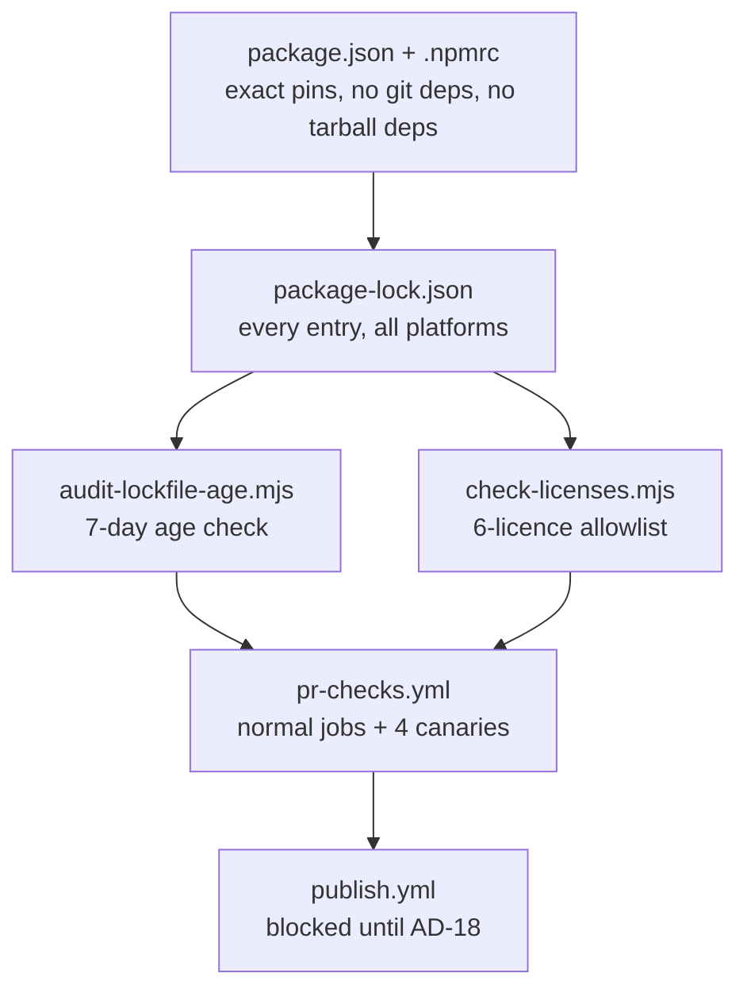
```mermaid
flowchart TD
  PKG["package.json + .npmrc<br/>exact pins, no git deps, no tarball deps"]
  LOCK["package-lock.json<br/>every entry, all platforms"]
  AGE["audit-lockfile-age.mjs<br/>7-day age check"]
  LIC["check-licenses.mjs<br/>6-licence allowlist"]
  PRCHECKS["pr-checks.yml<br/>normal jobs + 4 canaries"]
  PUBLISH["publish.yml<br/>blocked until AD-18"]

  PKG --> LOCK
  LOCK --> AGE
  LOCK --> LIC
  AGE --> PRCHECKS
  LIC --> PRCHECKS
  PRCHECKS --> PUBLISH
```

**Story:** `_bmad-output/implementation-artifacts/1-1-align-the-toolchain-and-supply-chain-to-the-stack.md`

### Reference

**Rules:**

- Pin exact versions. No `^`, no `~`. Tools too.
- Keep Vite on 7.x. Vite 8 pulls in `lightningcss`, whose licence is not allowed.
- Both audit scripts read `package-lock.json`.
  The lockfile lists packages for every OS; `node_modules` only holds this machine's.
- A package must be 7 days old.
  npm's own `min-release-age` checks new installs only, so a young package already in the lockfile slips past it.
- Six licences allowed: MIT, Apache-2.0, ISC, BSD-2-Clause, BSD-3-Clause, 0BSD.
- Each gate has a canary job that feeds it a bad package and checks the **exact** error, like `EALLOWGIT`.
  Checking only "it failed" would also pass on a typo.
- Publishing stops before anything runs unless a repo variable is set.
  It stays unset until the AD-18 licence question is answered.

**Watch out:** the git and remote canary fixtures are real installable packages, because their jobs run a real `npm ci`.
The age and licence fixtures are only read as files, so they just need to be valid JSON.

## Step 2 (epic1-story2): canonical bytes and digests

**In plain terms:** Two programs can hold the same data and write it out differently:
keys in another order, different spacing, a long number quietly rounded off.
Hash those two files and you get two fingerprints for one thing, and every comparison built on them is wrong.
This step fixes one exact way to write any JSON value out as bytes and fingerprints those bytes,
so anyone starting from the same data lands on the same answer.

**What:** turn any JSON value into one exact byte string, then SHA-256 those bytes.

**Why:** every version number, integrity check, and lineage link in this product is a digest.
If our code and someone else's code turn the same JSON into different bytes, every comparison quietly breaks.
Real example: JavaScript reads `9007199254740993` as `9007199254740992`.

**Read in this order:**

1. `tests/fixtures/README.md`: the whole contract, written for someone not using TypeScript.
2. `src/core/schemas/faults.ts`: nine lines.
3. `src/core/canonical/scan-json.ts`: reads raw text, catches what `JSON.parse` hides.
4. `src/core/canonical/value-domain.ts`: same checks for values already in memory.
5. `src/core/canonical/canonicalize.ts`: JSON to bytes.
6. `src/core/canonical/digest.ts`: the five digest functions.
7. `tests/fixtures/derive_vectors.py`: run `python3 tests/fixtures/derive_vectors.py --check`.
8. `tests/canonical/vectors.test.ts`: every fixture runs as its own test.

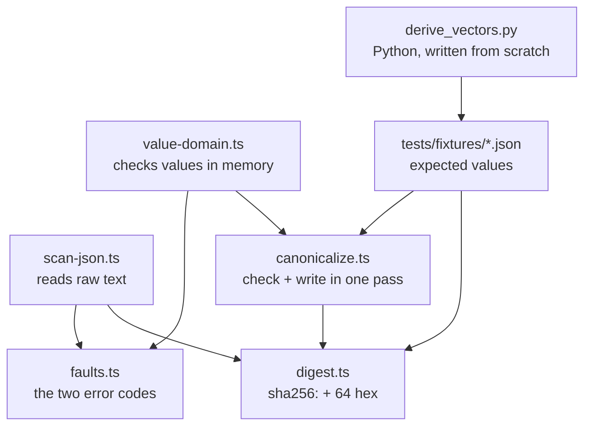
```mermaid
flowchart TD
  SCAN["scan-json.ts<br/>reads raw text"]
  DOMAIN["value-domain.ts<br/>checks values in memory"]
  FAULT["faults.ts<br/>the two error codes"]
  CANON["canonicalize.ts<br/>check + write in one pass"]
  DIGEST["digest.ts<br/>sha256: + 64 hex"]
  FIXTURES["tests/fixtures/*.json<br/>expected values"]
  DERIVE["derive_vectors.py<br/>Python, written from scratch"]

  SCAN --> FAULT
  DOMAIN --> FAULT
  DOMAIN --> CANON
  SCAN --> DIGEST
  CANON --> DIGEST
  DERIVE --> FIXTURES
  FIXTURES --> CANON
  FIXTURES --> DIGEST
```

**Story:** `_bmad-output/implementation-artifacts/1-2-canonical-digest-computation-and-the-hashed-artifact-value-domain.md`

### Reference

**Rules:**

- Written here, no library. An unchecked hashing library is a supply-chain risk.
- Sort keys by UTF-16 code unit. Emoji sort before some normal letters, which looks wrong and is correct.
- Let JavaScript print the numbers.
- Check and write in one pass.
  Read an object twice and a sneaky object can hand back something else the second time.
  This really happened: a hidden `NaN` came out as `null`.
- Numbers must be finite, and whole numbers stop at 2^53 − 1. Above that JavaScript loses digits.
- Scan the raw text before parsing, and make bad UTF-8 throw.
  `JSON.parse` rounds big numbers and drops duplicate keys without a word;
  the default decoder swaps bad bytes for `?` and hands you a clean hash of wrong data.
- Two error codes only: `non-canonicalizable-value` for a bad value,
  `schema-parse-failure` for text that will not parse.
- A digest is `sha256:` plus 64 hex characters.
  To combine digests, hash an object with named fields.
- Expected test values come from a Python script written from scratch.
  Running our own code and saving its output would only prove the code agrees with itself.

**Watch out:**

- `src/index.ts` still exports only `VERSION`. Tests import from `src/core/canonical/` directly.
- Only `core/schemas/` and `core/canonical/` exist so far.
- The huge-number branch in `canonicalize.ts` is real code that no valid input can reach.
  The safe-integer rule rejects those numbers first.

## Step 3 (epic1-story3): the Eval Contract schema

**In plain terms:** Someone has to write down what they want tested:
which endpoints exist, what counts as a pass, what gets called in what order.
This step defines the shape of that document, field by field, and what an author is allowed to say in it.
Anything the form has no box for is a rule nobody downstream can ever check.

**What:** the whole Eval Contract written once in Zod:
what an author declares, the check expression grammar, and the plan of interaction steps.

**Why:** every later epic reads these declarations and decides whether a contract is any good.
This step decides what can be said at all.
A shape spelled two ways is two products.

**Read in this order:**

1. `src/core/schemas/primitives.ts`: identifiers, digests, dates, and the `JsonValue` container.
2. `src/core/schemas/pointer.ts`: the three spellings and who may use each.
3. `src/core/schemas/expression.ts`: the operand union and the sixteen check forms.
4. `src/core/schemas/interface.ts`: operations, request channels, response descriptors.
5. `src/core/schemas/plan.ts`: a step selects observations; it never gives instructions.
6. `src/core/schemas/eval-contract.ts`: everything above, assembled.
7. `src/core/schemas/constraint-ledger.ts`: what the export cannot carry, as data.
8. `tests/schemas/ad5-admissions.test.ts`: one test per error code, proving the shape still parses.
9. `tests/schemas/fixtures/gate-c-contract.ts`: the only hand-written contract,
   and the twelve places it had to change.

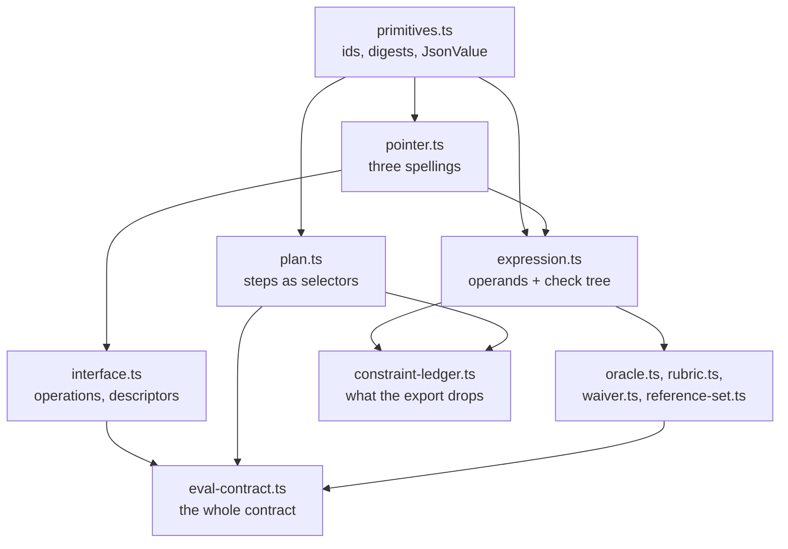
```mermaid
flowchart TD
  PRIM["primitives.ts<br/>ids, digests, JsonValue"]
  PTR["pointer.ts<br/>three spellings"]
  EXPR["expression.ts<br/>operands + check tree"]
  IFACE["interface.ts<br/>operations, descriptors"]
  PLAN["plan.ts<br/>steps as selectors"]
  PARTS["oracle.ts, rubric.ts,<br/>waiver.ts, reference-set.ts"]
  CONTRACT["eval-contract.ts<br/>the whole contract"]
  LEDGER["constraint-ledger.ts<br/>what the export drops"]

  PRIM --> PTR
  PRIM --> EXPR
  PTR --> EXPR
  PTR --> IFACE
  PRIM --> PLAN
  EXPR --> PARTS
  IFACE --> CONTRACT
  PLAN --> CONTRACT
  PARTS --> CONTRACT
  EXPR --> LEDGER
  PLAN --> LEDGER
```

**Story:** `_bmad-output/implementation-artifacts/1-3-the-eval-contract-schema-declarations-operand-grammar-and-plan-grammar.md`

### Reference

**Rules:**

- If a later epic has an error code for a bad shape, the schema accepts that shape.
  Rejecting it here swaps a named error for a nameless parse failure and deletes a test someone else owes.
- One exception to that rule: operand count is still enforced here.
  `equality` takes exactly two operands,
  and the schema rejects a third operand itself, without waiting on a later epic's error code.
- "Not set" is written `null`, with the key always present.
  Missing, empty, and filled are three answers.
- Every object is strict. Six maps are keyed by the author's own words; each is named in the code.
- `JsonValue` is the only place the caller's own keys are allowed.
- Three pointer spellings, three regexes:
  rooted at a step, relative to a quantifier's element, and plain into one response descriptor.
- Binding values are tagged, `{"literal": …}` or `{"matcher": "any"}`.
  The untagged form cannot be written down at all.
- Name every shape that is shared or refers to itself.
  An unnamed one exports as `__schema0`, a number that shifts as soon as anything else changes.
  Never add `.describe()` to a named shape at a use site;
  that wraps it and brings `__schema0` straight back.
- Reach for a plain Zod feature wherever one exists.
  A `.refine()` vanishes from the published JSON Schema; `.describe()` text survives.
  Whatever a refinement still enforces goes in `constraint-ledger.ts`
  with the exact place to put it back and the JSON Schema version that fix is written for.

**Watch out:**

- A reject test asserts the exact issue path and code. "It failed" would also pass on a typo.
- The old worked example fails three of its five checks on purpose. Do not repair it.
- `z.record` keyed by an enum demands every member, so the four channels are a plain object.
- `DIGEST_FORM` moved here from `digest.ts`.
  Imports run one way: `core/` may import `core/schemas`.

## Step 4 (epic1-story4): the other eleven artifacts

**In plain terms:** Step 3 shaped the document going in.
Everything coming back out had no agreed shape at all:
the record of what happened during a run, the audit of how it was kept isolated, the scored result.
A caller sending one of those was guessing at the fields.
This step writes down all eleven of them, one file each, and keeps a single list naming the full set.

**What:** the remaining eleven interchange artifacts written in Zod, one file each,
plus one registry listing all twelve.

**Why:** step 3 typed the file going in.
A field missing in the other eleven is a rule a later epic cannot read,
and an artifact with no schema is a caller guessing.

**Read in this order:**

1. `src/core/schemas/lineage.ts` and `verdict.ts`: two leaves, read them first.
2. `src/core/schemas/artifact-reference.ts`: the smallest union, and the no-lineage exemption.
3. `src/core/schemas/sealed-run-record.ts`: the biggest one, and the finding union.
4. `src/core/schemas/isolation-manifest.ts`: the generated forbidden-input accounting.
5. `src/core/schemas/probe.ts` and `evidence-artifact.ts`: the other two top-level unions.
6. `src/core/schemas/sealed-evaluator-brief.ts`: the one artifact defined by what it keeps out.
7. `src/core/schemas/artifact.ts`: the twelve, as data.
8. `src/core/schemas/constraint-ledger.ts`: addresses now name an artifact.
9. `tests/schemas/artifact-registry.test.ts`: the audits that walk all twelve.
10. `tests/schemas/fixtures/worked-example-artifacts.ts`: the old chain, and its 60 and 19 failures.

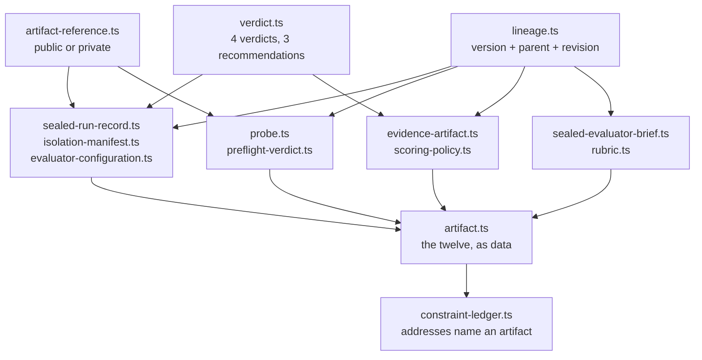
```mermaid
flowchart TD
  LIN["lineage.ts<br/>version + parent + revision"]
  VER["verdict.ts<br/>4 verdicts, 3 recommendations"]
  REF["artifact-reference.ts<br/>public or private"]
  IN["sealed-run-record.ts<br/>isolation-manifest.ts<br/>evaluator-configuration.ts"]
  CORPUS["probe.ts<br/>preflight-verdict.ts"]
  OUT["evidence-artifact.ts<br/>scoring-policy.ts"]
  BRIEF["sealed-evaluator-brief.ts<br/>rubric.ts"]
  REG["artifact.ts<br/>the twelve, as data"]
  LEDGER["constraint-ledger.ts<br/>addresses name an artifact"]

  LIN --> IN
  LIN --> CORPUS
  LIN --> OUT
  LIN --> BRIEF
  VER --> IN
  VER --> OUT
  REF --> IN
  REF --> CORPUS
  IN --> REG
  CORPUS --> REG
  OUT --> REG
  BRIEF --> REG
  REG --> LEDGER
```

**Story:** `_bmad-output/implementation-artifacts/1-4-the-remaining-interchange-artifact-schemas.md`

### Reference

**Rules:**

- Twelve artifacts, one closed list, in `artifact.ts`.
  Nothing generates that list and nothing under `core/schemas/` imports it.
- `schemaVersion`, `parentDigest`, and `revisionCount` live in `lineage.ts` and are spread into eleven artifacts.
  A spread adds no shared definition to the export.
- `lineage.ts` and `verdict.ts` are leaves on purpose.
  Put them in `artifact.ts` and the imports form a loop that crashes on load
  with an error naming a file you never edited.
- `ArtifactReference` is the one artifact with no version and no lineage.
  It sits inside others, so versioning it would add a key to every finding for nobody.
- Where the old schema said "if this, then that", the new one is a union of branches.
  That is why a defect finding must quote its evidence and the other two kinds need not.
- Severity, interface kind, and the seven forbidden inputs come from the file that already held them.
  A second copy drifts.
- If a field-level `null` already says "absent",
  the object under it may not say the same thing again with every member null.
- Money is a string everywhere, including the isolation manifest.
  Seconds stay a number.
  A ceiling that must stay above zero needs its own string format:
  a plain `number` field can't carry that constraint.
- Every ledger entry names its artifact, because with twelve roots "the root" points at nothing.
  A union at the top has no `properties`,
  so the resolver reads every branch and gives up if one lacks the field.

**Watch out:**

- The old worked example fails in 79 places. That is the record. Do not repair it.
- `RubricBody` now shows up in the contract's exported definitions. That is deliberate.
- `EvidenceArtifact` is the scored output.
  `evidenceArtifacts` on a finding is a list of references.
  Two different things one word apart.
- `EvaluatorConfiguration` rejects a `trialIndex` key on purpose, and a test proves the rejection.
  A missing field here is the requirement itself; don't add it back in.
- `responseHeaders` is a name-to-value map while `responseBody` is the open container.
  A pointer reaches into the headers by name, so a bare number there would address nothing;
  a body may be a bare number and still be a body.
- Every fixture is listed in an exported array that a test asserts is complete.
  A fixture nothing imports proves nothing, and one shipped that way before review caught it.
- Eighteen rules are named as unenforced in `ad5-admissions.test.ts`.
  Most compare two artifacts, and one schema cannot see two artifacts at once.

## Step 5 (epic1-story5): the published export and its four checks

**In plain terms:** Anyone not writing TypeScript sees only the JSON Schema files this project publishes.
A rule that lives in the TypeScript and fails to make it into those files is invisible to them,
and nothing would ever point it out.
This step generates the published files from the same source the library uses
and adds four checks that compare the two rule by rule, so a rule that goes missing turns the build red.

**What:** twelve committed `schemas/*.schema.json` files built by one pure function,
and four checks that prove them equivalent to the Zod source, constraint by constraint.

**Why:** a constraint living only in a Zod refinement never reaches the published files, and nothing would notice.
The four checks make that class of silence a red build.

**Read in this order:**

1. `src/core/schemas/publish.ts`: the builder, the injection, the serialiser.
2. `scripts/generate-schemas.ts` and `scripts/check-schemas.ts`: the writer and the byte gate.
3. `src/core/failure-codes.ts` and `scripts/check-ad5-registry.ts`: the AD-5 binding.
4. `tests/schemas/publish.test.ts`: `$id`, `$defs` naming, the loud failures.
5. `tests/schemas/published/keyword-occurrences.ts`: what counts as a keyword, and the exemption rule.
6. `tests/schemas/published/mutant-generator.ts`: the schema-directed corpus.
7. `tests/schemas/published/differential.test.ts` and `keyword-mutation.test.ts`: checks three and four.

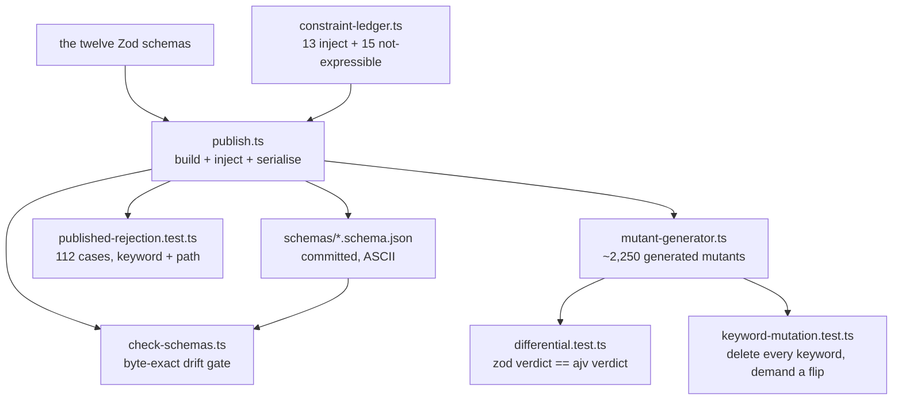
```mermaid
flowchart TD
  ZOD["the twelve Zod schemas"]
  LEDGER["constraint-ledger.ts<br/>13 inject + 15 not-expressible"]
  PUB["publish.ts<br/>build + inject + serialise"]
  FILES["schemas/*.schema.json<br/>committed, ASCII"]
  DRIFT["check-schemas.ts<br/>byte-exact drift gate"]
  REJ["published-rejection.test.ts<br/>112 cases, keyword + path"]
  GEN["mutant-generator.ts<br/>~2,250 generated mutants"]
  DIFF["differential.test.ts<br/>zod verdict == ajv verdict"]
  SWEEP["keyword-mutation.test.ts<br/>delete every keyword, demand a flip"]

  ZOD --> PUB
  LEDGER --> PUB
  PUB --> FILES
  PUB --> DRIFT
  FILES --> DRIFT
  PUB --> REJ
  PUB --> GEN
  GEN --> DIFF
  GEN --> SWEEP
```

**Story:** `_bmad-output/implementation-artifacts/1-5-the-published-json-schema-export-and-its-four-ci-checks.md`

### Reference

**Rules:**

- One builder, `publish.ts`, downstream of everything. Nothing under `core/schemas/` imports it.
- `$id` is a URN, `urn:eval-quality:schema:{key}`. A URL would promise a document nothing serves.
- The constraint ledger drives every injection by its stated address.
  An address that does not resolve throws.
- The committed files are pure ASCII, 2-space indent, one trailing newline.
  The drift check compares bytes, so the serialisation is fixed in one shared function.
- The drift check has no `--write`.
  If it could fix the file it is checking, a broken build would get silently patched and pass.
- Four checks, three homes:
  rejection suite, differential, and mutation sweep are pure and live in Vitest;
  only the byte drift check reads disk, so only it is a script.
- The validator is ajv 8, third-party on purpose: it independently reported the arity hole the ledger repairs.
  `strict` on, `strictTypes` off, `date-time` registered always-true, no ajv-formats.
- The mutant corpus is generated.
  A hand-written attempt was tried first and measured a kill rate of one keyword in ten.
- Unkillable keywords are exempted by computed rule,
  and survivors, unreachable, and exempt are asserted equal three ways.
  Measured on this pin: 1,949 occurrences, 168 exempt.
- Pin the counts (occurrences, exempt, survivors) exactly.
  A floor ("at least N") lets the count quietly drop and still pass;
  only an exact match catches coverage that stopped growing.
- Every gate gets a canary that proves it blocks, for the stated reason.
- `FAILURE_CODES` is parsed against the AD-5 table on every validate,
  so nobody hand-maintains the enumeration beside it.

**Watch out:** ajv anchors a reported `schemaPath` to the `$defs` entry where the error occurred.
Zod exports `type` beside every `const` and `enum`, which makes those `type`s undeletable-by-proof and therefore exempt.
Deleting an injected arity keyword makes ajv strict refuse to compile,
which the sweep tracks as its own outcome, separate from a pass.

## Step 6 (epic2-story1): the direction-prose generator

**In plain terms:** The evaluator is told what to check and deliberately not told the script:
no step names, no call order.
So the instruction has to say something like "the id you sent to the create endpoint,
compared with the id field the read endpoint gave back" without naming a single step.
This step is the code that writes those sentences out of what the author declared.

**What:** turn one oracle's declared direction (evidence targets, relation, polarity, scope, negative domain)
into the prose that becomes a `BriefDirection`'s `text`.

**Why:** the sealed evaluator gets this prose in place of the interaction plan and its step identifiers.
It has to say which call an evidence target came from without naming the step.
Two observations of one operation that render the same sentence are indistinguishable to it.
Real example: "the id value you sent to the create endpoint, compared with its id field from the read endpoint,
is asserted to be equal" names two calls and what to compare between them, and names no step.

**Read in this order:**

1. `src/core/seal/plan-index.ts`: resolves a pointer to its step and operation.
   Nothing about reachability; that is Epic 4's.
2. `src/core/seal/derived-reference.ts`: the phrase vocabulary, the escalation ladder,
   and the temporal-pair grouping.
3. `src/core/seal/direction-prose.ts`: the five relation families, assembled into one string.
4. `tests/schemas/fixtures/gate-c-contract.ts`: the primary fixture, already in the tree.
5. `tests/seal/fixtures.ts`: what Gate C does not carry,
   including the Gate D reconstruction and the create-then-read-back pair.

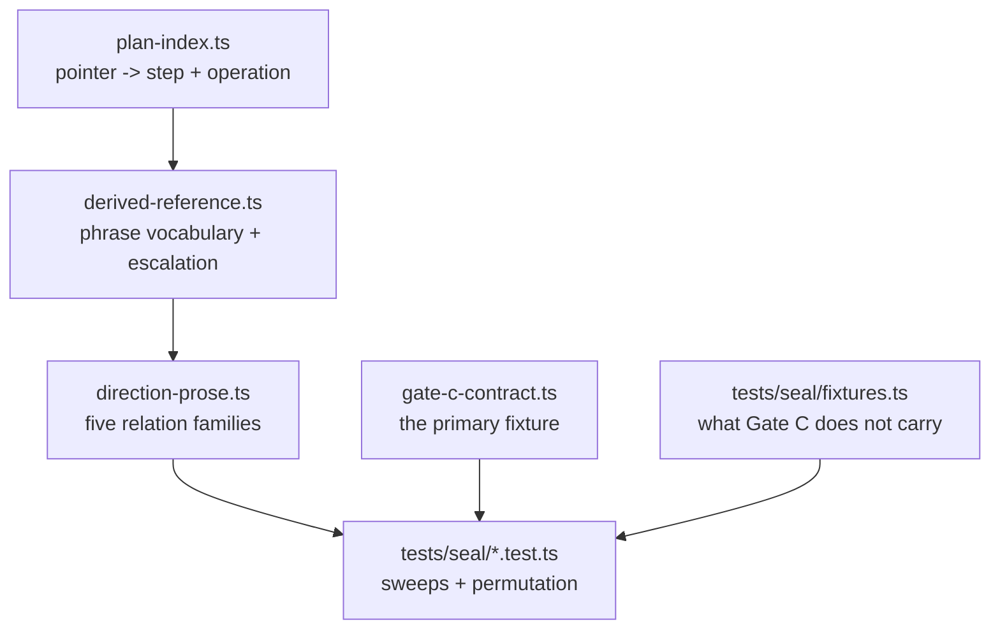
```mermaid
flowchart TD
  PLANIDX["plan-index.ts<br/>pointer -> step + operation"]
  DERIVED["derived-reference.ts<br/>phrase vocabulary + escalation"]
  PROSE["direction-prose.ts<br/>five relation families"]
  GATEC["gate-c-contract.ts<br/>the primary fixture"]
  SEALFIX["tests/seal/fixtures.ts<br/>what Gate C does not carry"]
  TESTS["tests/seal/*.test.ts<br/>sweeps + permutation"]

  PLANIDX --> DERIVED
  DERIVED --> PROSE
  PROSE --> TESTS
  GATEC --> TESTS
  SEALFIX --> TESTS
```

**Story:** `_bmad-output/implementation-artifacts/2-1-the-direction-prose-generator.md`

### Reference

**Rules:**

- A pointer resolves to a phrase that leaves the step id out.
- The channel decides whether the phrase says obtained or sent.
  Drop it and O-001's two targets read alike.
- A malformed input always says so. That is AD-16's own worked example.
- Two steps that would render the same phrase escalate through a fixed ladder:
  generic, then the binding's kind, then its literal value, then a method and path description.
- A temporal read-back pair renders as one relational phrase.
  Rendering each side on its own and joining them puts the two steps in an order the evaluator can read off.
- Five relation-template families:
  quantifiers, connectives, presence, comparison, and the six remaining structural operators.
  `not` gets its own skeleton; a shared affirmative one tells the evaluator the opposite of the declared claim.
- `scope` and `negativeDomain` are author text.
  The generator frames them in a sentence and never splits or reorders them.
  `null` drops the clause.
- Determinism is proven by permutation.
  A repeat call cannot catch a tie-break that is stable within one process.

**Watch out:**

- The ladder's fourth rung is computed from the shared operation,
  so every sibling on that operation gets the same text and it can never break a tie.
  Reaching it throws.
- `response-body`, `stdout` and `stderr` all render `its {field} field`,
  and a `call-inputs` pointer carrying a tail drops its transport channel,
  so two different targets can still read alike.
  Both are open findings on story 2.1.
- The suite is green and does not prove the rules above.
  Mutating the sent-versus-obtained wording, the pair order, the binding-key sort and the clause order
  each leaves all 63 tests passing.
- `gateCContract` is declared `satisfies EvalContract`,
  and the type TypeScript infers for it afterward does not assign to `PermittedInterface[]`.
  `tests/seal/fixtures.ts` casts once through `unknown`;
  `z.array(PermittedInterface).parse` gives the same type and validates.

## Step 7 (epic2-story2): brief assembly, exclusions, and canonical ordering

**In plain terms:** Step 6 writes one sentence.
This step walks the whole document, writes one per rule,
and packs them into the single briefing the evaluator actually receives,
carrying only the fields it is allowed to see.
It also sorts everything that has no meaningful order,
so two authors who listed the same things in a different order get byte-for-byte the same briefing.

**What:** `seal(contract)` walks every oracle,
renders one `BriefDirection` per oracle using Step 6's prose generator,
then assembles the `SealedEvaluatorBrief`: only the fields AD-16 permits, with unordered arrays sorted to a fixed key.

**Why:** Step 6 renders one oracle's prose.
Nothing yet walked a whole contract and produced the artifact the evaluator actually reads.
Most of the brief's content must come out byte-identical no matter how the contract's arrays were declared;
`behaviors` and `contractDigest` are the two deliberate exceptions, covered below.

**Read in this order:**

1. `src/core/seal/seal.ts`: the whole function.
2. `src/core/schemas/sealed-evaluator-brief.ts`: what the brief is allowed to carry.
3. `src/core/schemas/interface.ts`: why `permittedInterfaces` needs a per-element map.
4. `tests/seal/seal.test.ts`: the sort, duplicate-key, reorder, and reject-fixture tests.

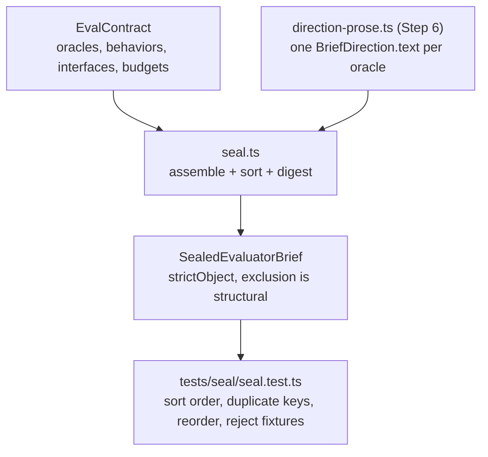
```mermaid
flowchart TD
  CONTRACT["EvalContract<br/>oracles, behaviors, interfaces, budgets"]
  PROSE["direction-prose.ts (Step 6)<br/>one BriefDirection.text per oracle"]
  SEAL["seal.ts<br/>assemble + sort + digest"]
  BRIEF["SealedEvaluatorBrief<br/>strictObject, exclusion is structural"]
  TESTS["tests/seal/seal.test.ts<br/>sort order, duplicate keys, reorder, reject fixtures"]

  CONTRACT --> SEAL
  PROSE --> SEAL
  SEAL --> BRIEF
  BRIEF --> TESTS
```

**Story:** `_bmad-output/implementation-artifacts/spec-2-2-brief-assembly-exclusions-and-canonical-ordering.md`

### Reference

**Rules:**

- Assemble only what `SealedEvaluatorBrief` declares.
  It is `strictObject`, so excluding commentary, the interaction plan, and every step identifier is structural:
  the type has no slot for them.
  Nobody has to remember to filter them out.
- `permittedInterfaces` is a per-element map: it drops each interface's operation inventory before the brief sees it.
  Only the interface's identity crosses.
- Four fields have no meaningful order in the contract
  (`directions`, `permittedInterfaces`, `scopedResources`, `safetyLimits`): sort each by its natural key.
  A duplicate key throws.
  Sort stability is not a guarantee, so byte-identity cannot lean on it.
- `behaviors` is the one array kept in contract order.
  Its order is meaningful, so it is not folded into the sort rule above.
- `contractDigest` hashes the literal input,
  so reordering the contract's arrays legitimately changes it even though the rest of the brief stays byte-identical.
  Lineage sits outside the guarantee for the same reason: it is not derived from array content at all.
- `negativeDomain`'s own "canonical sorted order" language is satisfied vacuously:
  one string, one member, nothing to sort.
  It is closed here, with no invented structure to make the sort mean anything.
- Copy `behaviors` and `budgets` in.
  Do not alias them to the source contract,
  or a caller mutating the contract after `seal()` returns would silently mutate the "sealed" brief too.

**Watch out:** a test that hashes or diffs the whole brief object across reorderings will never pass;
only the content fields are asserted byte-identical, `contractDigest` is not one of them.
Forbidden-input exclusion here comes from the schema's `strictObject` shape.
`seal()` performs no such check itself.

## Step 8 (epic2-story3): the emitted-brief scripting audit

**In plain terms:** The evaluator is supposed to work out its own approach,
so the briefing must not smuggle in a step-by-step script.
The generated sentences never do that on their own, but an author's free-text notes get copied through,
and "first do this, then do that" fits in a notes field.
This step reads the finished briefing and rejects it
when one instruction carries more sequencing language than the author said it would.

**What:** a pure function, `auditBriefScripting`, that reads an already-assembled `SealedEvaluatorBrief`
and throws if any one direction's generated `text` carries more sequencing/transition markers
than the contract's declared `probeStepBound`.

**Why:** the declaration-side graph predicate over the interaction plan (a later epic) reads the plan structure,
and generated prose falls outside what it reads.
An author's own free `scope`/`negativeDomain` text is the one channel
that can still smuggle a scripted "do this, then this" sequence past that predicate,
since Step 6's own generator never emits that vocabulary itself.
This audit runs after generation, over the finished brief, to catch exactly that.

**Read in this order:**

1. `src/core/failure-codes.ts`: the twenty-one-code tuple and the new `StructuralFailure` class beside it.
2. `src/core/seal/scripting-audit.ts`: the marker pattern, the per-direction count, the throw.
3. `tests/seal/scripting-audit.test.ts`: the accept/reject fixtures and the permutation test.

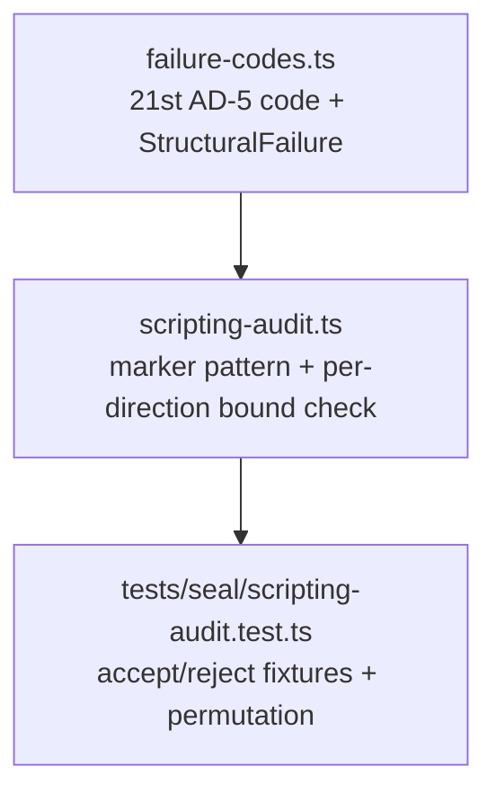
```mermaid
flowchart TD
  CODES["failure-codes.ts<br/>21st AD-5 code + StructuralFailure"]
  AUDIT["scripting-audit.ts<br/>marker pattern + per-direction bound check"]
  TESTS["tests/seal/scripting-audit.test.ts<br/>accept/reject fixtures + permutation"]

  CODES --> AUDIT
  AUDIT --> TESTS
```

**Story:** `_bmad-output/implementation-artifacts/2-3-the-emitted-brief-scripting-audit.md`

### Reference

**Rules:**

- `probeStepBound: null` means no bound was declared; the audit passes vacuously.
  `0` is a legal, strict bound: no marker of any kind is permitted.
- The bound applies per direction,
  because an enumerated path is something a reader reconstructs from one direction's own narrated claim.
- The marker set: `then`, `before`, `after`, `subsequently`, `next`, `finally`, `afterward` (and `afterwards`),
  plus a numbered-list marker (`1.`, `2)`, ...), case-insensitive and whole-word.
- A numbered-list marker only counts inside real list context:
  it has to open a line, follow a newline, or follow a sentence-ending mark plus a space.
  That anchor keeps ordinary numeric prose like "Rule 12." from counting as a step.
- Bare ordinals (`first`, `second`, ...) are excluded on purpose:
  `gateCContract`'s own shipped "not the first" already uses "first" as a position word, in accepted author prose.
- Only `directions[].text` is scanned.
  Widening that scan to `behaviors`, `scopedResources`, or `safetyLimits`
  is a flagged, deferred judgment call for a later story.
- It throws `StructuralFailure`,
  a compile-time-class failure carrying an AD-5 code (the twenty-first the registry now carries).
- Which direction's failure surfaces first, when more than one violates,
  is only as deterministic as `directions`' own array order;
  the audit does not hunt for every violation in one pass.

**Watch out:** the story's own regression fixture cites "O-004" for the "not the first" text;
that text is actually O-005's `scope` in `tests/schemas/fixtures/gate-c-contract.ts`,
and the test targets O-005 directly.

## Step 9 (epic3-story1): scalar operators over the evidence domain

**In plain terms:** "Did the response match?" sounds like one question and is really ten:
equal, contains, exists, matches this pattern, is sorted, is roughly this many, and so on.
Two people implementing those ten differently will score the same run differently.
This step pins each one down exactly,
including what happens when the value is garbage, which is a plain "no".

**What:** ten pure functions (`equality`, `deepEquality`, `containment`, `existence`, `absence`,
`regexMatch`, `setMembership`, `ordering`, `countTolerance`, `shape`),
each taking already-resolved evidence values and returning a plain `boolean`.

**Why:** two implementations of one oracle's `check` must land on the same answer for every node,
or the scoring model can't be trusted.
This step nails that down operator by operator:
what counts as equal, what counts as contained, what a regex match-step budget actually bounds.
Real example: compare `9007199254740993` against an ordinary number and it just resolves `false`,
the same as any other wrong answer.
Only comparing two objects or two arrays ever risks a crash,
so a broken system under test's bad number cannot bring the whole run down.

**Read in this order:**

1. `src/core/evaluate/resolved-value.ts`: the `ABSENT` sentinel and `ResolvedValue`.
2. `src/core/evaluate/operators.ts`: the ten functions.
3. `src/core/schemas/scoring-policy.ts`: `regexMatchStepBudget`, the field `regexMatch` reads.
4. `src/core/schemas/faults.ts`: the two new runtime fault codes, `RUNTIME_FAULT_CODES`.
5. `tests/evaluate/operators.test.ts`: every operator's accept, reject, and absent-operand case.

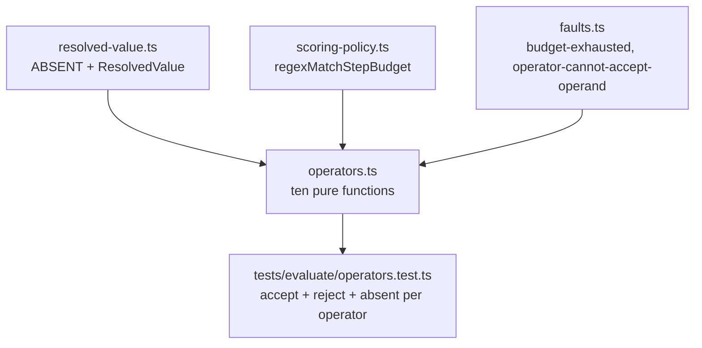
```mermaid
flowchart TD
  RESOLVED["resolved-value.ts<br/>ABSENT + ResolvedValue"]
  OPS["operators.ts<br/>ten pure functions"]
  POLICY["scoring-policy.ts<br/>regexMatchStepBudget"]
  FAULTS["faults.ts<br/>budget-exhausted, operator-cannot-accept-operand"]
  TESTS["tests/evaluate/operators.test.ts<br/>accept + reject + absent per operator"]

  RESOLVED --> OPS
  POLICY --> OPS
  FAULTS --> OPS
  OPS --> TESTS
```

**Story:** `_bmad-output/implementation-artifacts/3-1-scalar-operators-over-the-evidence-domain.md`

### Reference

**Rules:**

- Every operator takes a `ResolvedValue` (`JsonValue | ABSENT`).
  Resolving a `{pointer}`/`{literal}`/`{referenceSet}` operand is a later epic's job.
- `ABSENT` is a unique symbol of its own, distinct from JSON `null`.
  `existence` reads false against it, `absence` true, and every comparison false, even absent-against-absent.
- `equality` reaches structural comparison (`digestArtifact`) only when both operands are the same compound kind.
  Every other input, including a domain-violating scalar, resolves without ever canonicalizing.
  `deepEquality` is unconditionally structural, so it can throw `non-canonicalizable-value`
  where `equality` on the same inputs would just resolve `false`.
- `regexMatch`'s step budget is a static two-tier gate:
  reject any nested-quantifier shape outright,
  then bound a linear, character-class-aware estimate against the declared budget.
- Strip escaped characters before stripping character classes.
  Getting that order backward once let an escaped bracket hide a real nested-quantifier group from both gate tiers,
  and the regex hung with no fault thrown.
- `shape`'s closed set is `permittedKeys` alone:
  a required key missing from it makes the descriptor unsatisfiable.
- `ordering`, `countTolerance`, and any operand that may denote a collection resolve `false` on a bare `ABSENT`.
  That answer is correct only when the operand is not itself declared collection-typed;
  the next story's wrapper handles the other case.
- Every function's last parameter is `artifactPath: string`,
  even on the five that never throw (named `_artifactPath`), so every operator shares one calling convention.

**Watch out:**

- This story's ten operators are two-valued.
  Three-valued `insufficient-evidence` resolution, the connectives, and the quantifiers are the next story's;
  nothing here decides that value.
- `RUNTIME_FAULT_CODES` lists only codes with a genuine thrower, four of AD-28's ten rows,
  where `FAILURE_CODES` mirrors AD-5 in full.
  Nothing automates a cross-check against the spine table yet.
- The budget gate still can't see everything:
  a quantified overlapping alternation like `(?:a|a)+` passes both tiers and can still hang.
  Catching it needs a real parser, so it's left as a named gap.
  The default budget is 1,000,000, so ordinary-length evidence text doesn't fault on length alone,
  but that also means the linear tier does almost no real work day to day;
  the structural nested-quantifier check above is the actual backstop.

## Step 10 (epic3-story2): connectives, quantifiers, and three-valued resolution

**In plain terms:** Real checks combine the simple ones:
not this, all of these, any of these, and "for every item in the list".
The trap is an empty list.
"Every item passed" is trivially true of nothing, and so is "no item failed",
so an empty response certifies itself.
This step adds a third answer beside yes and no, meaning "there was nothing here to look at",
so an empty result stops reading as a clean pass.

**What:** `resolveCheck`, the tree-walker that turns an `Expression` into a `CheckResolutionValue`:
`notOf`/`allOf`/`anyOf` for the three connectives,
`resolveQuantifier` for `for-all`/`for-any`,
and the empty-collection check applied before every leaf operator runs.

**Why:** Story 3.1's ten operators only decide one node.
The soft-delete pair is why three-valued resolution exists:
`for-all(page, absence(@/retractedAt))` and `not(for-any(page, existence(@/retractedAt)))` say the same thing,
and over an empty page one used to certify while the other failed closed.
Both now resolve `insufficient-evidence`.

**Read in this order:**

1. `src/core/schemas/evidence-artifact.ts`: `CheckResolutionValue`, the shape this whole module produces.
2. `src/core/evaluate/resolution.ts`: `operandDenotesEmptyCollection`, `notOf`/`allOf`/`anyOf`,
   `resolveQuantifier`, `resolveNode`, `resolveCheck`.
3. `tests/evaluate/fixtures/stub-resolver.ts`: the test-only pointer walker these tests resolve against;
   never shipped from `src/`.
4. `tests/evaluate/resolution.test.ts`: the soft-delete three-way agreement,
   the empty-collection cases, and every RuntimeFault-propagates-through-a-connective case.

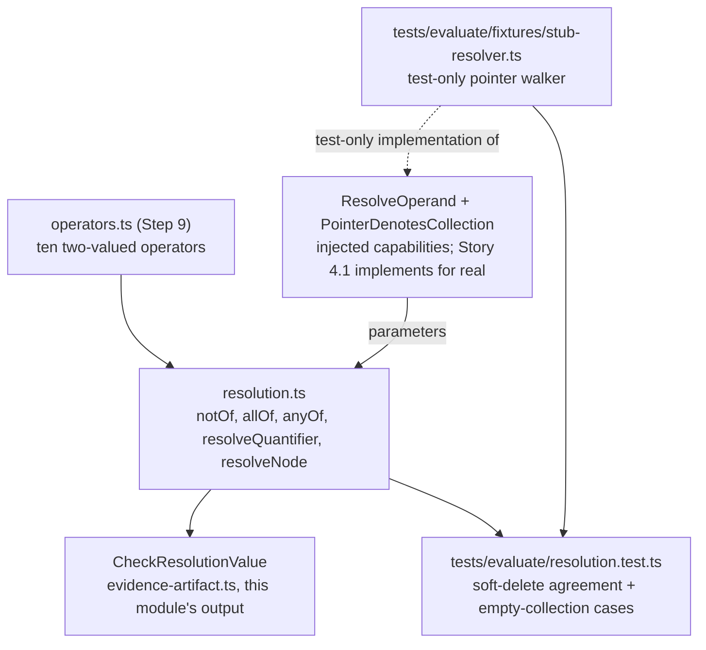
```mermaid
flowchart TD
  OPS["operators.ts (Step 9)<br/>ten two-valued operators"]
  CAP["ResolveOperand + PointerDenotesCollection<br/>injected capabilities; Story 4.1 implements for real"]
  RES["resolution.ts<br/>notOf, allOf, anyOf, resolveQuantifier, resolveNode"]
  OUT["CheckResolutionValue<br/>evidence-artifact.ts, this module's output"]
  STUB["tests/evaluate/fixtures/stub-resolver.ts<br/>test-only pointer walker"]
  TESTS["tests/evaluate/resolution.test.ts<br/>soft-delete agreement + empty-collection cases"]

  OPS --> RES
  CAP -- parameters --> RES
  RES --> OUT
  STUB -. test-only implementation of .-> CAP
  STUB --> TESTS
  RES --> TESTS
```

**Story:** `_bmad-output/implementation-artifacts/3-2-connectives-quantifiers-and-three-valued-resolution.md`

### Reference

**Rules:**

- The empty-collection check runs on every operand of every operator except three,
  including a `{ literal: [] }` one:
  there is no spelling in this grammar for "this may legitimately be empty."
- The three exceptions read a property of the collection itself:
  `count-tolerance` reads its cardinality, `existence` and `absence` read its presence.
  All three answer over a collection observed present and empty,
  so `count-tolerance(coll, 0, 0)` spells "this collection should be empty."
  A collection-typed pointer that did not resolve still abstains under all three.
- Known disagreement, recorded in AD-4:
  `deep-equality(coll, [])` still abstains over evidence where `count-tolerance(coll, 0, 0)` resolves.
  One totality covers a whole leaf, so exempting `equality` would exempt a `{ literal: [] }` operand too.
- `all` keeps a genuine `false` decisive even next to an `insufficient-evidence` sibling.
  `any` is weaker than plain OR: one `insufficient-evidence` sibling beats a `true` one.
- `not(insufficient-evidence)` is `insufficient-evidence`, under both polarities.
- A quantifier's `collection` is collection-typed by definition:
  `ABSENT`, or a non-array type mismatch, both resolve `insufficient-evidence`, with no fault thrown.
- A node that resolves `insufficient-evidence` by folding its children carries `introductionCondition: null`.
  The child that actually tripped the condition still carries it, one level down.
- `boundElement` is `ABSENT` outside any quantifier:
  a bound element can legitimately be JSON `null` itself, and only a third value tells the two apart.
- `covers-by-key` had no operator at this point; that branch threw a plain `Error` naming Story 3.3.
  Story 3.3 (Step 11) fills it in.
- Real pointer resolution, including `@/`, arrives in a later story:
  this module takes `ResolveOperand` and `PointerDenotesCollection` as parameters.

**Watch out:**

- This step never reads `polarity` and never produces an `OutcomeState`.
  `abstained` and the rest of AD-6's states are score-side, a later epic.
- The stub resolver in the tests is deliberately small and ad hoc.
  It is not a preview of Story 4.1's real addressing grammar
  and is not asserted to match it beyond what these fixtures need.

## Step 11 (epic3-story3): covers-by-key, the last operator

**In plain terms:** Checking that a list came back complete is harder than counting it.
A response can drop a record, or duplicate one record to keep the count looking right,
or slip in something nobody asked for.
This step matches what was expected against what came back one to one, on named fields,
so all three of those fail.
The padding trick happened here.

**What:** `coversByKey`, the closed vocabulary's eleventh and final operator:
a bijection between a contract-declared `expected` reference set and an observed `actual` collection,
matched on named keys.
Plus the real `resolveNode` dispatch branch that replaces Step 10's throwing stub.

**Why:** AD-20's completeness rule needed to catch three failure shapes in one check:
a response omitting a seeded record, one padded with duplicates to fake the right count,
and one carrying unexpected extras.
An injection alone catches omission only.
The historical `[n-1, n-1, n-1]` bug (padding one record to hide two missing ones)
is why this has to be a true bijection.
An earlier spine revision first stated a weaker check.

**Read in this order:**

1. `src/core/evaluate/operators.ts`: `keyValueOf`, `coversByKey`.
2. `src/core/evaluate/resolution.ts`: `resolveCoversByKeyNode`,
   one entry in the `operatorHandlers` dispatch table `resolveNode` looks up by `op`
   (this story also replaced the whole file's switch with that table;
   every other operator moved into its own same-shaped handler alongside it).
3. `tests/schemas/fixtures/relevance-contracts.ts`: `populatedContract`'s O-001,
   the one real `covers-by-key` check tree this story's dispatch fixtures reuse.
4. `tests/evaluate/operators.test.ts`: `coversByKey`'s own positive, missing, duplicate, unexpected,
   duplicate-key, and empty-set cases.
5. `tests/evaluate/resolution.test.ts`: the same six cases at dispatch level,
   plus the guard and the three-tier precedence fixtures.

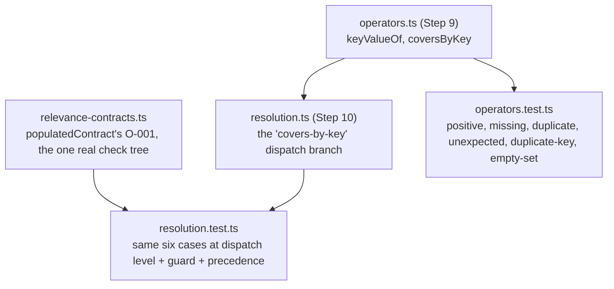
```mermaid
flowchart TD
  OPS["operators.ts (Step 9)<br/>keyValueOf, coversByKey"]
  RES["resolution.ts (Step 10)<br/>the 'covers-by-key' dispatch branch"]
  FIX["relevance-contracts.ts<br/>populatedContract's O-001, the one real check tree"]
  OPTESTS["operators.test.ts<br/>positive, missing, duplicate, unexpected, duplicate-key, empty-set"]
  RESTESTS["resolution.test.ts<br/>same six cases at dispatch level + guard + precedence"]

  OPS --> RES
  FIX --> RESTESTS
  OPS --> OPTESTS
  RES --> RESTESTS
```

**Story:** `_bmad-output/implementation-artifacts/3-3-covers-by-key-as-a-bijection.md`

### Reference

**Rules:**

- Cardinality is never checked separately.
  `actualByKey` starts with exactly one entry per `actual` element,
  including a synthetic slot for one missing its key,
  so `actualByKey.size === 0` after the match loop already means every `actual` element got claimed:
  the whole bijection condition.
- `ABSENT` on either operand resolves `false`,
  the one AD-4 exception to Step 10's general empty-collection rule,
  stated explicitly for this operator because a wholly missing collection is a detected defect.
- Only a genuinely empty array (both operands present, one or both length zero)
  trips the ordinary `insufficient-evidence` path,
  and `resolveNode` intercepts that before `coversByKey` ever runs.
- A non-array `actual` resolves `false` inside `coversByKey` itself,
  the same type-mismatch rule every other operator already applies.
- A duplicate `actualKey` value resolves `false` the moment a second element claims an already-populated map entry.
  A duplicate `expectedKey` value is assumed compile-time-prevented but fails the same way if it ever occurs.
- An `expected` element missing its named key fails its own lookup directly, no dedicated branch needed.
  An `actual` element missing its named key still claims a slot in the match index, a synthetic un-claimable one,
  so a keyless extra row counts against cardinality.
- The dispatch branch's three special cases fire in a fixed order:
  the `expected`-operand array-narrowing guard first (a resolver bug),
  then `ABSENT`/malformed-`actual` as a decisive `false`,
  then genuine emptiness last.
  A higher tier always outranks a lower one on the other operand.

**Watch out:**

- `coversByKey([], [], ...)` returns `true` on its own:
  a vacuous bijection is a correct pure-function answer with no `insufficient-evidence` to return.
  Only `resolveNode`'s dispatch wraps that same case as `insufficient-evidence`.
  Both are stated side by side in their own test files so neither reads as contradicting the other.
- `operatorHandlers` is a plain object, so it inherits `Object.prototype`,
  and a lookup of `op: 'constructor'` would find `Object` itself.
  `resolveNode` checks `Object.hasOwn` before the lookup, so that still throws.

## Step 12 (epic4-story1): pointer resolution and reachability

**In plain terms:** A check has to say where in the response to look,
and it says it as a path: the id field of the thing the read call returned.
Something has to actually walk that path.
This step builds that walk, and then reuses it before anything runs,
to catch a path pointing somewhere the response was never going to have.

**What:** the real `ResolveOperand`/`PointerDenotesCollection` pair (`makeResolveOperand`, `makePointerDenotesCollection`), replacing Step 10's test-only stub,
plus two compile-time checks (`checkBoundElementScope`, `checkEvidenceReachability`) that catch an unreachable or misplaced pointer before a sealed evaluator ever runs.

**Why:** Step 10 took pointer resolution as an injected capability and never built it.
This step is that build: one walk of RFC 6901 tails, including the bound-element `@/` form,
shared by the runtime resolver and, through the same array-index grammar, the compile-time reachability check.
Both now read one oracle's `check` expression identically.

**Read in this order:**

1. `src/core/seal/plan-index.ts`: `decodeToken`/`decodeTail`, now exported.
2. `src/core/evaluate/evidence-resolution.ts`: `walkTail`, `decodeBoundElementTail`, `makeResolveOperand`,
   `makePointerDenotesCollection`.
3. `src/core/compile/reachability.ts`: the shared tree walk, `checkBoundElementScope`,
   `evaluatePointerReachability`, `checkEvidenceReachability`.
4. `tests/evaluate/evidence-resolution.test.ts`: the RFC 6901 edge cases (escaped keys,
   `__proto__`/`constructor`, non-canonical indices) and the resolver/collection-predicate fixtures.
5. `tests/compile/reachability.test.ts`: the two whole-fixture regressions,
   the negative mutation fixtures, and the parity matrix against `makeResolveOperand`'s own walk.

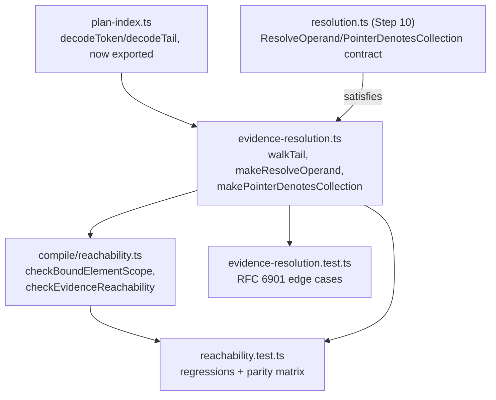
```mermaid
flowchart TD
  PLANIDX["plan-index.ts<br/>decodeToken/decodeTail, now exported"]
  RES["resolution.ts (Step 10)<br/>ResolveOperand/PointerDenotesCollection contract"]
  EVIDRES["evidence-resolution.ts<br/>walkTail, makeResolveOperand,<br/>makePointerDenotesCollection"]
  REACH["compile/reachability.ts<br/>checkBoundElementScope,<br/>checkEvidenceReachability"]
  RESTESTS["evidence-resolution.test.ts<br/>RFC 6901 edge cases"]
  REACHTESTS["reachability.test.ts<br/>regressions + parity matrix"]

  PLANIDX --> EVIDRES
  RES -- satisfies --> EVIDRES
  EVIDRES --> REACH
  EVIDRES --> RESTESTS
  REACH --> REACHTESTS
  EVIDRES --> REACHTESTS
```

**Story:** `_bmad-output/implementation-artifacts/4-1-pointer-resolution-and-reachability.md`

### Reference

**Rules:**

- One walk, `walkTail`, and `plan-index.ts`'s own `decodeToken`/`decodeTail` are exported,
  so the interaction pointer's tail and a declared collection location's own pointer decode the same way.
- Bare `@/` needs its own decode path, `decodeBoundElementTail`.
  Feeding `pointer.slice(1)` straight into `decodeTail` yields one empty-string token where the correct result is zero,
  and the lookup lands on the wrong key.
- Every map lookup (`referenceSets`, `stepObservations`) guards with `Object.hasOwn` before indexing.
  `constructor` is a legal identifier,
  and a plain index on a missing key silently returns `Object.prototype.constructor` where the answer should be `ABSENT`.
- Reachability checks `requiredKeys ∪ permittedKeys`,
  so an already-accepted authoring gap (permitted keys not covering required ones) can't reject a field the descriptor's own required list already promises.
- A field the descriptor declares a definite scalar type blocks further descent;
  an undeclared or type-not-stated field stays permissive, since nothing rules descent out.
- `stdout`/`stderr` reject any non-empty tail outright:
  the schema types both as bare strings unconditionally, so a tail into either is provably always absent.
- Both checks throw on the first violation and name the exact operand position (`.check.predicate.operands[0]`),
  matching the one existing `StructuralFailure` thrower's fail-fast shape.
- `@/` outside any quantifier's predicate fails the same code a reference-set operand outside its three legal positions already uses:
  no dedicated AD-5 code exists for it, and the two are the same shape.

**Watch out:**

- Two `ResolveOperand` implementations coexist by design:
  Step 10's stub for dispatch-logic tests, this story's real one for addressing-grammar tests and eventual score-side use.
  `resolution.test.ts`/`operators.test.ts` were not migrated.
- Nothing wires either check, or this resolver, into a `compile()` entry point yet.
  Both ship as standalone, independently callable functions a future orchestrator composes.
- Recursion depth on the check-tree walk is unbounded,
  the same inherited, unfixed gap Story 3.2 already recorded for `resolution.ts`'s identically-shaped walk.
- The root-collection carve-out accepts any canonical array index;
  it never checks that index against the collection's own declared `expectedCardinality`.
  Filed in `deferred-work.md`, headed for Story 4.2.

## Step 13 (epic4-story2): the AD-5 registry as code, twelve more compile-time checks

**In plain terms:** Most of what goes wrong with one of these documents goes wrong before anything is run:
a rule pointing at nothing, a check whose stated intent disagrees with what it actually tests,
one endpoint declared twice, an exemption with no reason attached.
This step is twelve of those checks, each living in exactly one place,
so two implementations cannot disagree about what a given mistake is called.

**What:** five new modules, thirteen new functions, covering twelve of AD-5's twenty-one codes:
per-behaviour declarations (`declarations.ts`), an oracle's direction against its check (`oracle-alignment.ts`),
the rest of the `check`-tree legality rules (`expression-legality.ts`),
the interface and interaction-plan inventory (`interface-inventory.ts`), and waiver completeness (`waivers.ts`).

**Why:** Step 12 built the shared pointer walk and reachability.
This step is everything else a `check` tree, an oracle, an interface list, or a waiver can get wrong on its own:
one place per AD-5 code, so two compilers can't invent two different answers for it.

**Read in this order:**

1. `src/core/compile/declarations.ts`: `checkRequirementLinkage`, `checkObservableSuccessCriterion`.
2. `src/core/compile/oracle-alignment.ts`: `substitutePointer`, `collectTargets`, `checkOracleChannel`,
   `checkOracleAlignment`.
3. `src/core/compile/expression-legality.ts`: the shared `walkExpression`, `checkOperandLegality`,
   `checkRegexConstructs`, `checkQuantifierNesting`, `checkQuantifierOverNonCollection`,
   `checkReferenceSetResolution`.
4. `src/core/compile/interface-inventory.ts`: `checkInterfaceKind`,
   `checkDuplicateOperationSignature`, `checkUndeclaredMandatoryInput`.
5. `src/core/compile/waivers.ts`: `checkWaiverCompleteness`.
6. `tests/compile/oracle-alignment.test.ts`: `gateCContract`'s O-004,
   the load-bearing proof that substitution is necessary at all (its direction target appears nowhere as raw text in its check).

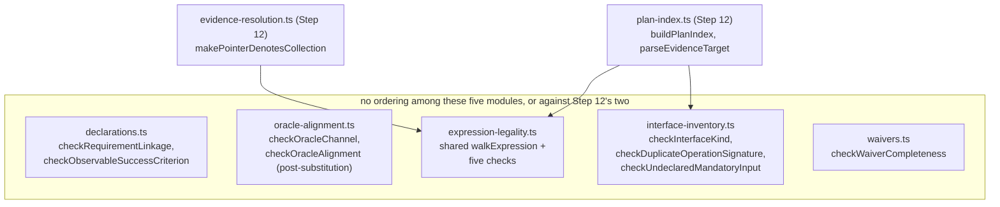
```mermaid
flowchart TD
  DECL["declarations.ts<br/>checkRequirementLinkage,<br/>checkObservableSuccessCriterion"]
  ORACLE["oracle-alignment.ts<br/>checkOracleChannel,<br/>checkOracleAlignment (post-substitution)"]
  EXPR["expression-legality.ts<br/>shared walkExpression +<br/>five checks"]
  IFACE["interface-inventory.ts<br/>checkInterfaceKind,<br/>checkDuplicateOperationSignature,<br/>checkUndeclaredMandatoryInput"]
  WAIVER["waivers.ts<br/>checkWaiverCompleteness"]
  EVIDRES2["evidence-resolution.ts (Step 12)<br/>makePointerDenotesCollection"]
  PLANIDX2["plan-index.ts (Step 12)<br/>buildPlanIndex, parseEvidenceTarget"]

  PLANIDX2 --> EXPR
  PLANIDX2 --> IFACE
  EVIDRES2 --> EXPR

  subgraph NOTE["no ordering among these five modules, or against Step 12's two"]
    DECL
    ORACLE
    EXPR
    IFACE
    WAIVER
  end
```

**Story:** `_bmad-output/implementation-artifacts/4-2-the-ad-5-registry-as-code-and-the-structural-compile-checks.md`

### Reference

**Rules:**

- `direction-check-misaligned` computes containment *after* substituting a quantifier's `@/…` pointers against its own `collection` pointer.
  `@/status` inside `for-all(collection: /items, …)` only becomes `/items/status`, a target a direction can name, once substituted.
  Skipping this step makes the containment check reject every oracle the quantifier syntax exists to make writable.
- The substitution is plain string concatenation:
  the raw text after `@` is already valid RFC 6901 escaping,
  so appending it onto a rooted pointer stays valid with no round trip.
- `direction.relation` containment reads as "appears anywhere in `check`'s set of `op` values."
  AD-3 says `check` "may be stronger" than the direction,
  so a relation matching a connective's inner operand still counts, even when it isn't `check`'s own root op.
- One shared tree walk, `walkExpression`, backs all five `expression-legality.ts` checks,
  the same DRY shape Step 12's `reachability.ts` already uses between its own two checks,
  widened here to also report an operand's op, position, and the live quantifier-nesting depth.
- Operand-kind legality per `(op, position)` is transcribed straight from `expression.ts`'s own doc comments.
  The schema admits every operand kind everywhere on purpose (AD-26 needs a reference set representable outside its three legal spots so `malformed-operator-expression` stays fireable),
  so the compiler is the only place that can reject a wrong kind.
- `quantifier-over-non-collection` only reads the `response-body` channel,
  matching AD-5's own wording ("the invoked operation's response descriptor");
  every other channel stays permissive by design.
- `duplicate-operation-signature` compares every operation across every permitted interface as one flat list:
  AD-40 resolves a defect signature against the whole inventory,
  and a caller invoking two interfaces against one target can still get an ambiguous response.
- `checkRegexConstructs` scans the pattern text for a backreference or a lookbehind.
  It doesn't parse the pattern, so either spelling appearing inside a character class can fool it,
  the same imperfection `AnchoredPattern`'s own anchoring check already carries.
- No ordering exists among these thirteen functions, or against Step 12's two:
  each is independently correct for the one code it names,
  and a contract invalid under two codes at once reports whichever a caller reaches first.
  One orchestration layer is a later story's job.

**Watch out:**

- Two functions can legitimately disagree with each other about which code fires first on one operand:
  `checkOperandLegality` and `checkReferenceSetResolution` on a `{ referenceSet }` operand that is both illegal-position and undeclared.
  Neither coordinates with the other by design.
- `checkUndeclaredMandatoryInput` takes no `strict` parameter and always enforces;
  whether it is even called is a future orchestrator's decision.
- AD-16's forbidden-input-floor and scoped-reference codes get their throwers here,
  in `src/core/compile/forbidden-inputs.ts`, closing a gap Epic 2 left open.
  Neither one runs until Step 15 wires it into the pipeline.

## Step 14 (epic4-story3): the last two stage-one AD-5 codes, a graph predicate over the interaction plan

**In plain terms:** An author can hand the evaluator a script without ever writing "step one, step two",
just by chaining calls so each waits on the last.
The schema allows chaining on purpose, so the schema cannot be what stops this.
This step measures the shape of the call plan five different ways at once,
because each single measure has a disguise that beats it:
a long chain hides from a width check, and sixty-four independent pairs hide from a depth check.

**What:** one new module, `scripting-bound.ts`, two functions.
`checkNestedTemporalClause` fires when a step's `after` names a step that itself has an `after`.
`checkScriptingBound` reads five metrics over the plan's `after` edges: depth, width, shared anchors, disjoint pairs, step count.

**Why:** `InteractionStep.after` chains to any depth in the schema on purpose (Story 1.3's deliberate deviation),
so the schema alone can't stop a scripted plan in disguise.
AD-39's two adversarial shapes each beat one single-dimension check:
an eight-step chain nests past the one-level bound, caught by the depth check.
Sixty-four independent `write`/`read` pairs are each exactly one level deep, so depth misses them;
the disjoint-pair count catches them.
Width guards a third shape, one step anchoring too many children, that neither example needs.

**Read in this order:**

1. `src/core/compile/scripting-bound.ts`: `parentOf`, `computeGraphMetrics`,
   `checkNestedTemporalClause`, `checkScriptingBound`.
2. `tests/compile/scripting-bound.test.ts`: the width/shared-anchor/disjoint-pair/step-count boundary pairs,
   each proving exactly-at-bound passes and one-past throws.

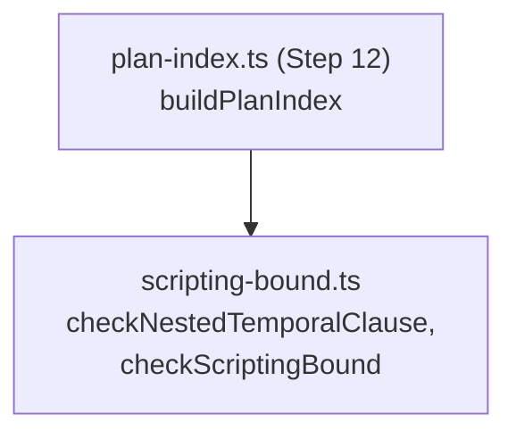
```mermaid
flowchart TD
  BOUND["scripting-bound.ts<br/>checkNestedTemporalClause,<br/>checkScriptingBound"]
  PLANIDX3["plan-index.ts (Step 12)<br/>buildPlanIndex"]

  PLANIDX3 --> BOUND
```

**Story:** `_bmad-output/implementation-artifacts/4-3-the-scripting-bound-graph-predicate-and-its-adversarial-fixtures.md`

### Reference

**Rules:**

- One pass over `after` builds three views at once:
  the one-hop nesting test, each anchor's child count,
  and an undirected adjacency map for a connected-component scan (disjoint pairs).
  No recursion, no memoization.
- At a fixed one-level bound, the one-hop nesting test also catches every cycle:
  a cycle needs each member's parent to carry its own `after`,
  and the one-hop test trips on the first member it visits.
  No separate cycle detection needed.
- Four numeric bounds (`WIDTH_MAX=2`, `SHARED_ANCHOR_MAX=2`, `DISJOINT_PAIR_MAX=4`, `STEP_COUNT_MAX=16`), each an exclusive ceiling,
  set against this repo's own two whole-contract fixtures as the accept floor and the epic's two adversarial shapes as the reject ceiling.
  No calibration corpus exists yet to derive them more precisely.
- A dangling `after` (naming no declared step, including one made unresolvable by a duplicate id) resolves to "no clause" in both checks,
  the same permissive default `undeclared-mandatory-input` already set for operation ids.
- `checkNestedTemporalClause` and `checkScriptingBound`'s depth dimension are independent, non-coordinating checks.
  Both fire on a nested chain; neither depends on the other having run.
- `computeGraphMetrics`'s internal maps key every graph node on each step's array position.
  `stepId` carries no schema-level uniqueness,
  so two distinct steps sharing one id would otherwise merge into one adjacency entry and corrupt the width/shared-anchor/disjoint-pair counts (found in review, fixture 20 pins it).

**Watch out:**

- `plan-exceeds-scripting-bound`'s `artifactPath` is always `EvalContract.interactionPlan`, the whole plan;
  `nested-temporal-clause`'s is per-step.
- No orchestrating entry point or ordering guarantee exists yet between this and Story 4.2's fifteen checks.
  That's Story 4.4's job.

## Step 15 (epic4-story4): one compile entry point, one place that awaits, one layer gate

**In plain terms:** Nineteen separate checks existed and nothing ran them together,
so which complaint you got about a bad document depended on which check the caller happened to call.
This step gives them one entry point and one fixed order.
It also puts every call that waits on the outside world into a single function,
and adds a script that reads every source file and fails when one reaches across a boundary the architecture forbids.

**What:** `core/compile/compile.ts` wired the 19 checks that existed then into one fixed order.
Step 21 has the current count.
`application/compile.ts` parses unknown input and hands it to that stage.
`application/invoke-port.ts` is the only function in the package that awaits.
`npm run check:layers` reads every file under `src/` and fails if one imports across a forbidden layer edge.

**Why:** before this story, 19 checks existed and nothing called them together,
so which failure a bad contract reported depended on which check the caller happened to run.
The layer rules had the same problem:
the architecture said `core/` may not import `ports/`,
and the only thing enforcing it was a test that searched `core/seal/` for the text "core/compile" (a spelling real imports never use).

**Read in this order:**

1. `src/core/compile/compile.ts`: the 19 calls, in order.
2. `src/application/compile.ts`: parse, default strict to true, delegate.
3. `src/application/invoke-port.ts`: the seven numbered steps of a port call.
4. `scripts/dependency-direction.ts`: `classifyLayer`, `isAllowedEdge`, `scanFile`.
5. `tests/architecture/dependency-direction.test.ts`: every allowed and forbidden edge,
   written from the story text, so the test does not check the checker against itself.

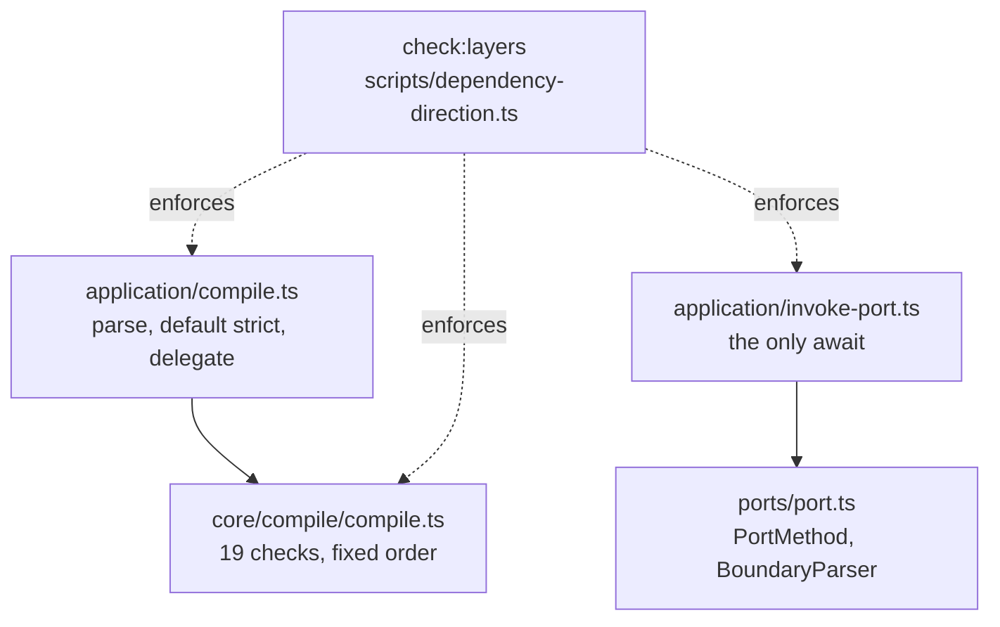
```mermaid
flowchart TD
  APPC["application/compile.ts<br/>parse, default strict, delegate"]
  CORE["core/compile/compile.ts<br/>19 checks, fixed order"]
  IP["application/invoke-port.ts<br/>the only await"]
  PORT["ports/port.ts<br/>PortMethod, BoundaryParser"]
  GATE["check:layers<br/>scripts/dependency-direction.ts"]

  APPC --> CORE
  IP --> PORT
  GATE -.enforces.-> APPC
  GATE -.enforces.-> CORE
  GATE -.enforces.-> IP
```

**Story:** `_bmad-output/implementation-artifacts/4-4-stages-as-pure-plan-and-reduce-pairs-with-one-orchestration-layer.md`

### Reference

**Rules:**

- Check order is AD-5 registry order, and compile stops at the first failure.
  Registry order is the only published stable order everyone already shares.
- Three checks share the code `malformed-operator-expression`, so they run in a fixed suborder:
  bound-element scope, operand legality, regex constructs.
- Strict mode defaults to true at the application boundary and is a required boolean in the core signature,
  so core behavior never reads an environment variable or a config file.
- `application/compile.ts` catches nothing.
  A `StructuralFailure` stays a `StructuralFailure`;
  it never becomes a runtime fault or an in-band result value.
- `invokePort` calls the port once, validates the request going out and the response coming back, and never retries.
  A `RuntimeFault` the port threw comes back as the same object;
  anything else becomes `port-failure`, or `aborted` if the signal aborted first.
- Compile and seal stay single synchronous functions.
  AD-34 splits a stage into plan and reduce only when it needs an outside observation, and neither of these does.
- `check:layers` parses with TypeScript's own tokenizer, so a comment or a string mentioning "await" is not a finding.
  It fails closed: an import it cannot read is reported as a violation.
- `core/` submodules may import each other.
  The diagram draws `core` as one node, so `core/seal/` reading `core/compile/` is a same-layer import;
  the prohibition is about leaving `core/`.
- Two registries now have a drift gate against the architecture document:
  `check:ad5-registry` for failure codes, `check:ad28-registry` for runtime fault codes.

**Watch out:**

- Wiring all 19 checks into one pipeline surfaced that `populatedContract`'s own `scopedResources` trips a Story 4.2 stub check.
  Whole-contract tests clear that field first, via `cleanPopulatedContract()` in `tests/compile/helpers.ts`.
- Six of the ten runtime fault codes have no thrower yet.
  AD-28 fixes the registry independently of when each producing stage lands.
- `src/index.ts` is untouched.
  Story 6.5 publishes the library and CLI surface.

## Step 16 (epic5-story1): what a discipline rule applies to

**In plain terms:** Seven quality rules apply to some documents and not others.
Letting the author declare which ones apply turns the whole thing into self-assessment,
which is why the earlier draft's "this rule does not apply here" label was deleted.
This step works the answer out from what the author declared they were testing,
so declaring less makes more rules apply.

**What:** `core/coverage/rules.ts` names AD-20's seven discipline rules.
`core/coverage/relevance.ts` answers one question per rule: does this contract have to satisfy it?
The answer comes from declarations only.

**Why:** "rule 6 does not apply here" is worth nothing when the contract's author is the one saying so.
The Gate C contract put a `rule` label on every oracle and the schema deleted it,
because reading that label back would turn fourteen decision procedures into self-assessment.
These predicates read the declarations,
so a contract that declares almost nothing comes out relevant on almost everything and under-declaring costs coverage.

**Read in this order:**

1. `src/core/coverage/rules.ts`: the seven identifiers and the derived predicate name.
2. `src/core/coverage/relevance.ts`: seven predicates, then the map and the aggregate.
3. `tests/schemas/fixtures/relevance-contracts.ts`: the three contracts every fixture clones,
   one per declaration state.
4. `tests/coverage/relevance.test.ts`: 56 numbered fixtures, checked against the truth table in the story.
5. `tests/coverage/rules.test.ts`: the vocabulary pinned against the Gate C contract's spellings.

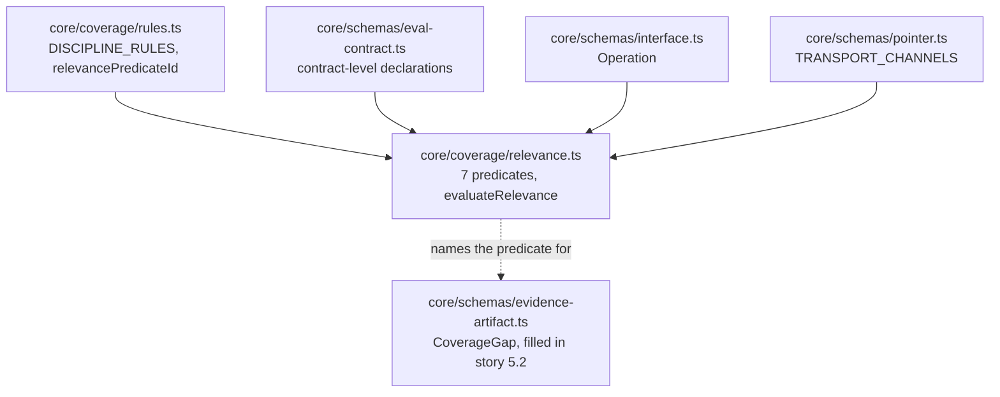
```mermaid
flowchart TD
  RULES["core/coverage/rules.ts<br/>DISCIPLINE_RULES, relevancePredicateId"]
  REL["core/coverage/relevance.ts<br/>7 predicates, evaluateRelevance"]
  CONTRACT["core/schemas/eval-contract.ts<br/>contract-level declarations"]
  IFACE["core/schemas/interface.ts<br/>Operation"]
  POINTER["core/schemas/pointer.ts<br/>TRANSPORT_CHANNELS"]
  GAP["core/schemas/evidence-artifact.ts<br/>CoverageGap, filled in story 5.2"]

  RULES --> REL
  CONTRACT --> REL
  IFACE --> REL
  POINTER --> REL
  REL -.names the predicate for.-> GAP
```

**Story:** `_bmad-output/implementation-artifacts/5-1-the-seven-relevance-predicates.md`

### Reference

**Rules:**

- Seven identifiers, minted once, spelled the way the Gate C contract spelled them.
  `Waiver.rule` and `CoverageGap.rule` are opaque strings, so this is the only thing joining a gap to a waiver.
- A predicate name is derived from its rule as `${rule}-relevance`, so a new rule arrives with one.
- A missing declaration makes the rule relevant.
  An explicitly empty one answers it.
  `collectionLocations: null` fires rule 4; `[]` does not.
- `successIndicator` has two spellings, so `null` there is absence and rule 1 fires.
- The empty pointer `''` is RFC 6901's whole document, a real answer.
  The check compares against `null`, so an empty indicator still counts as nominated.
- A contract declaring no operation makes all six operation-scoped rules relevant.
  That is the shape the design is built to catch.
- No predicate reads an oracle, a plan step, a waiver, a rubric, or a severity.
  Five fixtures delete each and assert the seven verdicts hold.
- Rule 5 reads `siblingGroups` at contract level.
  The operation list has no part in it.
- Nothing throws and nothing blocks.
  A coverage gap is recorded and the artifact still ships.

**Watch out:**

- `structuredClone` keeps shared references.
  All four transport channels of the absent contract come from one object,
  so a test replaces a whole channel; writing through one changes all four.
- Nothing calls these predicates yet.
  `core/compile/compile.ts` is untouched, because a gap record needs a satisfaction verdict and that is Story 5.2.
- One verdict covers the whole contract.
  One operation's missing declaration and another's present one land on the same answer,
  so Story 5.2 has to keep them apart.

## Step 17 (epic5-story2): does the contract actually check it?

**In plain terms:** Knowing a rule applies says nothing about whether anyone followed it.
A document can be on the hook for all seven rules and check none of them.
This step visits every place a rule applies and looks for a check that genuinely reads it.
If an endpoint promises to return an id and an ok flag, and no single check looks at both,
that is a gap, even though checks exist.

**What:** `core/coverage/satisfaction.ts` answers the second half of each discipline rule.
For every place a rule applies, is there an oracle that really reads it?
The answer comes from the declarations plus each oracle's direction and check.

**Why:** Step 16 said which rules a contract has to satisfy.
That flags nothing on its own: a contract can be relevant on all seven and still check nothing.
These seven predicates walk every site and demand a witness.
Say an operation declares required response keys `id` and `ok`.
If no single oracle names both of them at one step, rule 2 is a gap,
even though the contract does have an oracle pointed at that step.

**Read in this order:**

1. `src/core/coverage/satisfaction.ts`: the pointer join and the check walk at the top,
   then the seven predicates, then the map and the aggregate.
2. `src/core/coverage/rules.ts`: `satisfactionPredicateId`, the twin of the relevance one.
3. `tests/coverage/fixtures/satisfaction-contracts.ts`: the one contract where all seven rules apply and all seven are satisfied.
   Its header says which oracle witnesses which rule.
4. `tests/coverage/satisfaction.test.ts`: fixtures 59 to 129, against the truth table in the story.
5. `tests/coverage/rules.test.ts`: fixtures 130 and 131,
   pinning that no relevance name ever equals a satisfaction name.

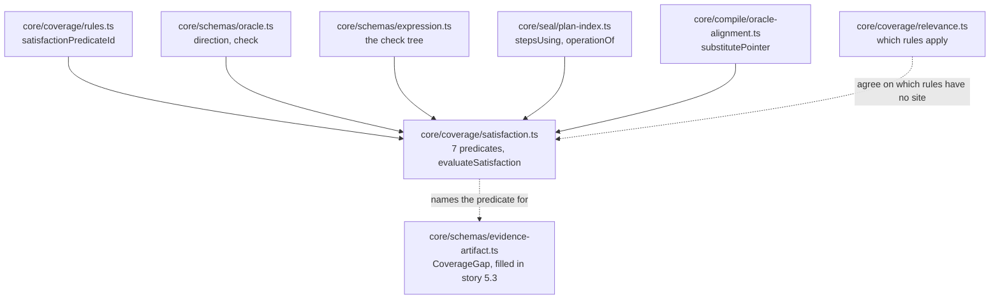
```mermaid
flowchart TD
  RULES["core/coverage/rules.ts<br/>satisfactionPredicateId"]
  REL["core/coverage/relevance.ts<br/>which rules apply"]
  SAT["core/coverage/satisfaction.ts<br/>7 predicates, evaluateSatisfaction"]
  ORACLE["core/schemas/oracle.ts<br/>direction, check"]
  EXPR["core/schemas/expression.ts<br/>the check tree"]
  PLANIDX["core/seal/plan-index.ts<br/>stepsUsing, operationOf"]
  ALIGN["core/compile/oracle-alignment.ts<br/>substitutePointer"]
  GAP["core/schemas/evidence-artifact.ts<br/>CoverageGap, filled in story 5.3"]

  RULES --> SAT
  ORACLE --> SAT
  EXPR --> SAT
  PLANIDX --> SAT
  ALIGN --> SAT
  REL -.agree on which rules have no site.-> SAT
  SAT -.names the predicate for.-> GAP
```

**Story:** `_bmad-output/implementation-artifacts/5-2-the-seven-satisfaction-predicates.md`

### Reference

**Rules:**

- Satisfaction is "for every site, some oracle".
  Universal over sites, existential over oracles.
  A contract-level "some oracle somewhere" would let one well-declared operation cover another's gap.
- A rule with no site is satisfied for free, and the reason says so: `NO_RELEVANT_SITE`.
  So `satisfied` alone never tells you enough.
  Read the reason with it.
- A contract that declares no operation gets nothing for free.
  Six rules answer not satisfied, with `NO_OPERATION_WITNESS`.
- A declared pointer is `/ok`.
  An evidence target is `/interactions/create/response-body/ok`.
  Join them by pasting the prefix on the front; both spellings escape the same way, so no re-encoding.
- "Addresses" means names it or goes inside it, so `/items/0/id` addresses `/items`.
  Rule 4 is the one exception: a quantifier's collection has to equal the declared location exactly.
- Both channels have to read it.
  The direction names the pointer and the check reads it.
  One alone is no witness.
- Rule 2's whole-body oracle is the oracle that covers the whole body.
  No label is read: the schema deleted `oracles[].rule` on purpose, so an author cannot mark their own homework.
- Rule 7 needs the write pointer and the read pointer inside one expression node.
  Two `existence` calls under one `all` assert two facts and relate them to nothing.
- Nothing throws, same as Step 16.
  A gap gets recorded and the artifact still ships.

**Watch out:**

- A fixture asserting only `satisfied: true` can pass because the rule stopped having a site.
  Every positive here asserts its reason too.
- `structuredClone` keeps shared references, the same trap as Step 16.
  The fixture builds several transport channels from one object,
  so a test replaces the whole channel; writing through one changes several.
- Still nothing calls these.
  `compile` is untouched.
  A gap record needs a severity and no declaration maps a rule to one, so that is story 5.3.
- `relevance.ts` is untouched on purpose.
  Fixture 67 pins that both halves agree on which rules have no site at all.

## Step 18 (epic5-story3): the table is generated output

**In plain terms:** A table of which rules are covered, kept by hand,
goes stale the first time someone renames something, and nothing says a word.
This step writes nineteen small documents covering every rule in every state,
generates the published table from the very code the library ships,
and fails the build when the committed table and the generated one differ by a byte.

**What:** nineteen hand-written contracts covering all seven rules in all four declaration states,
a pure builder that runs the fourteen predicates over them and renders a markdown document,
and a byte-exact drift check in CI.

**Why:** a table of predicates kept by hand goes stale the day someone renames a predicate, and nothing notices.
Here the document is generated from the same functions the library ships,
so a rule that stops being covered fails the build.
The worked example in this repo is the proof:
it has disagreed with the code for months and no check ever said so.

**Read in this order:**

1. `src/core/coverage/coverage.ts`: `evaluateCoverage` pairs the two verdict arrays into gap records;
   `coverageSeverity` takes the highest declared behaviour severity.
2. `src/core/coverage/table.ts`: the four states, the verdict pair each one asserts,
   the four diagnoses, and the renderer.
3. `tests/coverage/fixtures/corpus.ts`: the nineteen contracts and the twenty-eight-cell index.
   Every contract is one small change to the Step 17 seed.
4. `scripts/generate-ad31-table.ts` and `scripts/check-ad31-table.ts`: write, and compare.
5. `docs/ad31-coverage-predicates.generated.md`: the output.
   133 matrix rows, 18 gap rows.
6. `tests/coverage/corpus.test.ts`, `coverage.test.ts`, `table.test.ts`: fixtures 151 to 231.

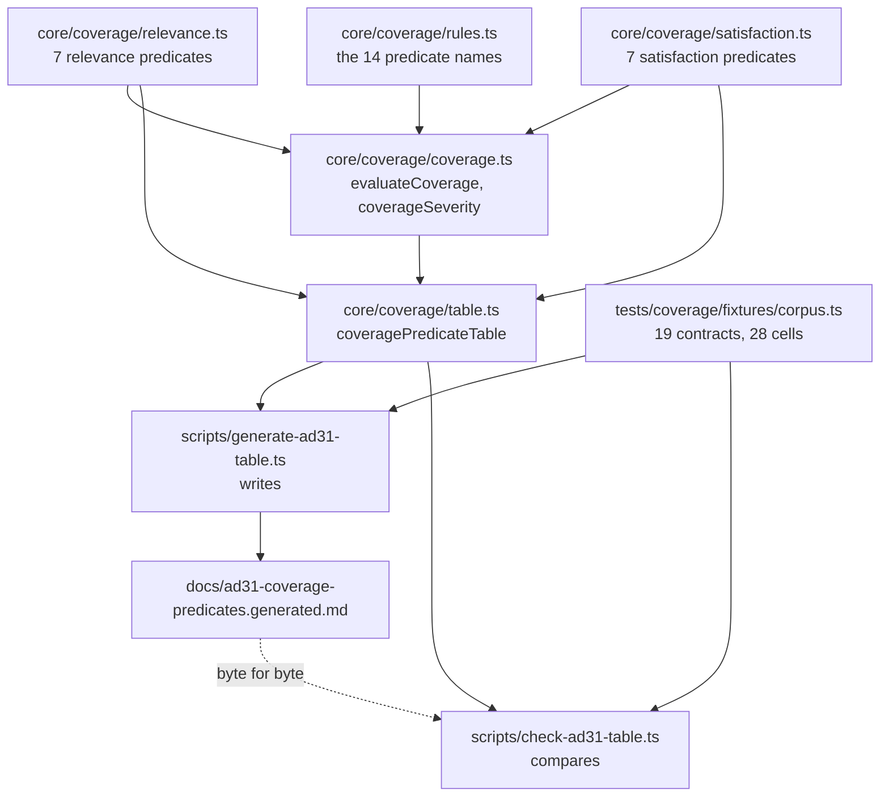
```mermaid
flowchart TD
  REL["core/coverage/relevance.ts<br/>7 relevance predicates"]
  SAT["core/coverage/satisfaction.ts<br/>7 satisfaction predicates"]
  RULES["core/coverage/rules.ts<br/>the 14 predicate names"]
  COV["core/coverage/coverage.ts<br/>evaluateCoverage, coverageSeverity"]
  TABLE["core/coverage/table.ts<br/>coveragePredicateTable"]
  CORPUS["tests/coverage/fixtures/corpus.ts<br/>19 contracts, 28 cells"]
  GEN["scripts/generate-ad31-table.ts<br/>writes"]
  CHECK["scripts/check-ad31-table.ts<br/>compares"]
  DOC["docs/ad31-coverage-predicates.generated.md"]

  REL --> COV
  SAT --> COV
  RULES --> COV
  COV --> TABLE
  REL --> TABLE
  SAT --> TABLE
  CORPUS --> GEN
  CORPUS --> CHECK
  TABLE --> GEN
  TABLE --> CHECK
  GEN --> DOC
  DOC -.byte for byte.-> CHECK
```

**Story:** `_bmad-output/implementation-artifacts/5-3-the-contract-fixture-corpus-and-the-regenerated-table.md`

### Reference

**Rules:**

- Four declaration states: absent, explicitly empty, witnessed, unwitnessed.
  Seven rules times four states is twenty-eight cells.
- Absent and unwitnessed both answer relevant and not satisfied.
  The reason is what tells them apart, so every fixture asserts the reason.
- Not relevant plus not satisfied is impossible.
  A rule that applies nowhere is satisfied for free,
  so the fourth combination has no contract and the document says so.
- Nineteen contracts fill twenty-eight cells, because two rules can read the same declaration.
- A corpus contract does not have to compile.
  Two of the nineteen do not: an empty operation list means the plan names operations nothing declares.
- The builder throws on an unfilled cell.
  Four checks: unique ids, every cell resolves, every cell filled exactly once,
  and every cell's contract really produces the verdicts it claims.
- The generator writes bytes; the checker rebuilds and compares.
  Neither can drift from the other, because both call one function.
- CI mutates a predicate name and asserts the check fails.
  A hand-kept table would survive that.
- Nothing calls the predicates from `compile`.
  A gap never blocks, so wiring it into a stage that throws would read as if it did.

**Watch out:**

- Do not import `core/compile/` into `table.ts`.
  `core/canonical/scan-json.ts` uses a constructor parameter property, which Node's type stripper rejects,
  so both scripts would die at load.
- `core/` outside `core/schemas/` may not import Zod, not even as a type.
  The `CoverageGap` and `Severity` type aliases live in the schema files for that reason.
- The corpus lives under `tests/`, so it never ships in `dist`.
  Both scripts import from `tests/`, which is new in this repo and allowed.
- Editing `README.md` makes `_bmad-output/shareable/` stale.
  Run `npm run build:shareable`.
- One conjunct in `evaluateCoverage` cannot be caught by any test, because the case it guards cannot happen today.
  It stays, with a comment saying which fixture would catch a change.

## Step 19 (epic6-story1): ports, adapters, and a suite you can run

**In plain terms:** Anything this package touches outside itself goes through a narrow, named opening:
a clock, the filesystem, the network.
That keeps the logic testable with fakes.
But someone writing their own plug for one of those openings has no way to tell whether they got it right,
and "call the underlying thing exactly once" is prose that nothing enforces.
This step ships a suite they can run against their own code,
which tells them by name which rule they broke.

**What:** four port types, three adapters that implement them,
a pure rule deciding which network address a probe is allowed to reach,
and a conformance suite published as `eval-quality/conformance` that hands an adapter author back a report.

**Why:** someone writing an adapter outside this repo has no way to know if it is right.
The prose says "call the underlying thing exactly once" and nothing checks it.
An adapter that quietly retries once on failure looks the same as a correct one until a probe fires twice at the system under test and the state-reset check reads a value the first call already changed.
Run the suite and that adapter fails on a named line.

**The shape, in call order:**

```text
           CLI (driving adapter; Story 6.5, not built yet)
                             |
                             v
         +-----------------------------------------------+
         |  core/ + application/                         |
         |  the hexagon. core/ is pure and synchronous,  |
         |  and application/ is the only layer that      |
         |  awaits a port                                |
         +-----------------------------------------------+
                             |
                             v
         +------------------------------------------------+
         |  ports/                                        |
         |  CorpusPort              ClockPort             |
         |  FileSystemPort          EnvironmentProbePort  |
         |  a method signature and two parsers each.      |
         |  no logic, no zod, no Node builtins            |
         +------------------------------------------------+
                             |
             +---------------+---------------+
             |                               |
             v                               v
   +----------------------+      +------------------------------+
   |  adapters/ (driven)  |      |  an adapter written outside  |
   |  system-clock        |      |  this repository             |
   |  node-file-system    |      +------------------------------+
   |  local-corpus        |
   +----------------------+
             |                               |
             v                               v
     clock, filesystem              someone else's store
```

The suite is the piece a plain ports-and-adapters drawing has no room for,
because it sits outside the call path and drives whatever claims to implement a port:

```text
   +-----------------------------------------------+
   |  testing/   the conformance suite             |
   |  published as eval-quality/conformance        |
   |  returns a report and imports no test runner  |
   +-----------------------------------------------+
                        |
                        |  4 subjects per port method,
                        |  4 scenarios, 6 outcomes each
                        v
        anything that claims to implement a port
                        |
       +----------------+----------------+
       |                |                |
       v                v                v
  the 3 shipped    probe-subject    an adapter written
  adapters         (under tests/,   outside this
                   run by CI)       repository
```

`invokePort` goes through the same suite as a subject, on purpose.
It passes five of the six and fails `prompt-abort`,
which is the one place an adapter has to do more than the generic seam does.

**Read in this order:**

1. `src/core/schemas/port-messages.ts`: the request and response shape of every port method.
2. `src/core/schemas/probe-policy.ts`: one authorized target, as data.
   No field has a default, because a missing cap is an unbounded cap.
3. `src/core/probe/target-policy.ts`: `parseAddress` reduces a spelling to one form and names its class;
   `evaluateTarget` walks interface, scheme, host, port, address, method in that order.
4. `src/ports/*.ts`: four port types, each a method signature plus the two parsers its boundary needs.
   `environment-probe-port.ts` carries the four rules an implementation has to follow.
5. `src/adapters/port-boundary.ts`: the five steps every adapter method runs, in one place.
6. `src/adapters/*-adapter.ts`: the three shipped adapters,
   each a factory over a mechanism you can swap out.
7. `src/testing/conformance.ts`: the six shared assertions and the report shape.
8. `src/testing/probe-conformance.ts`: thirteen more, for the probe port only.
9. `tests/adapters/probe-subject.ts`: a real loopback server and the adapter that talks to it.
10. `tests/testing/conformance.test.ts`: one broken subject per assertion,
    each proving that assertion can actually fail.

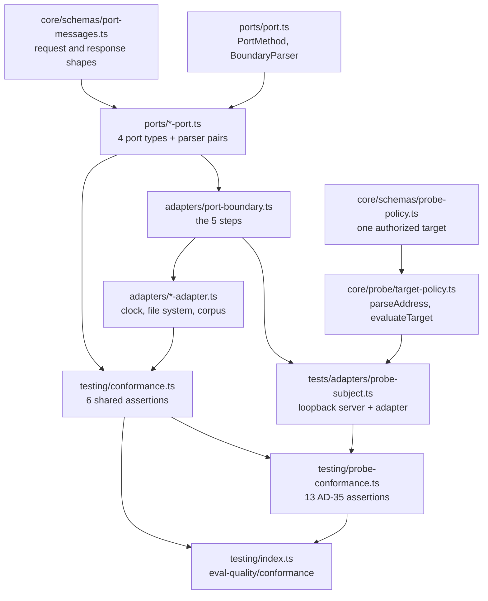
```mermaid
flowchart TD
  MSG["core/schemas/port-messages.ts<br/>request and response shapes"]
  POL["core/schemas/probe-policy.ts<br/>one authorized target"]
  TP["core/probe/target-policy.ts<br/>parseAddress, evaluateTarget"]
  PORT["ports/port.ts<br/>PortMethod, BoundaryParser"]
  PORTS["ports/*-port.ts<br/>4 port types + parser pairs"]
  PB["adapters/port-boundary.ts<br/>the 5 steps"]
  AD["adapters/*-adapter.ts<br/>clock, file system, corpus"]
  CONF["testing/conformance.ts<br/>6 shared assertions"]
  PROBE["testing/probe-conformance.ts<br/>13 AD-35 assertions"]
  IDX["testing/index.ts<br/>eval-quality/conformance"]
  SUBJ["tests/adapters/probe-subject.ts<br/>loopback server + adapter"]

  MSG --> PORTS
  PORT --> PORTS
  POL --> TP
  PORTS --> PB
  PB --> AD
  PORTS --> CONF
  CONF --> PROBE
  CONF --> IDX
  PROBE --> IDX
  PB --> SUBJ
  TP --> SUBJ
  AD --> CONF
  SUBJ --> PROBE
```

**Story:** `_bmad-output/implementation-artifacts/6-1-ports-and-the-published-conformance-suite.md`

### Reference

**Rules:**

- The suite hands back a report.
  It cannot import the consumer's test runner, so `testing/` may not import an external module or a Node builtin at all.
- The suite never sees `core/probe/`.
  A suite sharing the subject's own decision procedure would pass any subject that shared it too.
- Every mechanism returns `unknown`.
  Give it a precise type and the adapter can build its response from a value it already holds,
  so the response check can never fail.
- Six assertions per port method, each id prefixed by the method name.
  Two of them count calls, because a retry only shows up on failure.
- The adapters race the abort signal and `invokePort` does not.
  A mechanism that never settles makes `invokePort` never settle,
  and an adapter is the thing that has to fix that.
- Every spelling of one address reduces to a single string before anything is compared.
  `127.0.0.1` and `::ffff:127.0.0.1` are one address; compare the text and you get two.
- Reducing two spellings to one string widens the allowlist, so only the IPv4-mapped form does it.
  `::127.0.0.1` is classified as loopback and still denied against an entry naming `127.0.0.1`.
- `metadata` is decided before `link-local` and `private`.
  `169.254.169.254` sits inside `169.254.0.0/16`,
  and calling it link-local hides the one denial an operator has to read.
- Seven denial reasons, one fault code.
  A denied target throws `forbidden-target` and a cap throws `budget-exhausted`.
  One says the contract aimed somewhere forbidden, the other says an allowed target answered too much or too slowly.
- A 500 is an observation.
  Throw on it and every seeded fault the pre-flight watches for goes invisible.

**Watch out:**

- The probe adapter lives under `tests/`, which `tsconfig-build.json` excludes, so no network adapter reaches `dist/`.
  That is the only reading under which AD-2 and AD-37 both hold.
- `ports/` may not import Zod.
  The port files pull schema objects from `core/schemas` and use each name in both type and value position,
  so a plain `import` is right there; `import type` breaks the parser export.
- A layer may import itself.
  A cross-layer edge the graph does not draw is still forbidden, so nothing may import `cli/` or `testing/`.
- The fixture server binds port 0 and reads the port back.
  A fixed port collides under parallel workers and the failure looks like a policy bug.
- A byte cap counts bytes.
  `setEncoding('utf8')` and `body.length` count UTF-16 code units,
  so a 256-byte cap lets 768 bytes of three-byte characters through.
- Editing `README.md` makes `_bmad-output/shareable/` stale.
  Run `npm run build:shareable`.

## Step 20 (epic6-story2): pre-flight as plan, observation, and pure verdict

**In plain terms:** before you trust a test rig, prove the rig works.
Send it the same request twice with two different ids and check the two answers differ the way the contract said they would.
If it hands back the same record both times, it was never reading the id,
and every test that passed against it proved nothing.
That is the check this step adds, and it runs before anything is scored:
fail it and the run is thrown away.

**What:** three new contract declarations (a sensitivity witness per operation, a manifestation witness per seeded defect, one fixture reset),
the compile checks that make them honest,
a pure plan that turns them into probe requests,
and a pure reducer that turns the answers into a verdict plus a digest of what the fixture was.

**Why:** the only false gate this project ever recorded came from a broken fixture.
The system under test ignored the identifier in the URL and returned the same record for every read,
so every oracle passed and the run scored clean.
Nothing in the pipeline asked whether the fixture could tell two inputs apart.
Pre-flight asks first: send two reads with different identifiers,
check the declared relation holds between the two answers, and invalidate the run when it does not.

**The shape:**

```mermaid
flowchart TD
  IN["contract + probes"]
  PLANOUT["PreflightPlan<br/>legs + checks + reference sets"]
  PORT["ports/environment-probe-port.ts<br/>probe"]
  OBS["observations<br/>one per leg, keyed by probeId"]
  OUT["PreflightVerdict<br/>passed + checks + fixtureDigest"]

  subgraph pure["core/preflight: no await, no clock, no observation"]
    PLAN["planPreflight"]
    RED["reducePreflight"]
  end

  subgraph awaits["application/: the only layer that awaits a port"]
    APP["runPreflight"]
  end

  IN --> PLAN
  PLAN --> PLANOUT
  PLANOUT --> APP
  APP -->|one leg at a time| PORT
  PORT --> OBS
  OBS --> RED
  PLANOUT --> RED
  RED --> OUT
```

**Read in this order:**

1. `src/core/schemas/sensitivity-witness.ts`: the three declarations and the inputs shape they share.
2. `src/core/compile/sensitivity-witness.ts`: the three checks,
   each assigned to an existing failure code because the registry is closed at twenty-one.
3. `src/core/compile/expression-legality.ts`: the enumerator now walks witness relations too.
4. `src/core/preflight/projection.ts`: what "the fixture" means, and the digest over it.
5. `src/core/preflight/witness-evidence.ts`: one leg as the observation shape the resolver reads.
6. `src/core/preflight/plan.ts`: which legs to send, in what order, and every check to answer.
7. `src/core/preflight/reduce.ts`: the six check kinds and when each is satisfied, failed, or exempt.
8. `src/application/preflight.ts`: parse, plan, await each leg in order, reduce, parse the verdict.
9. `tests/preflight/fixtures/observations.ts`: the four-operation contract every pre-flight test reads.

```mermaid
flowchart TD
  SW["core/schemas/sensitivity-witness.ts<br/>witnesses + fixture reset"]
  IFACE["core/schemas/interface.ts<br/>Operation.sensitivityWitness"]
  PROBE["core/schemas/probe.ts<br/>Defect.manifestationWitness"]
  EC["core/schemas/eval-contract.ts<br/>EvalContract.fixtureReset"]
  CHK["core/compile/sensitivity-witness.ts<br/>declared, legality, leg ids"]
  EL["core/compile/expression-legality.ts<br/>enumerator over witness relations"]
  PROJ["core/preflight/projection.ts<br/>prune volatile, fixture digest"]
  WE["core/preflight/witness-evidence.ts<br/>leg as Observation"]
  PLAN["core/preflight/plan.ts<br/>legs + checks"]
  RED["core/preflight/reduce.ts<br/>the six check kinds"]
  APP["application/preflight.ts<br/>the one place that awaits"]
  PORT["ports/environment-probe-port.ts<br/>probe"]

  SW --> IFACE
  SW --> PROBE
  SW --> EC
  IFACE --> CHK
  EC --> CHK
  IFACE --> EL
  CHK --> PLAN
  PROJ --> WE
  WE --> RED
  PLAN --> RED
  PROJ --> RED
  PLAN --> APP
  RED --> APP
  PORT --> APP
```

**Story:** `_bmad-output/implementation-artifacts/6-2-pre-flight-as-plan-observation-and-pure-verdict.md`

### Reference

**Rules:**

- Every operation that declares a request key declares a witness.
  One that declares none is exempt, and the exemption is recorded as a check.
- The witness varies one channel: `body` where the operation changes state, `path` or `query` where it does not.
  All four channels are validated, so a header credential fails compilation.
- The relation is an ordinary AD-4 expression over two synthetic step ids,
  so the whole resolver is reused and nothing in `core/evaluate/` changes.
- A leg id shares one namespace with interaction-plan step ids.
  A collision makes a pointer resolve against the wrong answer, so it fails compilation.
- The two legs must differ on the channel they vary.
  A pair that sends the same thing twice differentiates nothing.
- A relation resolving `insufficient-evidence` fails.
  A check that examined nothing has established nothing.
- The digest covers `{ legId, interfaceId, operationId, status, body }` minus declared volatile fields,
  sorted by leg id, so arrival order cannot change it.
  Headers are outside it: no declaration can mark a header volatile,
  so a fixture echoing a request id would never look immutable.
- `clean-control` reads only the control legs.
  AD-10's own example is two 404s from a good fixture.
- The two seeded-fault checks are disjoint: one reads only clean legs, the other only the fault leg.
  Fold them together and one answer maps to no outcome the schema can spell.
- A clean leg is one that asks a different question.
  The reducer drops a leg that issued the fault leg's request and got the fault leg's answer,
  since that leg is the fault leg's own probe under a second label.
  Both halves are needed: answers alone would drop two 404s from two distinct nonexistent identifiers,
  which is AD-10's own example of a good fixture,
  and requests alone cannot see that one request was answered two ways.
- The answer half compares the evidence, which is what a relation can address.
  It carries the projected body, so a field the operation declares volatile is out of it already and a server-minted id stops being a difference.
- An empty clean-leg set fails, and emptiness is tested on what survived the drop.
  The check examined nothing, and a check that examined nothing has established nothing,
  which is the same rule `insufficient-evidence` gets.
  The note says which cause emptied it: the operation had no other leg,
  or every leg the plan named ran the fault leg's own probe.

**Watch out:**

- `port-messages.ts` reads `HttpMethod` from `interface.ts`, and `interface.ts` now reads the witness,
  so the two body unions moved to `probe-body.ts`.
  Import them from there and the cycle stays broken.
- A manifestation witness asks whether a seeded fault fired in the fixture.
  AD-40's defect signature matches a finding against an observation, and it has not arrived yet.
- The published probe schema carries the whole expression grammar now,
  so the constraint ledger holds twelve arity entries per document, twenty-four in all.
- `src/index.ts` may import `application/` and `core/schemas` only,
  so the plan-and-reduce pair is off the barrel.
- Editing `README.md` makes `_bmad-output/shareable/` stale.
  Run `npm run build:shareable`.

## Step 21 (epic6-story3): rubric compilation under checked rules

**In plain terms:** a rubric is the scoring sheet you hand a grader.
If the sheet says "score this 1 to 5" and never says what a 3 looks like,
two graders give two answers and neither is wrong.
If it asks whether the model's reasoning was sound,
the grader ends up scoring a story the model told about itself.
This step checks the sheet before anyone grades with it and refuses the ones that cannot be answered honestly.

**What:** four compile-time checks over the rubrics a contract carries.
They reject a scale with no anchors, an unbounded answer length, unnamed penalties,
a repeated rubric or criterion id, a criterion pointing at evidence the declared interfaces never produce,
and wording that asks the grader to score stated reasoning.

**Why:** a rubric asking a question nothing can answer still produces a number,
and that number looks like a measurement.
"does the list carry every expected identifier?" points at `/interactions/list/response-body/items` and the grader can go look.
"Is the answer well justified?" against a scale whose only level reads "good" gives the grader nothing to compare,
so the score it returns is the grader's mood.
Both compiled before this step.

**Read in this order:**

1. `src/core/compile/rubrics.ts`: the four checks, top to bottom in the order they run.
2. `src/core/schemas/rubric.ts`: the shapes each check reads,
   and the field descriptions saying which broken shapes the schema admits on purpose so the compiler can name them.
3. `src/core/compile/compile.ts`: where the four sit in the fixed order,
   and why the identifier check jumps its rung.
4. `tests/compile/rubrics.test.ts`: 36 numbered cases, the eight accept cases first.

```mermaid
flowchart TD
  SCHEMA["core/schemas/rubric.ts<br/>parses every broken shape"]
  IDS["checkRubricIdentifiers<br/>rubric-unanchored"]
  PROSE["checkRubricReasoningProse<br/>rubric-scores-reasoning-prose"]
  ANCHOR["checkRubricAnchoring<br/>rubric-unanchored"]
  EVID["checkRubricEvidenceReachability<br/>rubric-evidence-unreachable"]
  REACH["core/compile/reachability.ts<br/>evaluatePointerReachability"]
  PIPE["core/compile/compile.ts<br/>26 checks, fixed order"]

  SCHEMA --> IDS --> PROSE --> ANCHOR --> EVID
  EVID --> REACH
  IDS -.-> PIPE
  PROSE -.-> PIPE
  ANCHOR -.-> PIPE
  EVID -.-> PIPE
```

**Story:** `_bmad-output/implementation-artifacts/6-3-rubric-compilation-under-checked-rules.md`

### Reference

**Rules:**

- A scale needs at least one level, and every level needs an anchor: a condition you can observe.
- Ordinals must be distinct.
  Sign, size, and gaps are free, so `-2` to `2` and `1, 3, 5` both pass.
- `maxLength` must be set.
  `null` means unbounded and fails.
- At least one failure-mode penalty, each with a name that is not blank.
- A criterion must state a question.
  Blank text fails.
- Rubric ids are unique across the contract; criterion ids are unique inside their rubric.
  A judge score cites both, so the pair is what has to be unique.
- Criterion evidence goes through the same reachability walk an oracle check uses,
  so the two codes give the same reason for the same broken pointer.
- Wording naming a reasoner's account of its own thinking fails:
  chain of thought, train of thought, thought process, thinking process, internal or inner monologue,
  self-explanation, reasoning, rationale.
  Scanned in criterion text, scale anchors, and penalty names and descriptions.
- A contract with no rubrics compiles clean, and so does a rubric with no criteria.

**Watch out:**

- The reasoning check reads wording.
  A paraphrase that avoids the vocabulary compiles, and "Explain why the answer was chosen" is one of them.
- `explanation`, `thinking`, `scratchpad`, `deliberation`, and `justify` are excluded on purpose:
  each names an ordinary thing in an API contract, and a compile error has no waiver path.
- A criterion rooted at `stdout` compiles on an `api`-kind contract that can never produce one.
  `unreachable-check-evidence` has the same gap, and both share one implementation.
- `compile.ts` runs 26 checks now.
  Step 15 says 19 because that was the count when it was written.
- Editing a `.describe()` string moves the published schema.
  Adding one moves the keyword census too, and then every new occurrence needs a reject case.

## Step 22 (epic6-story4): artifacts are frozen, and history is a chain

**In plain terms:** if you keep editing one file, every save throws away the version before it,
and later nobody can say what changed.
This step makes every file the library hands you read-only the moment you get it.
A new version is a new file carrying the hash of the one it came from and a counter one higher.
A build check fails if code anywhere else in the project sets those two fields.

**What:** a deep freeze at the four places an artifact leaves the library,
a reader for a history someone hands you, a constructor for the next version,
a table of which stage owns which artifact, and a new gate, `npm run check:lineage`.

**Why:** anyone holding an artifact could edit it and keep the same name.
Before this step, `const brief = seal(contract); brief.directions[0].text = 'looks better'` succeeded quietly,
and the brief's hash matched nothing that had been sealed.
Now that line throws a `TypeError`.
The reader answers the three questions an evidence file has to carry:
is the history the length it claims, does any hash appear twice, is there a gap.

**The shape:**

```mermaid
flowchart LR
  ROOT["artifact<br/>revisionCount 0<br/>parentDigest null"]
  R1["revision<br/>revisionCount 1<br/>parentDigest = hash of root"]
  R2["revision<br/>revisionCount 2<br/>parentDigest = hash of r1"]
  ROOT --> R1 --> R2
  R2 -.-> READ["validateLineageChain<br/>lengthConsistent / noRepeatedDigest / noGap"]
```

**Read in this order:**

1. `src/core/lineage/freeze.ts`: 32 lines.
   The deep freeze, and why it skips a `Date`, a `Map`, and a byte array.
2. `src/core/lineage/chain.ts`: the nine finding codes at the top, then `CHECK_PROJECTION`,
   then the reader, then `reviseArtifact` at the bottom.
3. `src/core/lineage/stage-table.ts`: six stages, what each takes, what each owns,
   and which two modules may write the version fields.
4. `scripts/lineage-ownership.ts`: the five rules the build check applies to every file under `src/`.
5. `tests/lineage/chain.test.ts`: one accept case, then one reject case per code, in code order.

```mermaid
flowchart TD
  FREEZE["core/lineage/freeze.ts<br/>freezeArtifact"]
  CHAIN["core/lineage/chain.ts<br/>validateLineageChain, reviseArtifact"]
  TABLE["core/lineage/stage-table.ts<br/>who owns what"]
  SEAL["core/seal/seal.ts"]
  REDUCE["core/preflight/reduce.ts"]
  APP["application/compile.ts<br/>application/preflight.ts"]
  SCAN["scripts/lineage-ownership.ts<br/>npm run check:lineage"]

  SEAL --> FREEZE
  REDUCE --> FREEZE
  APP --> FREEZE
  CHAIN --> FREEZE
  TABLE --> SCAN
  SCAN -.->|reads every file under src/| SEAL
  SCAN -.-> REDUCE
```

**Story:** `_bmad-output/implementation-artifacts/6-4-artifact-immutability-and-lineage-enforcement.md`

### Reference

**Rules:**

- Every artifact the library returns is deep-frozen.
  Writing to one throws a `TypeError`.
- A revision is a new artifact carrying its parent's hash and a count one higher.
- `parentDigest` is null exactly when `revisionCount` is 0.
  The published schema cannot say this, so the reader does.
- Two artifacts with the same parent hash, the same count, and different content are a conflict.
  The reader names both hashes and stops there.
- The reader returns findings.
  It throws only for a `schemaVersion` it does not accept and for a value that cannot be hashed.
- Nine finding codes, each mapped onto exactly one of the three booleans an evidence file carries.
  The remediation cap is the one code mapped onto none.
- Six stages, one owned output each, and one producer per artifact.
  `seal` and `preflight` are the two that write version fields today.
- `npm run check:lineage` fails the build when any other file sets those fields,
  by assignment, by object literal, by string key, or by calling `reviseArtifact`.
- Findings come out in the same order whatever order you hand the chain in.

**Watch out:**

- The reader wants whole artifacts.
  Hand it three fields stripped out of one, the hashes stop matching,
  and it reports a gap in a chain that is sound.
- Two identical members produce two findings at one address.
  That tie is real and the sort keeps it stable.
- A type alias naming `revisionCount` outside `src/core/schemas/` trips the check.
  That is deliberate: the tokenizer cannot tell a type from an object literal,
  and a lineage field redeclared elsewhere is worth a look.
- `src/core/schemas/evidence-artifact.ts` has a second `revisionCount` nested inside `Remediation`.
  It counts how often a contract was revised after results, and it is a different field.
- The tokenizer both build checks share throws on the two source shapes it cannot read:
  a regex containing `#`, and a regex containing a backtick.
  Neither exists under `src/` today.
- A key built at runtime or parsed out of JSON reaches a lineage field with the check silent.
  No token scanner can see either.

## Step 23 (epic6-story5): a command to run, and a package that ships what it promises

**In plain terms:** everything before this step was a library.
To use it you had to write TypeScript and import it.
That rules out most of the people who want it: a build server, a script, a bot reviewing a pull request.
This step adds a command you can type.
It also fixes the thing nobody notices until they install a package and find half of it missing,
and adds a build check that stops the team's internal paperwork from shipping to strangers.

**What:** three commands, `compile`, `seal`, and `preflight`, a `bin` entry so `npx eval-quality` works,
four new places in the package other people can import from, a check that fails the build on in-house references,
a small corpus of example contracts, and a measured coverage floor.

**Why:** three of the four things the package was supposed to publish were missing.
There was no command, the generated schemas never left the repository, and there was no example corpus.
A consumer who could not read TypeScript had nothing.
Separately, 136 lines under `src/` mentioned things like "Story 6.3" and "Epic 4",
and comments ship, so `npm install eval-quality` handed you someone else's sprint notes.

**The shape:**

```mermaid
flowchart LR
  ARGV["argv"] --&gt; P["arguments.ts&lt;br/&gt;argv in, one value out"]
  P --&gt; R["run.ts&lt;br/&gt;read, one library call, serialize"]
  R --&gt; APP["application/&lt;br/&gt;compile | seal | preflight"]
  APP --&gt; S["serialize.ts&lt;br/&gt;canonical bytes"]
  S --&gt; OUT["stdout or --out"]
  R --&gt; E["exit-codes.ts&lt;br/&gt;0 1 2 3 4 5 64"]
```

**Read in this order:**

1. `src/cli/arguments.ts`: turns argv into one value.
   Reads no file, resolves no path.
2. `src/cli/exit-codes.ts`: seven numbers and what each means.
   One function, total.
3. `src/cli/run.ts`: the three commands.
   Every effect arrives as a function it was handed.
4. `src/cli/main.ts`: the only file that touches `process` or a stream.
5. `src/application/index.ts`: why the barrel exists at all, which is the import rules.
6. `scripts/package-boundary.ts`: the twelve things a shipped file may not say.
7. `corpus/dev/README.md`: what the example set has, and what it is missing and why.

```mermaid
flowchart TD
  CLI["src/cli/*"] --&gt; APP["src/application/index.ts"]
  APP --&gt; CORE["src/core/*"]
  ROOT["src/index.ts"] --&gt; APP
  ADAPT["src/adapters/index.ts"]
  GEN["scripts/generate-dev-corpus.ts"] --&gt; APP
  GEN --&gt; CORPUS["corpus/dev/"]
  SCAN["scripts/package-boundary.ts&lt;br/&gt;npm run check:boundary"] -.-&gt;|reads every shipped file| CLI
  SCAN -.-&gt; CORPUS
```

**Story:** `_bmad-output/implementation-artifacts/6-5-the-library-and-cli-surface.md`

### Reference

**Rules:**

- A command reads its input, makes one library call, serializes the result, and stops.
  It decides nothing.
- Leave an input flag off and it reads stdin.
  Leave `--out` off and the artifact goes to stdout, so the command works in a pipe.
- `--out` ending in `.json` is a file.
  Anything else is a directory and the file gets named after the artifact.
- The artifact goes to stdout.
  Everything else goes to stderr, always.
- Exit codes: 0 fine, 1 a promoted warning, 2 a failure, 3 the environment check did not pass,
  4 the contract is malformed, 5 something threw, 64 you typed the command wrong.
- `--strict` promotes a warning to a failure.
  `--strict-inputs` is a different switch and controls how picky the compiler is.
- A shipped file may not name a story, an epic, an acceptance criterion, a task, a decision,
  or a planning document.
  `npm run check:boundary` fails the build if one does.
- The package publishes five entry points: the library, `./adapters`, `./conformance`,
  `./schemas/*`, and `./corpus/*`.
- Ninety percent of `core/` has to be covered by tests, statements and branches.
  It measures 96.85 and 92.25.

**Watch out:**

- `src/cli/` may import `src/application/` and `src/adapters/` and nothing else.
  That one rule is why `src/application/index.ts` exists.
- `npm pack` deletes `dist/` before it runs.
  Any test that packs needs `--ignore-scripts`, or it pulls the floor out from under a test running beside it.
- `import.meta.resolve` will happily resolve a file that does not exist.
  Use `createRequire(...).resolve` when you mean to check.
- A JSON file imported in ESM needs `with { type: 'json' }` or Node throws.
- The example corpus is missing two of the three things the architecture asks for.
  Probes need a scorer, and the scorer is not written.
  `corpus/dev/README.md` says so out loud.
- `--strict` and codes 1 and 2 are wired and documented, and nothing reaches them yet,
  because scoring ships later.
- The documentation site is generated from `docs/`,
  and `npm run check:doc-invocations` runs every fenced CLI line in it against the built binary.

## Step 24 (epic7-story1): the run's mode, written down where it cannot be changed later

**In plain terms:** a scored run is either grading a real system or grading a contract,
and nothing in the record said which.
The same sealed run could be labelled one way at ingest, scored, relabelled the other way,
and scored again under the same version number.
Both answers would look equally official.
This step puts the label on the record itself, as a required field the caller fills in once.

**What:** a two-value `mode` on the Sealed Run Record,
a `valueInputs` column on the stage table so `ingest` names it as something it receives,
and a breaking schema version bump.

**Why:** the two modes disagree about what a good outcome is.
In `production` a `caught` finding means the system is broken.
In `contract-scoring` the probe is deliberately broken, so `caught` means the contract did its job.
The same field reads two ways depending on the mode,
and until now the first place mode appeared was the evidence artifact,
four stages past the only place a caller can supply one.

```mermaid
flowchart LR
  CALLER["caller<br/>writes mode on the record"] --> REC["sealed run record<br/>mode: production | contract-scoring"]
  REC --> ING["ingest<br/>valueInputs: mode"]
  ING --> SCORE["score"] --> EMIT["emit"] --> EV["evidence artifact<br/>restates the mode the record fixed"]
```

**Read in this order:**

1. `src/core/schemas/sealed-run-record.ts`: `RUN_MODES`, then the `mode` field's description,
   which says why the field is required.
2. `src/core/lineage/stage-table.ts`: `STAGE_VALUE_INPUTS` and the new column.
   `ingest` is the only row that names anything.
3. `tests/schemas/fixtures/artifact-reject-cases.ts`: the two new cases, absent and out-of-vocabulary.

**Story:** `_bmad-output/implementation-artifacts/7-1-the-run-mode-source-and-the-sealed-run-records-mode-field.md`

### Reference

**Rules:**

- Two modes and no third: `production` and `contract-scoring`.
- The caller supplies mode on the record.
  No stage derives it, recomputes it, or defaults it.
- Required, so the bump is breaking.
  A version-1 record has no mode, and no default may invent one,
  because a defaulted mode is the relabelling the field exists to stop.
- A record with no mode fails to parse, which makes it a `schema-parse-failure` fault.
- The stage table's `inputs` column lists artifacts.
  `valueInputs` lists the other things a stage receives, and today that is one word.
- The evidence artifact still carries mode.
  It restates what the record fixed.

**Watch out:**

- A missing enum key reports Zod `invalid_value`.
  Writing the test against `invalid_type` is the easy mistake and it was made here first.
  The next required field will offer the same trap.
- `npm run check:boundary` rejects the word "story" in shipped source,
  so a description cites the owed item or the AD it comes from.
- The worked example now fails in sixty-one recorded ways, up from sixty.
  That is expected.
  The chain gets regenerated later in epic 7, and patching it by hand is forbidden.
- `schemas/*.json` is generated.
  Edit the Zod and run `npm run generate:schemas`.
- Mode is still outside the scoring version.
  Until it goes in, a relabelled run can still rescore under the same version,
  and mode separation is what closes that.

## Step 25 (epic7-story2): giving every observation a place in line

**In plain terms:** if a step in the plan matched two different responses, which one counts?
Nothing said, so a scorer that picks the first match and a scorer that picks the last match could grade the same run differently and both be "right."
This step gives every observation a position, records how many matches a step actually expects,
and writes down what to do when the count disagrees with that expectation.

**What:** a required `sequence` number on every observation, unique within a record;
a required `cardinality` on every plan step (`exactly-one`, `at-most-one`, or `any`);
and one pure reference function that matches a step against the observations and reports `none`, `one`, or `several`, in sequence order.

**Why:** the worked example already had two steps that each matched two observations,
and a first-match reading and a last-match reading of it disagreed.
`sequence` gives every observation a real position, so "which one happened first" has a real answer.
`cardinality` gives every step a stated expectation,
so a step that gets more matches than it declared is a named, reportable condition.

**Read in this order:**

1. `src/core/schemas/sealed-run-record.ts`: the `sequence` field and the record-wide uniqueness check.
2. `src/core/schemas/plan.ts`: the `cardinality` field and its three values.
3. `src/core/score/selection.ts`: `selectObservations`, the whole matching function,
   and `resolveTemporalAnchor` built on top of it.
4. `tests/score/selection.test.ts`: every match count, both cardinalities,
   and the permutation test that proves array order is never read.

```mermaid
flowchart TD
  SEQ["sealed-run-record.ts<br/>sequence: unique per record"]
  CARD["plan.ts<br/>cardinality: exactly-one | at-most-one | any"]
  SEL["selection.ts<br/>selectObservations, resolveTemporalAnchor"]
  TESTS["tests/score/selection.test.ts<br/>match counts + permutation proof"]

  SEQ --> SEL
  CARD --> SEL
  SEL --> TESTS
```

**Story:** `_bmad-output/implementation-artifacts/7-2-a-monotonic-observation-sequence-and-declared-selector-cardinality.md`

### Reference

**Rules:**

- `sequence` only has to be unique.
  `[5, 12, 40]` is a perfectly valid record.
- The matching function sorts a copy of the observations by `sequence` before it does anything else.
  The array's own order is never read as meaning anything.
- `several` matches under `exactly-one` or `at-most-one` comes back as data,
  for whoever reads the result to act on.
- `several` matches under `any` is expected.
  That cardinality exists because a step sometimes does expect more than one match.
- Resolving which observation a step's "after" clause points to reuses the same match function.
  If the pointed-to step declared `any` and matched several, the earliest one by `sequence` wins.
- One record holds exactly one trial's worth of observations,
  all one linear sequence with nothing running in parallel,
  which is why a plain ordered number is enough here.
- Matching only compares a step's `operationId` against an observation's `operationId`.
  Two steps that share an operation and differ only in their input binding are not told apart here;
  that is later work.

**Watch out:**

- `tests/seal/fixtures.ts`'s `irreducibleCollisionPair` is a real, still-open case:
  two steps sharing one `operationId`, distinguishable only by their input binding.
  This story does not resolve it.
- The published-schema census counters (`CENSUS_BY_DOCUMENT`, `CENSUS_BY_KEYWORD`, `CENSUS_TOTAL`,
  and the reject-case-length counters) are hand-typed numbers copied across five test files.
  This story added one more schema change to that list; it did not fix the duplication.
  See `deferred-work.md`.
- This story does not decide what a verdict does with a `several` result.
  It only names the condition.
  Wiring it to an actual outcome is a later story.

## Step 26 (epic7-story3): binding a step to something the contract cannot know yet

**In plain terms:** a plan step could only say "send this exact value" or "send anything."
Neither writes down the two things real test suites do constantly.
Creating a thing and then reading it back needs the id the server just made up, which nobody can hard-code.
Checking that user A cannot read user B's data needs two different accounts,
whose credentials never belong in a contract.

**What:** two more shapes an input binding can take.
`{ captured: <pointer> }` points at an earlier step's response field and binds whatever came back.
`{ principal: <name> }` names a test account the contract declares by label only.
`testData` gains `principals` and `resources`, both keyed by name and carrying no values.
The sealed brief carries the declared principal names,
so the caller running the evaluation knows which accounts to set up.

**Why:** the architecture listed both as open defects.
A literal hard-codes a resource the evaluator never created; `any` matches unrelated reads.
Neither expresses "the id from the POST you just did."
And an account cannot be a literal, because credentials are banned from every artifact,
nor an earlier step's output, because accounts are set up outside the run.

**Read in this order:**

1. `src/core/schemas/plan.ts`: the binding union, now four members,
   and the comment saying what each one means.
2. `src/core/schemas/eval-contract.ts`: `testData.principals` and `testData.resources`.
3. `src/core/compile/bindings.ts`: the three compile-time checks over captured bindings.
4. `src/core/score/binding-order.ts`: which steps must be resolved before which.
5. `src/core/score/bindings.ts`: resolving a captured pointer,
   then filtering a step's candidate observations by its own bindings.
6. `tests/compile/bindings.test.ts` and `tests/score/bindings.test.ts`.

```mermaid
flowchart TD
  PLAN["plan.ts<br/>captured + principal binding forms"]
  TD["eval-contract.ts<br/>testData.principals / resources"]
  COMPILE["compile/bindings.ts<br/>binding-cycle, captured-channel-undeclared,<br/>reachability + type equality"]
  ORDER["score/binding-order.ts<br/>tiers: resolve dependencies first"]
  SCORE["score/bindings.ts<br/>resolve captured value, filter candidates"]
  BRIEF["sealed-evaluator-brief.ts<br/>declared principal names"]

  PLAN --> COMPILE
  TD --> COMPILE
  PLAN --> ORDER
  ORDER --> SCORE
  COMPILE --> SCORE
  TD --> BRIEF
```

**Story:** `_bmad-output/implementation-artifacts/7-3-captured-value-matchers-and-test-data-bindings.md`

### Reference

**Rules:**

- A captured pointer may only address `response-body`.
  Every other channel fails compilation, because the response descriptor describes the body and nothing else.
- The captured field must be a declared scalar, one segment deep,
  and its declared type must equal the type of the parameter it feeds.
  Anything else fails compilation.
- An array index is not capturable: no declaration says what type an element has.
- "Earlier" means earlier in the capture graph, which is a separate graph from the plan's `after` clauses.
  A cycle across the two graphs together fails compilation under `binding-cycle`.
- `binding-cycle` is decided with strongly connected components, so no edge ordering can hide a cycle.
- Steps are resolved in tiers: everything a step captures from is resolved before it is.
  Within a tier, declaration order.
- At scoring time, a candidate observation only counts if its `sequence` is greater than the observation each captured value came from.
  That is what makes "read after write" mean anything.
- A captured pointer that resolves to nothing makes the step select `none`.
  Missing evidence counts as an observation and the scoring carries on.
- A step's candidates are now filtered by its own bindings:
  a literal must match the value actually sent, a captured binding must match the resolved value,
  `any` and a principal only require the key to be present,
  and `type-violating` requires the sent value's type to differ from the declared one.
- A principal name is a label the harness maps to an account.
  It never carries a credential, an account id, or anything about a real person.
- Two new failure codes, `binding-cycle` and `captured-channel-undeclared`,
  bring the compile-time registry to twenty-three.
  The registry table in the architecture document and the code list in `failure-codes.ts` must stay in the same order.

**Watch out:**

- Two steps that differ only by which principal they name still cannot be told apart when scoring.
  A sealed run record does not say which account the harness used.
  Closing that needs a field on the observation, which is a later story; see `deferred-work.md`.
- `testData.resources` can be declared and never compiles, exactly like `scopedResources`.
  Any declared resource fails compilation today, because nothing can yet prove a reference is safe.
- Ten review findings landed on this story after the first implementation was already green,
  including a cycle check that missed real cycles depending on which edges happened to be walked first.
  Randomized testing against a brute-force answer is what found it.

## Step 27 (epic7-story4): proving the finding is about the defect the probe seeded

**In plain terms:** the scorer could see that an evaluator filed a finding and named a probe.
It had no way to tell whether the finding was about the defect that probe actually seeded.
Any finding on the right probe counted as a catch, so the catch rate came out 1.00 every time.

**What:** two required declarations on every probe, and three functions that read them.
A qualification record says how the probe earned its ground truth, in one of five forms.
A defect signature says where the seeded defect lives (a method and a path template),
which channel it shows up in, and the condition that tells it apart from correct behaviour.
`qualifyProbe` decides whether a probe may enter a sealed set,
`matchProbeWitness` decides what one run proved about one probe,
and `auditQuotation` checks that a finding's quoted evidence appears in the observations it cites.

**Why:** without the signature,
an oracle that correctly confirmed an untouched behaviour and one that missed the seeded defect look identical to the scorer.
Same disposition, no defect finding, same probe class, same reachability.
The architecture calls this the worst defect any review of it produced,
because a detection instrument that cannot record non-detection measures nothing.

**Read in this order:**

1. `src/core/schemas/probe-qualification.ts`: AD-9's five routes, one per kind of probe.
2. `src/core/schemas/defect-signature.ts`: the signature, and the selector it carries.
3. `src/core/schemas/probe.ts`: where both attach, and which probes owe which.
4. `src/core/score/qualification.ts`: the nineteen ways a probe fails to qualify.
5. `src/core/score/witness.ts`: the candidate partition and the six results.
6. `src/core/score/quotation.ts`: the per-channel projection, and why nothing calls it yet.
7. `tests/score/qualification.test.ts` and `tests/score/witness.test.ts`.

```mermaid
flowchart TD
  QUAL["probe-qualification.ts<br/>five AD-9 routes"]
  SIG["defect-signature.ts<br/>home operation, channel, condition"]
  PROBE["probe.ts<br/>both required, schemaVersion 2"]
  GATE["score/qualification.ts<br/>qualifyProbe, sealProbeSet<br/>19 failure codes"]
  MATCH["score/witness.ts<br/>T/F/U partition, six results"]
  QUOTE["score/quotation.ts<br/>auditQuotation, no caller in v0"]
  NEXT["story 7.5<br/>AD-33 assigns the outcome state"]

  QUAL --> PROBE
  SIG --> PROBE
  PROBE --> GATE
  GATE --> MATCH
  PROBE --> QUOTE
  MATCH --> NEXT
```

**Story:** `_bmad-output/implementation-artifacts/7-4-the-ad-40-defect-signature-corpus-qualification-and-the-witness-match.md`

### Reference

**Rules:**

- A signature names its defect's home by method and path template.
  Parameter names are erased before comparing, so `/notes/{id}` and `/notes/{noteId}` are the same operation.
- The condition's pointers are rooted at the fixed step id `observed`.
  Any other step id fails qualification,
  which is what keeps a corpus signature usable against a contract it has never seen.
- The probe-side binding admits `literal` and `matcher` only.
  `captured` and `principal` name things a corpus author cannot know.
- A probe is exercised when the evaluator itself invoked the home operation.
  `provenance: 'evaluator-chosen'` is the whole test; an aborted call never reaches the record at all.
- The candidates are the home operation's evaluator-chosen observations whose inputs match the selector.
- Candidates are sorted by how the condition resolved on each: true, false, insufficient-evidence.
- Six results, first match wins: `unexercised`, `unwitnessed-claim`, `matched`,
  `manifested-unclaimed`, `not-triggered`, `vacuous`.
- `not-triggered` is a sixth result the architecture's list of five had no room for.
  It covers the common case where the probe ran and the seeded defect did not show up,
  which AD-6 calls `confirmed`.
  Folding it into `vacuous` would invalidate the run.
- `vacuous` keeps its narrow meaning: the condition examined nothing on any candidate.
- A finding that claims detection and cites nothing satisfying the condition wins over a finding that got it right.
  A run carrying a false claim cannot be scored at all.
- A finding citing only observations of some other operation comes back as unmapped.
  It stays a finding under AD-23 and is excluded from the catch count.
- The verdict reads cited identifiers.
  Quotation is a separate audit that ships with no caller,
  because the stage that invalidates on it does not exist yet.
- A fault thrown by the evaluator leaves the function undecorated.
  A fault never becomes a verdict.
- The gate is what makes the match safe to run.
  It rejects the operand shapes that make the shipped evaluator throw, `{ referenceSet }` above all.
- The probe schema is at version 2, and the bump is breaking because both fields are required.

**Watch out:**

- A condition can satisfy every gate rule and still be true of every correct response.
  `existence` over a response key the contract already declares required is the example.
  The gate reads the expression's structure,
  and closing that class needs the signature evaluated against a clean run, which is pre-flight work.
- A canary may carry seeded defects and nothing rejects it.
  Pre-flight then plans a `seeded-fault-fired` check for each one, and records it failed,
  about a fault AD-9's canary route makes no claim about.
- Two of the gate's checks read the home operation's declarations.
  Qualifying with no contract in hand reports `declarationChecksRan: false` and skips them,
  so the caller is told which two did not run.
- `src/application/preflight.ts` parses caller-supplied probes,
  so every corpus written before this story fails to parse until it gains both fields.

## Step 28 (epic7-story5): the one place a result gets its name

**In plain terms:** after a test run, somebody has to say what each check actually proved.
Did it catch the planted bug, miss it, or never get run at all?
Every piece built so far refused to answer on purpose,
so the twelve possible answers had nothing behind them producing one.
This step is the one function that answers.
It writes its own answer tables into a file the build checks character by character,
so two people cannot read the same run two ways.

**What:** `resolveOutcome`, a pure function over fifteen inputs, written as four ordered tables.
Ten condition checks that all run and all report.
Twenty state rules, first match wins.
Two waiver rules that run after the state is picked.
Eight agreement rules that run last.
A script prints all four tables, the shape rules, and the fixture counts to
`docs/ad33-outcome-decision.generated.md`, and a check compares that file byte for byte.

**Why:** four of the twelve result names had no rule behind them anywhere in the codebase:
`bypassed`, `abstained`, `judge-error`, and `oracle-error`.
The order of the rules is the whole design, and a wrong order is a green build on a broken run.
Put the waiver above the match and a waiver deletes a real catch.
Put the examined-nothing rule below the did-not-fire rule and a check that looked at an empty list reports success.

**Read in this order:**

1. `src/core/score/outcome.ts`: the fifteen inputs, then the four tables, top to bottom.
2. `src/core/score/outcome-table.ts`: turns those tables plus the fixture counts into markdown.
3. `tests/score/fixtures/outcome-inputs.ts`: the input domains, seven shape rules, the case set.
4. `tests/score/outcome.test.ts`: all twelve names reached, every rule fired, counts pinned.
5. `scripts/generate-ad33-table.ts` and `scripts/check-ad33-table.ts`: write it, then guard it.
6. `docs/ad33-outcome-decision.generated.md`: the printed result. Never edited by hand.

```mermaid
flowchart TD
  IN["outcome.ts<br/>OutcomeInputs, fifteen fields"]
  A["Stage A<br/>ten conditions, all report"]
  B["Stage B<br/>twenty state rules, first match"]
  C["Stage C<br/>two waiver rules"]
  D["corroboration<br/>eight agreement rules"]
  OUT["OutcomeResolution<br/>state, agreement, evidence read"]
  TBL["outcome-table.ts"]
  DOC["docs/ad33-outcome-decision.generated.md<br/>byte-compared in CI"]

  IN --> A --> OUT
  IN --> B --> C --> OUT
  IN --> D --> OUT
  B --> TBL
  TBL --> DOC
```

**Story:** `_bmad-output/implementation-artifacts/7-5-ad-33-as-a-total-reference-decision-procedure-with-generated-fixtures.md`

### Reference

**Rules:**

- Conditions run independently and every one that holds is reported.
  A first-match list would let a broken judge hide a real regression.
- `caught` needs the finding to map to the defect the probe seeded.
- `missed` has one source: the seeded defect showed up and nobody filed it.
- A check that examined an empty list is `abstained`,
  decided above the did-not-fire rule and above the clean-control pass.
- A waiver only touches `missed`.
  It cannot waive a clean control and it cannot relabel an abstention.
- An oracle whose steps all went unmatched is `unreached`,
  unless a witness already proved otherwise, and never when the oracle declared no steps at all.
- A disposition that claims a result and cites no observation is recorded as disagreement.
- Agreement is a separate answer from the check's own three values.
  `not-evaluable` means the check never ran;
  `insufficient-evidence` means it ran and found nothing to look at.
- The document is generated.
  Rename a rule in the code, skip the regeneration, and CI fails.

**Watch out:**

- Two cells disagree with the epic's restatement of the architecture rule.
  The architecture wins, and both cells are named in the story's decisions.
- `probeSigned` is an input no rule reads.
  It is there because the published table states the relation between a signature and a witness,
  and a test pins that nothing reads it.
- Two fields the function returns have no home on the evidence artifact yet,
  so the WAIVED verdict cannot be derived from the artifact alone until the next story adds them.

## Step 29 (epic7-story6): turning several trial outcomes into one probe result

**In plain terms:** the architecture said a contract's catch rate comes from repeated trials,
but nothing in the codebase said how three outcomes for one probe become one number.
`caught, missed, missed` could mean 1/1, 0/1, or 1/3 depending on which reading you pick,
and no reading had been chosen yet.

**What:** `reduceTrialSet` folds one probe's trial votes into an exercised/caught verdict by strict majority.
`buildStrengthVector` turns a qualified probe set's verdicts into AD-7's per-class rate vector,
and `compareDominance` turns two vectors into a four-valued dominance relation.

**Why:** the instrument behind the measured effect used a real threshold, two catches in three,
but the architecture never generalized it:
what happens at four trials, at an invalidated trial, at a probe nobody exercised.
Guessing the general rule wrong, or picking "one catch anywhere counts" (the retry pattern the architecture spends a paragraph forbidding),
would make a contract's number depend on how many times you happened to run it.

**Read in this order:**

1. `src/core/score/reduce-trials.ts`: the three-way state grouping, then `reduceTrialSet`.
2. `tests/score/fixtures/trial-set-cases.ts`: the vote sequences the reducer is tested against.
3. `tests/score/reduce-trials.test.ts`: majority, tie, invalidated trial, unexercised probe.
4. `src/core/score/strength.ts`: the vector builder, then the dominance comparator.
5. `tests/score/strength.test.ts`: exclusion, comparability, all four relation values.
6. `src/core/schemas/scoring-policy.ts`: `catchThreshold`, the one new schema field.

```mermaid
flowchart TD
  VOTE["reduce-trials.ts<br/>TrialVote, twelve states grouped"]
  REDUCE["reduceTrialSet<br/>strict majority of valid trials"]
  RESULT["TrialSetResult<br/>exercised, caught, per probe"]
  BUILD["strength.ts<br/>buildStrengthVector"]
  VEC["StrengthVector<br/>per class: caught, exercised, rate"]
  CMP["compareDominance<br/>comparabilityKey, then rate, then severity floor"]
  REL["DominanceRelationValue<br/>a/b-dominates, equivalent, incomparable"]

  VOTE --> REDUCE --> RESULT --> BUILD --> VEC --> CMP --> REL
```

**Story:** `_bmad-output/implementation-artifacts/7-6-the-trial-set-reducer-and-the-ad-7-rate-vector.md`

### Reference

**Rules:**

- Every one of the twelve outcome states lands in exactly one of three groups:
  three invalidate a trial, two leave the probe unvoted without invalidating it, seven are counted votes.
- A tie never counts as caught.
  The threshold is a fraction of valid trials, so it generalizes past the pre-registered two-of-three.
- A probe with zero valid trials contributes to neither the numerator nor the denominator,
  the same treatment AD-7 already gives a probe the evaluator never exercised at all.
- Canary probes and every clean control are excluded from the rate vector regardless of class or outcome,
  checked as two separate conditions since a canary is not automatically a clean control.
- A vector's class key is `null` only when the qualified set has no probe of that class at all;
  a class with probes but none exercised is still a present, zero-valued entry.
- Comparability is checked before anything else.
  Two results with different comparability keys are `incomparable` with no component-wise check run,
  and so is either side whose own `strength.comparable` reads false.
- A contract that missed a floor-or-above probe the other contract caught can never dominate,
  whatever the rest of its vector reads.
  The override can only downgrade the favored side to `incomparable`.

**Watch out:**

- `caughtCount > threshold * validCount` is not the same comparison as `caughtCount / validCount > threshold`.
  Multiplying rounds `0.29 * 100` to `28.999999999999996` under IEEE-754,
  which turns an exact tie into a false caught.
  Every first-draft fixture used `0.5`, where that rounding never shows up,
  so nothing caught it until a review asked for a different threshold; the fix compares by division.
- Two vectors can tie on `rate` while disagreeing on the raw counts behind it (1/2 against 2/4).
  The comparator resolves that combination to `incomparable`,
  the same value a no-shared-class comparison already returns.
- The reducer's own vote type carries `state` alone.
  Severity for the dominance override is read separately, off each result's outcome list,
  because it has to survive per probe past the point where probes get folded into class counts.
- `comparabilityKey` and `Strength.comparable` answer different questions, and the comparator needs both.
  A matching key says two results cover the same probes;
  `comparable` says one side's own vector is trustworthy at all,
  since AD-21 sets it to false on a below-minimum-trial or unreached-oracle run.
  A code review caught the comparator checking only the key,
  so a thin, unreliable side could still win a comparison outright.

## Step 30 (epic7-story7): giving production and contract-scoring their own ladder

**In plain terms:** the architecture wrote its verdict rules as one ladder,
with a note that two of its rungs don't apply in scoring mode.
That note describes two ladders sharing a page.
A contract scoring a knowingly defective probe and a real system under test were landing on different verdicts from the same rungs,
depending which paragraph you read.

**What:** `resolveProductionVerdict` and `resolveContractVerdict`,
two pure first-match-wins ladders over the same seven state categories, differing only from FAIL down.
Production reads an ingested evaluator recommendation to pick a rung; contract-scoring only records it.
`checkModeAgreement` rejects a run record and an evidence artifact that name different modes, either direction.
`mode` joins `ScoringVersionInputs` as a sixth field,
so a run relabelled after the fact can't rescore under its old identity.

**Why:** nothing before this story derived a verdict at all; only the exit-code tail existed.
Building it surfaced a third condition nobody had wired:
`auditQuotation` (Step 27), shipped two stories ago with no caller.
Two caps sound alike and measure different things:
AD-6's re-execution cap bounds how many of a probe's attempts got invalidated and redone,
AD-12's remediation cap bounds how many times the contract itself was revised.
A first draft of this story's own spec used the wrong one, caught by a peer review before any code existed.

**Read in this order:**

1. `src/core/score/ladder.ts`: the seven-category input types, the two rule tables, `resolve`.
2. `src/core/score/mode-agreement.ts`: the cross-artifact check, both directions.
3. `src/core/score/ladder-table.ts` and `scripts/generate-ad21-table.ts`/`check-ad21-table.ts`:
   the published table, generated the way Step 28's AD-33 table already is.
4. `src/core/schemas/evidence-artifact.ts`: `mode` on `ScoringVersionInputs`, `schemaVersion` 1 to 2.
5. `tests/score/ladder.test.ts` and `tests/score/fixtures/ladder-inputs.ts`: every rung, both ladders.

```mermaid
flowchart TD
  RECORD["SealedRunRecord.mode (Step 24)"]
  QUOTE["quotation.ts (Step 27)<br/>auditQuotation, no caller then"]
  RESOLVE["outcome.ts (Step 28)<br/>OutcomeResolution per oracle"]
  LADDER["ladder.ts<br/>two rule tables, resolve()"]
  AGREE["mode-agreement.ts<br/>checkModeAgreement"]
  TABLE["ladder-table.ts<br/>generated doc"]

  RECORD --> AGREE
  RESOLVE --> LADDER
  QUOTE --> LADDER
  LADDER --> AGREE
  LADDER --> TABLE
```

**Story:** `_bmad-output/implementation-artifacts/7-7-mode-separation-with-two-input-types-and-two-generated-ladders.md`

### Reference

**Rules:**

- `ProductionAssessment` and `ContractAssessment` carry a literal `mode` field,
  so one can't structurally stand in for the other.
- Invalid is one shared list for both ladders; only FAIL, CONCERNS, and WAIVED can diverge,
  and only by whether a row reads the evaluator's recommendation.
- Production reads the evaluator's recommendation to pick a rung; contract-scoring only records it.
- A CONCERNS built only from a thin-measurement condition (short trial count, an unreached oracle) stays at exit zero under `--strict`;
  anything else promotes to one.
- The published table is generated from the same rule tables the ladders run against,
  the same guarantee Step 28's table already gives AD-33.
- `score` and `emit` still don't exist.
  Both ladders are built and tested with nobody calling them.

**Watch out:**

- AD-21's own spine text and the epic's acceptance criteria named only two of the three Invalid conditions this story owed;
  the third (`auditQuotation`'s unwitnessed-quotation check) surfaced only because a peer review of the spec cross-checked it against Step 27's own story file.
- `Remediation.cap` (AD-12) and the scoring policy's `reExecutionCap` (AD-6) sound alike and measure different things.
  A first draft of this story used the wrong one for the wrong rung.
- A required oracle whose check never resolved, on an otherwise clean-looking run,
  used to fall through both WAIVED and PASS.
  A review during development found it;
  the fix widened the Invalid guard from "no check resolved" to "not every check resolved."

## Step 31 (epic7-story8): giving an uncited defect finding somewhere to go

**In plain terms:** AD-23 already retains a finding that names no oracle.
Nothing after that ever read it.
An evaluator could catch a real, uncontemplated defect and the run would still come back clean.

**What:** `uncitedDefectFindingGaps` filters a record's findings down to the uncited `defect` ones and shapes each into `UncitedFindingGap` (finding id, cited observations, quoted evidence, severity).
`AssessmentCommon.uncitedDefectFindings` carries that array into both ladders,
and one new shared CONCERNS row, `uncited-defect-finding`, fires whenever it's non-empty.
No severity floor, unlike its two neighbor rows.
`EvidenceArtifact`'s contract-scoring branch gets a required `uncitedFindingGaps` field to persist the same records,
`schemaVersion` 2 to 3.

**Why:** the finding this closes is narrower than it looks.
`uncitedFindingIds` (Step 28) already existed and already covered every finding type;
this one is `defect`-only and carries the full record because that's the strongest evidence contract-scoring has of a coverage gap.
It isn't `CoverageGap` (Step 20-ish, AD-31):
a coverage gap names the declaration that went unconfirmed,
and an uncited defect finding has no declaration to name at all,
so forcing it into that shape would mean inventing predicate fields that lie.
No floor gate either:
a genuine defect an evaluator already caught outside every declared oracle isn't the "harmless under-declared corner" AD-21's floor-gated PASS clause is about.

**Read in this order:**

1. `src/core/schemas/evidence-artifact.ts`: `UncitedFindingGap`,
   next to `CoverageGap` so the contrast is visible.
2. `src/core/score/outcome.ts`: `uncitedDefectFindingGaps`, right after `uncitedFindingIds`.
3. `src/core/score/ladder.ts`: `uncitedDefectFindings` on `AssessmentCommon`,
   and the `uncited-defect-finding` row in `CONCERNS_ROWS_SHARED`.
4. `tests/score/fixtures/ladder-inputs.ts`: the `uncited-defect-finding` override,
   same shape as `coverage-gap-at-or-above-floor`.

```mermaid
flowchart TD
  FINDINGS["SealedRunRecord.findings<br/>defect, oracleId: null"]
  GAPS["outcome.ts<br/>uncitedDefectFindingGaps"]
  ASSESS["ladder.ts<br/>AssessmentCommon.uncitedDefectFindings"]
  RUNG["CONCERNS_ROWS_SHARED<br/>uncited-defect-finding, no floor"]
  ARTIFACT["EvidenceArtifact (contract-scoring)<br/>uncitedFindingGaps, schemaVersion 3"]

  FINDINGS --> GAPS
  GAPS --> ASSESS
  ASSESS --> RUNG
  GAPS --> ARTIFACT
```

**Story:** `_bmad-output/implementation-artifacts/7-8-a-rung-for-uncited-defect-findings-and-the-record-it-writes.md`

### Reference

**Rules:**

- Only `defect` findings qualify.
  `uncitedFindingIds` (Step 28) covers every finding type;
  `uncitedDefectFindingGaps` only the ones with `quotedEvidence` to read.
- The new CONCERNS row has no severity floor, unlike the two rows next to it.
  Presence alone fires it.
  `severity` rides on the persisted record for a reader; the guard itself never reads it.
- `uncitedFindingGaps` is required only on the contract-scoring branch.
  The same key on a production fixture fails `strictObject`'s `unrecognized_keys` rule.
- A reject-fixture case that targets a contract-scoring-only field can't clone the registry's default accept seed,
  which is production-mode;
  `ArtifactRejectCase` gained an optional `seed` override for exactly that.

**Watch out:**

- The default accept seed gets cloned in more places than the two the spec named.
  `published-rejection.test.ts` rebuilds its own copy of the reject-case list and had the same bare `ARTIFACT_ACCEPT_FIXTURES[artifact]` lookup;
  it needed the same `seed` fix as the two named consumers, found only by actually running the suite.
- A schema change can move a pinned `$defs` census in a file the story never mentions.
  `publish.test.ts`'s per-document count for `evidence-artifact` moved 3 to 4,
  because the new field reuses `QuotedEvidence`,
  and that made an already-`.meta({id})`-tagged type (`EvidenceChannel`) reachable from this document for the first time.
  Every pinned counter in this story, this one included, was read off the actual regenerated schema and test run.

## Step 32 (epic7-story9): regenerating the worked chain from the reference functions

**In plain terms:** `spike-worked-example/` was hand-typed years before this epic's reference functions existed,
and its own `FINDINGS.md` said so:
a step matching zero observations was labelled `confirmed`/`agrees` anyway,
two steps matching two observations had no declared cardinality,
and the probe the run cites, `P-001`, was never defined.
Patching those fields by hand would be more hand-typing.
This story runs the actual epic 7 functions over the chain's authored evidence and keeps whatever they return.

**What:** `scripts/worked-example-target.ts` holds the only authored literals (the contract, the probe's declared signature and qualification, the run record's raw observations, dispositions and findings) and two exports:
`buildWorkedExampleChain()`, a pure function returning the four artifacts plus the witness match and every per-step selection,
and `buildWorkedExample()`, a thin renderer over it producing the five files as canonical JSON text.
`generate:worked-example` writes them;
`check:worked-example` rebuilds and byte-compares, the same fixed-point shape as `generate:dev-corpus`/`check:corpus`,
minus that pair's directory-clear and orphan-sweep,
because `FINDINGS.md`, `README.md` and `system-under-test.md` live in the same folder and are not generated.

**Why:** everything downstream of the authored evidence is a function's return value:
`seal` for the brief, `sealProbeSet` for probe admission,
`selectWithBindings` for which observations a step actually matched,
`resolveCheck` for every oracle's check resolution,
`matchProbeWitness` for the detection match,
`resolveOutcome` for every disposition and state,
`resolveContractVerdict` for the verdict.
Running the real functions changed the answer: the chain scores FAIL now; the hand-typed version read CONCERNS.

**Read in this order:**

1. `scripts/worked-example-target.ts`: `buildWorkedExampleChain`, the authored literals at the top,
   the derivation calls below them.
2. `scripts/generate-worked-example.ts`, `scripts/check-worked-example.ts`: the write/check pair.
3. `tests/score/worked-example.test.ts`: the reversed-order flip and the FAIL verdict,
   asserted directly against the built chain's values.
4. `_bmad-output/planning-artifacts/architecture/architecture-eval-quality-2026-07-29/spike-worked-example/FINDINGS.md`:
   which retraction defects close here.

```mermaid
flowchart TD
  AUTH["worked-example-target.ts<br/>authored contract, probe, observations"]
  SEAL["seal / sealProbeSet"]
  SELECT["selectWithBindings / resolveCheck / matchProbeWitness"]
  OUTCOME["resolveOutcome / resolveContractVerdict"]
  FILES["5 generated files<br/>contract, brief, probe, run record, evidence artifact"]

  AUTH --> SEAL --> FILES
  AUTH --> SELECT --> OUTCOME --> FILES
```

**Story:** `_bmad-output/implementation-artifacts/7-9-regenerate-the-worked-chain-and-its-probe-corpus-entry.md`

### Reference

**Rules:**

- The raw observations stay authored.
  There is no live system to run against,
  so only the *derived* fields (dispositions, states, the verdict) are forbidden to hand-type;
  the evidence itself is legitimately stipulated,
  the same way a probe's qualification record is authored and only the gate that admits it (`sealProbeSet`) is computed.
- `selectObservations` filters on operation id alone and returns `several` for every step sharing an operation.
  The binding-aware selector, `selectWithBindings`,
  is what a step's temporal clause (`after`) and its `cardinality` actually disambiguate against.
- A defect signature's home operation has to be the operation whose observation actually distinguishes the seeded defect.
  Homing it on the operation the defect superficially looks like (the PATCH that returns a false-clean 200) rather than the one that reveals it (the follow-up GET) makes the witness match `unwitnessed-claim`,
  and the whole chain resolves Invalid, exit 3, no verdict at all.
- Regenerating an artifact against a schema that has since moved means bumping its *instance* `schemaVersion` to the version that shipped,
  even though nothing in this story bumps a schema itself.

**Watch out:**

- A re-indent step that reasons its way to "still byte-canonical" without checking is a drift check that can bless reordered bytes:
  it rebuilds the same reordering it just wrote and compares clean.
  `renderJson` now round-trips its own output back to canonical form and fails if that round-trip changes anything.
- A CI fixed-point canary that runs the generator once and asserts a clean `git status` passes for a generator that writes nothing, on an already-clean tree.
  It needs to delete or mutate a tracked output first, the same way a drift canary needs a mutated byte.
- A spec's prediction of what a reference function will return is not evidence that it does.
  Two of this story's three frozen acceptance criteria (an operator's resolution value, a verdict tier) were wrong against the shipped code once it actually ran;
  both were corrected by construction, and neither acceptance criterion was edited to match the wrong prediction.

## Step 33 (epic7-story10): one place that says what the epic broke

**In plain terms:** Stories 7.1 through 7.8 each bumped a `schemaVersion` and left the bump note in the field's own description,
which is where AD-11 says it belongs but not where a caller pinned to `0.1.x` would ever read it.
Nothing before this story told a reader the release breaks nine times across six schemas,
or that scoring versions from before this epic can never be compared against scoring versions from after it.
This story is the last one in the epic and writes no code:
it collects the disclosure into `CHANGELOG.md`, the one place already wired to become the GitHub Release body.

**What:** One `### Changed` block under `CHANGELOG.md`'s `[Unreleased]` section, one bullet per schema,
each stated as the artifact's net move from the version a `0.1.x` caller actually holds
(three schemas were bumped twice inside the epic, so their disclosed number is the epic-wide jump),
with every driving field named and marked BREAKING.
Two runtime facts sit beside the bump list:
the version number gates nothing in either direction today, so neither a stale nor a forward `schemaVersion` announces itself;
and mode entering `ScoringVersionInputs` makes every scoring version computed before this epic non-comparable with every version after it.
`ARCHITECTURE-SPINE.md`'s AD-11 sentence, which enumerates the caller-facing surface,
gained the five interchange artifacts it had never named across nine prior spine revisions.

**Why:** a five-item list looks complete right up until someone counts what actually has a `schemaVersion`.
Deriving AD-11's surface from the schema registry itself is what found the other six.

**Read in this order:**

1. `CHANGELOG.md`'s `[Unreleased]` section: the bump list, the two runtime facts,
   the non-comparability statement.
2. `ARCHITECTURE-SPINE.md:291`: AD-11's amended sentence,
   now naming eleven of the twelve interchange artifacts by the rule ("carries a `schemaVersion`").
3. The `.describe()` calls on `ScoringVersionInputs.mode`, `Probe.qualification`,
   `Probe.defectSignature`, and `ScoringPolicy.catchThreshold`:
   each now carries the bump note AD-11 requires and none previously had.

```mermaid
flowchart TD
  BUMPS["9 schemaVersion bumps<br/>Stories 7.1-7.8, field .describe() only"]
  CHANGELOG["CHANGELOG.md [Unreleased]<br/>net old to new per schema, both runtime facts"]
  SPINE["ARCHITECTURE-SPINE.md AD-11<br/>surface list derived from the registry, eleven of twelve"]

  BUMPS --> CHANGELOG
  BUMPS --> SPINE
```

**Story:** `_bmad-output/implementation-artifacts/7-10-the-epics-disclosed-breaks-and-the-non-comparability-statement.md`

### Reference

**Rules:**

- Disclose the version a `0.1.x` caller actually holds.
  Three schemas moved twice inside the epic;
  disclosing either as "2 → 3" hides the bump that broke a caller who was still on version 1.
- "Every caller-facing break" is NFR8's actual text.
  `ScoringPolicy` ships in the tarball as one of the twelve published JSON Schema documents and broke the same way the other five did;
  leaving it out because one enumeration forgot it would still be under-disclosing a real break.
- A version number that nothing compares is silent in both directions.
  A pre-bump artifact fails on its missing fields;
  a forward-version artifact with the right fields parses and ships unnoticed.
  The repository's own dev corpus is the live example:
  twenty contracts, all stamped `schemaVersion: 1`, all shaped to version 3, all in the tarball.

**Watch out:**

- A rule that says "recorded in the field's own description" is falsifiable per field,
  and it was false for five of the epic's nine bumps until this story's review pass added the missing notes.
  Trusting a rule's own text is not the same as checking every field it applies to.
- The regenerated worked chain from Step 32 is itself an instance of the silent-forward-version gap Step 32 already named as a rule to follow:
  its `eval-contract.json` was re-authored whole against the version-3 schema but still stamps `schemaVersion: 1`,
  and `check:worked-example` cannot catch it, because the same hardcoded `1` sits on both sides of the drift comparison.
  Filed to `deferred-work.md`, since fixing it touches a different story's shipped files.

## Step 34 (epic8-story1): the first stage that reads three artifacts at once

**In plain terms:** a pile of rules in this codebase said "the ingest step checks this," and there was no ingest step.
Most were written into the shipped schema files themselves,
where a reader would find them and assume the check existed.
This step builds it.
It takes the three files a finished run produces, compares them against each other,
and writes down every way they disagree.
It never throws and never guesses:
a run with problems comes back as a run carrying a list of its problems.

**What:** `src/core/ingest/ingest.ts`, a pure function over three already-parsed artifacts,
returning the observations in a fixed order, the findings, the dispositions,
every condition it detected, and the two verdict-ladder inputs it can fill today.
`src/core/ingest/conditions.ts` declares the eleven condition kinds as a runtime list and maps each to the ladder field it feeds,
or to `null` where no rung exists yet.
`STAGE_SIGNATURES.ingest.module` stops being `null`.

**Why:** nothing produced `validated-observations`, which `score` declares as an input,
so the thirteen scoring functions the previous epic shipped had no path to reach.
`auditQuotation` shipped in Step 27 with a header saying it "ships with no caller by design";
this is that caller.

**Read in this order:**

1. `src/core/ingest/conditions.ts`: the seven kinds, their payloads, and the ladder field each feeds.
2. `src/core/ingest/ingest.ts`: the stage, top to bottom, in the order the kinds are declared.
3. `src/core/stage-contracts.ts`: `IngestStage`,
   generic over its product so the shape file and the stage never import each other in a circle.
4. `src/core/lineage/stage-table.ts`: the `ingest` row's `module`, the one field this step changes.
5. `tests/ingest/ingest.test.ts` and `tests/ingest/conditions.test.ts`: one case per edge-case row,
   plus the drift checks over the kinds list.

```mermaid
flowchart TD
  REC["SealedRunRecord<br/>observations, findings, judge results"]
  MAN["IsolationManifest or null<br/>allowlists, forbidden-input accounting"]
  CFG["EvaluatorConfiguration"]
  QUOTE["score/quotation.ts (Step 27)<br/>auditQuotation, no caller until now"]
  COND["ingest/conditions.ts<br/>kinds tuple, LADDER_TARGETS"]
  ING["ingest/ingest.ts<br/>seven checks, nothing thrown"]
  PROD["ValidatedObservations<br/>conditions + two ladder inputs"]
  LADDER["score/ladder.ts (Step 30)<br/>rungs for three of the seven"]

  REC --> ING
  MAN --> ING
  CFG --> ING
  QUOTE --> ING
  COND --> ING
  ING --> PROD
  PROD -.-> LADDER
```

**Story:** `_bmad-output/implementation-artifacts/8-1-the-ingest-stage-and-the-conditions-it-records.md`

### Reference

**Rules:**

- Ingest never parses.
  Unparseable bytes are rejected at the application boundary;
  this stage receives typed artifacts and compares them.
- A detected problem comes back as data.
  Exactly one fault propagates:
  quoting a value canonical serialization rejects raises `non-canonicalizable-value` out of `core/canonical`.
- A condition with no rung maps to `null` and keeps its own name.
  Putting it on a neighbouring rung would make the persisted reason line say the wrong thing.
- Eight of the eleven carry `null` today.
  A ninth fails the build, because `conditions.test.ts` pins the set of eight.
- A `findingId` or an `oracleId` the record uses twice is itself a condition.
  Everything downstream addresses those entries by exactly that identifier.
- The evaluator configuration's digest is recomputed here and compared against the record's.
  It is the one digest in the run that no caller attests to.
- An absent isolation manifest and an absent evaluator configuration are conditions.
  Unparseable and incomplete are schema rejections raised before this stage runs.
- Everything the stage sorts is sorted on its whole payload.
  Two entries that still tie are equal values, so nothing can tell them apart anyway.
- The kinds are a runtime list first and the union draws from it.
  A union's string literals are erased at runtime, so a drift check has nothing to read otherwise.
- `ladder.ts` is imported type-only.
  A value import used only in type position compiles silently under this tsconfig and would put the whole ladder module on ingest's runtime load path.
- Observations come out sorted by `sequence`, then `observationId`,
  the same sort `selectObservations` uses.
  Array position is never read.
- `isolationViolation` ships as a list of strings, one entry per offending value,
  while the ladder field it feeds is still one nullable string.
  The field is the half that widens next.
- Three checks that name ingest in a schema comment need inputs the stage row does not declare.
  They sit in `deferred-work.md` with owners,
  because ingest never sees the artifacts they would be computed from.

**Watch out:**

- The coverage config takes a per-directory floor as a glob key,
  and a glob matching nothing summarises to `"Unknown"`, which compares below no threshold at all.
  Such a gate is permanently green.
  `tests/ingest/conditions.test.ts` asserts the directory the glob names is real.
- `tests/preflight/fixtures/observations.ts` builds `ProbeObservation` from the port message schema,
  an unrelated type.
  The filename reads like a source for this step's fixtures.
- The shipped record fixture is not clean, by design.
  Its defect finding quotes a JSON spelling RFC 8785 never produces,
  one judge result carries `score: null`, the paired manifest admits one forbidden input,
  and both artifacts declare a placeholder evaluator-configuration digest,
  so four of the eleven conditions fire on the fixtures as they ship.
- The product's arrays are copies and its elements are not.
  Mutating an observation on the record after the call changes what the product shows.

## Step 35 (epic8-story2): the stage that runs every reference function at once

**In plain terms:** the last epic built a dozen small, separately-tested functions: seal a probe,
match a witness, resolve one oracle's outcome, fold votes across trials.
None of them had a caller.
This step is the caller.
It takes a whole trial set (one probe, run several times), walks every oracle against every trial,
and hands the ladder from step 30 the one assessment it needs to resolve a verdict.
It never throws.
A rejected probe, a malformed input, two trials that disagree with each other:
every one comes back as data on the verdict.

**What:** `src/core/score/score.ts`, a pure function over an eval contract,
a trial set (`readonly ValidatedObservations[]`), a probe, a pre-flight verdict, a scoring policy,
and two caller-supplied values (`waiver`, `evaluationFault`) neither artifact declares.
It seals the probe once, builds the plan index once,
then per trial resolves every oracle's outcome and folds the designated oracle's votes into `Trials`.
Ten new ladder rows arrive alongside it.
Eight are conditions Step 34 detected but had no rung for.
The other two `score.ts` computes itself: an `operationId` ambiguous across two interfaces,
and a trial set disagreeing with itself on `mode` or `evaluatorRecommendation`.

**Why:** `STAGE_SIGNATURES.score.module` had been `null` since the registry existed.
Every function this step calls was written and tested in isolation across the previous epic;
nothing had ever run them together over more than one trial,
and "a trial set" had no declared shape anywhere until this step's own function signature gave it one.

**Read in this order:**

1. `src/core/score/score.ts`: the stage, top to bottom, starting with probe sealing once,
   then the per-trial loop resolving every oracle, then the trial-set reducer,
   then the two new conditions, then the ladder call chosen by the trial set's own `mode`.
2. `src/core/score/ladder.ts`:
   the ten new `INVALID_ROWS` entries and the ten new `EvidenceIntegrityInputs` fields they read.
3. `src/core/ingest/conditions.ts`: `LadderTarget` losing `null`,
   so every one of the eleven kinds now names a real field.
4. `src/core/ingest/ingest.ts`: `ValidatedObservations` gaining `evaluatorRecommendation`,
   read off the record the same way `mode` already was.
5. `src/core/stage-contracts.ts`: `ScoreStage<Trials, Product>`,
   generic over both the trial-set element and the product for the same reason `IngestStage` is generic over its product.
6. `tests/score/score.test.ts`: one case per I/O Matrix row,
   built on a minimal hand-authored contract wired to `tests/score/fixtures/probe-witness.ts`'s probe and operation inventory.

```mermaid
flowchart TD
  CONTRACT["EvalContract"]
  TRIALS["readonly ValidatedObservations[]<br/>one trial set, N records"]
  PROBE["Probe"]
  PREFLIGHT["PreflightVerdict"]
  POLICY["ScoringPolicy"]
  SEAL["qualification.ts (epic 7)<br/>sealProbeSet, once per run"]
  LOOP["per trial: bindings.ts, witness.ts,<br/>evaluate/resolution.ts, outcome.ts"]
  REDUCE["reduce-trials.ts (epic 7)<br/>reduceTrialSet, folding the designated oracle's votes"]
  LADDER["ladder.ts (Step 30)<br/>ten new rows, resolveProductionVerdict / resolveContractVerdict"]
  PROD["ScoredOutcomesAndVerdict<br/>assessment + LadderResolution"]

  CONTRACT --> SEAL
  PROBE --> SEAL
  SEAL --> LOOP
  TRIALS --> LOOP
  CONTRACT --> LOOP
  LOOP --> REDUCE
  POLICY --> REDUCE
  REDUCE --> LADDER
  LOOP --> LADDER
  PREFLIGHT --> LADDER
  LADDER --> PROD
```

**Story:** `_bmad-output/implementation-artifacts/8-2-the-score-stage-over-a-trial-set.md`

### Reference

**Rules:**

- `score.ts` throws nothing for a domain input.
  A rejected probe, an oracle with no check,
  a probe whose behaviour resolves to no single designated oracle:
  each degrades to a documented fallback,
  where the worked-example script this stage's order is lifted from calls `fail()`.
- The designated oracle is found from the probe's own `behaviorId`.
  A canary and a clean control carry no defect to read `behaviorId` off,
  and `probe.behaviorId` is on every branch.
- `judgeConduct` derives once per run and is broadcast to every oracle:
  `'absent'` when the contract declares no rubric,
  `'malformed'` when any trial carries an unscored judge result, `'conforming'` otherwise,
  checked in that order, so an empty-rubric contract stays `'absent'` even carrying the condition.
- A trial set that disagrees with itself on `mode` or `evaluatorRecommendation` still resolves:
  the first trial's values build the one assessment a discriminated union requires,
  and the new Invalid row's basis line, naming both disagreeing values,
  is what keeps the pick non-silent.
- `resolveOutcome` stays the one place an AD-6 state gets assigned.
  A trial's fallback vote, when the probe has no designated oracle,
  is read off a state some oracle already resolved this trial.
- `buildPlanIndex` is called with `duplicateIds: 'unresolved'`, overriding its own default `'throw'`:
  two interfaces sharing an `operationId` is the exact shape the new `operation-identifier-collision` row exists to describe,
  and the index builder cannot be allowed to crash on it first.
- `EvidenceIntegrityInputs.disclosure` and its three sibling booleans arrive declared:
  no declared input carries `EvidenceDisclosure`,
  and the module's own doc comment already states this posture for the other three.
- Amended after this step shipped:
  the stage lifts the one probe's own `QualificationResult` out of the sealed set and returns it as `probeQualification`,
  and `probeQualified` is read off it.
  The closed reason set that decided the probe now travels with the result,
  so a caller holding an `infrastructure-error` outcome can say which reason fired.
  No artifact schema changed.

**Watch out:**

- `ScoredOutcomesAndVerdict` is exactly `{assessment, ladder}`.
  `buildStrengthVector` and `uncitedFindingIds` are not called here:
  neither result has a field to land in under this story's own definition,
  and calling either just to discard the answer would be dead code.
  `emit`'s own declared input (`scored-outcomes-and-verdict` alone) is too narrow to build `EvidenceArtifact`'s remaining fields from,
  which is filed forward.
- `checkModeAgreement` (`mode-agreement.ts`) is still never called.
  Its second parameter needs an `EvidenceArtifact`, which does not exist until `emit` produces one.
- A minimal hand-authored test contract triggers several AD-31 coverage-gap rules that a real contract would satisfy (no declared success indicator,
  no sibling groups, and so on).
  `tests/score/score.test.ts`'s fixture keeps its one behaviour's severity below the policy's severity floor so those gaps populate `coverageGaps` without also firing the ladder's `coverage-gap-at-or-above-floor` row for a reason unrelated to what each case actually tests.
- Four schema-legal duplicates are each guarded to an ambiguous/floor value (`designatedState`,
  `citedFinding`, `disposition`, resolved-`severity`): two oracles sharing an id,
  two defect findings citing the same oracle, two dispositions for the same oracle,
  two findings sharing a `resolvedFrom` identifier.
  Two review passes found these one at a time;
  a fifth lookup with the same shape is worth the same guard on sight.
- `remediationState` cannot call `validateLineageChain` on `[contract]` alone:
  that only self-validates when `revisionCount` is 0,
  and fires `lineage-chain-inconsistent` on every ordinarily-revised contract otherwise,
  since score is never handed the ancestor chain to check.
  It arrives declared (a vacuous pass), on `disclosure`'s own precedent,
  until some future stage is handed a real chain.

## Step 36 (epic8-story3): the stage that mints the evidence artifact

**In plain terms:** every earlier step decided facts: did the check pass,
what should the verdict be.
Nobody actually wrote the report you'd hand someone.
A demo script had one hand-typed copy of that report, rebuilt by hand every time it ran.
This step is the real thing:
one function that builds that report from the facts the earlier steps already worked out.

**What:** `src/core/emit/emit.ts`,
a pure function over the last step's widened result plus three values only the caller can supply (a corpus digest,
a fixture digest, an evaluator-configuration digest), returning a frozen `EvidenceArtifact`.

**Why:** `emit`'s row in the stage table said `module: null` since the table existed.
The one place that ever built a real report was a seven-field hand-assembly in a demo script,
sitting outside the library's own code paths.
The step before this one produced too little to build a report from,
just the outcome and the verdict,
so it grew eight more fields this step needed and had nowhere else to get.

```mermaid
flowchart TD
  SCORED["Step 35's widened result<br/>assessment + ladder + runId + contract +<br/>policy + probe + sealedProbes + trialSetResult +<br/>outcomes + uncitedFindings"]
  DIGESTS["corpusDigest, fixtureDigest,<br/>evaluatorConfigurationDigest<br/>(caller-supplied, no artifact carries them)"]
  EMIT["emit.ts"]
  ARTIFACT["EvidenceArtifact<br/>(frozen)"]

  SCORED --> EMIT
  DIGESTS --> EMIT
  EMIT --> ARTIFACT
```

**Read in this order:**

1. `src/core/emit/emit.ts`: the stage, top to bottom,
   starting with the strength and comparability numbers, then the mode-specific report,
   then the two checks it runs before handing the report back.
2. `src/core/score/score.ts`:
   the previous step's result gains eight fields this step needed and had no other way to get.
3. `src/core/ingest/ingest.ts`: gains one more field, a run id,
   that gets carried all the way through to here.
4. `src/core/stage-contracts.ts`: `EmitStage<Input>`, this step's own function shape.
5. `src/core/lineage/stage-table.ts`:
   the registry row that said "nothing builds this yet" now names the file that does.
6. `scripts/worked-example-target.ts`: the old hand-typed report is deleted;
   one function call replaces it.
7. `tests/emit/emit.test.ts`: one test per row of this step's own edge-case table.

**Story:** `_bmad-output/implementation-artifacts/8-3-the-emit-stage-and-the-evidence-artifact-it-mints.md`

### Reference

**Rules:**

- `emit.ts` throws nothing for a domain input.
  Both of its checks fire only if this step's own build produced a broken report.
- The three caller-supplied digests are named parameters,
  because nothing earlier in the pipeline carries them.
- The strength and comparability numbers are lifted field for field from the old hand-typed report.
- `emit` checks its own report is well-formed and freezes it before handing it back,
  the same as the two other steps that mint something new (Step 7's sealed brief,
  Step 20's pre-flight verdict).
  Step 7's own well-formed check is where this step copied the pattern from.
- A verdict that never resolved (the run was Invalid) is the caller's own guard to stop,
  one call earlier, before it ever reaches here.
  If one slipped through anyway,
  the well-formed check above catches it before anything gets handed back.
- The run id now joins the two fields Step 35 already compared across trials,
  so two trials from different runs batched into one set are caught here.

**Watch out:**

- A second small file, `private-artifact-digest.ts`, ships beside `emit.ts` but has no caller yet:
  checking a manifest's declared digests against the real bytes needs those bytes fetched first,
  and fetching is the calling layer's job.
  The next step wires it up.
- Don't assume the two files in `src/core/emit/` are both finished features just because they sit in the same folder:
  only one of them has a caller today.
- Amended after this step shipped: the scored result carries an eleventh field, `probeQualification`,
  which `emit` reads nothing from.
  The evidence artifact is the same bytes either way.
  The field is there so the reason a probe failed qualification reaches the caller.

## Step 37 (epic8-story4): the score command, at last

**In plain terms:** the three previous steps built the report-writer,
but nobody could call it from the command line or from another package.
This step wires `ingest` -> `score` -> `emit` behind one new CLI command and one new library function.
A caller now gets a real evidence artifact back.

**What:** `src/application/score.ts`'s `runScore`, and the `score` command it sits behind.
Reads eight inputs: a sealed run record, an isolation manifest, an evaluator configuration,
a contract, a probe, a preflight verdict, a scoring policy,
and an optional private-artifact manifest.
Resolves two of them through the corpus port for a digest check,
then calls the three stages in order and writes `evidence-artifact.json`.

**Why:** the three stages existed and nothing called them outside a test.
Two digest checks earlier steps left for whoever first awaited the corpus port from `application/` land here too,
since this is that caller: each `--private-manifest` entry's digest,
and the sealed run record's own isolation-manifest reference when it is a private one.

```mermaid
flowchart TD
  INPUTS["8 inputs: record, manifest, configuration,<br/>contract, probe, preflight verdict, policy,<br/>optional private manifest"]
  PORT["CorpusPort.resolve<br/>(two digest checks)"]
  CHAIN["ingest -> score -> emit"]
  ARTIFACT["evidence-artifact.json,<br/>or nothing on the Invalid rung"]
  EXIT["process exit code,<br/>read off LadderResolution"]

  INPUTS --> PORT --> CHAIN --> ARTIFACT --> EXIT
```

**Read in this order:**

1. `src/application/score.ts`: the whole orchestration, top to bottom.
   Parse every input, run the two digest checks, call the three stages, return.
2. `src/cli/arguments.ts`: `score` joins the other three commands in every exhaustive table.
   Three of its eight inputs are optional, which no earlier command needed a way to say.
3. `src/cli/run.ts`: the dispatch gains an explicit `score` branch,
   plus a `--corpus-root` usage check that runs before the call.
   A usage error is `cli/`'s own vocabulary; `application/` returns verdicts and faults.
4. `src/cli/main.ts`: the one place a `CorpusPort` gets built, from `--corpus-root`.
5. `src/cli/exit-codes.ts`:
   the `'verdict'` outcome now carries the ladder's own `exitCode` and `strictPromotable` straight through.
   No FAIL/CONCERNS logic gets recomputed locally.
6. `tests/application/score.test.ts`: one case per row of the story's own edge-case table,
   over a fixture chain reused from `tests/application/fixtures/score-fixtures.ts`.

**Story:** `_bmad-output/implementation-artifacts/8-4-the-score-command-the-application-call-and-the-published-surface.md`

### Reference

**Rules:**

- `score.ts` holds no decision logic.
  Every branch is a parse, a digest comparison, an await, or a call into `ingest`/`score`/`emit`.
- Both digest checks compare a digest over resolved bytes.
  A digest over a parsed object is a different number.
- On the Invalid rung (a null verdict), `emit` is skipped and nothing is written.
  There is no legal `EvidenceArtifact` with a null verdict to write.
- `waiver` and `evaluationFault`, the two values nothing upstream supplies,
  are fixed at `'none'` and `false`,
  the same values the old hand-typed worked example already used for the identical gap.
- The corpus digest has no artifact anywhere that carries it, so it arrives as its own required flag,
  `--corpus-digest`, the same way `--run-id` already does for a value with no JSON file behind it.
- The fixture digest is already sitting on the preflight verdict every score call already takes,
  so it is read from there.
- Amended after this step shipped: `runScore` returns a third field, `qualification`,
  carrying the probe's own AD-9 result,
  and the command writes one stderr line per reason in the `<code>: <artifactPath>: <detail>` shape the renderer already used.
  The barrel gained `QUALIFICATION_FAILURES` with the `QualificationFailure`,
  `QualificationFailureCode`, and `QualificationResult` types,
  over the `root -> application` edge it already had.
  A rejected probe reaches the Invalid rung and writes no artifact whenever it resolves an oracle,
  and the line goes to stderr on every rung.
  No artifact schema changed.

**Watch out:**

- `--corpus-root` is optional,
  even though a private reference needing it with no root given is a usage error.
  The argument grammar cannot know a root is needed without reading the artifacts' content,
  so that check happens once the files are actually read.
- `src/` comments ban a story-local decision number and the word "story."
  The reasoning for a choice made in a story lives in the story file and in plain-English code comments.

## Step 38 (epic8-story5): calling the real stages, and telling a reader the command exists

**In plain terms:** the worked chain still hand-typed everything downstream of `ingest`/`score`,
even though Story 8.2 had already lifted this exact script's own sequence into `src/`.
Calling the real stages in place of the hand-rolled equivalent should reproduce the same output;
running it found two places it doesn't, and both are named below.
Nothing in `CHANGELOG.md` yet told a reader the `score` command exists at all.

**What:** `scripts/worked-example-target.ts` now authors a real `IsolationManifest`,
`EvaluatorConfiguration`, and `PreflightVerdict` alongside the existing contract, probe,
and run record, and calls `ingest()` then `score()` in place of the old hand-rolled oracle loop,
AD-7 reduction, and ladder resolution.
`emit()` now takes real values for its `fixtureDigest` and `evaluatorConfigurationDigest` arguments,
two of the four placeholders it used to be handed.
The per-step selection map and the witness match stay computed directly in the script,
since `score()`'s own product carries neither and `WorkedExampleChain` still publishes both.
`CHANGELOG.md` gains the `score` command's full flag set, its seven exit codes,
and `runScore`'s export.

**Why:** `score()` was built by lifting this file's own prior logic,
so the two should agree by construction.
They do, with two named exceptions:
`systemRecommendationNote` moves from an authored sentence to `null`,
since no declared input carries authored prose for that field once a shipped stage owns it;
and `evaluatorConfigurationDigest` moves from a placeholder to the real digest of the authored configuration,
since `ingest` now recomputes and compares it for real.

**Read in this order:**

1. `scripts/worked-example-target.ts`: the three new authored inputs,
   then `buildWorkedExampleChain`'s shortened body:
   the qualification gate and the selection/witness prologue stay,
   and the whole oracle loop through `emit` collapses into three calls.
2. `_bmad-output/planning-artifacts/architecture/architecture-eval-quality-2026-07-29/spike-worked-example/sealed-run-record.json` and `evidence-artifact.json`:
   the two files that actually moved, three lines between them,
   since `evaluatorConfigurationDigest` moving pulls `scoringVersion` with it.
3. `CHANGELOG.md`'s `[Unreleased]` → `### Added`: the `score` command's disclosure.
4. `scripts/dev-corpus-target.ts`: the corrected "What is absent, and why" prose.

```mermaid
flowchart TD
  AUTH["authored: contract, probe, record,<br/>manifest, configuration, preflight verdict"]
  INGEST["ingest(record, manifest, configuration)"]
  SCORE["score(contract, [validated], probe,<br/>preflightVerdict, policy, 'none', false)"]
  EMIT["emit(scored, corpusDigest,<br/>preflightVerdict.fixtureDigest, evaluatorConfigurationDigest)"]
  FILES["5 generated files"]

  AUTH --> INGEST --> SCORE --> EMIT --> FILES
```

**Story:** `_bmad-output/implementation-artifacts/8-5-the-worked-chain-through-the-shipped-stages-and-the-release-disclosure.md`

### Reference

**Rules:**

- Calling a stage that was lifted from a script's own prior logic is the way to prove the lift was faithful:
  a byte that moves is real information about where it diverged.
- The per-step selection map and the witness match,
  two things `WorkedExampleChain` publishes that `score()`'s own product does not,
  stay computed directly in the script, calling the same shipped functions `score()` calls internally.
  That keeps both values owed item 7 clean.
- `waiver`, `evaluationFault`,
  and the corpus digest stay caller-supplied literals even after the switch to shipped stages,
  because no declared input or authored artifact carries a source for any of the three.
  `runScore` closes the same gap the same way.
- A pre-flight verdict's `fixtureDigest` is where `emit`'s own fixture-digest argument comes from now.

**Watch out:**

- A spec can assert a fact about the published surface (here,
  that a result type was already exported from the library barrel) that build time finds is not true yet.
  The fix is to make the assertion true.
- A test asserting on a doc's exact stale wording stops being a regression guard once the wording it pins is the thing being corrected.
  Updating the assertion to the corrected wording is what keeps the test meaningful.

## Step 39 (epic9-story1): a system under test that is a command

**In plain terms:** everything this project could describe so far was a thing you talk to over the web.
Ask it a question, get an answer back.
But a lot of software is not like that.
You run it, you type something in, and it prints an answer out.
None of that could be written down here,
so anyone with a program of that kind could not write a contract at all.
Now they can.

**What:** `permittedInterfaces` became a union tagged by `kind`.
The three kinds that spoke HTTP carried the operation shape they always had, unchanged; Step 48 gives `mcp` its own.
The new `cli` kind carries a command operation:
a logical executable and a subcommand path where the web kinds carry a method and a path,
four input channels named `argument`, `option`, `environment`, and `stdin`,
a list of the files it writes,
and one `descriptorChannel` saying which output channel its single response descriptor describes.
That took the eval contract's `schemaVersion` to 4. Step 48 takes it to 5.

**Why:** an operation has exactly one response descriptor under AD-19,
and until now every reader of one assumed the channel it described was the response body.
`descriptorChannel` makes that an operation's own answer,
so `/interactions/x/stdout/key` descends through the descriptor exactly as `/interactions/x/response-body/key` does.
Without it a command contract parses and then fails on the first line of its oracles:
110 of the pointers in the nine contracts driving this epic address standard output with a tail,
and the old rule rejected every one of them.

**Read in this order:**

1. `src/core/schemas/interface.ts`: `CommandOperation`, and the four members of `PermittedInterface`.
2. `src/core/declared-inputs.ts`: `descriptorChannelOf` and `requestChannelsOf`,
   the two questions a caller asks an operation whose kind it does not know.
3. `src/core/compile/reachability.ts`: `descendThroughDescriptor`,
   called from whichever channel the operation nominates.
4. `src/core/seal/plan-index.ts`:
   `interfaceKindOf` and `commandOperationOf` beside a narrow `operationOf`.
5. `tests/schemas/fixtures/command-contract.ts`: a command contract that compiles end to end.

**Story:** `_bmad-output/implementation-artifacts/9-1-the-interface-kind-shaped-operation.md`

### Reference

**Rules:**

- An operation's declared output channel is whatever `descriptorChannel` names.
- `PlanIndex.operationOf` stays narrow.
  Read `interfaceKindOf` first, then the matching accessor.
- A tuple named for one kind's channels stays bound to that kind's channels.
  Carry resolved `{ channel, shape }` pairs.
- `invocation.executable` is an `Identifier`, so AD-35's ban on naming a target is a parse error.
- Standard input on a witness leg is `json`, `text`, or `absent`; a text stream is opaque,
  so that channel's key comparison abstains.
- Pre-flight still refuses a command interface, because the probe port carries a method and a path.
- `web` and `mcp` kept the api-shaped operation at this step,
  which is what kept `unsupported-interface-kind` fireable.
  Step 48 gives `mcp` its own shape and leaves `web` carrying that job alone.

**Watch out:**

- A union of two closed objects over disjoint keys makes a schema-mutation sweep unable to attribute a keyword deletion to one branch when both branches are `$ref`s.
  Spelling one branch in place is what restores attribution.
- Making `permittedInterfaces` a discriminated union means `iface.operations` is a union of array types,
  which TypeScript will not call `.map` on.
  `operationsOf(iface)` is the one place that widening is spelled.

## Step 40 (epic9-story2): the file a program wrote, addressed by name

**In plain terms:** a program that writes a report has put its answer in a file.
Until now there was no way to point at that file, or at a field inside it,
so a check could not read it.
Now you can name the file the program said it writes and read inside it,
and naming a file it never said it writes is an error.

**What:** `artifact` is an eighth evidence channel,
spelled `/interactions/{stepId}/artifact/{artifactId}` plus a tail.
The identifier segment is mandatory and resolves against the operation's own `artifacts` list;
a name absent from that list fails compilation under `unresolved-artifact-reference`.
`descriptorChannel` gains its `artifact` arm,
so an operation may nominate one written file as the channel its response descriptor describes.

**Why:** the segment is mandatory for the reason AD-26 already gives for `call-inputs`:
a channel that names one of several things has nothing to resolve against without it.
And a dangling identifier is a coded failure:
`absent` is defined over pointers that do not resolve against observed evidence,
while a dangling declaration is an authoring fault the compiler can see.
That is the same call AD-26 made for a dangling reference-set identifier.

**Read in this order:**

1. `src/core/schemas/pointer.ts`: `IDENTIFIER_ROOTED_CHANNEL` and the four-way partition.
2. `src/core/compile/reachability.ts`: the artifact branch, and how it reaches the same descent.
3. `src/core/compile/interface-inventory.ts`: `checkArtifactReferences`, both sites it walks.
4. `src/core/schemas/sealed-run-record.ts`: `Observation.artifacts`.

**Story:** `_bmad-output/implementation-artifacts/9-2-the-channel-vocabulary-and-the-pointer-grammar.md`

### Reference

**Rules:**

- A channel naming one of several things takes a declared segment before its tail.
- A dangling declared identifier is a coded compile failure.
- An artifact the operation declares but the descriptor does not nominate exists and declares no structure:
  a bare pointer at it is fine, a tail on it is not.

**Watch out:**

- Adding a channel to `EVIDENCE_CHANNELS` breaks two exhaustive switches on purpose.
  That is the forcing function; do not add a `default` to either.

## Step 41 (epic9-story3): teaching the probe port to run a command

**In plain terms:** before any of this counts,
the package checks the test environment is real by poking it.
That poke could only be a web request.
Now it can also be running a program,
and the rule that the contract never says where anything lives holds the same way for both.

**What:** `ProbeRequest` and `ProbeObservation` are each a union tagged on `kind`.
A command request carries a logical `executable`, a `subcommandPath`,
and the four command channels; a command observation carries an exit code, two streams,
and the files the run wrote.
`planPreflight` plans command legs and the reducer reads a non-zero exit as the anomaly a 4xx is on the other kind.
`seal` calls a command a command.

**Why:** AD-35 says a contract names a logical identifier and the caller maps it,
and the analogue for a command is exactly the same shape:
the adapter maps the name to something runnable and builds the argument vector,
and is never handed one to execute.
Handing it a shell string would put the target back inside the contract in a different alphabet.

**Read in this order:**

1. `src/core/schemas/port-messages.ts`: the two request shapes and the two observation shapes.
2. `src/core/preflight/plan.ts`: `requestOf`, and why a leg's spelling must agree with its kind.
3. `src/core/preflight/reduce.ts`: `anomalyOf`.
4. `src/core/seal/derived-reference.ts`: `operationReference`.

**Story:** `_bmad-output/implementation-artifacts/9-3-compile-and-preflight-admit-a-command-interface.md`

### Reference

**Rules:**

- The adapter builds the argument vector.
  A request never carries one, and never a shell string.
- A non-zero exit on a control leg is what a 4xx is on the other kind.
- An adapter that speaks one mechanism declines the other.

## Step 42 (epic9-story4): recording what a command produced

**In plain terms:** the record of a run had places for a web response and none for what a program prints or writes.
It has them now.
It also records which account the harness was acting as, which is what makes "act as one user,
read as another" checkable at all.

**What:** `Observation` gains `artifacts` and `principal`,
`stdout` and `stderr` become tagged values, and `callInputs` carries all eight input channels.
`DefectSignature` becomes a union whose command branch declares an invocation where the web branch declares a method and a path template.

**Why:** the tagging is what makes a nominated output channel resolvable.
A tailed `stdout` pointer compiled and then resolved absent at score time,
because a tail over a bare string resolves absent;
a harness that captured JSON now records it as JSON and the tail walks into it.
`principal` closes the other half of a gap that had been open since owed item 3:
a `{ principal }` binding is presence-only by construction,
so two steps binding different accounts both matched everything.

**Read in this order:**

1. `src/core/schemas/sealed-run-record.ts`: `Observation`, and why `ObservedCallInputs` is one object.
2. `src/core/score/bindings.ts`: `satisfiesBindings`, the principal comparison.
3. `src/core/schemas/defect-signature.ts`: the two branches and why the union is plain.
4. `src/core/score/qualification.ts`: `resolveHomeOperation`, comparing identity within its kind.

**Story:** `_bmad-output/implementation-artifacts/9-4-the-run-record-the-defect-signature-and-qualification.md`

### Reference

**Rules:**

- A declaration cannot tell unused from empty, so those spellings stay apart; an observation can,
  so one object serves both kinds.
- Compare a transport identity within its own kind.
  `GET /notes` and an executable of that name are not the same operation.
- A union of identical branches is a union AD-13's sweep cannot attribute a deletion to.

## Step 43 (epic9-story5): saying what stopped being comparable

**In plain terms:** the package computes a version number for every score from what went into it,
and one of those inputs just changed for every contract.
So no score from before this release can be compared with any score after it,
including scores that have nothing to do with commands.

**What:** two command contracts ship in `corpus/dev/`,
the published schemas and generated tables are regenerated,
and `CHANGELOG.md` carries the breaks and the non-comparability statement.

**Why:** AD-11 computes the scoring version from a named object whose first field is the contract schema version,
and that moved from 3 to 4 for every contract in the tree.
Older results stay true of the version they were computed under, and no comparison spans the two.
A reader who is not told that will compare them anyway.

**Read in this order:**

1. `CHANGELOG.md`: the Comparability section.
2. `tests/coverage/fixtures/corpus.ts`: `DEV_CORPUS_CONTRACTS` and why it differs from the cells.
3. `tests/schemas/published-census.ts`: every hand-maintained published count, in one place.

**Story:** `_bmad-output/implementation-artifacts/9-5-the-published-surface-the-corpus-and-the-disclosed-breaks.md`

### Reference

**Rules:**

- A schema version is an input to the scoring version,
  so bumping one ends comparability for every contract in the tree.
- One release gets one bump per artifact, whatever the plan said about per-story releasability.
- An entry criterion about someone else's document is discharged by a measured reading of their check.

## Step 44 (epic10-story1): a real adapter for the port that had none

**In plain terms:** the schema for describing a command-line system under test existed;
nothing could actually run one.
This step ships the adapter that spawns the real process,
plus the authorization shape that says which process it is allowed to spawn.

**What:** `CommandTargetAuthorization`/`CommandTargetPolicy` in `core/schemas/`,
a pure evaluator and `createCommandLineAdapter` under `src/adapters/`,
and a second conformance runner, `runCommandLineProbeConformance`,
alongside the existing `api`-only one.

**Why:** the dependency-direction check forbids `adapters/` from importing `core/`,
so the evaluator cannot live beside its HTTP sibling under `core/probe/` the way a first read of the existing code suggests.
It has to be adapter-owned, or no shipped adapter could ever call it.

**Read in this order:**

1. `src/adapters/command-target-policy.ts`: the evaluator, and why it is not under `core/`.
2. `src/adapters/command-line-adapter.ts`:
   the four numbered rules in its header comment are the whole "what's a command allowed to do" answer.
3. `src/testing/probe-conformance.ts`: the nine `cli`-arm assertions, next to the thirteen `api` ones.

**Story:** `_bmad-output/implementation-artifacts/10-1-the-command-line-environment-probe-adapter.md`

### Reference

**Rules:**

- A pure decision function an adapter calls is adapter-owned infrastructure when the layer rule forbids the import.
  Check the rule before writing the module.
- An authorization names exactly what its mapping needs to name and nothing the contract's own compile-time declaration already checks.
- A conformance arm for a second mechanism is a second runner with its own outcome count.

## Step 45 (epic11-story1): two different questions were sharing one name

**In plain terms:** people say "test how the assistant uses its tools" and mean two different things.
One is whether the assistant picked the right tools and used them properly.
The other is whether the tool service it called behaves correctly.
We tried the first one for real, start to finish, and it works with what already ships.
The second one is the part still missing, and the guide had been describing them as one gap.

**What:** a worked run of a command-shaped contract whose one operation declares the tool-call log as a file it writes, put through `compile`, `seal`, `preflight`, and the probe qualification gate on both addressing routes, with the finding recorded and the three published pages that merged the two questions corrected.

**Why:** six later stories were sized against the merged pair without anyone testing the first half.
If the shipped `cli` kind already answers "was the agent's tool use correct", the reason to build the `mcp` kind is the second question alone.
A guide that says otherwise is worse than a gap, because it is the sentence that stops anyone checking.

**Read in this order:**

1. `src/core/schemas/interface.ts`: `CommandOperation.artifacts` and `descriptorChannel`, the two declarations that make a written file addressable.
2. `src/core/compile/reachability.ts`: the artifact branch, which descends through the descriptor for the nominated file and refuses a tail into any other.
3. `src/core/score/qualification.ts`: the comment above `condition-artifact-channel-contract-local`, which names the descriptor channel as the route a signature takes to a file.
4. `docs/how-to/evaluate-tool-use-behavior.md`: the two readings, split.

**Story:** `_bmad-output/implementation-artifacts/11-1-whether-tool-use-evaluation-is-one-gap-or-two.md`

### Reference

**Rules:**

- An oracle, a sensitivity witness, and a manifestation witness may all address a declared artifact; a scoring-side defect signature may not.
- The artifact refusal reads the channel, so the tailed and the bare pointer spelling are refused alike.
- Put the structure on the channel the descriptor nominates and the same defect qualifies with no failures.
- Keep the file in `artifacts` even then, so the oracle and both witnesses still reach it.
- A pointer into a declared file the descriptor does not nominate is `unreachable-check-evidence`; a pointer at an undeclared file is `unresolved-artifact-reference`, at every site that names one including a sensitivity-witness relation.
- A sensitivity-witness relation may not read a field the operation declares volatile, because the projection it reads has already removed it.
- A witness relation may only read a channel pre-flight actually fills for that leg: the described one, the transport inputs, and the status, headers or exit code its transport produces.
- Flipping a contract's interface kind flips its operation shape too, so an unsupported kind can surface as a parse failure before its own code fires.
- Test a claim about what the shipped code expresses by running it against real bytes.

**Watch out:** the routing table on the docs home page still reads "Declared and refused at compile" for the tool-use row, and that stays true. It describes the second question only.

## Step 46 (epic11-story2): a documented example that names a file only its reader has

**In plain terms:** a guide showed a command and the error message it produces.
The file the command reads was never written down anywhere on the page, so the checker that runs every documented command quietly substituted a different file and ran that.
The command still ran, it still passed, and nothing on the page was ever measured against a real run.
Now the guide writes the file out first and says which exit code it expects, so the page fails the build on the day the command stops failing that way.
The error message printed beside it is compared with the run's own output too, because one exit code covers every kind of structural failure and the message is what names which one.

**What:** the tool-use guide's JSON block becomes a `cat > mcp-contract.json <<'EOF'` heredoc carrying a whole `EvalContract`, and `<!-- expect-exit: 4 -->` is declared on the line before the command that reads it.

**Why:** three later changes in this epic each falsify the rejection that page shows.
Left alone, the checker keeps reporting a pass over a substituted input and a stale rejection ships.
Armed, `npm run validate` goes red inside the story that breaks the claim, which is the story that has to fix the page.
The three changes each move the exit code off 4, and a fourth kind of drift leaves it at 4 and changes the message, which is why the message is compared as well.

**Read in this order:**

1. `scripts/check-doc-invocations.mjs`: the header comment, which states the faithful and unfaithful rules and what each one judges.
2. `scripts/check-doc-invocations.mjs`: `realizeInput`, whose four branches decide whether a named path reaches real bytes or the stand-in.
3. `docs/how-to/evaluate-tool-use-behavior.md`: the heredoc, the declaration, and the text fence the declaration pins.

**Story:** `_bmad-output/implementation-artifacts/11-2-the-check-that-would-catch-a-stale-tool-use-claim.md`

### Reference

**Rules:**

- A documented command is judged on its exit code only when every input it names resolved to real bytes.
- Three things count as real bytes: a file this repository ships, a file under `node_modules/eval-quality/`, and a file an earlier command on the same page wrote.
- Write the third kind on the page with a `cat > path <<'EOF'` heredoc; the checker replays it into a per-page sandbox.
- Declare a deliberate failure with `<!-- expect-exit: N -->` on the last non-empty line before the fence.
- A sentence between the declaration and the fence swallows the declaration, and the run is judged against 0.
- A fence whose first line is a shell command is labelled `bash`.
- The heredoc carries a whole contract: the interface fragment on its own exits 5 under `schema-parse-failure`.
- The contract declares one tool: two tools collide under `duplicate-operation-signature`, which is checked before the kind is, and both exit 4.
- Prove the gate is armed by declaring a code the run does not produce and watching the check fail.
- A `text` fence directly under a declared-exit command, blank lines only between them, is that run's transcribed stderr and is compared line for line.
- Each documented line has to be the whole stderr line. `...` inside a line elides characters there; a bare `...` line matches any one line that exists. Stderr may run past the block, and the block may never run past stderr.
- The block detaches from prose above it, from a fence carrying two commands, and from a command with no declared exit, which prints on stdout.
- A page's own heredoc is read ahead of any file at the same path in the clone, so a copy a reader leaves behind changes nothing the gate reports.

**Watch out:** two more commands on that page still name files the page never writes, so their exit codes stay unjudged. The story records the six authored artifacts that making them faithful would cost. The example contract also carries a second fault behind the one the page shows, and the page names it: a search changes no state, and the witness channel a tool call needs is illegal for an operation that changes none.

## Step 47 (epic11-story3): a blob of prose has nothing to count

**In plain terms:** a check can say "every row in this list carries a price".
That only works if the answer really is a list.
A tool that replies with a paragraph of text hands back one long string, so there are no rows and the check has nothing to walk.
That is the reason the answer sat unwritten: the form a contract author fills in describes named fields and lists, and prose has neither.
The answer recorded here covers the tools that reply with real data and leaves the ones that reply with prose for later.

**What:** the recorded decision that a tool-server operation's one response descriptor describes the tool's structured result, that a tool answering with markdown alone is outside the kind's first version, and that no schema field, evidence channel, or fault code is added to say so.

**Why:** every later story in the epic declares an operation shape against this answer, so a wrong one gets retyped in the field under a breaking version bump.
The two cheaper answers both look free and both cost exactly that.
Describing the transport wrapper makes fourteen coverage predicates report confidently about the wrapper while saying nothing about the tool.
Letting an author declare a markdown-to-JSON parser makes those same predicates grade a body no declaration contains.

**Read in this order:**

1. `src/core/schemas/interface.ts`: the response descriptor's six fields, each carrying the reason its own shape is what it is.
2. `src/core/declared-inputs.ts`: `descriptorChannelOf`, the rule that lets one descriptor sit over whichever channel an operation nominates.
3. `src/core/compile/expression-legality.ts`: `checkQuantifiersAgainst`, which refuses a `for-all` over anything the descriptor types as a non-array.
4. `src/core/coverage/relevance.ts`: the two relevance predicates that read `collectionLocations` and grade an explicitly empty list irrelevant.
5. `_bmad-output/planning-artifacts/architecture/architecture-eval-quality-2026-07-29/ARCHITECTURE-SPINE.md`: AD-19's response-descriptor paragraph, and the Deferred entry it answers.

**Story:** `_bmad-output/implementation-artifacts/11-3-the-response-descriptor-for-an-unstructured-tool-result.md`

### Reference

**Rules:**

- A tool-server operation's one descriptor describes the tool's structured result, and all six fields keep the meaning they carry for an HTTP operation.
- A tool whose result is only markdown is outside this version of the kind, and no check refuses it: a contract for one has nothing to spell.
- A text channel would give an oracle three assertions and no more: presence, absence, and a whole-string match. No descending, no quantifying, no capturing. This version spells no such channel.
- `collectionLocations: []` is the trap, and it is the honest declaration for a tool with no collection: it makes two of the seven discipline rules irrelevant, so the contract scores clean over a result nobody checked. Never write it to mean "no collection here".
- `null` in that same place makes those two rules relevant and permanently unsatisfiable. Both spellings are wrong, which is why the answer is a restriction on the kind.
- No fault code is minted. `unreachable-check-evidence`, `quantifier-over-non-collection`, and `captured-channel-undeclared` already fire on every condition the restriction produces, and a code with no thrower is its own defect.
- A contract claiming structured content for a tool that has none fails on its first run: every pointer into an absent body resolves absent, so a comparison over it is false and a quantifier over it abstains. An `absence` oracle over that same missing body still holds, so it is the checks that read the result that collapse.
- Describing the transport wrapper is the cheap answer, and it grades the wrapper while saying nothing about the tool.
- Admitting markdown later adds a member to the operation's descriptor-channel tag, which is an additive change; retyping a bare field would be a breaking one.

**Watch out:** the kind is still refused at compile. This step records the answer to the question that deferred it and opens nothing, so the docs home page still says `api` and `cli` are what compile and its routing table still gives the tool-use row the verdict "Declared and refused at compile".

## Step 48 (epic11-story4): every tool call has the same address

**In plain terms:** an HTTP request says which thing it wants in its address.
Every call to a tool server sends the same address and puts the tool's name inside the message.
So if you describe a tool server the way you describe a web service, every tool on it looks identical, and two tools you declared separately are read as one.
The fix is to stop pretending: describe a tool by the name the server publishes for it.

**What:** the `mcp` kind stops borrowing the HTTP operation shape and declares its own.
A tool call carries a published tool name, one channel of arguments, and a tagged nomination of the structured result its one response descriptor describes.

**Why:** the borrowed shape forced four wrong declarations.
A tool call has no HTTP verb, so `method` was a guess.
The only place a tool name fit was the path, so two tools both spelled `POST /tools/call` and collided under `duplicate-operation-signature`.
Three of the four request channels were declared empty on every operation and could never carry anything.
And the fourth, the response descriptor, is what the step before this one settled.

**Read in this order:**

1. `src/core/schemas/primitives.ts`: `ToolName`, whose charset admits `search_notes` and `searchNotes` and admits no slash, colon, or dot.
2. `src/core/schemas/interface.ts`: `McpOperation` beside `Operation` and `CommandOperation`, three shapes under one union.
3. `src/core/declared-inputs.ts`: three predicates that each test their own required field, replacing one predicate and its negation.
4. `src/core/compile/interface-inventory.ts`: `mcpSignature` and the shape family a transport identity is compared inside.
5. `src/core/compile/reachability.ts`: the two places a tool call's evidence is closed to the two channels it fills.
6. `tests/schemas/fixtures/mcp-contract.ts`: a whole tool-server contract, two tools, seven discipline rules relevant and satisfied.

**Story:** `_bmad-output/implementation-artifacts/11-4-the-operation-shape-for-a-tool-call.md`

### Reference

**Rules:**

- A tool call's transport identity is its published tool name and nothing else. No server segment: a signature written against one contract has to bind another, and a contract-local name would stop it.
- Tool names are compared inside their own shape family. A tool named `notes` and a command named `notes` are different things; two tool servers each publishing `notes` are refused, and renaming is not a fix.
- `arguments` is the ninth input channel. It is its own name because a command's positional `argument` means something else.
- A tool call fills `response-body` and `response-status` and nothing else. A pointer at a header, an exit code, or a stream is `unreachable-check-evidence`; one at a file is `unresolved-artifact-reference`.
- AD-10's marker rule selects nothing for a tool call, so `arguments` is its one legal witness channel whichever value the marker takes.
- Never test "which kind is this" as a negation. `isApiOperation` was `!isCommandOperation` and answered yes for a tool call the day the third shape landed, silently, with a clean typecheck.
- The eval contract's `schemaVersion` is 5 and the probe's moves to 4 here. Both breaking: an `mcp` interface written against version 4 stops parsing.
- The protocol's `isError` flag belongs on `response-status`, never in the response descriptor's `requiredKeys`, where it would satisfy a coverage rule while checking nothing.

**Watch out:** this step opens no gate. Everything above parses and every compile check but the kind gate admits it, and the next step is what opens that gate. `ObservedCallInputs` still has eight keys, so what a tool call *sent* has nowhere to be recorded yet: an oracle over `/interactions/{stepId}/call-inputs/arguments/...` compiles and resolves absent until the sealed run record takes its ninth key.

## Step 49 (epic11-story5): the door that was locked from two sides

**In plain terms:** the tool has known how to describe a tool server for two steps now.
It still refused to accept one, because a list of "kinds I will accept" said no.
That list was written down in three places that nobody kept in step: two in the code and one in the docs.
This step adds tool servers to the list, writes the list down once, and deletes the copies.

**What:** `compile` and the pre-flight plan both accept a contract over an MCP tool server.
Both read one exported list, and the pre-flight plan can now describe the actual tool calls a probe would make.

**Why:** two copies of one fact drift.
Before this, opening a kind meant editing a list in the compiler, a matching test in the planner, and a table in a guide, with nothing checking that the three agreed.
Now there is one list, its opposite is spelled out beside it, and a test proves the two together cover every kind the vocabulary names, so a fifth kind cannot be added without someone deciding which side it goes on.

**Read in this order:**

1. `src/core/compile/interface-inventory.ts`: the two lists, the membership check both gates call, and the sentence the failure message builds from them.
2. `src/core/preflight/plan.ts`: the second gate reading that same list, and `requestOf` building a real tool-call request.
3. `src/core/schemas/port-messages.ts`: `McpProbeRequest`, the message an adapter would be handed.
4. `src/core/score/qualification.ts`: `declaredIdentityOf`, which answers "no identity" for a tool call instead of rendering it a method and a path template.
5. `tests/preflight/mcp-plan.test.ts`: a tool-server contract compiled, planned, and answered with the wrong kind of answer.

**Story:** `_bmad-output/implementation-artifacts/11-5-compile-and-preflight-admit-an-mcp-interface.md`

### Reference

**Rules:**

- What compiles and what pre-flights is one list, `SUPPORTED_INTERFACE_KINDS`. Both gates call `isSupportedInterfaceKind` and interpolate the same sentence.
- The opposite list is spelled out too. A test proves the two are disjoint and together cover every kind, so a new kind has to be assigned a side by hand.
- `web` is the only kind still refused. It is the last one that can fire `unsupported-interface-kind` end to end, so it is what keeps that code from becoming dead.
- A pre-flight over a tool server is planned and cannot finish. Nothing can answer a tool call yet, so any answer is a `port-contract-violation`.
- A tool-call request carries six keys and no address: the three correlation identifiers, the kind, the published tool name, and the arguments.
- Never render one kind's identity in another kind's shape. A tool call has a published name; rendering it a method and a path template finds no match, which looks exactly like a contract that declares no such tool.
- A documented list of what the code accepts is a copy that will go stale. Cite the constant by name and let a reader open it.

**Watch out:** a probe that names a tool server in its defect signature is still refused when it is scored. The contract side opens here; the probe side opens in the step after this one, and until then a tool-use defect cannot be scored at all.

## Step 50 (epic11-story6): the bug report that names the tool

**In plain terms:** to say "here is the bug I planted", you have to say where it lives.
For a web service that is a verb and a URL. A tool server has neither, so a bug report against one was writing down an address that meant nothing.
And when a run was recorded, whatever the tool call actually sent was thrown away, because the record had no slot for it.
This step gives the bug report the tool's own name, and gives the record a slot for the arguments.

**What:** `DefectSignature` gains a tool-call branch that declares the published tool name, the probe's qualification gate admits the kind, and both the recorded call inputs and the signature's own filter gain a ninth `arguments` channel.

**Why:** without this a planted tool bug could be described but never scored.
The signature declared a verb and a URL, which matched no tool, so the scorer looked for the bug's home and found nothing.
The gate refused the kind outright besides.
And a filter like "the call where `query` was set" had nothing to read, because the record kept eight channels and none of them was `arguments`, so every candidate was filtered out and the probe reported that its bug never fired.

**Read in this order:**

1. `src/core/schemas/defect-signature.ts`: `McpDefectSignature` beside the two existing branches, the narrowed api enum, and the selector's ninth channel.
2. `src/core/schemas/sealed-run-record.ts`: `ObservedCallInputs`, now one key per input channel.
3. `src/core/score/qualification.ts`: the gate reading the same supported-kind list the other two gates read, and `declaredIdentityOf` answering with a tool name.
4. `src/core/preflight/witness-evidence.ts`: `callInputsOf`, whose tool-call arm writes the ninth key.
5. `src/core/declared-inputs.ts`: where two lookup helpers used to be, and the five call sites across four files that index the record directly now.
6. `tests/schemas/fixtures/artifact-fixtures.ts`: `toolCallProbe`, the first probe whose signature names a tool.

**Story:** `_bmad-output/implementation-artifacts/11-6-the-tool-call-defect-signature-and-the-ninth-input-channel.md`

### Reference

**Rules:**

- A tool-call signature declares the published tool name. It is compared against `McpOperation.toolName` and against nothing else.
- `ApiDefectSignature.interfaceKind` is `api` and `web` only. A signature naming `mcp` beside a verb and a URL no longer parses.
- All three gates read `SUPPORTED_INTERFACE_KINDS`. `web` is the only kind any of them still refuses.
- The record and the signature's filter are the same width, one key per member of `INPUT_CHANNELS`. A loop over the vocabulary indexes either one directly.
- Two helpers that bridged the width gap are deleted. A tenth channel now fails the typecheck at five call sites across four files, where those helpers resolved it quietly.
- The sealed run record is version 5 and the probe is version 5. Both breaking: a record or probe declaring eight call-input channels stops parsing.
- A new union branch ships with its accept fixture in the same change. A branch nothing exercises is a branch the mutation sweep reports as unprotected.
- A sentence that counts a shape's own keys goes stale in silence. Nothing checks a numeral for sense, so every one near a shape's name gets counted against the declaration.

**Watch out:** an `mcp` probe qualifies now, and it still cannot be run. Nothing can answer a tool call, so a pre-flight against a real server ends in `port-contract-violation`; the observation message and the adapter are the next step.

## Step 51 (epic11-story13): the answer comes back

**In plain terms:** the tool could ask a tool server a question two steps ago, and had nowhere to put the answer.
There was no shape for "what a tool said back", and nothing that knew how to go and ask.
This step adds both: a slot for the answer, and a small program that starts a real tool server, asks it, and writes down what came back.
A check against a live tool server now runs from end to end.

**What:** `ProbeObservation` gains a tool-call member carrying the error flag and the structured result, `createMcpAdapter` runs a real tool call over the stdio transport, and an `McpTargetPolicy` says which servers and which tools are allowed.

**Why:** without this the whole tool-server path stopped one step from useful.
A pre-flight planned the calls, sent them, and any answer at all was reported as the port breaking its contract, because no answer of that kind could exist.
The three pure functions that read an answer each tested for one kind and treated everything else as the other, so a tool result would have been read as a command's exit code.

**Read in this order:**

1. `src/core/schemas/port-messages.ts`: `McpProbeObservation`, the third member: the error flag and the structured result.
2. `src/core/schemas/probe-policy.ts`: `McpTargetAuthorization`, the mapping from a logical interface name to a server the adapter may launch and the tools it may ask for.
3. `src/adapters/mcp-target-policy.ts`: the pure yes-or-no over that mapping, which runs before anything starts.
4. `src/adapters/mcp-adapter.ts`: the adapter itself, and its four rules at the top.
5. `src/core/preflight/projection.ts`: the projection, which gains a sixth field for the error flag.
6. `src/core/preflight/witness-evidence.ts`: where an observation becomes sealed evidence, and where the flag becomes a 0 or a 1.
7. `src/core/preflight/reduce.ts`: `anomalyOf`, which now reads a tool error the way it reads a 4xx.
8. `tests/adapters/mcp-adapter.test.ts`: a real server started, asked, and torn down, once per case.

**Story:** `_bmad-output/implementation-artifacts/11-13-the-port-messages-and-the-mcp-adapter.md`

### Reference

**Rules:**

- A tool result carrying an error is an answer, and so is a JSON-RPC error answering the call. Only a denial, a cap, an abort, or a failure to open the session throws.
- A server that answers the opening handshake with an error has refused the session. Nothing observed the system, so that is a `port-failure`.
- The adapter speaks the stdio transport and starts the server as a child process. A server behind a URL is the caller's own adapter, because this package opens no socket.
- The policy is checked before a process starts. A server the mapping omits and a tool the list omits are both `forbidden-target`. One mapping entry per server, so a name cannot point at two binaries.
- One session per call: start, handshake, ask, tear down. A session kept between calls would carry state into the very comparison that measures state.
- Teardown closes the server's input and kills its whole process group. Launchers are the normal case, so killing the process you started leaves the server it started behind.
- `maxElapsedMs` covers the whole thing, launch through teardown. `maxOutputBytes` applies to the server's stdout and to its stderr on their own.
- Server logging on stderr is read and capped. An unread pipe wedges the server once the operating system's buffer fills.
- The error flag lands on `response-status` as 1 or 0, so an oracle can assert a tool reported no error. That projection is written down beside the field, because a 0 there and an HTTP status of zero look identical.
- The projection keeps the flag as its own field. Without it, two calls that returned the same body look identical when one failed and one did not, which reads as a fixture reset that never happened.
- `buildPlanIndex` sorts operations by asking the interface its kind first. Each branch then reads its own operation type with no hand-written cast, and a fifth kind fails the typecheck there.

**Watch out:** the conformance suite still has two arms, for HTTP and for commands. The six shared assertions run against this adapter from its own test file; the third arm, and the count that goes with it, land in the next story.
