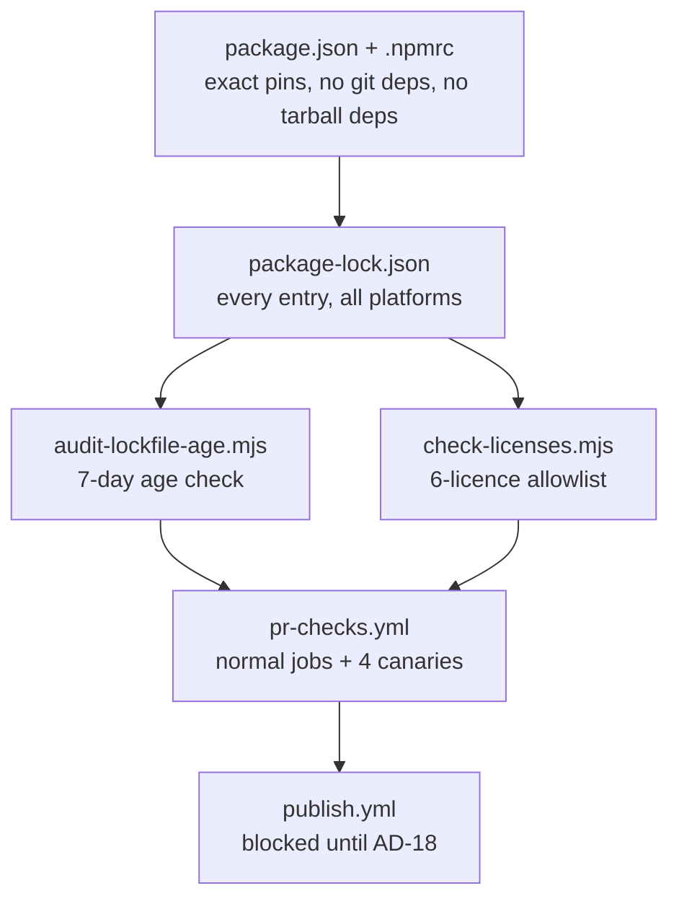
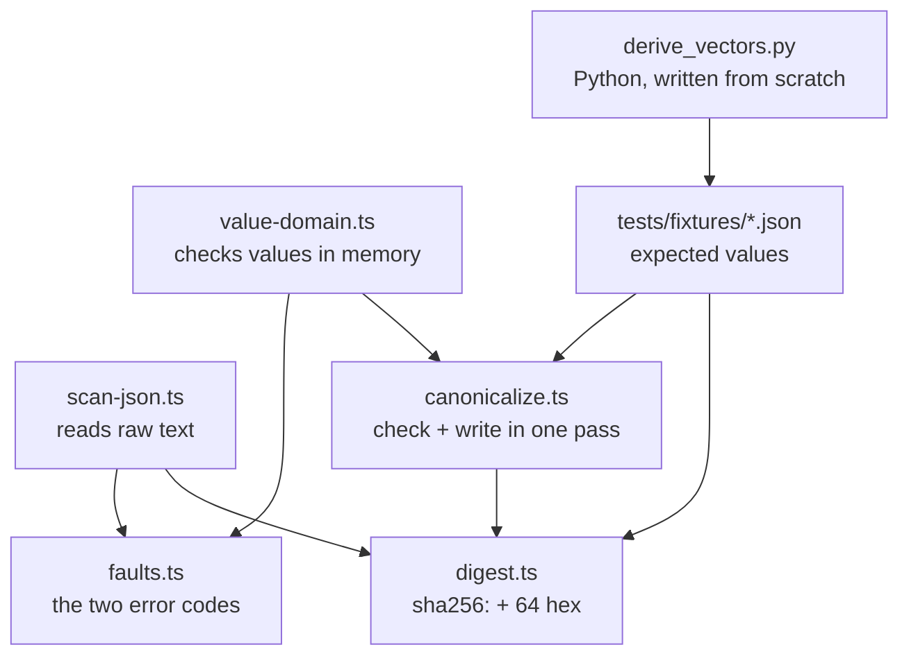
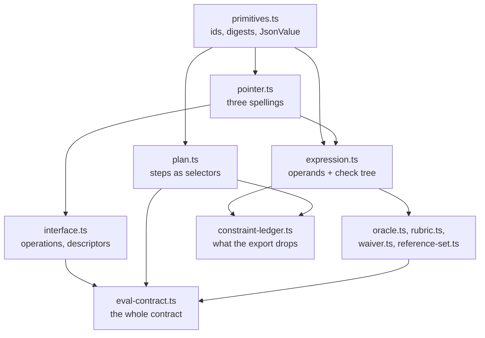
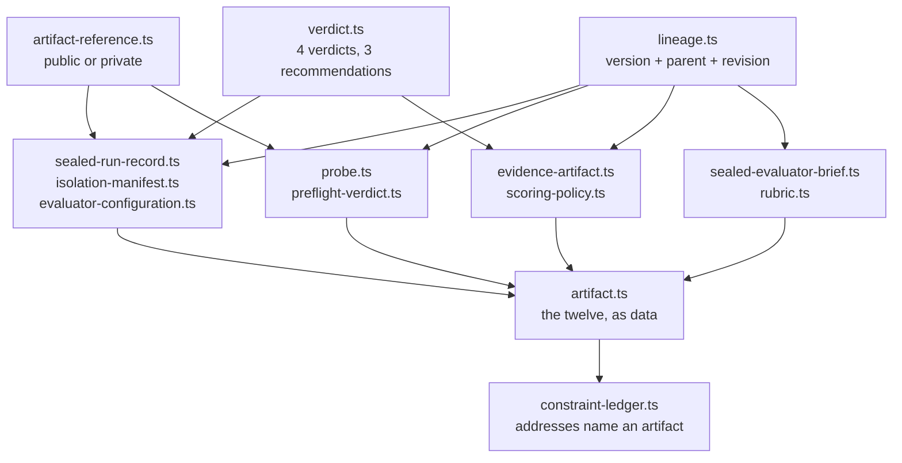

# eval-quality learning path

One step per finished story. Jump to the one you need.
Short version here. The long reasoning lives in the code comments each step points at.

| Step | What it does                                                                     |
| ---: | -------------------------------------------------------------------------------- |
|    1 | Lock down dependencies. Prove the CI gates really block bad ones.                 |
|    2 | One way to turn JSON into bytes, one way to hash it, so two codebases agree.      |
|    3 | What a contract author may write down, and what the schema lets through on purpose. |
|    4 | The other eleven artifacts, so every file crossing the boundary has a shape.       |

Adding a step: follow `learning-path-template.md`.

## Step 1: dependencies and CI gates

**What:** exact versions in `package.json`, two audit scripts, and a CI job per gate that breaks the
gate on purpose.

**Why:** this repo's supply-chain gates had already failed open twice. A gate that never blocks
anything looks like protection but is not. Everything built later sits on these dependencies.

**Rules:**

- Pin exact versions. No `^`, no `~`. Tools too.
- Keep Vite on 7.x. Vite 8 pulls in `lightningcss`, whose licence is not allowed.
- Both audit scripts read `package-lock.json`, never `node_modules`. The lockfile lists packages for
  every OS; `node_modules` only holds this machine's.
- A package must be 7 days old. npm's own `min-release-age` checks new installs only, so a young
  package already in the lockfile slips past it.
- Six licences allowed: MIT, Apache-2.0, ISC, BSD-2-Clause, BSD-3-Clause, 0BSD.
- Each gate has a canary job that feeds it a bad package and checks the **exact** error, like
  `EALLOWGIT`. Checking only "it failed" would also pass on a typo.
- Publishing stops before anything runs unless a repo variable is set. It stays unset until the
  AD-18 licence question is answered.

**Read in this order:**

1. `package.json` and `.npmrc`: the pins and the four policy lines.
2. `scripts/audit-lockfile-age.mjs` and `scripts/check-licenses.mjs`: short, no dependencies, and
   each says at the top which hole it plugs.
3. `.github/workflows/pr-checks.yml`: normal jobs first, then the four `canary-*` jobs.
4. `.github/workflows/publish.yml` and `scripts/assert-publish-authorized.mjs`: the publish block.
5. `.github/actions/`: two shared actions, so the copies cannot drift apart again.
6. `tsconfig.json` and `tsconfig-build.json`: TypeScript 7.

**Watch out:** the git and remote canary fixtures are real installable packages, because their jobs
run a real `npm ci`. The age and licence fixtures are only read as files, so they just need to be
valid JSON.

**Story:** `_bmad-output/implementation-artifacts/1-1-align-the-toolchain-and-supply-chain-to-the-stack.md`

## Step 2: canonical bytes and digests

**What:** turn any JSON value into one exact byte string, then SHA-256 those bytes.

**Why:** every version number, integrity check, and lineage link in this product is a digest. If our
code and someone else's code turn the same JSON into different bytes, every comparison quietly
breaks. Real example: JavaScript reads `9007199254740993` as `9007199254740992`.

**Rules:**

- Written here, no library. An unchecked hashing library is a supply-chain risk.
- Sort keys by UTF-16 code unit. Emoji sort before some normal letters. Looks wrong, is right.
- Let JavaScript print the numbers. Never hand-roll number formatting.
- Check and write in one pass. Read an object twice and a sneaky object can hand back something else
  the second time. This really happened: a hidden `NaN` came out as `null`.
- Numbers must be finite, and whole numbers stop at 2^53 − 1. Above that JavaScript loses digits.
- Scan the raw text before parsing, and make bad UTF-8 throw. `JSON.parse` rounds big numbers and
  drops duplicate keys without a word; the default decoder swaps bad bytes for `?` and hands you a
  clean hash of wrong data.
- Two error codes only: `non-canonicalizable-value` for a bad value, `schema-parse-failure` for text
  that will not parse.
- A digest is `sha256:` plus 64 hex characters. To combine digests, hash an object with named
  fields. Never glue strings together.
- Expected test values come from a Python script written from scratch. Running our own code and
  saving its output would only prove the code agrees with itself.

**Read in this order:**

1. `tests/fixtures/README.md`: the whole contract, written for someone not using TypeScript.
2. `src/core/schemas/faults.ts`: nine lines.
3. `src/core/canonical/scan-json.ts`: reads raw text, catches what `JSON.parse` hides.
4. `src/core/canonical/value-domain.ts`: same checks for values already in memory.
5. `src/core/canonical/canonicalize.ts`: JSON to bytes.
6. `src/core/canonical/digest.ts`: the five digest functions.
7. `tests/fixtures/derive_vectors.py`: run `python3 tests/fixtures/derive_vectors.py --check`.
8. `tests/canonical/vectors.test.ts`: every fixture runs as its own test.

**Watch out:**

- `src/index.ts` still exports only `VERSION`. Tests import from `src/core/canonical/` directly.
- Only `core/schemas/` and `core/canonical/` exist so far.
- The huge-number branch in `canonicalize.ts` is real code that no valid input can reach. The
  safe-integer rule rejects those numbers first.

**Story:** `_bmad-output/implementation-artifacts/1-2-canonical-digest-computation-and-the-hashed-artifact-value-domain.md`

## Step 3: the Eval Contract schema

**What:** the whole Eval Contract written once in Zod: what an author declares, the check expression
grammar, and the plan of interaction steps.

**Why:** every later epic reads these declarations and decides whether a contract is any good. This
step decides what can be said at all. A field missing here is a rule nobody can ever check, and a
shape spelled two ways is two products.

**Rules:**

- If a later epic has an error code for a bad shape, the schema accepts that shape. Rejecting it here
  swaps a named error for a nameless parse failure and deletes a test someone else owes.
- One exception, chosen by the epic: operator arity. `equality` takes exactly two operands.
- "Not set" is written `null`, never a missing key. Missing, empty, and filled are three answers.
- Every object is strict. Six maps are keyed by the author's own words; each is named in the code.
- `JsonValue` is the only place the caller's own keys are allowed.
- Three pointer spellings, three regexes: rooted at a step, relative to a quantifier's element, and
  plain into one response descriptor.
- Binding values are tagged, `{"literal": …}` or `{"matcher": "any"}`. The untagged form cannot be
  written down at all.
- Name every shape that is shared or refers to itself. An unnamed one exports as `__schema0`, a
  number that shifts as soon as anything else changes. Never add `.describe()` to a named shape at a
  use site; that wraps it and brings `__schema0` straight back.
- Prefer a plain Zod feature over `.refine()`. Refinements vanish from the published JSON Schema;
  `.describe()` text survives. Whatever a refinement still enforces goes in `constraint-ledger.ts`
  with the exact place to put it back and the JSON Schema version that fix is written for.

**Read in this order:**

1. `src/core/schemas/primitives.ts`: identifiers, digests, dates, and the `JsonValue` container.
2. `src/core/schemas/pointer.ts`: the three spellings and who may use each.
3. `src/core/schemas/expression.ts`: the operand union and the sixteen check forms.
4. `src/core/schemas/interface.ts`: operations, request channels, response descriptors.
5. `src/core/schemas/plan.ts`: a step selects observations; it never gives instructions.
6. `src/core/schemas/eval-contract.ts`: everything above, assembled.
7. `src/core/schemas/constraint-ledger.ts`: what the export cannot carry, as data.
8. `tests/schemas/ad5-admissions.test.ts`: one test per error code, proving the shape still parses.
9. `tests/schemas/fixtures/gate-c-contract.ts`: the only hand-written contract, and the twelve places
   it had to change.

**Watch out:**

- A reject test asserts the exact issue path and code. "It failed" would also pass on a typo.
- The old worked example fails three of its five checks on purpose. Do not repair it.
- `z.record` keyed by an enum demands every member, so the four channels are a plain object.
- `DIGEST_FORM` moved here from `digest.ts`. `core/` may import `core/schemas`, never the reverse.

**Story:** `_bmad-output/implementation-artifacts/1-3-the-eval-contract-schema-declarations-operand-grammar-and-plan-grammar.md`

## Step 4: the other eleven artifacts

**What:** the remaining eleven interchange artifacts written in Zod, one file each, plus one registry
listing all twelve.

**Why:** step 3 typed the file going in. Everything else crossing the boundary, the run record the
caller sends back, the isolation audit, the scored result, had no shape at all. A field missing here
is a rule a later epic cannot read, and an artifact with no schema is a caller guessing.

**Rules:**

- Twelve artifacts, one closed list, in `artifact.ts`. Nothing generates that list and nothing under
  `core/schemas/` imports it.
- `schemaVersion`, `parentDigest`, and `revisionCount` live in `lineage.ts` and are spread into
  eleven artifacts. Spread, never nested: a spread adds no shared definition to the export.
- `lineage.ts` and `verdict.ts` are leaves on purpose. Put them in `artifact.ts` and the imports form
  a loop that crashes on load with an error naming a file you never edited.
- `ArtifactReference` is the one artifact with no version and no lineage. It sits inside others, so
  versioning it would add a key to every finding for nobody.
- Where the old schema said "if this, then that", the new one is a union of branches. That is why a
  defect finding must quote its evidence and the other two kinds need not.
- One vocabulary, one home. Severity, interface kind, and the seven forbidden inputs come from the
  file that already held them. A second copy drifts.
- One state, one spelling. If a field-level `null` already says "absent", the object under it may not
  say the same thing again with every member null.
- Money is a string everywhere, including the isolation manifest. Seconds stay a number. A ceiling
  that must be above zero needs its own string format, or retyping a number silently drops the bound.
- Every ledger entry names its artifact, because with twelve roots "the root" points at nothing. A
  union at the top has no `properties`, so the resolver reads every branch and gives up if one lacks
  the field.

**Read in this order:**

1. `src/core/schemas/lineage.ts` and `verdict.ts`: two leaves, read them first.
2. `src/core/schemas/artifact-reference.ts`: the smallest union, and the no-lineage exemption.
3. `src/core/schemas/sealed-run-record.ts`: the biggest one, and the finding union.
4. `src/core/schemas/isolation-manifest.ts`: the generated forbidden-input accounting.
5. `src/core/schemas/probe.ts` and `evidence-artifact.ts`: the other two top-level unions.
6. `src/core/schemas/sealed-evaluator-brief.ts`: the one artifact defined by what it keeps out.
7. `src/core/schemas/artifact.ts`: the twelve, as data.
8. `src/core/schemas/constraint-ledger.ts`: addresses now name an artifact.
9. `tests/schemas/artifact-registry.test.ts`: the audits that walk all twelve.
10. `tests/schemas/fixtures/worked-example-artifacts.ts`: the old chain, and its 60 and 19 failures.

**Watch out:**

- The old worked example fails in 79 places. That is the record. Do not repair it.
- `RubricBody` now shows up in the contract's exported definitions. That is deliberate.
- `EvidenceArtifact` is the scored output. `evidenceArtifacts` on a finding is a list of references.
  Two different things one word apart.
- `EvaluatorConfiguration` rejects a `trialIndex` key on purpose, and a test proves the rejection.
  Here a missing field is the requirement, not an oversight.
- `responseHeaders` is a name-to-value map while `responseBody` is the open container. A pointer
  reaches into the headers by name, so a bare number there would address nothing; a body may be a
  bare number and still be a body.
- Every fixture is listed in an exported array that a test asserts is complete. A fixture nothing
  imports proves nothing, and one shipped that way before review caught it.
- Eighteen rules are named as unenforced in `ad5-admissions.test.ts`. Most compare two artifacts, and
  one schema cannot see two artifacts at once.

**Story:** `_bmad-output/implementation-artifacts/1-4-the-remaining-interchange-artifact-schemas.md`

