# eval-quality learning path

One step per finished story. Jump to the one you need.
Short version here. The long reasoning lives in the code comments each step points at.
`AD-N` below cites decision N in the architecture spine (`ARCHITECTURE-SPINE.md`, grep for the
number); the rule it's attached to is the short version of that decision's reasoning.

**Big picture:** this project builds the artifacts a sealed evaluator needs to grade a system under
test honestly. An author writes a contract stating what to check; this library turns that contract
into a brief telling the evaluator what to compare, without ever showing it the interaction plan (the
step order, the step ids, the scripted call sequence). Sealed on purpose, so the verdict comes from
reasoning over evidence. The library itself never runs anyone: executing
the system under test and the sealed evaluator is the caller's job, shown in the diagram below.
Everything below is one piece of what the library produces: canonical bytes so two codebases agree on
a hash (Step 2), the contract schema (Steps 3 to 5), the prose a sealed evaluator reads in place of
the interaction plan (Steps 6 to 8), and, starting at Step 9, the code that resolves a contract's own
checks against observed evidence to `true`, `false`, or `insufficient-evidence`.

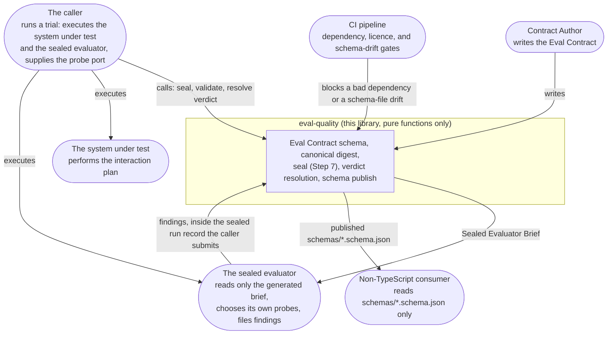

| Step | Epic-Story | What it does                                                                     |
| ---: | :--- | -------------------------------------------------------------------------------- |
|    1 | epic1-story1 | Lock down dependencies. Prove the CI gates really block bad ones.                 |
|    2 | epic1-story2 | One way to turn JSON into bytes, one way to hash it, so two codebases agree.      |
|    3 | epic1-story3 | What a contract author may write down, and what the schema lets through on purpose. |
|    4 | epic1-story4 | The other eleven artifacts, so every file crossing the boundary has a shape.       |
|    5 | epic1-story5 | Publish the schemas as JSON Schema files and prove them equivalent to the Zod source. |
|    6 | epic2-story1 | Turn a declared direction into evaluator prose that names the call without naming the step. |
|    7 | epic2-story2 | Assemble the sealed brief: only what AD-16 permits, everything else sorted or excluded. |
|    8 | epic2-story3 | Catch sequencing prose an author smuggled into free text, after the brief is generated. |
|    9 | epic3-story1 | Ten pure operators over resolved evidence: equality, membership, regex, and shape, fully specified. |
|   10 | epic3-story2 | Connectives, quantifiers, and the empty-collection rule so equivalent spellings agree on empty evidence. |

Adding a step: follow `learning-path-template.md`.

## Step 1 (epic1-story1): dependencies and CI gates

**What:** exact versions in `package.json`, two audit scripts, and a CI job per gate that breaks the
gate on purpose.

**Why:** this repo's supply-chain gates had already failed open twice. A gate that never blocks
anything protects nothing. Everything built later sits on these dependencies.

**Rules:**

- Pin exact versions. No `^`, no `~`. Tools too.
- Keep Vite on 7.x. Vite 8 pulls in `lightningcss`, whose licence is not allowed.
- Both audit scripts read `package-lock.json`, never `node_modules`. The lockfile lists packages for
  every OS; `node_modules` only holds this machine's.
- A package must be 7 days old. npm's own `min-release-age` checks new installs only, so a young
  package already in the lockfile slips past it.
- Six licences allowed: MIT, Apache-2.0, ISC, BSD-2-Clause, BSD-3-Clause, 0BSD.
- Each gate has a canary job that feeds it a bad package and checks the **exact** error, like
  `EALLOWGIT`. Checking only "it failed" would also pass on a typo.
- Publishing stops before anything runs unless a repo variable is set. It stays unset until the
  AD-18 licence question is answered.

**Read in this order:**

1. `package.json` and `.npmrc`: the pins and the four policy lines.
2. `scripts/audit-lockfile-age.mjs` and `scripts/check-licenses.mjs`: short, no dependencies, and
   each says at the top which hole it plugs.
3. `.github/workflows/pr-checks.yml`: normal jobs first, then the four `canary-*` jobs.
4. `.github/workflows/publish.yml` and `scripts/assert-publish-authorized.mjs`: the publish block.
5. `.github/actions/`: two shared actions, so the copies cannot drift apart again.
6. `tsconfig.json` and `tsconfig-build.json`: TypeScript 7.

**Watch out:** the git and remote canary fixtures are real installable packages, because their jobs
run a real `npm ci`. The age and licence fixtures are only read as files, so they just need to be
valid JSON.

**Story:** `_bmad-output/implementation-artifacts/1-1-align-the-toolchain-and-supply-chain-to-the-stack.md`

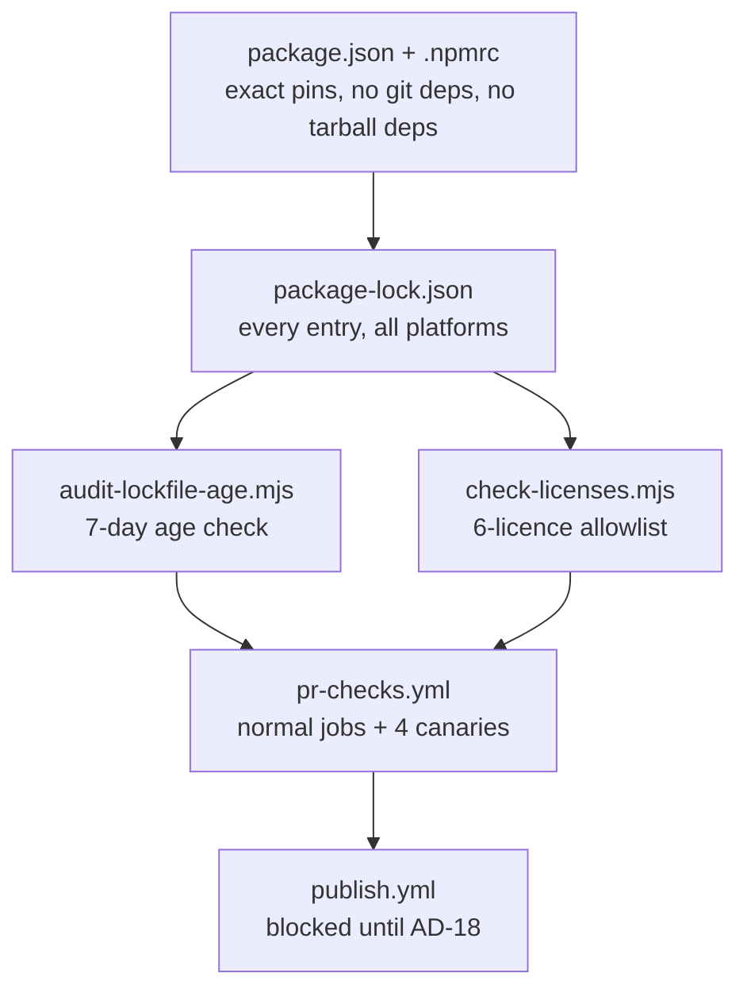

## Step 2 (epic1-story2): canonical bytes and digests

**What:** turn any JSON value into one exact byte string, then SHA-256 those bytes.

**Why:** every version number, integrity check, and lineage link in this product is a digest. If our
code and someone else's code turn the same JSON into different bytes, every comparison quietly
breaks. Real example: JavaScript reads `9007199254740993` as `9007199254740992`.

**Rules:**

- Written here, no library. An unchecked hashing library is a supply-chain risk.
- Sort keys by UTF-16 code unit. Emoji sort before some normal letters, which looks wrong and is correct.
- Let JavaScript print the numbers. Never hand-roll number formatting.
- Check and write in one pass. Read an object twice and a sneaky object can hand back something else
  the second time. This really happened: a hidden `NaN` came out as `null`.
- Numbers must be finite, and whole numbers stop at 2^53 − 1. Above that JavaScript loses digits.
- Scan the raw text before parsing, and make bad UTF-8 throw. `JSON.parse` rounds big numbers and
  drops duplicate keys without a word; the default decoder swaps bad bytes for `?` and hands you a
  clean hash of wrong data.
- Two error codes only: `non-canonicalizable-value` for a bad value, `schema-parse-failure` for text
  that will not parse.
- A digest is `sha256:` plus 64 hex characters. To combine digests, hash an object with named
  fields. Never glue strings together.
- Expected test values come from a Python script written from scratch. Running our own code and
  saving its output would only prove the code agrees with itself.

**Read in this order:**

1. `tests/fixtures/README.md`: the whole contract, written for someone not using TypeScript.
2. `src/core/schemas/faults.ts`: nine lines.
3. `src/core/canonical/scan-json.ts`: reads raw text, catches what `JSON.parse` hides.
4. `src/core/canonical/value-domain.ts`: same checks for values already in memory.
5. `src/core/canonical/canonicalize.ts`: JSON to bytes.
6. `src/core/canonical/digest.ts`: the five digest functions.
7. `tests/fixtures/derive_vectors.py`: run `python3 tests/fixtures/derive_vectors.py --check`.
8. `tests/canonical/vectors.test.ts`: every fixture runs as its own test.

**Watch out:**

- `src/index.ts` still exports only `VERSION`. Tests import from `src/core/canonical/` directly.
- Only `core/schemas/` and `core/canonical/` exist so far.
- The huge-number branch in `canonicalize.ts` is real code that no valid input can reach. The
  safe-integer rule rejects those numbers first.

**Story:** `_bmad-output/implementation-artifacts/1-2-canonical-digest-computation-and-the-hashed-artifact-value-domain.md`

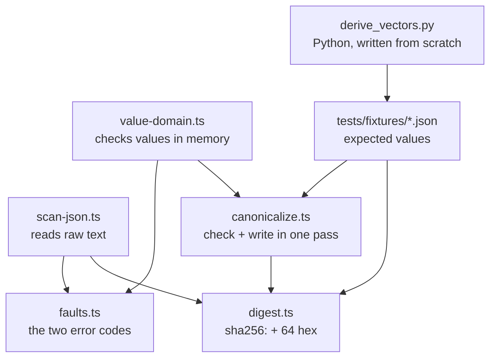

## Step 3 (epic1-story3): the Eval Contract schema

**What:** the whole Eval Contract written once in Zod: what an author declares, the check expression
grammar, and the plan of interaction steps.

**Why:** every later epic reads these declarations and decides whether a contract is any good. This
step decides what can be said at all. A field missing here is a rule nobody can ever check, and a
shape spelled two ways is two products.

**Rules:**

- If a later epic has an error code for a bad shape, the schema accepts that shape. Rejecting it here
  swaps a named error for a nameless parse failure and deletes a test someone else owes.
- One exception to that rule: operand count is still enforced here. `equality` takes exactly two
  operands, and the schema rejects a third operand itself, without waiting on a later epic's error
  code.
- "Not set" is written `null`, never a missing key. Missing, empty, and filled are three answers.
- Every object is strict. Six maps are keyed by the author's own words; each is named in the code.
- `JsonValue` is the only place the caller's own keys are allowed.
- Three pointer spellings, three regexes: rooted at a step, relative to a quantifier's element, and
  plain into one response descriptor.
- Binding values are tagged, `{"literal": …}` or `{"matcher": "any"}`. The untagged form cannot be
  written down at all.
- Name every shape that is shared or refers to itself. An unnamed one exports as `__schema0`, a
  number that shifts as soon as anything else changes. Never add `.describe()` to a named shape at a
  use site; that wraps it and brings `__schema0` straight back.
- Prefer a plain Zod feature over `.refine()`. Refinements vanish from the published JSON Schema;
  `.describe()` text survives. Whatever a refinement still enforces goes in `constraint-ledger.ts`
  with the exact place to put it back and the JSON Schema version that fix is written for.

**Read in this order:**

1. `src/core/schemas/primitives.ts`: identifiers, digests, dates, and the `JsonValue` container.
2. `src/core/schemas/pointer.ts`: the three spellings and who may use each.
3. `src/core/schemas/expression.ts`: the operand union and the sixteen check forms.
4. `src/core/schemas/interface.ts`: operations, request channels, response descriptors.
5. `src/core/schemas/plan.ts`: a step selects observations; it never gives instructions.
6. `src/core/schemas/eval-contract.ts`: everything above, assembled.
7. `src/core/schemas/constraint-ledger.ts`: what the export cannot carry, as data.
8. `tests/schemas/ad5-admissions.test.ts`: one test per error code, proving the shape still parses.
9. `tests/schemas/fixtures/gate-c-contract.ts`: the only hand-written contract, and the twelve places
   it had to change.

**Watch out:**

- A reject test asserts the exact issue path and code. "It failed" would also pass on a typo.
- The old worked example fails three of its five checks on purpose. Do not repair it.
- `z.record` keyed by an enum demands every member, so the four channels are a plain object.
- `DIGEST_FORM` moved here from `digest.ts`. `core/` may import `core/schemas`, never the reverse.

**Story:** `_bmad-output/implementation-artifacts/1-3-the-eval-contract-schema-declarations-operand-grammar-and-plan-grammar.md`

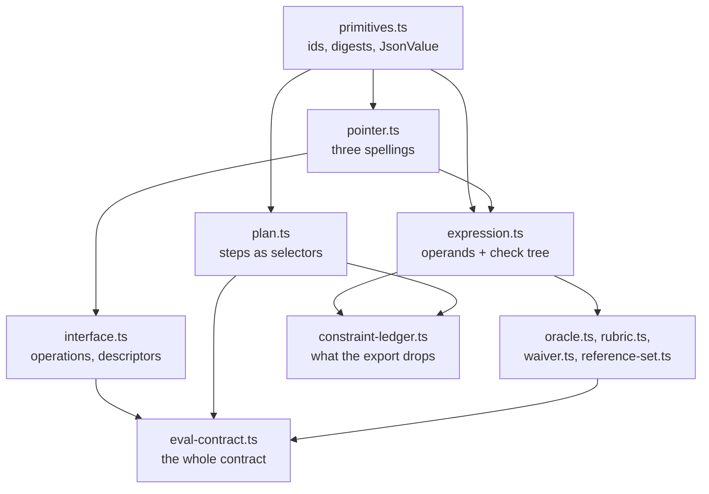

## Step 4 (epic1-story4): the other eleven artifacts

**What:** the remaining eleven interchange artifacts written in Zod, one file each, plus one registry
listing all twelve.

**Why:** step 3 typed the file going in. Everything else crossing the boundary, the run record the
caller sends back, the isolation audit, the scored result, had no shape at all. A field missing here
is a rule a later epic cannot read, and an artifact with no schema is a caller guessing.

**Rules:**

- Twelve artifacts, one closed list, in `artifact.ts`. Nothing generates that list and nothing under
  `core/schemas/` imports it.
- `schemaVersion`, `parentDigest`, and `revisionCount` live in `lineage.ts` and are spread into
  eleven artifacts. Spread, never nested: a spread adds no shared definition to the export.
- `lineage.ts` and `verdict.ts` are leaves on purpose. Put them in `artifact.ts` and the imports form
  a loop that crashes on load with an error naming a file you never edited.
- `ArtifactReference` is the one artifact with no version and no lineage. It sits inside others, so
  versioning it would add a key to every finding for nobody.
- Where the old schema said "if this, then that", the new one is a union of branches. That is why a
  defect finding must quote its evidence and the other two kinds need not.
- Severity, interface kind, and the seven forbidden inputs come from the file that already held
  them. A second copy drifts.
- If a field-level `null` already says "absent", the object under it may not say the same thing
  again with every member null.
- Money is a string everywhere, including the isolation manifest. Seconds stay a number. A ceiling
  that must stay above zero needs its own string format: a plain `number` field can't carry that
  constraint, so typing the ceiling as a number would silently drop the above-zero requirement.
- Every ledger entry names its artifact, because with twelve roots "the root" points at nothing. A
  union at the top has no `properties`, so the resolver reads every branch and gives up if one lacks
  the field.

**Read in this order:**

1. `src/core/schemas/lineage.ts` and `verdict.ts`: two leaves, read them first.
2. `src/core/schemas/artifact-reference.ts`: the smallest union, and the no-lineage exemption.
3. `src/core/schemas/sealed-run-record.ts`: the biggest one, and the finding union.
4. `src/core/schemas/isolation-manifest.ts`: the generated forbidden-input accounting.
5. `src/core/schemas/probe.ts` and `evidence-artifact.ts`: the other two top-level unions.
6. `src/core/schemas/sealed-evaluator-brief.ts`: the one artifact defined by what it keeps out.
7. `src/core/schemas/artifact.ts`: the twelve, as data.
8. `src/core/schemas/constraint-ledger.ts`: addresses now name an artifact.
9. `tests/schemas/artifact-registry.test.ts`: the audits that walk all twelve.
10. `tests/schemas/fixtures/worked-example-artifacts.ts`: the old chain, and its 60 and 19 failures.

**Watch out:**

- The old worked example fails in 79 places. That is the record. Do not repair it.
- `RubricBody` now shows up in the contract's exported definitions. That is deliberate.
- `EvidenceArtifact` is the scored output. `evidenceArtifacts` on a finding is a list of references.
  Two different things one word apart.
- `EvaluatorConfiguration` rejects a `trialIndex` key on purpose, and a test proves the rejection.
  A missing field here is the requirement itself; don't add it back in.
- `responseHeaders` is a name-to-value map while `responseBody` is the open container. A pointer
  reaches into the headers by name, so a bare number there would address nothing; a body may be a
  bare number and still be a body.
- Every fixture is listed in an exported array that a test asserts is complete. A fixture nothing
  imports proves nothing, and one shipped that way before review caught it.
- Eighteen rules are named as unenforced in `ad5-admissions.test.ts`. Most compare two artifacts, and
  one schema cannot see two artifacts at once.

**Story:** `_bmad-output/implementation-artifacts/1-4-the-remaining-interchange-artifact-schemas.md`

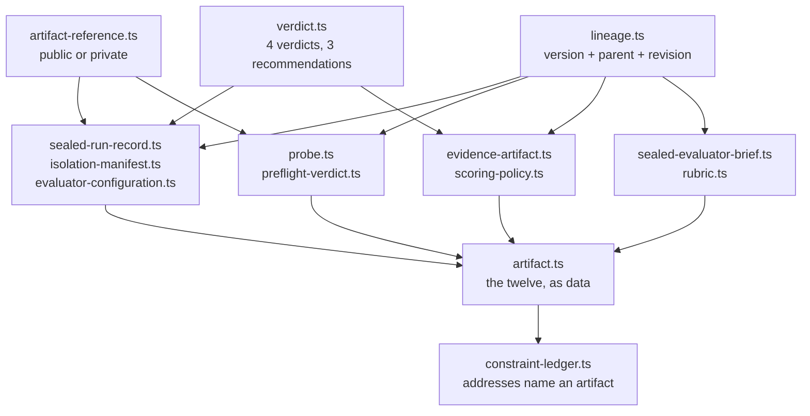

## Step 5 (epic1-story5): the published export and its four checks

**What:** twelve committed `schemas/*.schema.json` files built by one pure function, and four checks
that prove them equivalent to the Zod source, constraint by constraint.

**Why:** a non-TypeScript consumer only sees the JSON Schema files. A constraint living only in a
Zod refinement would be invisible to them, and nothing would notice. The four checks make that class
of silence a red build.

**Rules:**

- One builder, `publish.ts`, downstream of everything. Nothing under `core/schemas/` imports it.
- `$id` is a URN, `urn:eval-quality:schema:{key}`. A URL would promise a document nothing serves.
- The constraint ledger drives every injection by its stated address. An address that does not
  resolve throws; it never warns.
- The committed files are pure ASCII, 2-space indent, one trailing newline. The drift check compares
  bytes, so the serialisation is fixed in one shared function.
- The drift check has no `--write`. If it could fix the file it is checking, a broken build would
  get silently patched and pass.
- Four checks, three homes: rejection suite, differential, and mutation sweep are pure and live in
  Vitest; only the byte drift check reads disk, so only it is a script.
- The validator is ajv 8, third-party on purpose: it independently reported the arity hole the
  ledger repairs. `strict` on, `strictTypes` off, `date-time` registered always-true, no ajv-formats.
- The mutant corpus is generated. A hand-written attempt was tried first and measured a kill rate
  of one keyword in ten.
- Unkillable keywords are exempted by computed rule, never by a hand list, and survivors, unreachable,
  and exempt are asserted equal three ways. Measured on this pin: 1,949 occurrences, 168 exempt.
- Pin the counts (occurrences, exempt, survivors) exactly. A floor ("at least N") lets the count
  quietly drop and still pass; only an exact match catches coverage that stopped growing.
- Every gate gets a canary that proves it blocks, for the stated reason.
- `FAILURE_CODES` is parsed against the AD-5 table on every validate, so nobody hand-maintains the
  enumeration beside it.

**Read in this order:**

1. `src/core/schemas/publish.ts`: the builder, the injection, the serialiser.
2. `scripts/generate-schemas.ts` and `scripts/check-schemas.ts`: the writer and the byte gate.
3. `src/core/failure-codes.ts` and `scripts/check-ad5-registry.ts`: the AD-5 binding.
4. `tests/schemas/publish.test.ts`: `$id`, `$defs` naming, the loud failures.
5. `tests/schemas/published/keyword-occurrences.ts`: what counts as a keyword, and the exemption rule.
6. `tests/schemas/published/mutant-generator.ts`: the schema-directed corpus.
7. `tests/schemas/published/differential.test.ts` and `keyword-mutation.test.ts`: checks three and four.

**Watch out:** ajv anchors a reported `schemaPath` to the `$defs` entry where the error occurred.
Zod exports `type` beside every `const` and `enum`, which makes those `type`s undeletable-by-proof
and therefore exempt. Deleting an injected arity keyword makes ajv strict refuse to compile, which
the sweep tracks as its own outcome, separate from a pass.

**Story:** `_bmad-output/implementation-artifacts/1-5-the-published-json-schema-export-and-its-four-ci-checks.md`

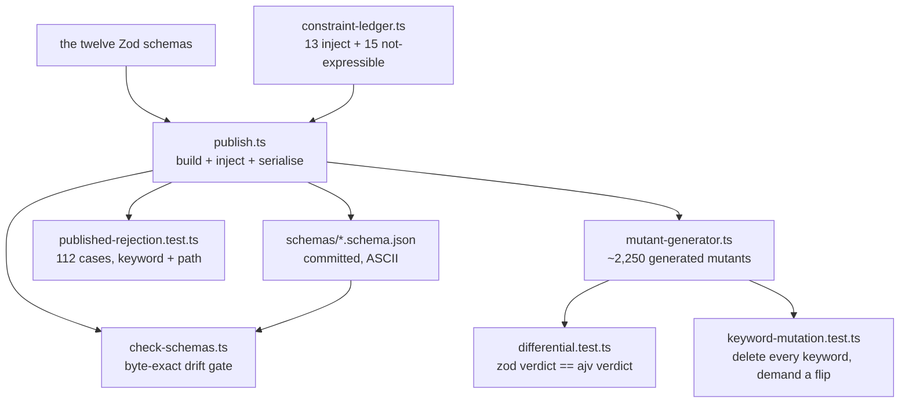

## Step 6 (epic2-story1): the direction-prose generator

**What:** turn one oracle's declared direction (evidence targets, relation, polarity, scope, negative
domain) into the prose that becomes a `BriefDirection`'s `text`.

**Why:** the sealed evaluator never sees the interaction plan or a step's identifier, only this
prose. It has to say which call an evidence target came from without naming the step. Two
observations of one operation that render the same sentence are indistinguishable to it. Real
example: "the id value you sent to the create endpoint, compared with its id field from the read
endpoint, is asserted to be equal" names two calls and what to compare between them, and names no
step.

**Rules:**

- A pointer resolves to a phrase, never to a step id.
- The channel decides whether the phrase says obtained or sent. Drop it and O-001's two targets read
  alike.
- A malformed input always says so. That is AD-16's own worked example.
- Two steps that would render the same phrase escalate through a fixed ladder: generic, then the
  binding's kind, then its literal value, then a method and path description.
- A temporal read-back pair renders as one relational phrase. Rendering each side on its own and
  joining them puts the two steps in an order the evaluator can read off.
- Five relation-template families: quantifiers, connectives, presence, comparison, and the six
  remaining structural operators. `not` gets its own skeleton; a shared affirmative one tells the
  evaluator the opposite of the declared claim.
- `scope` and `negativeDomain` are author text. The generator frames them in a sentence and never
  splits or reorders them. `null` drops the clause; it never prints the word.
- Determinism is proven by permutation. A repeat call cannot catch a tie-break that is stable within
  one process.

**Read in this order:**

1. `src/core/seal/plan-index.ts`: resolves a pointer to its step and operation. Nothing about
   reachability; that is Epic 4's.
2. `src/core/seal/derived-reference.ts`: the phrase vocabulary, the escalation ladder, and the
   temporal-pair grouping.
3. `src/core/seal/direction-prose.ts`: the five relation families, assembled into one string.
4. `tests/schemas/fixtures/gate-c-contract.ts`: the primary fixture, already in the tree.
5. `tests/seal/fixtures.ts`: what Gate C does not carry, including the Gate D reconstruction and the
   create-then-read-back pair.

**Watch out:**

- The ladder's fourth rung is computed from the shared operation, so every sibling on that operation
  gets the same text and it can never break a tie. Reaching it throws.
- `response-body`, `stdout` and `stderr` all render `its {field} field`, and a `call-inputs` pointer
  carrying a tail drops its transport channel, so two different targets can still read alike. Both
  are open findings on story 2.1.
- The suite is green and does not prove the rules above. Mutating the sent-versus-obtained wording,
  the pair order, the binding-key sort and the clause order each leaves all 63 tests passing.
- `gateCContract` is declared `satisfies EvalContract`, and the type TypeScript infers for it
  afterward does not assign to `PermittedInterface[]`. `tests/seal/fixtures.ts` casts once through
  `unknown`; `z.array(PermittedInterface).parse` gives the same type and validates.

**Story:** `_bmad-output/implementation-artifacts/2-1-the-direction-prose-generator.md`

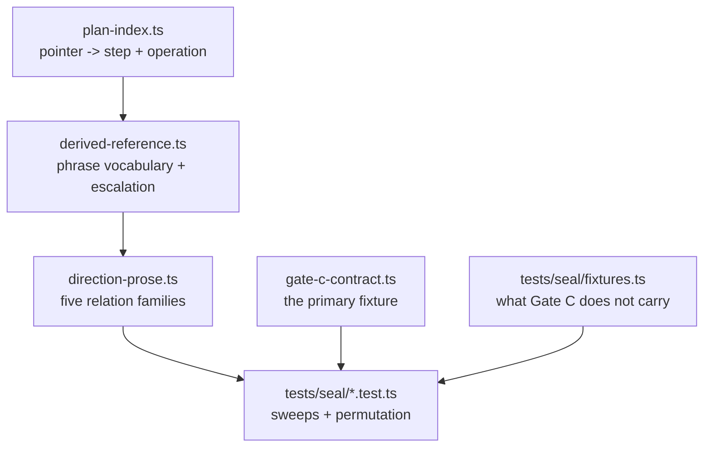

## Step 7 (epic2-story2): brief assembly, exclusions, and canonical ordering

**What:** `seal(contract)` walks every oracle, renders one `BriefDirection` per oracle using Step 6's
prose generator, then assembles the `SealedEvaluatorBrief`: only the fields AD-16 permits, with
unordered arrays sorted to a fixed key.

**Why:** Step 6 renders one oracle's prose. Nothing yet walked a whole contract and produced the
artifact the evaluator actually reads. Most of the brief's content must come out byte-identical no
matter how the contract's arrays were declared; `behaviors` and `contractDigest` are the two
deliberate exceptions, covered below.

**Rules:**

- Assemble only what `SealedEvaluatorBrief` declares. It is `strictObject`, so excluding commentary,
  the interaction plan, and every step identifier is structural: the type has no slot for them.
  Nobody has to remember to filter them out.
- `permittedInterfaces` is a per-element map: it drops each interface's operation inventory before
  the brief sees it. Only the interface's identity crosses.
- Four fields have no meaningful order in the contract (`directions`, `permittedInterfaces`,
  `scopedResources`, `safetyLimits`): sort each by its natural key. A duplicate key throws. Sort
  stability is not a guarantee, so byte-identity cannot lean on it.
- `behaviors` is the one array kept in contract order. Its order is meaningful, so it is not folded
  into the sort rule above.
- `contractDigest` hashes the literal input, so reordering the contract's arrays legitimately changes
  it even though the rest of the brief stays byte-identical. Lineage sits outside the guarantee for
  the same reason: it is not derived from array content at all.
- `negativeDomain`'s own "canonical sorted order" language is satisfied vacuously: one string, one
  member, nothing to sort. Closed here: no invented structure needed to make the sort mean anything.
- Copy `behaviors` and `budgets` in. Do not alias them to the source contract, or a caller mutating
  the contract after `seal()` returns would silently mutate the "sealed" brief too.

**Read in this order:**

1. `src/core/seal/seal.ts`: the whole function.
2. `src/core/schemas/sealed-evaluator-brief.ts`: what the brief is allowed to carry.
3. `src/core/schemas/interface.ts`: why `permittedInterfaces` needs a per-element map.
4. `tests/seal/seal.test.ts`: the sort, duplicate-key, reorder, and reject-fixture tests.

**Watch out:** a test that hashes or diffs the whole brief object across reorderings will never pass;
only the content fields are asserted byte-identical, `contractDigest` is not one of them.
Forbidden-input exclusion here comes from the schema's `strictObject` shape. `seal()` performs no
such check itself.

**Story:** `_bmad-output/implementation-artifacts/spec-2-2-brief-assembly-exclusions-and-canonical-ordering.md`

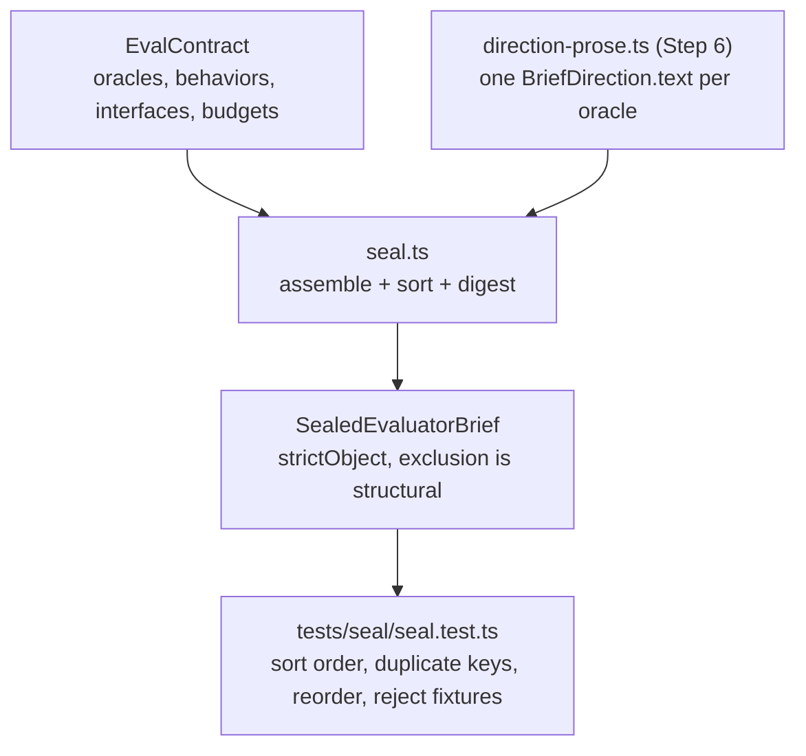

## Step 8 (epic2-story3): the emitted-brief scripting audit

**What:** a pure function, `auditBriefScripting`, that reads an already-assembled `SealedEvaluatorBrief`
and throws if any one direction's generated `text` carries more sequencing/transition markers than the
contract's declared `probeStepBound`.

**Why:** the declaration-side graph predicate over the interaction plan (a later epic) reads the plan
structure; it never reads generated prose. An author's own free `scope`/`negativeDomain` text is the one
channel that can still smuggle a scripted "do this, then this" sequence past that predicate, since Step
6's own generator never emits that vocabulary itself. This audit runs after generation, over the
finished brief, to catch exactly that.

**Rules:**

- `probeStepBound: null` means no bound was declared; the audit passes vacuously. `0` is a legal, strict
  bound: no marker of any kind is permitted.
- The bound applies per direction, never summed across the brief. An enumerated path is something a
  reader reconstructs from one direction's own narrated claim.
- The marker set: `then`, `before`, `after`, `subsequently`, `next`, `finally`, `afterward` (and
  `afterwards`), plus a numbered-list marker (`1.`, `2)`, ...), case-insensitive and whole-word.
- A numbered-list marker only counts inside real list context: it has to open a line, follow a
  newline, or follow a sentence-ending mark plus a space. That anchor keeps ordinary numeric prose
  like "Rule 12." from counting as a step.
- Bare ordinals (`first`, `second`, ...) are excluded on purpose: `gateCContract`'s own shipped "not the
  first" already uses "first" as a position word, in accepted author prose.
- Only `directions[].text` is scanned, never `behaviors`, `scopedResources`, or `safetyLimits`. Widening
  that scan is a flagged, deferred judgment call for a later story.
- It throws `StructuralFailure`, a compile-time-class failure carrying an AD-5 code (the twenty-first
  the registry now carries).
- Which direction's failure surfaces first, when more than one violates, is only as deterministic as
  `directions`' own array order; the audit does not hunt for every violation in one pass.

**Read in this order:**

1. `src/core/failure-codes.ts`: the twenty-one-code tuple and the new `StructuralFailure` class beside it.
2. `src/core/seal/scripting-audit.ts`: the marker pattern, the per-direction count, the throw.
3. `tests/seal/scripting-audit.test.ts`: the accept/reject fixtures and the permutation test.

**Watch out:** the story's own regression fixture cites "O-004" for the "not the first" text; that text
is actually O-005's `scope` in `tests/schemas/fixtures/gate-c-contract.ts`, and the test targets O-005
directly.

**Story:** `_bmad-output/implementation-artifacts/2-3-the-emitted-brief-scripting-audit.md`

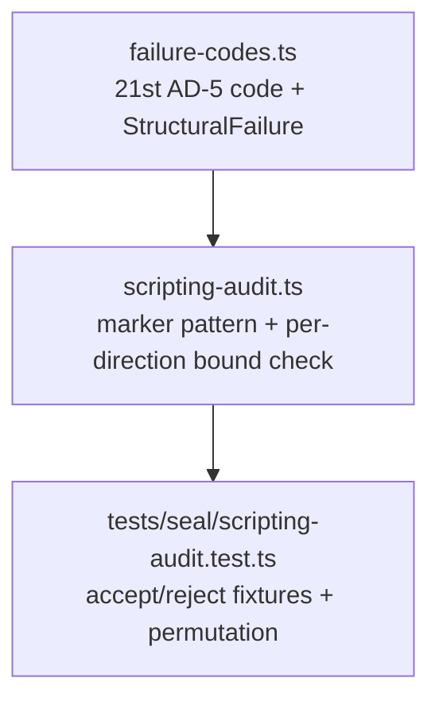

## Step 9 (epic3-story1): scalar operators over the evidence domain

**What:** ten pure functions (`equality`, `deepEquality`, `containment`, `existence`, `absence`,
`regexMatch`, `setMembership`, `ordering`, `countTolerance`, `shape`), each taking already-resolved
evidence values and returning a plain `boolean`.

**Why:** two implementations of one oracle's `check` must land on the same answer for every node, or
the scoring model can't be trusted. This step nails that down operator by operator: what counts as
equal, what counts as contained, what a regex match-step budget actually bounds. Real example:
compare `9007199254740993` against an ordinary number and it just resolves `false`, the same as any
other wrong answer, never a crash. Only comparing two objects or two arrays ever risks one. That
keeps a broken system under test's bad number from crashing the whole run.

**Rules:**

- Every operator takes a `ResolvedValue` (`JsonValue | ABSENT`), never a `{pointer}`/`{literal}`/
  `{referenceSet}` operand. Resolving those is a later epic's job.
- `ABSENT` is a unique symbol, never `null`. `existence` reads false against it, `absence` true, and
  every comparison false, even absent-against-absent.
- `equality` reaches structural comparison (`digestArtifact`) only when both operands are the same
  compound kind. Every other input, including a domain-violating scalar, resolves without ever
  canonicalizing. `deepEquality` is unconditionally structural, so it can throw
  `non-canonicalizable-value` where `equality` on the same inputs would just resolve `false`.
- `regexMatch`'s step budget is a static two-tier gate, never a live step count: reject any
  nested-quantifier shape outright, then bound a linear, character-class-aware estimate against the
  declared budget.
- Strip escaped characters before stripping character classes. Getting that order backward once let
  an escaped bracket hide a real nested-quantifier group from both gate tiers, and the regex hung with
  no fault thrown.
- `shape`'s closed set is `permittedKeys` alone: a required key missing from it makes the descriptor
  unsatisfiable.
- `ordering`, `countTolerance`, and any operand that may denote a collection resolve `false` on a bare
  `ABSENT`. That answer is correct only when the operand is not itself declared collection-typed; the
  next story's wrapper handles the other case.
- Every function's last parameter is `artifactPath: string`, even on the five that never throw (named
  `_artifactPath`), so every operator shares one calling convention.

**Read in this order:**

1. `src/core/evaluate/resolved-value.ts`: the `ABSENT` sentinel and `ResolvedValue`.
2. `src/core/evaluate/operators.ts`: the ten functions.
3. `src/core/schemas/scoring-policy.ts`: `regexMatchStepBudget`, the field `regexMatch` reads.
4. `src/core/schemas/faults.ts`: the two new runtime fault codes, `RUNTIME_FAULT_CODES`.
5. `tests/evaluate/operators.test.ts`: every operator's accept, reject, and absent-operand case.

**Watch out:**

- This story's ten operators are two-valued. Three-valued `insufficient-evidence` resolution, the
  connectives, and the quantifiers are the next story's; nothing here decides that value.
- `RUNTIME_FAULT_CODES` is not a full AD-28 mirror the way `FAILURE_CODES` mirrors AD-5: it only lists
  codes with a genuine thrower, four of AD-28's ten rows. Nothing automates a cross-check against the
  spine table yet.
- The budget gate still can't see everything: a quantified overlapping alternation like `(?:a|a)+`
  passes both tiers and can still hang. Catching it needs a real parser, so it's left as a named gap.
  The default budget is 1,000,000, so ordinary-length evidence text doesn't fault on length alone, but
  that also means the linear tier does almost no real work day to day; the structural
  nested-quantifier check above is the actual backstop.

**Story:** `_bmad-output/implementation-artifacts/3-1-scalar-operators-over-the-evidence-domain.md`

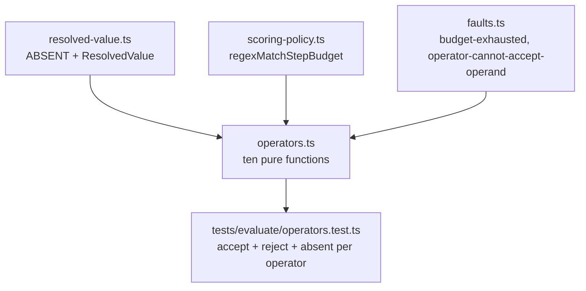

## Step 10 (epic3-story2): connectives, quantifiers, and three-valued resolution

**What:** `resolveCheck`, the tree-walker that turns an `Expression` into a `CheckResolutionValue`:
`notOf`/`allOf`/`anyOf` for the three connectives, `resolveQuantifier` for `for-all`/`for-any`, and one
uniform empty-collection check applied before every leaf operator runs.

**Why:** Story 3.1's ten operators only decide one node. The soft-delete pair is why three-valued
resolution exists: `for-all(page, absence(@/retractedAt))` and
`not(for-any(page, existence(@/retractedAt)))` say the same thing, and over an empty page one used to
certify while the other failed closed. Both now resolve `insufficient-evidence`, so an empty
collection never reads as a clean pass.

**Rules:**

- The empty-collection check runs on every operand of every operator, including a `{ literal: [] }`
  one: there is no spelling in this grammar for "this may legitimately be empty."
- `all` keeps a genuine `false` decisive even next to an `insufficient-evidence` sibling. `any` is
  weaker than plain OR: one `insufficient-evidence` sibling beats a `true` one.
- `not(insufficient-evidence)` is `insufficient-evidence`, under both polarities.
- A quantifier's `collection` is collection-typed by definition: `ABSENT`, or a non-array type
  mismatch, both resolve `insufficient-evidence`, never a thrown fault.
- A node that resolves `insufficient-evidence` by folding its children, not by tripping the condition
  itself, carries `introductionCondition: null`. The child that actually tripped it still carries the
  condition, one level down.
- `boundElement` is `ABSENT` outside any quantifier, never `null`: a bound element can legitimately be
  JSON `null` itself, and only a third value tells the two apart.
- `covers-by-key` has no operator yet; that branch throws a plain `Error` naming Story 3.3, never a
  `RuntimeFault` — a gap in this dispatch table, not a fact about the evidence.
- Real pointer resolution, including `@/`, is not built here: `ResolveOperand` and
  `PointerDenotesCollection` are the two capabilities this module takes as parameters instead.

**Read in this order:**

1. `src/core/schemas/evidence-artifact.ts`: `CheckResolutionValue`, the shape this whole module
   produces.
2. `src/core/evaluate/resolution.ts`: `operandDenotesEmptyCollection`, `notOf`/`allOf`/`anyOf`,
   `resolveQuantifier`, `resolveNode`, `resolveCheck`.
3. `tests/evaluate/fixtures/stub-resolver.ts`: the test-only pointer walker these tests resolve
   against; never shipped from `src/`.
4. `tests/evaluate/resolution.test.ts`: the soft-delete three-way agreement, the empty-collection
   cases, and every RuntimeFault-propagates-through-a-connective case.

**Watch out:**

- This step never reads `polarity` and never produces an `OutcomeState`. `abstained` and the rest of
  AD-6's states are score-side, a later epic.
- The stub resolver in the tests is deliberately small and ad hoc. It is not a preview of Story 4.1's
  real addressing grammar and is not asserted to match it beyond what these fixtures need.

**Story:** `_bmad-output/implementation-artifacts/3-2-connectives-quantifiers-and-three-valued-resolution.md`

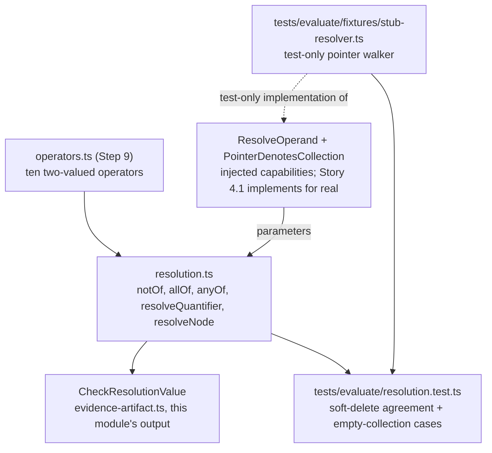
