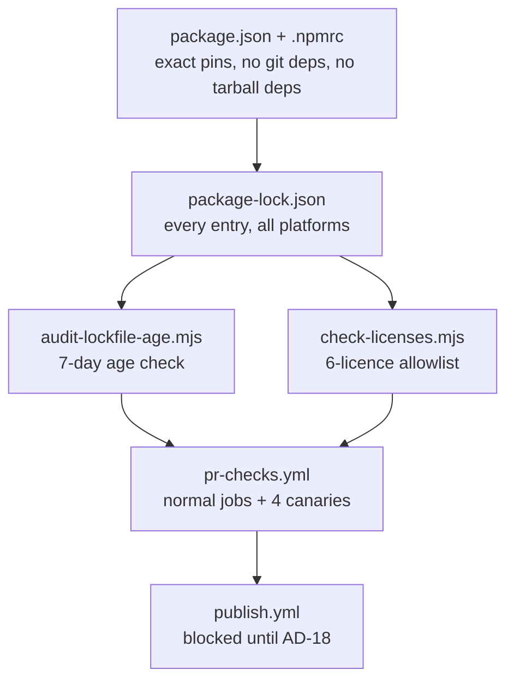
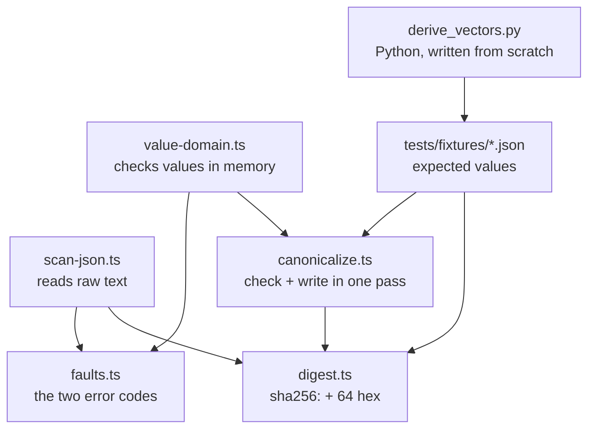

# eval-quality learning path

One step per finished story. Jump to the one you need.
Short version here. The long reasoning lives in the code comments each step points at.

| Step | What it does                                                                     |
| ---: | -------------------------------------------------------------------------------- |
|    1 | Lock down dependencies. Prove the CI gates really block bad ones.                 |
|    2 | One way to turn JSON into bytes, one way to hash it, so two codebases agree.      |

Adding a step: follow `learning-path-template.md`.

## Step 1: dependencies and CI gates

**What:** exact versions in `package.json`, two audit scripts, and a CI job per gate that breaks the
gate on purpose.

**Why:** this repo's supply-chain gates had already failed open twice. A gate that never blocks
anything looks like protection but is not. Everything built later sits on these dependencies.

**Rules:**

- Pin exact versions. No `^`, no `~`. Tools too.
- Keep Vite on 7.x. Vite 8 pulls in `lightningcss`, whose licence is not allowed.
- Both audit scripts read `package-lock.json`, never `node_modules`. The lockfile lists packages for
  every OS; `node_modules` only holds this machine's.
- A package must be 7 days old. npm's own `min-release-age` checks new installs only, so a young
  package already in the lockfile slips past it.
- Six licences allowed: MIT, Apache-2.0, ISC, BSD-2-Clause, BSD-3-Clause, 0BSD.
- Each gate has a canary job that feeds it a bad package and checks the **exact** error, like
  `EALLOWGIT`. Checking only "it failed" would also pass on a typo.
- Publishing stops before anything runs unless a repo variable is set. It stays unset until the
  AD-18 licence question is answered.

**Read in this order:**

1. `package.json` and `.npmrc`: the pins and the four policy lines.
2. `scripts/audit-lockfile-age.mjs` and `scripts/check-licenses.mjs`: short, no dependencies, and
   each says at the top which hole it plugs.
3. `.github/workflows/pr-checks.yml`: normal jobs first, then the four `canary-*` jobs.
4. `.github/workflows/publish.yml` and `scripts/assert-publish-authorized.mjs`: the publish block.
5. `.github/actions/`: two shared actions, so the copies cannot drift apart again.
6. `tsconfig.json` and `tsconfig-build.json`: TypeScript 7.

**Watch out:** the git and remote canary fixtures are real installable packages, because their jobs
run a real `npm ci`. The age and licence fixtures are only read as files, so they just need to be
valid JSON.

**Story:** `_bmad-output/implementation-artifacts/1-1-align-the-toolchain-and-supply-chain-to-the-stack.md`

## Step 2: canonical bytes and digests

**What:** turn any JSON value into one exact byte string, then SHA-256 those bytes.

**Why:** every version number, integrity check, and lineage link in this product is a digest. If our
code and someone else's code turn the same JSON into different bytes, every comparison quietly
breaks. Real example: JavaScript reads `9007199254740993` as `9007199254740992`.

**Rules:**

- Written here, no library. An unchecked hashing library is a supply-chain risk.
- Sort keys by UTF-16 code unit. Emoji sort before some normal letters. Looks wrong, is right.
- Let JavaScript print the numbers. Never hand-roll number formatting.
- Check and write in one pass. Read an object twice and a sneaky object can hand back something else
  the second time. This really happened: a hidden `NaN` came out as `null`.
- Numbers must be finite, and whole numbers stop at 2^53 − 1. Above that JavaScript loses digits.
- Scan the raw text before parsing, and make bad UTF-8 throw. `JSON.parse` rounds big numbers and
  drops duplicate keys without a word; the default decoder swaps bad bytes for `?` and hands you a
  clean hash of wrong data.
- Two error codes only: `non-canonicalizable-value` for a bad value, `schema-parse-failure` for text
  that will not parse.
- A digest is `sha256:` plus 64 hex characters. To combine digests, hash an object with named
  fields. Never glue strings together.
- Expected test values come from a Python script written from scratch. Running our own code and
  saving its output would only prove the code agrees with itself.

**Read in this order:**

1. `tests/fixtures/README.md`: the whole contract, written for someone not using TypeScript.
2. `src/core/schemas/faults.ts`: nine lines.
3. `src/core/canonical/scan-json.ts`: reads raw text, catches what `JSON.parse` hides.
4. `src/core/canonical/value-domain.ts`: same checks for values already in memory.
5. `src/core/canonical/canonicalize.ts`: JSON to bytes.
6. `src/core/canonical/digest.ts`: the five digest functions.
7. `tests/fixtures/derive_vectors.py`: run `python3 tests/fixtures/derive_vectors.py --check`.
8. `tests/canonical/vectors.test.ts`: every fixture runs as its own test.

**Watch out:**

- `src/index.ts` still exports only `VERSION`. Tests import from `src/core/canonical/` directly.
- Only `core/schemas/` and `core/canonical/` exist so far.
- The huge-number branch in `canonicalize.ts` is real code that no valid input can reach. The
  safe-integer rule rejects those numbers first.

**Story:** `_bmad-output/implementation-artifacts/1-2-canonical-digest-computation-and-the-hashed-artifact-value-domain.md`

