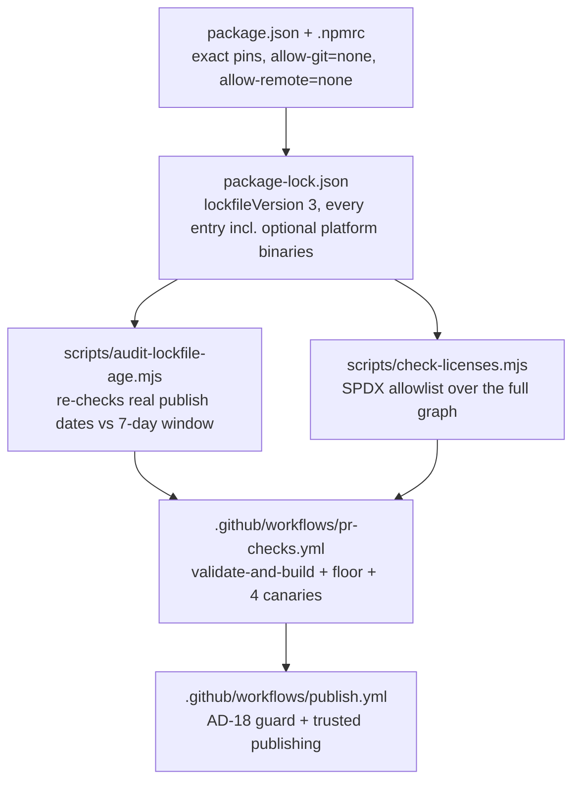
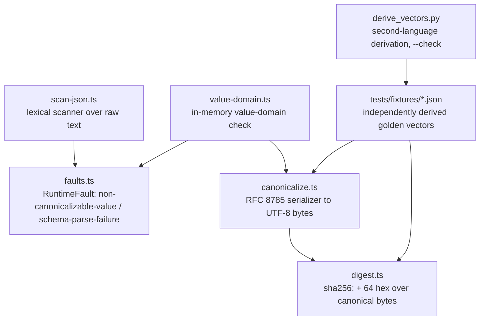

# eval-quality Learning Path (step by step)

Updated: 2026-08-11. Added Step 2 (Canonical digest computation and the hashed-artifact value domain)
for Story 1.2: the in-house RFC 8785 canonicalizer, the two-layer AD-36 value-domain check, the AD-28
fault codes, the digest forms, and the independently derived cross-language golden vectors.

## How to use this

1. Read the project map below.
2. Jump to the step you need. You do not need to read the file from top to bottom.
3. Read the story, then open the files in `Sequence to follow`.
4. Use `Task owner map` when you need the exact code location.

You should be able to get a working understanding of a story from this file alone, without opening
the story document first. The story document is the source of truth for exact wording (acceptance
criteria, task lists); this file is the fast path to "what does this actually do and why."

## The whole project in plain English

| Step | Caveman version                                                                       |
| ---: | ---------------------------------------------------------------------------------------- |
|    1 | Pin every dependency exactly, and make the gates that check that actually fail.          |
|    2 | Write one canonical JSON serializer and one digest rule, so two implementations always hash the same artifact to the same bytes. |

## LLM collaborator prompt

Use this prompt when asking an LLM to improve this document or its matching code comments:

```text
You are improving eval-quality's learning docs and code commentary.

Primary goals:
1) Keep `_bmad-output/project-knowledge/learning-path-step-by-step.md` clear, lean, and teachable.
2) Preserve one standardized section template across numbered steps.
3) Keep the plain-English project map accurate.
4) Make `Task owner map` the main search surface for finding source code.

"Caveman but professional" style:
- Write for a smart engineer who is new to this repository.
- Explain the idea as if drawing it on a whiteboard.
- State the outcome first. Add implementation detail after it.
- Prefer short subject-verb-object sentences.
- Put one main idea in each sentence.
- Use common words. Define necessary jargon once.
- Use concrete examples when a rule is abstract.
- Keep paragraphs short. Prefer lists for sequences and choices.
- Preserve exact paths, contracts, thresholds, failure states, and security rules.
- Keep technical depth in the detailed step. Keep the opening summary simple.
- Do not use childish fragments, slang, marketing language, or vague claims.
- Do not remove a useful explanation only because the same topic has a short summary elsewhere.

Step template rules:
- Every numbered step uses this order:
  `User/business impact`
  `Key takeaways`
  `Story/Task mapping`
  `Story reference`
  `Cross-links`
  `Sequence to follow`
  `Task owner map`
  optional `Current repo note`
  optional `Architecture diagram`
- Do not add `Searchable strings:` or `Pattern summary:` sections.
- Remove a section only when it adds no useful information.

Mermaid rules:
- Open with exactly three backticks plus `mermaid` and close with three backticks.
- Close each diagram before the next heading.
- Parse or render every diagram after editing it.

Task owner map rules:
- Use the heading `Task owner map:` in every numbered step.
- Reuse the exact `Story X Task Y step Z owner` implementation anchor.
- Keep each owner bullet and full file path on one physical line.
- Prefer separate bullets when multiple files matter.

Working style:
- Make small edits. Preserve facts and working explanations.
- Remove fluff and true duplication.
- Run formatting, Markdown, and Mermaid checks after editing.
- Add a new numbered step, and a new row in the project map, once a story's dev-story workflow marks
  it complete - not before, so this file never describes code that does not exist yet.
```

## Step 1 - Toolchain and supply-chain foundation

User/business impact:

Everything downstream in this repo (the contract schema, the brief compiler, the scoring predicates)
inherits whatever dependency graph and CI gates this step establishes. Both of this repo's
supply-chain controls had already failed open twice before this story: the Node floor's bundled npm
silently ignored the age/git policies it was supposed to enforce, and the age policy itself only
filtered new resolutions, never re-checked a young package already sitting in a committed lockfile. A
control that fails open is worse than no control, because it looks like protection. This step closes
both fail-opens with mechanisms that are proven to fail loud, not just written down as policy.

Key takeaways:

1. **Exact pins, not ranges.** Every entry in `package.json` is pinned exact (no `^`/`~`), including
   the toolchain itself (TypeScript, Vitest, Biome, `@types/node`). `overrides.vite` pins Vite to the
   7.x line specifically to keep `lightningcss` (an MPL-2.0 dependency of Vite 8, outside the licence
   allowlist) out of the graph entirely - it is cheaper to pin around a licence problem than to detect
   and fail on it every time.
2. **Two custom audit scripts, both zero-dependency.** `scripts/audit-lockfile-age.mjs` re-checks
   every locked package version's real registry publish date against a 7-day window (closing the
   fail-open where `.npmrc`'s `min-release-age` only filtered resolution, not an already-committed
   lockfile). `scripts/check-licenses.mjs` evaluates every lockfile entry's SPDX licence expression
   against a 6-item allowlist (MIT, Apache-2.0, ISC, BSD-2-Clause, BSD-3-Clause, 0BSD) and reports the
   exact dependency path to any violation. Both read `package-lock.json` directly - never
   `node_modules` - specifically so they see optional platform binaries (e.g. Biome's per-OS CLI
   packages) that are never installed on the runner that happens to be checking them.
3. **A gate that cannot be shown to fail is a gate that fails open.** Every one of these controls has
   a CI job whose entire purpose is proving the control actually blocks the thing it claims to block:
   a young package, a git-based dependency, a remote-tarball dependency, a disallowed licence. Each
   canary asserts failure **for the specific policy reason** (matching real npm error codes like
   `EALLOWGIT`, or a specific line in a script's own output), never a bare nonzero exit code - a
   canary that accepts any failure reason "passes" on a typo'd fixture path just as easily as on a
   real policy block.
4. **Publication is blocked by a mechanism, not a comment.** `publish.yml` opens with a guard step
   that fails before checkout, npm setup, or install, unless a repository variable is explicitly set -
   and that variable stays unset until an unresolved intellectual-property question (AD-18) is
   resolved in writing. `workflow_dispatch` access alone is not the guard.
5. **A committed test does not prove the code works; execution does.** Every claim above (the lock
   entry count, which licences appear in the graph, whether a canary's grep actually distinguishes its
   intended failure from an unrelated one) was checked by actually running the scripts and the
   workflow's shell logic locally against the real lockfile and the fixtures, not inferred from reading
   the code. A peer review after this story's first merge found and fixed several bugs exactly in the
   places nobody had run: a silent no-op triggered only by a path containing a space, and a
   dependency-path resolver that silently lost the path for every scoped package.

Story/Task mapping:

- Story 1.1
- Task 1 (dependency pins), Task 2 (TypeScript 7 migration), Task 3 (CI supply-chain hardening),
  Task 4 (publish.yml hardening), Task 5 (housekeeping verification), Task 6 (prove the whole gate)

Story reference:

- `_bmad-output/implementation-artifacts/1-1-align-the-toolchain-and-supply-chain-to-the-stack.md`

Cross-links:

- Every later story's CI run depends on this step's `pr-checks.yml` jobs passing; there is no earlier
  step to link back to.

Sequence to follow:

1. Read `package.json` and `.npmrc` to see the pinned graph and the four supply-chain policy lines.
2. Read `scripts/audit-lockfile-age.mjs` and `scripts/check-licenses.mjs` - both are short, plain
   `.mjs`, no dependencies, and each has a one-paragraph comment at the top explaining what fail-open
   it closes.
3. Read `.github/workflows/pr-checks.yml` top to bottom: the `validate-and-build` and `floor` jobs run
   the ordinary path, and the four `canary-*` jobs each prove one control can actually fail.
4. Read `.github/workflows/publish.yml` for the AD-18 guard step and the npm trusted-publishing setup
   that replaced a static `NPM_TOKEN` secret.
5. Read `.github/actions/assert-npm-version/action.yml` and
   `.github/actions/audit-lockfile-age/action.yml` - both workflows above call into these instead of
   repeating themselves.

Task owner map:

- Story 1 Task 1 step 1 owner: pin the dependency graph in `package.json`, `.npmrc`, and
  `package-lock.json`
- Story 1 Task 2 step 1 owner: migrate to TypeScript 7 in `tsconfig.json` and `tsconfig-build.json`
- Story 1 Task 3 step 1 owner: audit lockfile publication age in `scripts/audit-lockfile-age.mjs`
- Story 1 Task 3 step 2 owner: audit licence compliance in `scripts/check-licenses.mjs`
- Story 1 Task 3 step 3 owner: wire the ordinary CI path and the four policy canaries in
  `.github/workflows/pr-checks.yml`
- Story 1 Task 3 step 4 owner: share the npm-version assertion and the age audit across jobs in
  `.github/actions/assert-npm-version/action.yml` and `.github/actions/audit-lockfile-age/action.yml`
- Story 1 Task 4 step 1 owner: block publication behind AD-18 and npm trusted publishing in
  `.github/workflows/publish.yml`
- Story 1 Task 4 step 2 owner: close the local-publish bypass in
  `scripts/assert-publish-authorized.mjs`

Current repo note:

- **Fixture packages are not always installable.** `scripts/fixtures/git-canary/` and
  `scripts/fixtures/remote-canary/` are real, `npm ci`-able lockfiles (they have to be, since their
  canaries run a real `npm ci` and check the error). `scripts/fixtures/age-canary/` and
  `scripts/fixtures/licence-canary/` are read directly by the audit scripts and never installed, so
  they only need to be internally consistent JSON, not resolvable on the real registry.
- **The age canary's clock is derived, not hardcoded.** It fetches the fixture package's real publish
  date from the registry at CI run time and pins `--now` to one day after that, so the fixture never
  "ages out" and starts failing for the wrong reason years later.
- **Composite actions exist specifically to prevent drift.** Before they existed, the npm-version pin
  and the age-audit logic were copy-pasted across six and three call sites respectively, and had
  already drifted (one hardcoded a different npm version than the rest) within the same story's first
  review cycle.

Architecture diagram:



## Step 2 - Canonical digest computation and the hashed-artifact value domain

User/business impact:

Every scoring version, sealed-set integrity check, lineage chain, and comparability key in this
product is a digest. If two independent implementations of the digest computation - this repo's
TypeScript and any adopter's own producer written in another language - ever compute different bytes
from the same JSON, every comparison silently becomes incomparable and the whole evidence chain is
worthless. This step exists because that failure is not hypothetical: the literal integer
`9007199254740993` parses in JavaScript as `9007199254740992`, so a conformant producer and a
JavaScript-based scorer can silently disagree on the canonical bytes of the exact same artifact. This
step delivers the one canonicalizer and the one value-domain rule every later schema and scoring stage
depends on, plus a set of language-neutral test vectors so a non-TypeScript implementer is told the
rules rather than discovering them through a mismatch.

Key takeaways:

1. **One canonicalizer, in-house, zero dependencies.** `src/core/canonical/canonicalize.ts`
   implements RFC 8785 (JCS) itself rather than depending on an unaudited npm package - the
   architecture treats an unvetted canonicalization library as a supply-chain risk, not a shortcut.
   The two rules an implementer in any language gets wrong are pinned exactly: numbers render via
   native ECMAScript `Number.prototype.toString` (shortest round-trip digits, never hand-rolled), and
   object keys sort by UTF-16 code unit, never by code point and never through
   `localeCompare`/`Intl`/`.normalize()`. A golden vector proves the difference: the surrogate-pair key
   `😀` sorts before the BMP key `דּ` (U+FB33) because its UTF-16 lead unit `D83D` is numerically
   smaller, even though its Unicode code point is larger.
2. **The numeric value domain is enforced in two separate layers, not one.** A hashed artifact only
   ever admits finite binary64 numbers, with integer values additionally restricted to the
   safe-integer range (|n| ≤ 2^53 − 1). `JSON.parse` cannot be trusted to detect a violation of that
   rule: it silently rounds `9007199254740993` to `9007199254740992` and silently keeps the last of two
   duplicate object keys. This story adds a lexical scanner (`scan-json.ts`) that walks raw JSON text
   itself, comparing unsafe-integer literals on their digits and duplicate keys on their unescaped
   strings, before anything is handed to a parser. A second, in-memory layer (`value-domain.ts`)
   catches the same class of violation in values already built in memory (a `Date`, a `Map`, a cyclic
   object) where there is no raw text left to scan.
3. **Byte-level input decoding must be fatal, not lenient.** When an artifact arrives as raw bytes,
   decoding uses `TextDecoder('utf-8', { fatal: true })`. Node's default, non-fatal decode silently
   replaces an invalid byte sequence with the replacement character U+FFFD - so a producer that
   (incorrectly) writes a lone surrogate as WTF-8 bytes would get those bytes silently repaired and
   digested cleanly, with no error and no evidence anything was wrong. Fatal decoding turns that into a
   `schema-parse-failure` instead of a silent, undetectable divergence.
4. **Exactly two fault codes, and only because they have a real thrower.** `non-canonicalizable-value`
   covers the four value-domain violations (non-finite number, unsafe integer, lone surrogate,
   duplicate key); `schema-parse-failure` covers input that never parses at all (malformed JSON syntax,
   or a fatal UTF-8 decode failure). No other fault code from the architecture's registry is
   pre-declared here - a registry entry with no code path that actually throws it is dead vocabulary,
   and the next story that needs a new code adds it when it has a real thrower.
5. **Digests are always `sha256:` plus 64 lowercase hex, over canonical bytes - never a
   concatenation.** A composite digest (used to bind several other digests together, e.g. a contract
   plus a run) hashes a domain-separated tagged object -
   `{"protocol":"eval-quality/composite/v1", ...named fields}` - never string concatenation, which
   would let two different field splits collide on the same hash. A directory digest is the same idea
   one level up: `{"protocol":"eval-quality/directory/v1","members":{<path>: <digest>}}`, and "ordered
   by path" means the same UTF-16 code-unit order as everything else, which is not the same order
   `git` or a Unix `sort` would produce for a path containing a supplementary-plane character.
6. **A golden vector is only as trustworthy as its independent origin.** Every expected canonical byte
   sequence and digest in `tests/fixtures/` was computed by a second implementation - a committed,
   from-scratch Python script (`tests/fixtures/derive_vectors.py`) that reimplements the same two JCS
   rules independently - and spot-checked by hand with `shasum -a 256`, never by running the TypeScript
   code under test and pasting its output back as the "expected" value. A fixture produced that way
   would only prove the implementation agrees with itself, which is exactly zero evidence against the
   cross-language divergence this whole story exists to prevent.

Story/Task mapping:

- Story 1.2
- Task 1 (typed fault + `core/` scaffold), Task 2 (lexical pre-parse scanner), Task 3 (in-memory
  value-domain validation), Task 4 (RFC 8785 canonicalizer), Task 5 (digest computation), Task 6
  (cross-language vectors and tests), Task 7 (prove the gate)

Story reference:

- `_bmad-output/implementation-artifacts/1-2-canonical-digest-computation-and-the-hashed-artifact-value-domain.md`

Cross-links:

- Builds directly on Step 1's CI gates: the same `pr-checks.yml` `validate-and-build` job now also runs
  this story's 152 tests, and no workflow file changed to make room for them.
- Stories 1.3-1.5 (schema declarations) consume this step's value-domain rule and string-carriage
  convention for large integers and exact decimals; they express in Zod what this step enforces at
  runtime.

Sequence to follow:

1. Read `tests/fixtures/README.md` first - it is written for a non-TypeScript implementer and states
   the whole contract (the two JCS rules, the fault codes, the digest forms, the dead exponent branch)
   without needing the test suite.
2. Read `src/core/schemas/faults.ts` - the entire typed-fault shape is nine lines.
3. Read `src/core/canonical/scan-json.ts` top to bottom - it is a small hand-written recursive-descent
   scanner; the comments at each `domain(...)` and `syntax(...)` call explain which of the two fault
   codes fires and why.
4. Read `src/core/canonical/value-domain.ts` - the in-memory counterpart, same two fault-code split,
   different input shape (JS values instead of raw text).
5. Read `src/core/canonical/canonicalize.ts` - the actual RFC 8785 serializer; note it calls
   `assertHashedArtifactValue` (Task 3) before it ever serializes anything.
6. Read `src/core/canonical/digest.ts` - the four digest functions and the two frozen protocol tag
   constants.
7. Read `tests/fixtures/derive_vectors.py` - the independent second implementation that produced every
   frozen expected value; run `python3 tests/fixtures/derive_vectors.py --check` to see it re-verify
   them.
8. Read `tests/canonical/vectors.test.ts` - it enumerates every fixture vector as its own test, so no
   committed vector goes unexercised.

Task owner map:

- Story 2 Task 1 step 1 owner: define the typed AD-28 fault in `src/core/schemas/faults.ts`
- Story 2 Task 2 step 1 owner: lexical pre-parse scanner (duplicate keys, unsafe integers, lone
  surrogates, fatal UTF-8 decode) in `src/core/canonical/scan-json.ts`
- Story 2 Task 3 step 1 owner: in-memory value-domain validation (non-finite/unsafe numbers, non-plain
  objects, cycles) in `src/core/canonical/value-domain.ts`
- Story 2 Task 4 step 1 owner: the RFC 8785 canonical serializer in `src/core/canonical/canonicalize.ts`
- Story 2 Task 5 step 1 owner: artifact/bytes/composite/directory digest functions in
  `src/core/canonical/digest.ts`
- Story 2 Task 6 step 1 owner: cross-language golden vectors in `tests/fixtures/*.json`
- Story 2 Task 6 step 2 owner: the independent second-language derivation in
  `tests/fixtures/derive_vectors.py`
- Story 2 Task 6 step 3 owner: the fixture contract documentation in `tests/fixtures/README.md`
- Story 2 Task 6 step 4 owner: the parametrized vector test suite in `tests/canonical/vectors.test.ts`

Current repo note:

- **The public barrel is untouched on purpose.** `src/index.ts` still exports only `VERSION`; tests
  import every function in this step directly from its `src/core/canonical/*.ts` path. The published
  library surface is Epic 6's to define, not this story's.
- **`core/` still has no sibling directories.** Only `core/schemas/` and `core/canonical/` exist.
  `compile/`, `seal/`, `ports/`, and the rest of the Structural Seed's tree stay absent until the story
  that owns them creates them - the same restraint Step 1 recorded for Story 1.1.
- **The ≥ 1e21 exponent-rendering branch is real code but unreachable input.** ECMAScript's
  number-to-string renders values ≥ 1e21 in exponent form, and the canonicalizer implements that branch
  faithfully - but no conformant hashed artifact can ever reach it, because every binary64 value of
  that magnitude is integer-valued and therefore already rejected by the safe-integer rule first.
  `tests/fixtures/README.md` states this so nobody spends time chasing a vector for it.

Architecture diagram:


