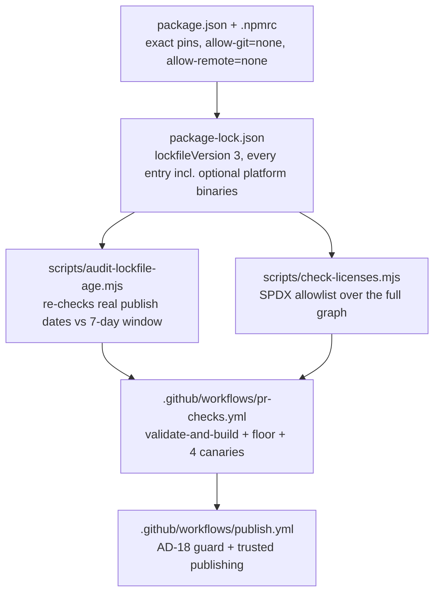

# eval-quality Learning Path (step by step)

Updated: 2026-08-10. Added Step 1 (Toolchain and supply-chain foundation) for Story 1.1: the exact
dependency pins, the two custom CI audit scripts, and the publication guard everything else in this
repo will build on top of.

## How to use this

1. Read the project map below.
2. Jump to the step you need. You do not need to read the file from top to bottom.
3. Read the story, then open the files in `Sequence to follow`.
4. Use `Task owner map` when you need the exact code location.

You should be able to get a working understanding of a story from this file alone, without opening
the story document first. The story document is the source of truth for exact wording (acceptance
criteria, task lists); this file is the fast path to "what does this actually do and why."

## The whole project in plain English

| Step | Caveman version                                                              |
| ---: | ------------------------------------------------------------------------------ |
|    1 | Pin every dependency exactly, and make the gates that check that actually fail. |

## LLM collaborator prompt

Use this prompt when asking an LLM to improve this document or its matching code comments:

```text
You are improving eval-quality's learning docs and code commentary.

Primary goals:
1) Keep `_bmad-output/project-knowledge/learning-path-step-by-step.md` clear, lean, and teachable.
2) Preserve one standardized section template across numbered steps.
3) Keep the plain-English project map accurate.
4) Make `Task owner map` the main search surface for finding source code.

"Caveman but professional" style:
- Write for a smart engineer who is new to this repository.
- Explain the idea as if drawing it on a whiteboard.
- State the outcome first. Add implementation detail after it.
- Prefer short subject-verb-object sentences.
- Put one main idea in each sentence.
- Use common words. Define necessary jargon once.
- Use concrete examples when a rule is abstract.
- Keep paragraphs short. Prefer lists for sequences and choices.
- Preserve exact paths, contracts, thresholds, failure states, and security rules.
- Keep technical depth in the detailed step. Keep the opening summary simple.
- Do not use childish fragments, slang, marketing language, or vague claims.
- Do not remove a useful explanation only because the same topic has a short summary elsewhere.

Step template rules:
- Every numbered step uses this order:
  `User/business impact`
  `Key takeaways`
  `Story/Task mapping`
  `Story reference`
  `Cross-links`
  `Sequence to follow`
  `Task owner map`
  optional `Current repo note`
  optional `Architecture diagram`
- Do not add `Searchable strings:` or `Pattern summary:` sections.
- Remove a section only when it adds no useful information.

Mermaid rules:
- Open with exactly three backticks plus `mermaid` and close with three backticks.
- Close each diagram before the next heading.
- Parse or render every diagram after editing it.

Task owner map rules:
- Use the heading `Task owner map:` in every numbered step.
- Reuse the exact `Story X Task Y step Z owner` implementation anchor.
- Keep each owner bullet and full file path on one physical line.
- Prefer separate bullets when multiple files matter.

Working style:
- Make small edits. Preserve facts and working explanations.
- Remove fluff and true duplication.
- Run formatting, Markdown, and Mermaid checks after editing.
- Add a new numbered step, and a new row in the project map, once a story's dev-story workflow marks
  it complete - not before, so this file never describes code that does not exist yet.
```

## Step 1 - Toolchain and supply-chain foundation

User/business impact:

Everything downstream in this repo (the contract schema, the brief compiler, the scoring predicates)
inherits whatever dependency graph and CI gates this step establishes. Both of this repo's
supply-chain controls had already failed open twice before this story: the Node floor's bundled npm
silently ignored the age/git policies it was supposed to enforce, and the age policy itself only
filtered new resolutions, never re-checked a young package already sitting in a committed lockfile. A
control that fails open is worse than no control, because it looks like protection. This step closes
both fail-opens with mechanisms that are proven to fail loud, not just written down as policy.

Key takeaways:

1. **Exact pins, not ranges.** Every entry in `package.json` is pinned exact (no `^`/`~`), including
   the toolchain itself (TypeScript, Vitest, Biome, `@types/node`). `overrides.vite` pins Vite to the
   7.x line specifically to keep `lightningcss` (an MPL-2.0 dependency of Vite 8, outside the licence
   allowlist) out of the graph entirely - it is cheaper to pin around a licence problem than to detect
   and fail on it every time.
2. **Two custom audit scripts, both zero-dependency.** `scripts/audit-lockfile-age.mjs` re-checks
   every locked package version's real registry publish date against a 7-day window (closing the
   fail-open where `.npmrc`'s `min-release-age` only filtered resolution, not an already-committed
   lockfile). `scripts/check-licenses.mjs` evaluates every lockfile entry's SPDX licence expression
   against a 6-item allowlist (MIT, Apache-2.0, ISC, BSD-2-Clause, BSD-3-Clause, 0BSD) and reports the
   exact dependency path to any violation. Both read `package-lock.json` directly - never
   `node_modules` - specifically so they see optional platform binaries (e.g. Biome's per-OS CLI
   packages) that are never installed on the runner that happens to be checking them.
3. **A gate that cannot be shown to fail is a gate that fails open.** Every one of these controls has
   a CI job whose entire purpose is proving the control actually blocks the thing it claims to block:
   a young package, a git-based dependency, a remote-tarball dependency, a disallowed licence. Each
   canary asserts failure **for the specific policy reason** (matching real npm error codes like
   `EALLOWGIT`, or a specific line in a script's own output), never a bare nonzero exit code - a
   canary that accepts any failure reason "passes" on a typo'd fixture path just as easily as on a
   real policy block.
4. **Publication is blocked by a mechanism, not a comment.** `publish.yml` opens with a guard step
   that fails before checkout, npm setup, or install, unless a repository variable is explicitly set -
   and that variable stays unset until an unresolved intellectual-property question (AD-18) is
   resolved in writing. `workflow_dispatch` access alone is not the guard.
5. **A committed test does not prove the code works; execution does.** Every claim above (the lock
   entry count, which licences appear in the graph, whether a canary's grep actually distinguishes its
   intended failure from an unrelated one) was checked by actually running the scripts and the
   workflow's shell logic locally against the real lockfile and the fixtures, not inferred from reading
   the code. A peer review after this story's first merge found and fixed several bugs exactly in the
   places nobody had run: a silent no-op triggered only by a path containing a space, and a
   dependency-path resolver that silently lost the path for every scoped package.

Story/Task mapping:

- Story 1.1
- Task 1 (dependency pins), Task 2 (TypeScript 7 migration), Task 3 (CI supply-chain hardening),
  Task 4 (publish.yml hardening), Task 5 (housekeeping verification), Task 6 (prove the whole gate)

Story reference:

- `_bmad-output/implementation-artifacts/1-1-align-the-toolchain-and-supply-chain-to-the-stack.md`

Cross-links:

- Every later story's CI run depends on this step's `pr-checks.yml` jobs passing; there is no earlier
  step to link back to.

Sequence to follow:

1. Read `package.json` and `.npmrc` to see the pinned graph and the four supply-chain policy lines.
2. Read `scripts/audit-lockfile-age.mjs` and `scripts/check-licenses.mjs` - both are short, plain
   `.mjs`, no dependencies, and each has a one-paragraph comment at the top explaining what fail-open
   it closes.
3. Read `.github/workflows/pr-checks.yml` top to bottom: the `validate-and-build` and `floor` jobs run
   the ordinary path, and the four `canary-*` jobs each prove one control can actually fail.
4. Read `.github/workflows/publish.yml` for the AD-18 guard step and the npm trusted-publishing setup
   that replaced a static `NPM_TOKEN` secret.
5. Read `.github/actions/assert-npm-version/action.yml` and
   `.github/actions/audit-lockfile-age/action.yml` - both workflows above call into these instead of
   repeating themselves.

Task owner map:

- Story 1 Task 1 step 1 owner: pin the dependency graph in `package.json`, `.npmrc`, and
  `package-lock.json`
- Story 1 Task 2 step 1 owner: migrate to TypeScript 7 in `tsconfig.json` and `tsconfig-build.json`
- Story 1 Task 3 step 1 owner: audit lockfile publication age in `scripts/audit-lockfile-age.mjs`
- Story 1 Task 3 step 2 owner: audit licence compliance in `scripts/check-licenses.mjs`
- Story 1 Task 3 step 3 owner: wire the ordinary CI path and the four policy canaries in
  `.github/workflows/pr-checks.yml`
- Story 1 Task 3 step 4 owner: share the npm-version assertion and the age audit across jobs in
  `.github/actions/assert-npm-version/action.yml` and `.github/actions/audit-lockfile-age/action.yml`
- Story 1 Task 4 step 1 owner: block publication behind AD-18 and npm trusted publishing in
  `.github/workflows/publish.yml`
- Story 1 Task 4 step 2 owner: close the local-publish bypass in
  `scripts/assert-publish-authorized.mjs`

Current repo note:

- **Fixture packages are not always installable.** `scripts/fixtures/git-canary/` and
  `scripts/fixtures/remote-canary/` are real, `npm ci`-able lockfiles (they have to be, since their
  canaries run a real `npm ci` and check the error). `scripts/fixtures/age-canary/` and
  `scripts/fixtures/licence-canary/` are read directly by the audit scripts and never installed, so
  they only need to be internally consistent JSON, not resolvable on the real registry.
- **The age canary's clock is derived, not hardcoded.** It fetches the fixture package's real publish
  date from the registry at CI run time and pins `--now` to one day after that, so the fixture never
  "ages out" and starts failing for the wrong reason years later.
- **Composite actions exist specifically to prevent drift.** Before they existed, the npm-version pin
  and the age-audit logic were copy-pasted across six and three call sites respectively, and had
  already drifted (one hardcoded a different npm version than the rest) within the same story's first
  review cycle.

Architecture diagram:


