# eval-quality learning path

One step per finished story. Jump to the one you need.
Short version here. The long reasoning lives in the code comments each step points at.
`AD-N` below cites decision N in the architecture spine (`ARCHITECTURE-SPINE.md`, grep for the
number); the rule it's attached to is the short version of that decision's reasoning.

**Big picture:** this project builds the artifacts a sealed evaluator needs to grade a system under
test honestly. An author writes a contract stating what to check; this library turns that contract
into a brief telling the evaluator what to compare, without ever showing it the interaction plan (the
step order, the step ids, the scripted call sequence). Sealed on purpose, so the verdict comes from
reasoning over evidence. The library itself never runs anyone: executing
the system under test and the sealed evaluator is the caller's job, shown in the diagram below.
Everything below is one piece of what the library produces: canonical bytes so two codebases agree on
a hash (Step 2), the contract schema (Steps 3 to 5), the prose a sealed evaluator reads in place of
the interaction plan (Steps 6 to 8), and, starting at Step 9, the code that resolves a contract's own
checks against observed evidence to `true`, `false`, or `insufficient-evidence`.

```mermaid
flowchart TD
  AUTHOR(["Contract Author<br/>writes the Eval Contract"])
  CALLER(["The caller<br/>runs a trial: executes the system under test<br/>and the sealed evaluator, supplies the probe port"])
  SUT(["The system under test<br/>performs the interaction plan"])
  JUDGE(["The sealed evaluator<br/>reads only the generated brief,<br/>chooses its own probes, files findings"])
  CI(["CI pipeline<br/>dependency, licence, and schema-drift gates"])
  CONSUMER(["Non-TypeScript consumer<br/>reads schemas/*.schema.json only"])

  subgraph EQ["eval-quality (this library, pure functions only)"]
    LIB["Eval Contract schema, canonical digest,<br/>seal (Step 7), verdict resolution, schema publish"]
  end

  AUTHOR -- writes --> LIB
  CALLER -- "calls: seal, validate, resolve verdict" --> LIB
  LIB -- "Sealed Evaluator Brief" --> JUDGE
  CALLER -- executes --> SUT
  CALLER -- executes --> JUDGE
  JUDGE -- "findings, inside the sealed run record the caller submits" --> LIB
  LIB -- "published schemas/*.schema.json" --> CONSUMER
  CI -- "blocks a bad dependency or a schema-file drift" --> LIB
```

| Step | Epic-Story | What it does                                                                     |
| ---: | :--- | -------------------------------------------------------------------------------- |
|    1 | epic1-story1 | Lock down dependencies. Prove the CI gates really block bad ones.                 |
|    2 | epic1-story2 | One way to turn JSON into bytes, one way to hash it, so two codebases agree.      |
|    3 | epic1-story3 | What a contract author may write down, and what the schema lets through on purpose. |
|    4 | epic1-story4 | The other eleven artifacts, so every file crossing the boundary has a shape.       |
|    5 | epic1-story5 | Publish the schemas as JSON Schema files and prove them equivalent to the Zod source. |
|    6 | epic2-story1 | Turn a declared direction into evaluator prose that names the call without naming the step. |
|    7 | epic2-story2 | Assemble the sealed brief: only what AD-16 permits, everything else sorted or excluded. |
|    8 | epic2-story3 | Catch sequencing prose an author smuggled into free text, after the brief is generated. |
|    9 | epic3-story1 | Ten pure operators over resolved evidence: equality, membership, regex, and shape, fully specified. |
|   10 | epic3-story2 | Connectives, quantifiers, and the empty-collection rule so equivalent spellings agree on empty evidence. |
|   11 | epic3-story3 | `covers-by-key`, the closed vocabulary's one relational operator: a bijection so omission, padding, and extras all fail. |
|   12 | epic4-story1 | The real pointer walk (RFC 6901, `@/`), and the two compile-time checks that catch an unreachable pointer before evaluation. |
|   13 | epic4-story2 | Twelve more AD-5 codes: quantifier substitution, operand-kind legality, the interface inventory, and waiver completeness. |
|   14 | epic4-story3 | The last two stage-one AD-5 codes: a graph predicate over the interaction plan, bounding depth, width, shared anchors, disjoint pairs, and step count. |
|   15 | epic4-story4 | One entry point that runs all 19 checks in a fixed order, one place that awaits, and a script that enforces which layer may import which. |
|   16 | epic5-story1 | Seven yes/no predicates deciding which discipline rules a contract has to satisfy, read from its declarations alone. |
|   17 | epic5-story2 | Seven more predicates asking whether an oracle really reads each place a rule applies, so under-declaring costs coverage. |
|   18 | epic5-story3 | Nineteen hand-written contracts and a generator that emits the published predicate table from the same predicates the library ships. |
|   19 | epic6-story1 | Four ports, three adapters, a default-deny rule for which address a probe may reach, and a suite an outside adapter author can run against their own code. |

Adding a step: follow `learning-path-template.md`.

## Step 1 (epic1-story1): dependencies and CI gates

**What:** exact versions in `package.json`, two audit scripts, and a CI job per gate that breaks the
gate on purpose.

**Why:** this repo's supply-chain gates had already failed open twice. A gate that never blocks
anything protects nothing. Everything built later sits on these dependencies.

**Rules:**

- Pin exact versions. No `^`, no `~`. Tools too.
- Keep Vite on 7.x. Vite 8 pulls in `lightningcss`, whose licence is not allowed.
- Both audit scripts read `package-lock.json`, never `node_modules`. The lockfile lists packages for
  every OS; `node_modules` only holds this machine's.
- A package must be 7 days old. npm's own `min-release-age` checks new installs only, so a young
  package already in the lockfile slips past it.
- Six licences allowed: MIT, Apache-2.0, ISC, BSD-2-Clause, BSD-3-Clause, 0BSD.
- Each gate has a canary job that feeds it a bad package and checks the **exact** error, like
  `EALLOWGIT`. Checking only "it failed" would also pass on a typo.
- Publishing stops before anything runs unless a repo variable is set. It stays unset until the
  AD-18 licence question is answered.

**Read in this order:**

1. `package.json` and `.npmrc`: the pins and the four policy lines.
2. `scripts/audit-lockfile-age.mjs` and `scripts/check-licenses.mjs`: short, no dependencies, and
   each says at the top which hole it plugs.
3. `.github/workflows/pr-checks.yml`: normal jobs first, then the four `canary-*` jobs.
4. `.github/workflows/publish.yml` and `scripts/assert-publish-authorized.mjs`: the publish block.
5. `.github/actions/`: two shared actions, so the copies cannot drift apart again.
6. `tsconfig.json` and `tsconfig-build.json`: TypeScript 7.

**Watch out:** the git and remote canary fixtures are real installable packages, because their jobs
run a real `npm ci`. The age and licence fixtures are only read as files, so they just need to be
valid JSON.

**Story:** `_bmad-output/implementation-artifacts/1-1-align-the-toolchain-and-supply-chain-to-the-stack.md`

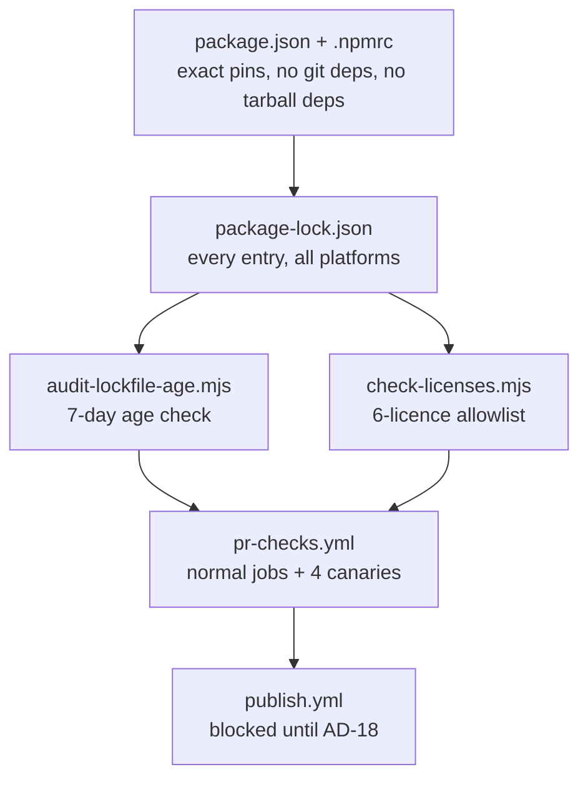
```mermaid
flowchart TD
  PKG["package.json + .npmrc<br/>exact pins, no git deps, no tarball deps"]
  LOCK["package-lock.json<br/>every entry, all platforms"]
  AGE["audit-lockfile-age.mjs<br/>7-day age check"]
  LIC["check-licenses.mjs<br/>6-licence allowlist"]
  PRCHECKS["pr-checks.yml<br/>normal jobs + 4 canaries"]
  PUBLISH["publish.yml<br/>blocked until AD-18"]

  PKG --> LOCK
  LOCK --> AGE
  LOCK --> LIC
  AGE --> PRCHECKS
  LIC --> PRCHECKS
  PRCHECKS --> PUBLISH
```

## Step 2 (epic1-story2): canonical bytes and digests

**What:** turn any JSON value into one exact byte string, then SHA-256 those bytes.

**Why:** every version number, integrity check, and lineage link in this product is a digest. If our
code and someone else's code turn the same JSON into different bytes, every comparison quietly
breaks. Real example: JavaScript reads `9007199254740993` as `9007199254740992`.

**Rules:**

- Written here, no library. An unchecked hashing library is a supply-chain risk.
- Sort keys by UTF-16 code unit. Emoji sort before some normal letters, which looks wrong and is correct.
- Let JavaScript print the numbers. Never hand-roll number formatting.
- Check and write in one pass. Read an object twice and a sneaky object can hand back something else
  the second time. This really happened: a hidden `NaN` came out as `null`.
- Numbers must be finite, and whole numbers stop at 2^53 − 1. Above that JavaScript loses digits.
- Scan the raw text before parsing, and make bad UTF-8 throw. `JSON.parse` rounds big numbers and
  drops duplicate keys without a word; the default decoder swaps bad bytes for `?` and hands you a
  clean hash of wrong data.
- Two error codes only: `non-canonicalizable-value` for a bad value, `schema-parse-failure` for text
  that will not parse.
- A digest is `sha256:` plus 64 hex characters. To combine digests, hash an object with named
  fields. Never glue strings together.
- Expected test values come from a Python script written from scratch. Running our own code and
  saving its output would only prove the code agrees with itself.

**Read in this order:**

1. `tests/fixtures/README.md`: the whole contract, written for someone not using TypeScript.
2. `src/core/schemas/faults.ts`: nine lines.
3. `src/core/canonical/scan-json.ts`: reads raw text, catches what `JSON.parse` hides.
4. `src/core/canonical/value-domain.ts`: same checks for values already in memory.
5. `src/core/canonical/canonicalize.ts`: JSON to bytes.
6. `src/core/canonical/digest.ts`: the five digest functions.
7. `tests/fixtures/derive_vectors.py`: run `python3 tests/fixtures/derive_vectors.py --check`.
8. `tests/canonical/vectors.test.ts`: every fixture runs as its own test.

**Watch out:**

- `src/index.ts` still exports only `VERSION`. Tests import from `src/core/canonical/` directly.
- Only `core/schemas/` and `core/canonical/` exist so far.
- The huge-number branch in `canonicalize.ts` is real code that no valid input can reach. The
  safe-integer rule rejects those numbers first.

**Story:** `_bmad-output/implementation-artifacts/1-2-canonical-digest-computation-and-the-hashed-artifact-value-domain.md`

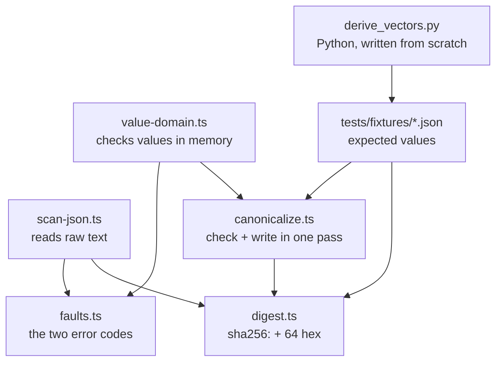
```mermaid
flowchart TD
  SCAN["scan-json.ts<br/>reads raw text"]
  DOMAIN["value-domain.ts<br/>checks values in memory"]
  FAULT["faults.ts<br/>the two error codes"]
  CANON["canonicalize.ts<br/>check + write in one pass"]
  DIGEST["digest.ts<br/>sha256: + 64 hex"]
  FIXTURES["tests/fixtures/*.json<br/>expected values"]
  DERIVE["derive_vectors.py<br/>Python, written from scratch"]

  SCAN --> FAULT
  DOMAIN --> FAULT
  DOMAIN --> CANON
  SCAN --> DIGEST
  CANON --> DIGEST
  DERIVE --> FIXTURES
  FIXTURES --> CANON
  FIXTURES --> DIGEST
```

## Step 3 (epic1-story3): the Eval Contract schema

**What:** the whole Eval Contract written once in Zod: what an author declares, the check expression
grammar, and the plan of interaction steps.

**Why:** every later epic reads these declarations and decides whether a contract is any good. This
step decides what can be said at all. A field missing here is a rule nobody can ever check, and a
shape spelled two ways is two products.

**Rules:**

- If a later epic has an error code for a bad shape, the schema accepts that shape. Rejecting it here
  swaps a named error for a nameless parse failure and deletes a test someone else owes.
- One exception to that rule: operand count is still enforced here. `equality` takes exactly two
  operands, and the schema rejects a third operand itself, without waiting on a later epic's error
  code.
- "Not set" is written `null`, never a missing key. Missing, empty, and filled are three answers.
- Every object is strict. Six maps are keyed by the author's own words; each is named in the code.
- `JsonValue` is the only place the caller's own keys are allowed.
- Three pointer spellings, three regexes: rooted at a step, relative to a quantifier's element, and
  plain into one response descriptor.
- Binding values are tagged, `{"literal": …}` or `{"matcher": "any"}`. The untagged form cannot be
  written down at all.
- Name every shape that is shared or refers to itself. An unnamed one exports as `__schema0`, a
  number that shifts as soon as anything else changes. Never add `.describe()` to a named shape at a
  use site; that wraps it and brings `__schema0` straight back.
- Prefer a plain Zod feature over `.refine()`. Refinements vanish from the published JSON Schema;
  `.describe()` text survives. Whatever a refinement still enforces goes in `constraint-ledger.ts`
  with the exact place to put it back and the JSON Schema version that fix is written for.

**Read in this order:**

1. `src/core/schemas/primitives.ts`: identifiers, digests, dates, and the `JsonValue` container.
2. `src/core/schemas/pointer.ts`: the three spellings and who may use each.
3. `src/core/schemas/expression.ts`: the operand union and the sixteen check forms.
4. `src/core/schemas/interface.ts`: operations, request channels, response descriptors.
5. `src/core/schemas/plan.ts`: a step selects observations; it never gives instructions.
6. `src/core/schemas/eval-contract.ts`: everything above, assembled.
7. `src/core/schemas/constraint-ledger.ts`: what the export cannot carry, as data.
8. `tests/schemas/ad5-admissions.test.ts`: one test per error code, proving the shape still parses.
9. `tests/schemas/fixtures/gate-c-contract.ts`: the only hand-written contract, and the twelve places
   it had to change.

**Watch out:**

- A reject test asserts the exact issue path and code. "It failed" would also pass on a typo.
- The old worked example fails three of its five checks on purpose. Do not repair it.
- `z.record` keyed by an enum demands every member, so the four channels are a plain object.
- `DIGEST_FORM` moved here from `digest.ts`. `core/` may import `core/schemas`, never the reverse.

**Story:** `_bmad-output/implementation-artifacts/1-3-the-eval-contract-schema-declarations-operand-grammar-and-plan-grammar.md`

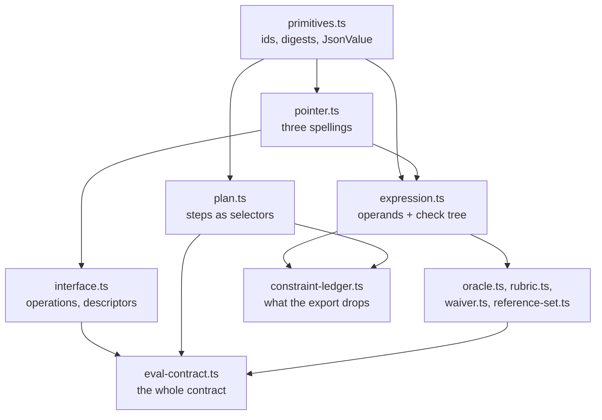
```mermaid
flowchart TD
  PRIM["primitives.ts<br/>ids, digests, JsonValue"]
  PTR["pointer.ts<br/>three spellings"]
  EXPR["expression.ts<br/>operands + check tree"]
  IFACE["interface.ts<br/>operations, descriptors"]
  PLAN["plan.ts<br/>steps as selectors"]
  PARTS["oracle.ts, rubric.ts,<br/>waiver.ts, reference-set.ts"]
  CONTRACT["eval-contract.ts<br/>the whole contract"]
  LEDGER["constraint-ledger.ts<br/>what the export drops"]

  PRIM --> PTR
  PRIM --> EXPR
  PTR --> EXPR
  PTR --> IFACE
  PRIM --> PLAN
  EXPR --> PARTS
  IFACE --> CONTRACT
  PLAN --> CONTRACT
  PARTS --> CONTRACT
  EXPR --> LEDGER
  PLAN --> LEDGER
```

## Step 4 (epic1-story4): the other eleven artifacts

**What:** the remaining eleven interchange artifacts written in Zod, one file each, plus one registry
listing all twelve.

**Why:** step 3 typed the file going in. Everything else crossing the boundary, the run record the
caller sends back, the isolation audit, the scored result, had no shape at all. A field missing here
is a rule a later epic cannot read, and an artifact with no schema is a caller guessing.

**Rules:**

- Twelve artifacts, one closed list, in `artifact.ts`. Nothing generates that list and nothing under
  `core/schemas/` imports it.
- `schemaVersion`, `parentDigest`, and `revisionCount` live in `lineage.ts` and are spread into
  eleven artifacts. Spread, never nested: a spread adds no shared definition to the export.
- `lineage.ts` and `verdict.ts` are leaves on purpose. Put them in `artifact.ts` and the imports form
  a loop that crashes on load with an error naming a file you never edited.
- `ArtifactReference` is the one artifact with no version and no lineage. It sits inside others, so
  versioning it would add a key to every finding for nobody.
- Where the old schema said "if this, then that", the new one is a union of branches. That is why a
  defect finding must quote its evidence and the other two kinds need not.
- Severity, interface kind, and the seven forbidden inputs come from the file that already held
  them. A second copy drifts.
- If a field-level `null` already says "absent", the object under it may not say the same thing
  again with every member null.
- Money is a string everywhere, including the isolation manifest. Seconds stay a number. A ceiling
  that must stay above zero needs its own string format: a plain `number` field can't carry that
  constraint, so typing the ceiling as a number would silently drop the above-zero requirement.
- Every ledger entry names its artifact, because with twelve roots "the root" points at nothing. A
  union at the top has no `properties`, so the resolver reads every branch and gives up if one lacks
  the field.

**Read in this order:**

1. `src/core/schemas/lineage.ts` and `verdict.ts`: two leaves, read them first.
2. `src/core/schemas/artifact-reference.ts`: the smallest union, and the no-lineage exemption.
3. `src/core/schemas/sealed-run-record.ts`: the biggest one, and the finding union.
4. `src/core/schemas/isolation-manifest.ts`: the generated forbidden-input accounting.
5. `src/core/schemas/probe.ts` and `evidence-artifact.ts`: the other two top-level unions.
6. `src/core/schemas/sealed-evaluator-brief.ts`: the one artifact defined by what it keeps out.
7. `src/core/schemas/artifact.ts`: the twelve, as data.
8. `src/core/schemas/constraint-ledger.ts`: addresses now name an artifact.
9. `tests/schemas/artifact-registry.test.ts`: the audits that walk all twelve.
10. `tests/schemas/fixtures/worked-example-artifacts.ts`: the old chain, and its 60 and 19 failures.

**Watch out:**

- The old worked example fails in 79 places. That is the record. Do not repair it.
- `RubricBody` now shows up in the contract's exported definitions. That is deliberate.
- `EvidenceArtifact` is the scored output. `evidenceArtifacts` on a finding is a list of references.
  Two different things one word apart.
- `EvaluatorConfiguration` rejects a `trialIndex` key on purpose, and a test proves the rejection.
  A missing field here is the requirement itself; don't add it back in.
- `responseHeaders` is a name-to-value map while `responseBody` is the open container. A pointer
  reaches into the headers by name, so a bare number there would address nothing; a body may be a
  bare number and still be a body.
- Every fixture is listed in an exported array that a test asserts is complete. A fixture nothing
  imports proves nothing, and one shipped that way before review caught it.
- Eighteen rules are named as unenforced in `ad5-admissions.test.ts`. Most compare two artifacts, and
  one schema cannot see two artifacts at once.

**Story:** `_bmad-output/implementation-artifacts/1-4-the-remaining-interchange-artifact-schemas.md`

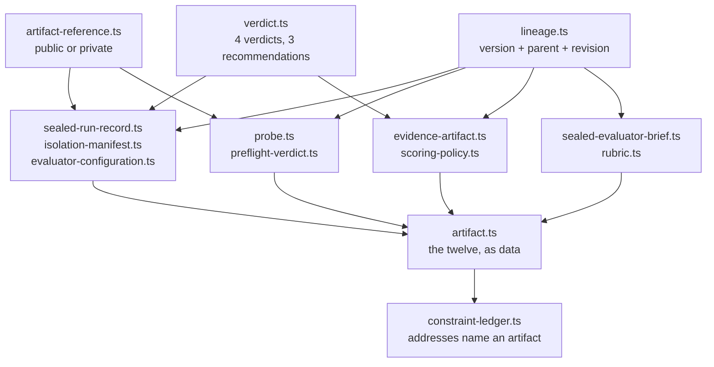
```mermaid
flowchart TD
  LIN["lineage.ts<br/>version + parent + revision"]
  VER["verdict.ts<br/>4 verdicts, 3 recommendations"]
  REF["artifact-reference.ts<br/>public or private"]
  IN["sealed-run-record.ts<br/>isolation-manifest.ts<br/>evaluator-configuration.ts"]
  CORPUS["probe.ts<br/>preflight-verdict.ts"]
  OUT["evidence-artifact.ts<br/>scoring-policy.ts"]
  BRIEF["sealed-evaluator-brief.ts<br/>rubric.ts"]
  REG["artifact.ts<br/>the twelve, as data"]
  LEDGER["constraint-ledger.ts<br/>addresses name an artifact"]

  LIN --> IN
  LIN --> CORPUS
  LIN --> OUT
  LIN --> BRIEF
  VER --> IN
  VER --> OUT
  REF --> IN
  REF --> CORPUS
  IN --> REG
  CORPUS --> REG
  OUT --> REG
  BRIEF --> REG
  REG --> LEDGER
```

## Step 5 (epic1-story5): the published export and its four checks

**What:** twelve committed `schemas/*.schema.json` files built by one pure function, and four checks
that prove them equivalent to the Zod source, constraint by constraint.

**Why:** a non-TypeScript consumer only sees the JSON Schema files. A constraint living only in a
Zod refinement would be invisible to them, and nothing would notice. The four checks make that class
of silence a red build.

**Rules:**

- One builder, `publish.ts`, downstream of everything. Nothing under `core/schemas/` imports it.
- `$id` is a URN, `urn:eval-quality:schema:{key}`. A URL would promise a document nothing serves.
- The constraint ledger drives every injection by its stated address. An address that does not
  resolve throws; it never warns.
- The committed files are pure ASCII, 2-space indent, one trailing newline. The drift check compares
  bytes, so the serialisation is fixed in one shared function.
- The drift check has no `--write`. If it could fix the file it is checking, a broken build would
  get silently patched and pass.
- Four checks, three homes: rejection suite, differential, and mutation sweep are pure and live in
  Vitest; only the byte drift check reads disk, so only it is a script.
- The validator is ajv 8, third-party on purpose: it independently reported the arity hole the
  ledger repairs. `strict` on, `strictTypes` off, `date-time` registered always-true, no ajv-formats.
- The mutant corpus is generated. A hand-written attempt was tried first and measured a kill rate
  of one keyword in ten.
- Unkillable keywords are exempted by computed rule, never by a hand list, and survivors, unreachable,
  and exempt are asserted equal three ways. Measured on this pin: 1,949 occurrences, 168 exempt.
- Pin the counts (occurrences, exempt, survivors) exactly. A floor ("at least N") lets the count
  quietly drop and still pass; only an exact match catches coverage that stopped growing.
- Every gate gets a canary that proves it blocks, for the stated reason.
- `FAILURE_CODES` is parsed against the AD-5 table on every validate, so nobody hand-maintains the
  enumeration beside it.

**Read in this order:**

1. `src/core/schemas/publish.ts`: the builder, the injection, the serialiser.
2. `scripts/generate-schemas.ts` and `scripts/check-schemas.ts`: the writer and the byte gate.
3. `src/core/failure-codes.ts` and `scripts/check-ad5-registry.ts`: the AD-5 binding.
4. `tests/schemas/publish.test.ts`: `$id`, `$defs` naming, the loud failures.
5. `tests/schemas/published/keyword-occurrences.ts`: what counts as a keyword, and the exemption rule.
6. `tests/schemas/published/mutant-generator.ts`: the schema-directed corpus.
7. `tests/schemas/published/differential.test.ts` and `keyword-mutation.test.ts`: checks three and four.

**Watch out:** ajv anchors a reported `schemaPath` to the `$defs` entry where the error occurred.
Zod exports `type` beside every `const` and `enum`, which makes those `type`s undeletable-by-proof
and therefore exempt. Deleting an injected arity keyword makes ajv strict refuse to compile, which
the sweep tracks as its own outcome, separate from a pass.

**Story:** `_bmad-output/implementation-artifacts/1-5-the-published-json-schema-export-and-its-four-ci-checks.md`

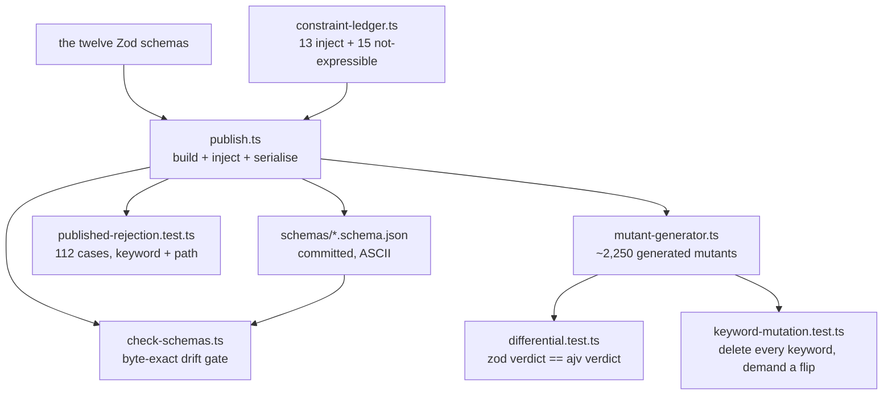
```mermaid
flowchart TD
  ZOD["the twelve Zod schemas"]
  LEDGER["constraint-ledger.ts<br/>13 inject + 15 not-expressible"]
  PUB["publish.ts<br/>build + inject + serialise"]
  FILES["schemas/*.schema.json<br/>committed, ASCII"]
  DRIFT["check-schemas.ts<br/>byte-exact drift gate"]
  REJ["published-rejection.test.ts<br/>112 cases, keyword + path"]
  GEN["mutant-generator.ts<br/>~2,250 generated mutants"]
  DIFF["differential.test.ts<br/>zod verdict == ajv verdict"]
  SWEEP["keyword-mutation.test.ts<br/>delete every keyword, demand a flip"]

  ZOD --> PUB
  LEDGER --> PUB
  PUB --> FILES
  PUB --> DRIFT
  FILES --> DRIFT
  PUB --> REJ
  PUB --> GEN
  GEN --> DIFF
  GEN --> SWEEP
```

## Step 6 (epic2-story1): the direction-prose generator

**What:** turn one oracle's declared direction (evidence targets, relation, polarity, scope, negative
domain) into the prose that becomes a `BriefDirection`'s `text`.

**Why:** the sealed evaluator never sees the interaction plan or a step's identifier, only this
prose. It has to say which call an evidence target came from without naming the step. Two
observations of one operation that render the same sentence are indistinguishable to it. Real
example: "the id value you sent to the create endpoint, compared with its id field from the read
endpoint, is asserted to be equal" names two calls and what to compare between them, and names no
step.

**Rules:**

- A pointer resolves to a phrase, never to a step id.
- The channel decides whether the phrase says obtained or sent. Drop it and O-001's two targets read
  alike.
- A malformed input always says so. That is AD-16's own worked example.
- Two steps that would render the same phrase escalate through a fixed ladder: generic, then the
  binding's kind, then its literal value, then a method and path description.
- A temporal read-back pair renders as one relational phrase. Rendering each side on its own and
  joining them puts the two steps in an order the evaluator can read off.
- Five relation-template families: quantifiers, connectives, presence, comparison, and the six
  remaining structural operators. `not` gets its own skeleton; a shared affirmative one tells the
  evaluator the opposite of the declared claim.
- `scope` and `negativeDomain` are author text. The generator frames them in a sentence and never
  splits or reorders them. `null` drops the clause; it never prints the word.
- Determinism is proven by permutation. A repeat call cannot catch a tie-break that is stable within
  one process.

**Read in this order:**

1. `src/core/seal/plan-index.ts`: resolves a pointer to its step and operation. Nothing about
   reachability; that is Epic 4's.
2. `src/core/seal/derived-reference.ts`: the phrase vocabulary, the escalation ladder, and the
   temporal-pair grouping.
3. `src/core/seal/direction-prose.ts`: the five relation families, assembled into one string.
4. `tests/schemas/fixtures/gate-c-contract.ts`: the primary fixture, already in the tree.
5. `tests/seal/fixtures.ts`: what Gate C does not carry, including the Gate D reconstruction and the
   create-then-read-back pair.

**Watch out:**

- The ladder's fourth rung is computed from the shared operation, so every sibling on that operation
  gets the same text and it can never break a tie. Reaching it throws.
- `response-body`, `stdout` and `stderr` all render `its {field} field`, and a `call-inputs` pointer
  carrying a tail drops its transport channel, so two different targets can still read alike. Both
  are open findings on story 2.1.
- The suite is green and does not prove the rules above. Mutating the sent-versus-obtained wording,
  the pair order, the binding-key sort and the clause order each leaves all 63 tests passing.
- `gateCContract` is declared `satisfies EvalContract`, and the type TypeScript infers for it
  afterward does not assign to `PermittedInterface[]`. `tests/seal/fixtures.ts` casts once through
  `unknown`; `z.array(PermittedInterface).parse` gives the same type and validates.

**Story:** `_bmad-output/implementation-artifacts/2-1-the-direction-prose-generator.md`

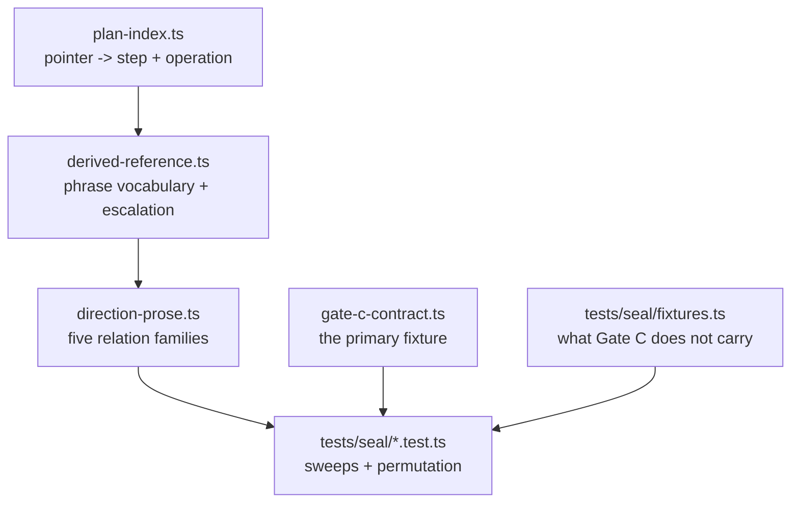
```mermaid
flowchart TD
  PLANIDX["plan-index.ts<br/>pointer -> step + operation"]
  DERIVED["derived-reference.ts<br/>phrase vocabulary + escalation"]
  PROSE["direction-prose.ts<br/>five relation families"]
  GATEC["gate-c-contract.ts<br/>the primary fixture"]
  SEALFIX["tests/seal/fixtures.ts<br/>what Gate C does not carry"]
  TESTS["tests/seal/*.test.ts<br/>sweeps + permutation"]

  PLANIDX --> DERIVED
  DERIVED --> PROSE
  PROSE --> TESTS
  GATEC --> TESTS
  SEALFIX --> TESTS
```

## Step 7 (epic2-story2): brief assembly, exclusions, and canonical ordering

**What:** `seal(contract)` walks every oracle, renders one `BriefDirection` per oracle using Step 6's
prose generator, then assembles the `SealedEvaluatorBrief`: only the fields AD-16 permits, with
unordered arrays sorted to a fixed key.

**Why:** Step 6 renders one oracle's prose. Nothing yet walked a whole contract and produced the
artifact the evaluator actually reads. Most of the brief's content must come out byte-identical no
matter how the contract's arrays were declared; `behaviors` and `contractDigest` are the two
deliberate exceptions, covered below.

**Rules:**

- Assemble only what `SealedEvaluatorBrief` declares. It is `strictObject`, so excluding commentary,
  the interaction plan, and every step identifier is structural: the type has no slot for them.
  Nobody has to remember to filter them out.
- `permittedInterfaces` is a per-element map: it drops each interface's operation inventory before
  the brief sees it. Only the interface's identity crosses.
- Four fields have no meaningful order in the contract (`directions`, `permittedInterfaces`,
  `scopedResources`, `safetyLimits`): sort each by its natural key. A duplicate key throws. Sort
  stability is not a guarantee, so byte-identity cannot lean on it.
- `behaviors` is the one array kept in contract order. Its order is meaningful, so it is not folded
  into the sort rule above.
- `contractDigest` hashes the literal input, so reordering the contract's arrays legitimately changes
  it even though the rest of the brief stays byte-identical. Lineage sits outside the guarantee for
  the same reason: it is not derived from array content at all.
- `negativeDomain`'s own "canonical sorted order" language is satisfied vacuously: one string, one
  member, nothing to sort. Closed here: no invented structure needed to make the sort mean anything.
- Copy `behaviors` and `budgets` in. Do not alias them to the source contract, or a caller mutating
  the contract after `seal()` returns would silently mutate the "sealed" brief too.

**Read in this order:**

1. `src/core/seal/seal.ts`: the whole function.
2. `src/core/schemas/sealed-evaluator-brief.ts`: what the brief is allowed to carry.
3. `src/core/schemas/interface.ts`: why `permittedInterfaces` needs a per-element map.
4. `tests/seal/seal.test.ts`: the sort, duplicate-key, reorder, and reject-fixture tests.

**Watch out:** a test that hashes or diffs the whole brief object across reorderings will never pass;
only the content fields are asserted byte-identical, `contractDigest` is not one of them.
Forbidden-input exclusion here comes from the schema's `strictObject` shape. `seal()` performs no
such check itself.

**Story:** `_bmad-output/implementation-artifacts/spec-2-2-brief-assembly-exclusions-and-canonical-ordering.md`

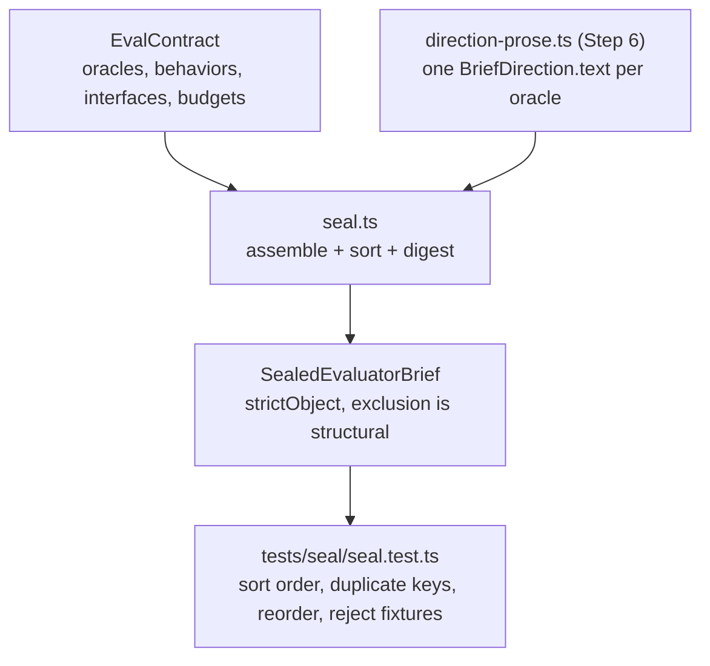
```mermaid
flowchart TD
  CONTRACT["EvalContract<br/>oracles, behaviors, interfaces, budgets"]
  PROSE["direction-prose.ts (Step 6)<br/>one BriefDirection.text per oracle"]
  SEAL["seal.ts<br/>assemble + sort + digest"]
  BRIEF["SealedEvaluatorBrief<br/>strictObject, exclusion is structural"]
  TESTS["tests/seal/seal.test.ts<br/>sort order, duplicate keys, reorder, reject fixtures"]

  CONTRACT --> SEAL
  PROSE --> SEAL
  SEAL --> BRIEF
  BRIEF --> TESTS
```

## Step 8 (epic2-story3): the emitted-brief scripting audit

**What:** a pure function, `auditBriefScripting`, that reads an already-assembled `SealedEvaluatorBrief`
and throws if any one direction's generated `text` carries more sequencing/transition markers than the
contract's declared `probeStepBound`.

**Why:** the declaration-side graph predicate over the interaction plan (a later epic) reads the plan
structure; it never reads generated prose. An author's own free `scope`/`negativeDomain` text is the one
channel that can still smuggle a scripted "do this, then this" sequence past that predicate, since Step
6's own generator never emits that vocabulary itself. This audit runs after generation, over the
finished brief, to catch exactly that.

**Rules:**

- `probeStepBound: null` means no bound was declared; the audit passes vacuously. `0` is a legal, strict
  bound: no marker of any kind is permitted.
- The bound applies per direction, never summed across the brief. An enumerated path is something a
  reader reconstructs from one direction's own narrated claim.
- The marker set: `then`, `before`, `after`, `subsequently`, `next`, `finally`, `afterward` (and
  `afterwards`), plus a numbered-list marker (`1.`, `2)`, ...), case-insensitive and whole-word.
- A numbered-list marker only counts inside real list context: it has to open a line, follow a
  newline, or follow a sentence-ending mark plus a space. That anchor keeps ordinary numeric prose
  like "Rule 12." from counting as a step.
- Bare ordinals (`first`, `second`, ...) are excluded on purpose: `gateCContract`'s own shipped "not the
  first" already uses "first" as a position word, in accepted author prose.
- Only `directions[].text` is scanned, never `behaviors`, `scopedResources`, or `safetyLimits`. Widening
  that scan is a flagged, deferred judgment call for a later story.
- It throws `StructuralFailure`, a compile-time-class failure carrying an AD-5 code (the twenty-first
  the registry now carries).
- Which direction's failure surfaces first, when more than one violates, is only as deterministic as
  `directions`' own array order; the audit does not hunt for every violation in one pass.

**Read in this order:**

1. `src/core/failure-codes.ts`: the twenty-one-code tuple and the new `StructuralFailure` class beside it.
2. `src/core/seal/scripting-audit.ts`: the marker pattern, the per-direction count, the throw.
3. `tests/seal/scripting-audit.test.ts`: the accept/reject fixtures and the permutation test.

**Watch out:** the story's own regression fixture cites "O-004" for the "not the first" text; that text
is actually O-005's `scope` in `tests/schemas/fixtures/gate-c-contract.ts`, and the test targets O-005
directly.

**Story:** `_bmad-output/implementation-artifacts/2-3-the-emitted-brief-scripting-audit.md`

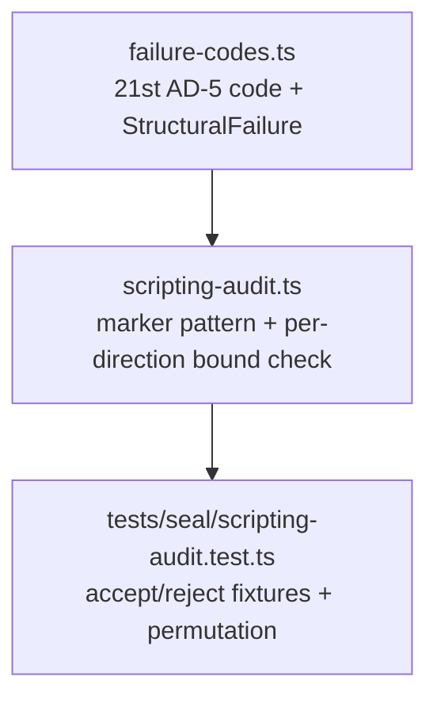
```mermaid
flowchart TD
  CODES["failure-codes.ts<br/>21st AD-5 code + StructuralFailure"]
  AUDIT["scripting-audit.ts<br/>marker pattern + per-direction bound check"]
  TESTS["tests/seal/scripting-audit.test.ts<br/>accept/reject fixtures + permutation"]

  CODES --> AUDIT
  AUDIT --> TESTS
```

## Step 9 (epic3-story1): scalar operators over the evidence domain

**What:** ten pure functions (`equality`, `deepEquality`, `containment`, `existence`, `absence`,
`regexMatch`, `setMembership`, `ordering`, `countTolerance`, `shape`), each taking already-resolved
evidence values and returning a plain `boolean`.

**Why:** two implementations of one oracle's `check` must land on the same answer for every node, or
the scoring model can't be trusted. This step nails that down operator by operator: what counts as
equal, what counts as contained, what a regex match-step budget actually bounds. Real example:
compare `9007199254740993` against an ordinary number and it just resolves `false`, the same as any
other wrong answer, never a crash. Only comparing two objects or two arrays ever risks one. That
keeps a broken system under test's bad number from crashing the whole run.

**Rules:**

- Every operator takes a `ResolvedValue` (`JsonValue | ABSENT`), never a `{pointer}`/`{literal}`/
  `{referenceSet}` operand. Resolving those is a later epic's job.
- `ABSENT` is a unique symbol, never `null`. `existence` reads false against it, `absence` true, and
  every comparison false, even absent-against-absent.
- `equality` reaches structural comparison (`digestArtifact`) only when both operands are the same
  compound kind. Every other input, including a domain-violating scalar, resolves without ever
  canonicalizing. `deepEquality` is unconditionally structural, so it can throw
  `non-canonicalizable-value` where `equality` on the same inputs would just resolve `false`.
- `regexMatch`'s step budget is a static two-tier gate, never a live step count: reject any
  nested-quantifier shape outright, then bound a linear, character-class-aware estimate against the
  declared budget.
- Strip escaped characters before stripping character classes. Getting that order backward once let
  an escaped bracket hide a real nested-quantifier group from both gate tiers, and the regex hung with
  no fault thrown.
- `shape`'s closed set is `permittedKeys` alone: a required key missing from it makes the descriptor
  unsatisfiable.
- `ordering`, `countTolerance`, and any operand that may denote a collection resolve `false` on a bare
  `ABSENT`. That answer is correct only when the operand is not itself declared collection-typed; the
  next story's wrapper handles the other case.
- Every function's last parameter is `artifactPath: string`, even on the five that never throw (named
  `_artifactPath`), so every operator shares one calling convention.

**Read in this order:**

1. `src/core/evaluate/resolved-value.ts`: the `ABSENT` sentinel and `ResolvedValue`.
2. `src/core/evaluate/operators.ts`: the ten functions.
3. `src/core/schemas/scoring-policy.ts`: `regexMatchStepBudget`, the field `regexMatch` reads.
4. `src/core/schemas/faults.ts`: the two new runtime fault codes, `RUNTIME_FAULT_CODES`.
5. `tests/evaluate/operators.test.ts`: every operator's accept, reject, and absent-operand case.

**Watch out:**

- This story's ten operators are two-valued. Three-valued `insufficient-evidence` resolution, the
  connectives, and the quantifiers are the next story's; nothing here decides that value.
- `RUNTIME_FAULT_CODES` is not a full AD-28 mirror the way `FAILURE_CODES` mirrors AD-5: it only lists
  codes with a genuine thrower, four of AD-28's ten rows. Nothing automates a cross-check against the
  spine table yet.
- The budget gate still can't see everything: a quantified overlapping alternation like `(?:a|a)+`
  passes both tiers and can still hang. Catching it needs a real parser, so it's left as a named gap.
  The default budget is 1,000,000, so ordinary-length evidence text doesn't fault on length alone, but
  that also means the linear tier does almost no real work day to day; the structural
  nested-quantifier check above is the actual backstop.

**Story:** `_bmad-output/implementation-artifacts/3-1-scalar-operators-over-the-evidence-domain.md`

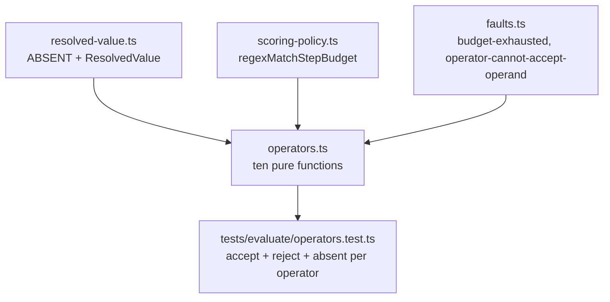
```mermaid
flowchart TD
  RESOLVED["resolved-value.ts<br/>ABSENT + ResolvedValue"]
  OPS["operators.ts<br/>ten pure functions"]
  POLICY["scoring-policy.ts<br/>regexMatchStepBudget"]
  FAULTS["faults.ts<br/>budget-exhausted, operator-cannot-accept-operand"]
  TESTS["tests/evaluate/operators.test.ts<br/>accept + reject + absent per operator"]

  RESOLVED --> OPS
  POLICY --> OPS
  FAULTS --> OPS
  OPS --> TESTS
```

## Step 10 (epic3-story2): connectives, quantifiers, and three-valued resolution

**What:** `resolveCheck`, the tree-walker that turns an `Expression` into a `CheckResolutionValue`:
`notOf`/`allOf`/`anyOf` for the three connectives, `resolveQuantifier` for `for-all`/`for-any`, and one
uniform empty-collection check applied before every leaf operator runs.

**Why:** Story 3.1's ten operators only decide one node. The soft-delete pair is why three-valued
resolution exists: `for-all(page, absence(@/retractedAt))` and
`not(for-any(page, existence(@/retractedAt)))` say the same thing, and over an empty page one used to
certify while the other failed closed. Both now resolve `insufficient-evidence`, so an empty
collection never reads as a clean pass.

**Rules:**

- The empty-collection check runs on every operand of every operator, including a `{ literal: [] }`
  one: there is no spelling in this grammar for "this may legitimately be empty."
- `all` keeps a genuine `false` decisive even next to an `insufficient-evidence` sibling. `any` is
  weaker than plain OR: one `insufficient-evidence` sibling beats a `true` one.
- `not(insufficient-evidence)` is `insufficient-evidence`, under both polarities.
- A quantifier's `collection` is collection-typed by definition: `ABSENT`, or a non-array type
  mismatch, both resolve `insufficient-evidence`, never a thrown fault.
- A node that resolves `insufficient-evidence` by folding its children, not by tripping the condition
  itself, carries `introductionCondition: null`. The child that actually tripped it still carries the
  condition, one level down.
- `boundElement` is `ABSENT` outside any quantifier, never `null`: a bound element can legitimately be
  JSON `null` itself, and only a third value tells the two apart.
- `covers-by-key` had no operator at this point; that branch threw a plain `Error` naming Story 3.3.
  Story 3.3 (Step 11) fills it in.
- Real pointer resolution, including `@/`, is not built here: `ResolveOperand` and
  `PointerDenotesCollection` are the two capabilities this module takes as parameters instead.

**Read in this order:**

1. `src/core/schemas/evidence-artifact.ts`: `CheckResolutionValue`, the shape this whole module
   produces.
2. `src/core/evaluate/resolution.ts`: `operandDenotesEmptyCollection`, `notOf`/`allOf`/`anyOf`,
   `resolveQuantifier`, `resolveNode`, `resolveCheck`.
3. `tests/evaluate/fixtures/stub-resolver.ts`: the test-only pointer walker these tests resolve
   against; never shipped from `src/`.
4. `tests/evaluate/resolution.test.ts`: the soft-delete three-way agreement, the empty-collection
   cases, and every RuntimeFault-propagates-through-a-connective case.

**Watch out:**

- This step never reads `polarity` and never produces an `OutcomeState`. `abstained` and the rest of
  AD-6's states are score-side, a later epic.
- The stub resolver in the tests is deliberately small and ad hoc. It is not a preview of Story 4.1's
  real addressing grammar and is not asserted to match it beyond what these fixtures need.

**Story:** `_bmad-output/implementation-artifacts/3-2-connectives-quantifiers-and-three-valued-resolution.md`

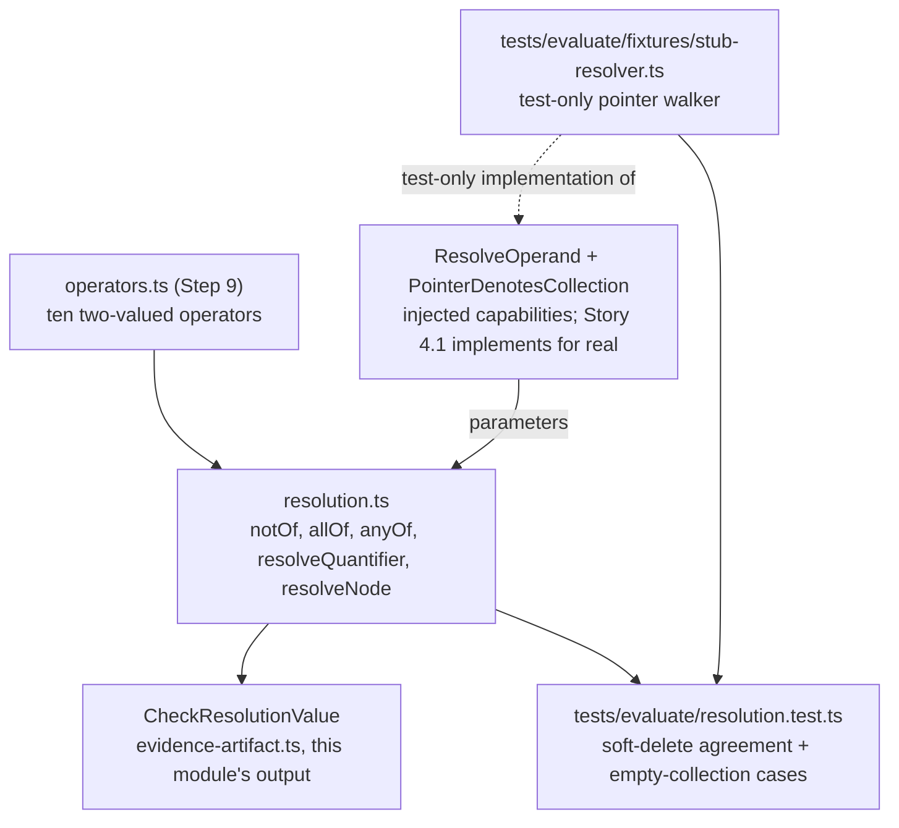
```mermaid
flowchart TD
  OPS["operators.ts (Step 9)<br/>ten two-valued operators"]
  CAP["ResolveOperand + PointerDenotesCollection<br/>injected capabilities; Story 4.1 implements for real"]
  RES["resolution.ts<br/>notOf, allOf, anyOf, resolveQuantifier, resolveNode"]
  OUT["CheckResolutionValue<br/>evidence-artifact.ts, this module's output"]
  STUB["tests/evaluate/fixtures/stub-resolver.ts<br/>test-only pointer walker"]
  TESTS["tests/evaluate/resolution.test.ts<br/>soft-delete agreement + empty-collection cases"]

  OPS --> RES
  CAP -- parameters --> RES
  RES --> OUT
  STUB -. test-only implementation of .-> CAP
  STUB --> TESTS
  RES --> TESTS
```

## Step 11 (epic3-story3): covers-by-key, the last operator

**What:** `coversByKey`, the closed vocabulary's eleventh and final operator: a bijection between a
contract-declared `expected` reference set and an observed `actual` collection, matched on named keys.
Plus the real `resolveNode` dispatch branch that replaces Step 10's throwing stub.

**Why:** AD-20's completeness rule needed to catch three failure shapes in one check: a response
omitting a seeded record, one padded with duplicates to fake the right count, and one carrying
unexpected extras. An injection alone catches omission only. The historical `[n-1, n-1, n-1]` bug
(padding one record to hide two missing ones) is why this has to be a true bijection, not the weaker
check an earlier spine revision first stated.

**Rules:**

- Cardinality is never checked separately. `actualByKey` starts with exactly one entry per `actual`
  element, including a synthetic slot for one missing its key, so `actualByKey.size === 0` after the
  match loop already means every `actual` element got claimed: the whole bijection condition, not an
  approximation of it.
- `ABSENT` on either operand resolves `false`, not `insufficient-evidence`: the one AD-4 exception to
  Step 10's general empty-collection rule, stated explicitly for this operator because a wholly missing
  collection is a detected defect, not an empty examination.
- Only a genuinely empty array (both operands present, one or both length zero) trips the ordinary
  `insufficient-evidence` path, and `resolveNode` intercepts that before `coversByKey` ever runs.
- A non-array `actual` resolves `false` inside `coversByKey` itself, the same type-mismatch rule every
  other operator already applies.
- A duplicate `actualKey` value resolves `false` the moment a second element claims an
  already-populated map entry. A duplicate `expectedKey` value is assumed compile-time-prevented but
  fails the same way if it ever occurs.
- An `expected` element missing its named key fails its own lookup directly, no dedicated branch needed.
  An `actual` element missing its named key still claims a slot in the match index, a synthetic
  un-claimable one, so a keyless extra row counts against cardinality instead of vanishing from it.
- The dispatch branch's three special cases fire in a fixed order: the `expected`-operand
  array-narrowing guard first (a resolver bug, not a data outcome), then `ABSENT`/malformed-`actual` as
  a decisive `false`, then genuine emptiness last. A higher tier always outranks a lower one on the
  other operand.

**Read in this order:**

1. `src/core/evaluate/operators.ts`: `keyValueOf`, `coversByKey`.
2. `src/core/evaluate/resolution.ts`: `resolveCoversByKeyNode`, one entry in the `operatorHandlers`
   dispatch table `resolveNode` looks up by `op` (this story also replaced the whole file's switch with
   that table; every other operator moved into its own same-shaped handler alongside it).
3. `tests/schemas/fixtures/relevance-contracts.ts`: `populatedContract`'s O-001, the one real
   `covers-by-key` check tree this story's dispatch fixtures reuse.
4. `tests/evaluate/operators.test.ts`: `coversByKey`'s own positive, missing, duplicate, unexpected,
   duplicate-key, and empty-set cases.
5. `tests/evaluate/resolution.test.ts`: the same six cases at dispatch level, plus the guard and the
   three-tier precedence fixtures.

**Watch out:**

- `coversByKey([], [], ...)` returns `true` on its own: a vacuous bijection is a correct pure-function
  answer with no `insufficient-evidence` to return. Only `resolveNode`'s dispatch wraps that same case
  as `insufficient-evidence`. Both are stated side by side in their own test files so neither reads as
  contradicting the other.
- `operatorHandlers` is a plain object, so it inherits `Object.prototype`; `resolveNode` checks
  `Object.hasOwn` before the lookup so `op: 'constructor'` still throws instead of silently resolving
  to `Object` itself.

**Story:** `_bmad-output/implementation-artifacts/3-3-covers-by-key-as-a-bijection.md`

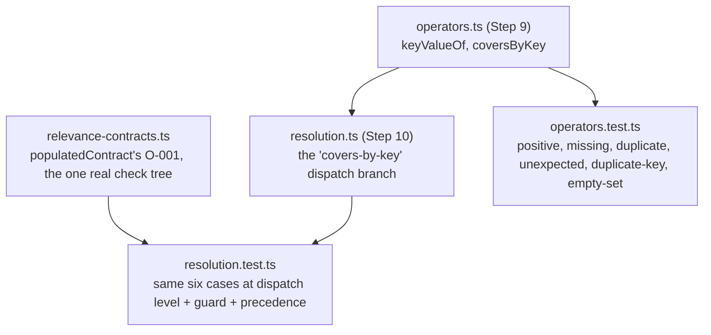
```mermaid
flowchart TD
  OPS["operators.ts (Step 9)<br/>keyValueOf, coversByKey"]
  RES["resolution.ts (Step 10)<br/>the 'covers-by-key' dispatch branch"]
  FIX["relevance-contracts.ts<br/>populatedContract's O-001, the one real check tree"]
  OPTESTS["operators.test.ts<br/>positive, missing, duplicate, unexpected, duplicate-key, empty-set"]
  RESTESTS["resolution.test.ts<br/>same six cases at dispatch level + guard + precedence"]

  OPS --> RES
  FIX --> RESTESTS
  OPS --> OPTESTS
  RES --> RESTESTS
```

## Step 12 (epic4-story1): pointer resolution and reachability

**What:** the real `ResolveOperand`/`PointerDenotesCollection` pair (`makeResolveOperand`,
`makePointerDenotesCollection`), replacing Step 10's test-only stub, plus two compile-time checks
(`checkBoundElementScope`, `checkEvidenceReachability`) that catch an unreachable or misplaced pointer
before a sealed evaluator ever runs.

**Why:** Step 10 took pointer resolution as an injected capability and never built it. This step is
that build: one walk of RFC 6901 tails, including the bound-element `@/` form, shared by the runtime
resolver and, through the same array-index grammar, the compile-time reachability check. Both now read
one oracle's `check` expression identically, which is this story's whole point.

**Rules:**

- One walk, `walkTail`, and `plan-index.ts`'s own `decodeToken`/`decodeTail` are exported rather than
  copied, so the interaction pointer's tail and a declared collection location's own pointer decode the
  same way.
- Bare `@/` needs its own decode path, `decodeBoundElementTail`: feeding `pointer.slice(1)` straight into
  `decodeTail` produces one empty-string token instead of zero, and would look up the wrong key.
- Every map lookup (`referenceSets`, `stepObservations`) guards with `Object.hasOwn` before indexing.
  `constructor` is a legal identifier, and a plain index on a missing key silently returns
  `Object.prototype.constructor` instead of `ABSENT`.
- Reachability checks `requiredKeys ∪ permittedKeys`, never `permittedKeys` alone, so an already-accepted
  authoring gap (permitted keys not covering required ones) can't reject a field the descriptor's own
  required list already promises.
- A field the descriptor declares a definite scalar type blocks further descent; an undeclared or
  type-not-stated field stays permissive, since nothing rules descent out.
- `stdout`/`stderr` reject any non-empty tail outright: the schema types both as bare strings
  unconditionally, so a tail into either is provably always absent, not merely unchecked.
- Both checks throw on the first violation and name the exact operand position
  (`.check.predicate.operands[0]`), matching the one existing `StructuralFailure` thrower's fail-fast shape.
- `@/` outside any quantifier's predicate fails the same code a reference-set operand outside its three
  legal positions already uses: no dedicated AD-5 code exists for it, and the two are the same shape.

**Read in this order:**

1. `src/core/seal/plan-index.ts`: `decodeToken`/`decodeTail`, now exported.
2. `src/core/evaluate/evidence-resolution.ts`: `walkTail`, `decodeBoundElementTail`, `makeResolveOperand`,
   `makePointerDenotesCollection`.
3. `src/core/compile/reachability.ts`: the shared tree walk, `checkBoundElementScope`,
   `evaluatePointerReachability`, `checkEvidenceReachability`.
4. `tests/evaluate/evidence-resolution.test.ts`: the RFC 6901 edge cases (escaped keys,
   `__proto__`/`constructor`, non-canonical indices) and the resolver/collection-predicate fixtures.
5. `tests/compile/reachability.test.ts`: the two whole-fixture regressions, the negative mutation
   fixtures, and the parity matrix against `makeResolveOperand`'s own walk.

**Watch out:**

- Two `ResolveOperand` implementations coexist by design: Step 10's stub for dispatch-logic tests, this
  story's real one for addressing-grammar tests and eventual score-side use. `resolution.test.ts`/
  `operators.test.ts` were not migrated.
- Nothing wires either check, or this resolver, into a `compile()` entry point yet. Both ship as
  standalone, independently callable functions a future orchestrator composes.
- Recursion depth on the check-tree walk is unbounded, the same inherited, unfixed gap Story 3.2 already
  recorded for `resolution.ts`'s identically-shaped walk.
- The root-collection carve-out accepts any canonical array index; it never checks that index against
  the collection's own declared `expectedCardinality`. Filed in `deferred-work.md`, headed for Story 4.2.

**Story:** `_bmad-output/implementation-artifacts/4-1-pointer-resolution-and-reachability.md`

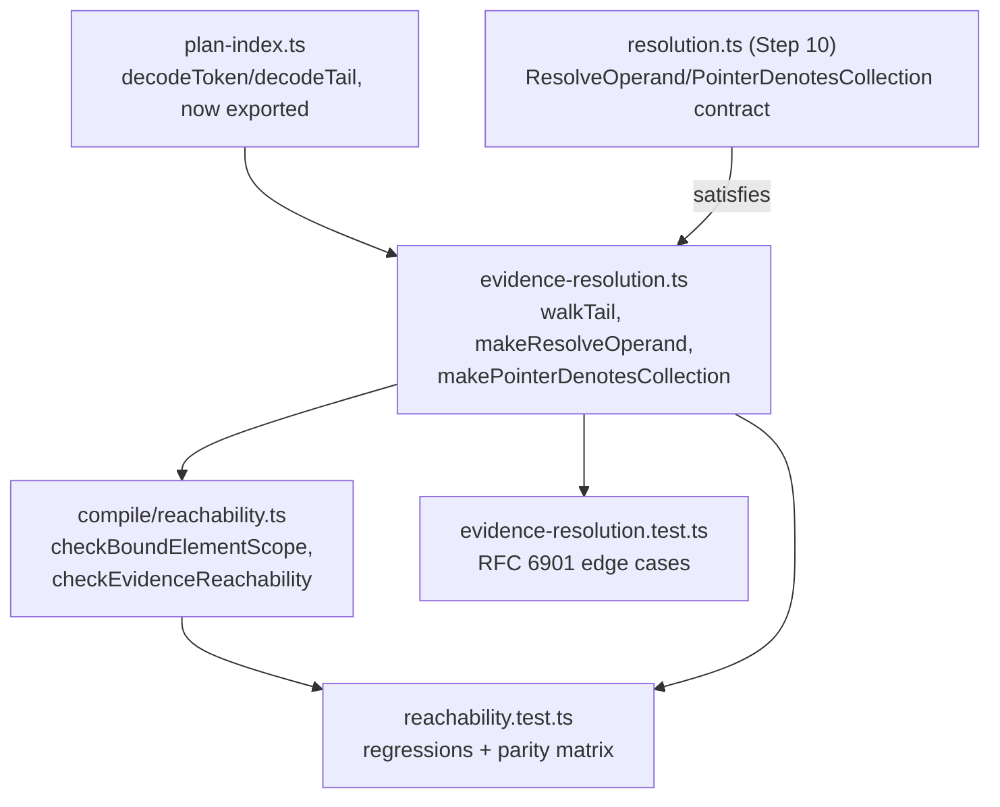
```mermaid
flowchart TD
  PLANIDX["plan-index.ts<br/>decodeToken/decodeTail, now exported"]
  RES["resolution.ts (Step 10)<br/>ResolveOperand/PointerDenotesCollection contract"]
  EVIDRES["evidence-resolution.ts<br/>walkTail, makeResolveOperand,<br/>makePointerDenotesCollection"]
  REACH["compile/reachability.ts<br/>checkBoundElementScope,<br/>checkEvidenceReachability"]
  RESTESTS["evidence-resolution.test.ts<br/>RFC 6901 edge cases"]
  REACHTESTS["reachability.test.ts<br/>regressions + parity matrix"]

  PLANIDX --> EVIDRES
  RES -- satisfies --> EVIDRES
  EVIDRES --> REACH
  EVIDRES --> RESTESTS
  REACH --> REACHTESTS
  EVIDRES --> REACHTESTS
```

## Step 13 (epic4-story2): the AD-5 registry as code, twelve more compile-time checks

**What:** five new modules, thirteen new functions, covering twelve of AD-5's twenty-one codes:
per-behaviour declarations (`declarations.ts`), an oracle's direction against its check
(`oracle-alignment.ts`), the rest of the `check`-tree legality rules (`expression-legality.ts`), the
interface and interaction-plan inventory (`interface-inventory.ts`), and waiver completeness
(`waivers.ts`).

**Why:** Step 12 built the shared pointer walk and reachability. This step is everything else a
`check` tree, an oracle, an interface list, or a waiver can get wrong on its own: one place per AD-5
code, so two compilers can't invent two different answers for it.

**Rules:**

- `direction-check-misaligned` computes containment *after* substituting a quantifier's `@/…`
  pointers against its own `collection` pointer, never over the raw operand text. `@/status` inside
  `for-all(collection: /items, …)` only becomes `/items/status`, a target a direction can name, once
  substituted. Skipping this step makes the containment check reject every oracle the quantifier
  syntax exists to make writable.
- The substitution is plain string concatenation, never decode-then-re-encode: the raw text after
  `@` is already valid RFC 6901 escaping, so appending it onto a rooted pointer stays valid with no
  round trip.
- `direction.relation` containment reads as "appears anywhere in `check`'s set of `op` values." AD-3
  says `check` "may be stronger" than the direction, so a relation matching a connective's inner
  operand still counts, even when it isn't `check`'s own root op.
- One shared tree walk, `walkExpression`, backs all five `expression-legality.ts` checks, the same
  DRY shape Step 12's `reachability.ts` already uses between its own two checks, widened here to also
  report an operand's op, position, and the live quantifier-nesting depth.
- Operand-kind legality per `(op, position)` is transcribed straight from `expression.ts`'s own doc
  comments. The schema admits every operand kind everywhere on purpose (AD-26 needs a reference set
  representable outside its three legal spots so `malformed-operator-expression` stays fireable), so
  the compiler is the only place that can reject a wrong kind.
- `quantifier-over-non-collection` only reads the `response-body` channel, matching AD-5's own wording
  ("the invoked operation's response descriptor"); every other channel stays permissive by design.
- `duplicate-operation-signature` compares every operation across every permitted interface as one
  flat list: AD-40 resolves a defect signature against the whole inventory, and a caller invoking two
  interfaces against one target can still get an ambiguous response.
- `checkRegexConstructs` scans the pattern text for a backreference or a lookbehind. It doesn't parse
  the pattern, so either spelling appearing inside a character class can fool it, the same
  imperfection `AnchoredPattern`'s own anchoring check already carries.
- No ordering exists among these thirteen functions, or against Step 12's two: each is independently
  correct for the one code it names, and a contract invalid under two codes at once reports whichever
  a caller reaches first. One orchestration layer is a later story's job.

**Read in this order:**

1. `src/core/compile/declarations.ts`: `checkRequirementLinkage`, `checkObservableSuccessCriterion`.
2. `src/core/compile/oracle-alignment.ts`: `substitutePointer`, `collectTargets`, `checkOracleChannel`,
   `checkOracleAlignment`.
3. `src/core/compile/expression-legality.ts`: the shared `walkExpression`, `checkOperandLegality`,
   `checkRegexConstructs`, `checkQuantifierNesting`, `checkQuantifierOverNonCollection`,
   `checkReferenceSetResolution`.
4. `src/core/compile/interface-inventory.ts`: `checkInterfaceKind`,
   `checkDuplicateOperationSignature`, `checkUndeclaredMandatoryInput`.
5. `src/core/compile/waivers.ts`: `checkWaiverCompleteness`.
6. `tests/compile/oracle-alignment.test.ts`: `gateCContract`'s O-004, the load-bearing proof that
   substitution is necessary at all (its direction target appears nowhere as raw text in its check).

**Watch out:**

- Two functions can legitimately disagree with each other about which code fires first on one
  operand (`checkOperandLegality` and `checkReferenceSetResolution` on a `{ referenceSet }` operand
  that is both illegal-position and undeclared). Neither coordinates with the other by design.
- `checkUndeclaredMandatoryInput` takes no `strict` parameter and always enforces; whether it is even
  called is a future orchestrator's decision.
- AD-16's forbidden-input-floor and scoped-reference codes have no thrower anywhere in `src/` yet.
  A pre-existing Epic 2 gap, named in this story's own AC 1 and left for a later story: closing it is
  out of Epic 4's stated scope.

**Story:** `_bmad-output/implementation-artifacts/4-2-the-ad-5-registry-as-code-and-the-structural-compile-checks.md`

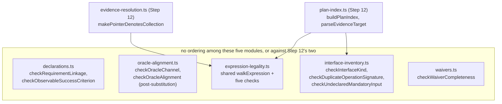
```mermaid
flowchart TD
  DECL["declarations.ts<br/>checkRequirementLinkage,<br/>checkObservableSuccessCriterion"]
  ORACLE["oracle-alignment.ts<br/>checkOracleChannel,<br/>checkOracleAlignment (post-substitution)"]
  EXPR["expression-legality.ts<br/>shared walkExpression +<br/>five checks"]
  IFACE["interface-inventory.ts<br/>checkInterfaceKind,<br/>checkDuplicateOperationSignature,<br/>checkUndeclaredMandatoryInput"]
  WAIVER["waivers.ts<br/>checkWaiverCompleteness"]
  EVIDRES2["evidence-resolution.ts (Step 12)<br/>makePointerDenotesCollection"]
  PLANIDX2["plan-index.ts (Step 12)<br/>buildPlanIndex, parseEvidenceTarget"]

  PLANIDX2 --> EXPR
  PLANIDX2 --> IFACE
  EVIDRES2 --> EXPR

  subgraph NOTE["no ordering among these five modules, or against Step 12's two"]
    DECL
    ORACLE
    EXPR
    IFACE
    WAIVER
  end
```

## Step 14 (epic4-story3): the last two stage-one AD-5 codes, a graph predicate over the interaction plan

**What:** one new module, `scripting-bound.ts`, two functions: `checkNestedTemporalClause` (a
step's `after` names a step that itself has an `after`) and `checkScriptingBound` (five metrics
over the plan's `after` edges: depth, width, shared anchors, disjoint pairs, step count).

**Why:** `InteractionStep.after` chains to any depth in the schema on purpose (Story 1.3's
deliberate deviation), so the schema alone can't stop a scripted plan in disguise. AD-39's two
adversarial shapes each beat one single-dimension check: an eight-step chain nests past the
one-level bound, caught by the depth check. Sixty-four independent `write`/`read` pairs are each
exactly one level deep, so depth misses them; the disjoint-pair count catches them. Width guards a
third shape, one step anchoring too many children, that neither example needs.

**Rules:**

- One pass over `after` builds three views at once: the one-hop nesting test, each anchor's child
  count, and an undirected adjacency map for a connected-component scan (disjoint pairs). No
  recursion, no memoization.
- At a fixed one-level bound, the one-hop nesting test also catches every cycle: a cycle needs
  each member's parent to carry its own `after`, and the one-hop test trips on the first member it
  visits. No separate cycle detection needed.
- Four numeric bounds (`WIDTH_MAX=2`, `SHARED_ANCHOR_MAX=2`, `DISJOINT_PAIR_MAX=4`,
  `STEP_COUNT_MAX=16`), each an exclusive ceiling, set against this repo's own two whole-contract
  fixtures as the accept floor and the epic's two adversarial shapes as the reject ceiling. No
  calibration corpus exists yet to derive them more precisely.
- A dangling `after` (naming no declared step, including one made unresolvable by a duplicate id)
  resolves to "no clause" in both checks, the same permissive default `undeclared-mandatory-input`
  already set for operation ids.
- `checkNestedTemporalClause` and `checkScriptingBound`'s depth dimension are independent,
  non-coordinating checks. Both fire on a nested chain; neither depends on the other having run.
- `computeGraphMetrics`'s internal maps key every graph node on each step's array position.
  `stepId` carries no schema-level uniqueness, so two distinct steps sharing one id would
  otherwise merge into one adjacency entry and corrupt the width/shared-anchor/disjoint-pair
  counts (found in review, fixture 20 pins it).

**Read in this order:**

1. `src/core/compile/scripting-bound.ts`: `parentOf`, `computeGraphMetrics`,
   `checkNestedTemporalClause`, `checkScriptingBound`.
2. `tests/compile/scripting-bound.test.ts`: the width/shared-anchor/disjoint-pair/step-count
   boundary pairs, each proving exactly-at-bound passes and one-past throws.

**Watch out:**

- `plan-exceeds-scripting-bound`'s `artifactPath` is always `EvalContract.interactionPlan`, the
  whole plan, never one step; `nested-temporal-clause`'s is per-step.
- No orchestrating entry point or ordering guarantee exists yet between this and Story 4.2's
  fifteen checks. That's Story 4.4's job.

**Story:** `_bmad-output/implementation-artifacts/4-3-the-scripting-bound-graph-predicate-and-its-adversarial-fixtures.md`

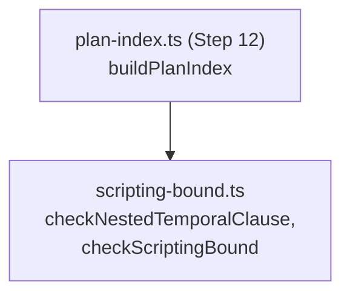
```mermaid
flowchart TD
  BOUND["scripting-bound.ts<br/>checkNestedTemporalClause,<br/>checkScriptingBound"]
  PLANIDX3["plan-index.ts (Step 12)<br/>buildPlanIndex"]

  PLANIDX3 --> BOUND
```

## Step 15 (epic4-story4): one compile entry point, one place that awaits, one layer gate

**What:** `core/compile/compile.ts` calls all 19 checks in a fixed order.
`application/compile.ts` parses unknown input and hands it to that stage.
`application/invoke-port.ts` is the only function in the package that awaits.
`npm run check:layers` reads every file under `src/` and fails if one imports across a forbidden
layer edge.

**Why:** before this story, 19 checks existed and nothing called them together, so which failure a
bad contract reported depended on which check the caller happened to run. The layer rules had the
same problem: the architecture said `core/` may not import `ports/`, and the only thing enforcing it
was a test that searched `core/seal/` for the text "core/compile" (a spelling real imports never
use).

**Rules:**

- Check order is AD-5 registry order, and compile stops at the first failure. Registry order is the
  only published stable order everyone already shares.
- Three checks share the code `malformed-operator-expression`, so they run in a fixed suborder:
  bound-element scope, operand legality, regex constructs.
- Strict mode defaults to true at the application boundary and is a required boolean in the core
  signature, so core behavior never reads an environment variable or a config file.
- `application/compile.ts` catches nothing. A `StructuralFailure` stays a `StructuralFailure`; it
  never becomes a runtime fault or an in-band result value.
- `invokePort` calls the port once, validates the request going out and the response coming back,
  and never retries. A `RuntimeFault` the port threw comes back as the same object; anything else
  becomes `port-failure`, or `aborted` if the signal aborted first.
- Compile and seal stay single synchronous functions. AD-34 splits a stage into plan and reduce only
  when it needs an outside observation, and neither of these does.
- `check:layers` parses with TypeScript's own tokenizer, so a comment or a string mentioning
  "await" is not a finding. It fails closed: an import it cannot read is reported as a violation.
- `core/` submodules may import each other. The diagram draws `core` as one node, so
  `core/seal/` reading `core/compile/` is a same-layer import; the prohibition is about leaving
  `core/`.
- Two registries now have a drift gate against the architecture document: `check:ad5-registry` for
  failure codes, `check:ad28-registry` for runtime fault codes.

**Read in this order:**

1. `src/core/compile/compile.ts`: the 19 calls, in order.
2. `src/application/compile.ts`: parse, default strict to true, delegate.
3. `src/application/invoke-port.ts`: the seven numbered steps of a port call.
4. `scripts/dependency-direction.ts`: `classifyLayer`, `isAllowedEdge`, `scanFile`.
5. `tests/architecture/dependency-direction.test.ts`: every allowed and forbidden edge, written from
   the story text, so the test does not check the checker against itself.

**Watch out:**

- Wiring all 19 checks into one pipeline surfaced that `populatedContract`'s own `scopedResources`
  trips a Story 4.2 stub check. Whole-contract tests clear that field first, via
  `cleanPopulatedContract()` in `tests/compile/helpers.ts`.
- Six of the ten runtime fault codes have no thrower yet. AD-28 fixes the registry independently of
  when each producing stage lands.
- `src/index.ts` is untouched. Story 6.5 publishes the library and CLI surface.

**Story:** `_bmad-output/implementation-artifacts/4-4-stages-as-pure-plan-and-reduce-pairs-with-one-orchestration-layer.md`

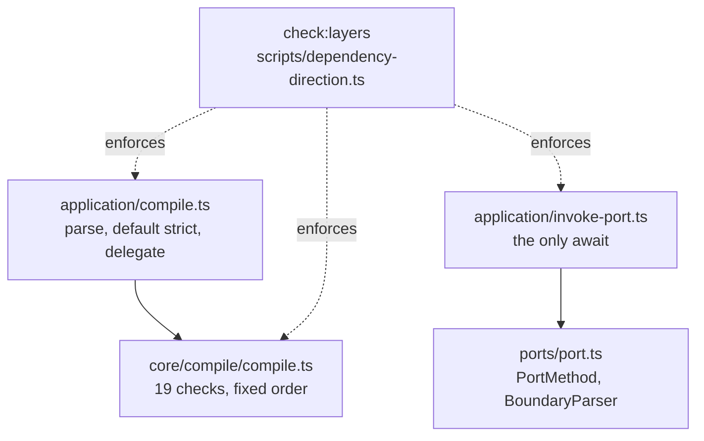
```mermaid
flowchart TD
  APPC["application/compile.ts<br/>parse, default strict, delegate"]
  CORE["core/compile/compile.ts<br/>19 checks, fixed order"]
  IP["application/invoke-port.ts<br/>the only await"]
  PORT["ports/port.ts<br/>PortMethod, BoundaryParser"]
  GATE["check:layers<br/>scripts/dependency-direction.ts"]

  APPC --> CORE
  IP --> PORT
  GATE -.enforces.-> APPC
  GATE -.enforces.-> CORE
  GATE -.enforces.-> IP
```

## Step 16 (epic5-story1): what a discipline rule applies to

**What:** `core/coverage/rules.ts` names AD-20's seven discipline rules. `core/coverage/relevance.ts`
answers one question per rule: does this contract have to satisfy it? The answer comes from
declarations only.

**Why:** "rule 6 does not apply here" is worth nothing when the contract's author is the one saying
so. The Gate C contract put a `rule` label on every oracle and the schema deleted it, because
reading that label back would turn fourteen decision procedures into self-assessment. These
predicates read the declarations, so a contract that declares almost nothing comes out relevant on
almost everything and under-declaring costs coverage.

**Rules:**

- Seven identifiers, minted once, spelled the way the Gate C contract spelled them. `Waiver.rule`
  and `CoverageGap.rule` are opaque strings, so this is the only thing joining a gap to a waiver.
- A predicate name is derived from its rule as `${rule}-relevance`, so a new rule arrives with one.
- A missing declaration makes the rule relevant. An explicitly empty one answers it.
  `collectionLocations: null` fires rule 4; `[]` does not.
- `successIndicator` has two spellings, so `null` there is absence and rule 1 fires.
- The empty pointer `''` is RFC 6901's whole document, a real answer. The check compares against
  `null`, so an empty indicator still counts as nominated.
- A contract declaring no operation makes all six operation-scoped rules relevant. That is the shape
  the design is built to catch.
- No predicate reads an oracle, a plan step, a waiver, a rubric, or a severity. Five fixtures delete
  each and assert the seven verdicts hold.
- Rule 5 reads `siblingGroups` at contract level. The operation list has no part in it.
- Nothing throws and nothing blocks. A coverage gap is recorded and the artifact still ships.

**Read in this order:**

1. `src/core/coverage/rules.ts`: the seven identifiers and the derived predicate name.
2. `src/core/coverage/relevance.ts`: seven predicates, then the map and the aggregate.
3. `tests/schemas/fixtures/relevance-contracts.ts`: the three contracts every fixture clones, one
   per declaration state.
4. `tests/coverage/relevance.test.ts`: 56 numbered fixtures, checked against the truth table in the
   story.
5. `tests/coverage/rules.test.ts`: the vocabulary pinned against the Gate C contract's spellings.

**Watch out:**

- `structuredClone` keeps shared references. All four transport channels of the absent contract come
  from one object, so a test replaces a whole channel; writing through one changes all four.
- Nothing calls these predicates yet. `core/compile/compile.ts` is untouched, because a gap record
  needs a satisfaction verdict and that is Story 5.2.
- One verdict covers the whole contract. One operation's missing declaration and another's present
  one land on the same answer, so Story 5.2 has to keep them apart.

**Story:** `_bmad-output/implementation-artifacts/5-1-the-seven-relevance-predicates.md`

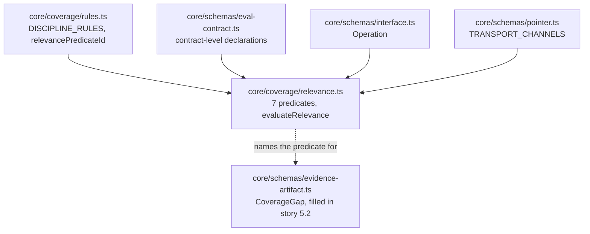
```mermaid
flowchart TD
  RULES["core/coverage/rules.ts<br/>DISCIPLINE_RULES, relevancePredicateId"]
  REL["core/coverage/relevance.ts<br/>7 predicates, evaluateRelevance"]
  CONTRACT["core/schemas/eval-contract.ts<br/>contract-level declarations"]
  IFACE["core/schemas/interface.ts<br/>Operation"]
  POINTER["core/schemas/pointer.ts<br/>TRANSPORT_CHANNELS"]
  GAP["core/schemas/evidence-artifact.ts<br/>CoverageGap, filled in story 5.2"]

  RULES --> REL
  CONTRACT --> REL
  IFACE --> REL
  POINTER --> REL
  REL -.names the predicate for.-> GAP
```

## Step 17 (epic5-story2): does the contract actually check it?

**What:** `core/coverage/satisfaction.ts` answers the second half of each discipline rule. For every
place a rule applies, is there an oracle that really reads it? The answer comes from the
declarations plus each oracle's direction and check.

**Why:** Step 16 said which rules a contract has to satisfy. That flags nothing on its own: a
contract can be relevant on all seven and still check nothing. These seven predicates walk every
site and demand a witness. Say an operation declares required response keys `id` and `ok`. If no
single oracle names both of them at one step, rule 2 is a gap, even though the contract does have an
oracle pointed at that step.

**Rules:**

- Satisfaction is "for every site, some oracle". Universal over sites, existential over oracles. A
  contract-level "some oracle somewhere" would let one well-declared operation cover another's gap.
- A rule with no site is satisfied for free, and the reason says so: `NO_RELEVANT_SITE`. So
  `satisfied` alone never tells you enough. Read the reason with it.
- A contract that declares no operation gets nothing for free. Six rules answer not satisfied, with
  `NO_OPERATION_WITNESS`.
- A declared pointer is `/ok`. An evidence target is `/interactions/create/response-body/ok`. Join
  them by pasting the prefix on the front; both spellings escape the same way, so no re-encoding.
- "Addresses" means names it or goes inside it, so `/items/0/id` addresses `/items`. Rule 4 is the
  one exception: a quantifier's collection has to equal the declared location exactly.
- Both channels have to read it. The direction names the pointer and the check reads it. One alone
  is no witness.
- Rule 2's whole-body oracle is the oracle that covers the whole body. No label is read: the schema
  deleted `oracles[].rule` on purpose, so an author cannot mark their own homework.
- Rule 7 needs the write pointer and the read pointer inside one expression node. Two `existence`
  calls under one `all` assert two facts and relate them to nothing.
- Nothing throws, same as Step 16. A gap gets recorded and the artifact still ships.

**Read in this order:**

1. `src/core/coverage/satisfaction.ts`: the pointer join and the check walk at the top, then the
   seven predicates, then the map and the aggregate.
2. `src/core/coverage/rules.ts`: `satisfactionPredicateId`, the twin of the relevance one.
3. `tests/coverage/fixtures/satisfaction-contracts.ts`: the one contract where all seven rules
   apply and all seven are satisfied. Its header says which oracle witnesses which rule.
4. `tests/coverage/satisfaction.test.ts`: fixtures 59 to 129, against the truth table in the story.
5. `tests/coverage/rules.test.ts`: fixtures 130 and 131, pinning that no relevance name ever equals
   a satisfaction name.

**Watch out:**

- A fixture asserting only `satisfied: true` can pass because the rule stopped having a site. Every
  positive here asserts its reason too.
- `structuredClone` keeps shared references, the same trap as Step 16. The fixture builds several
  transport channels from one object, so a test replaces the whole channel; writing through one
  changes several.
- Still nothing calls these. `compile` is untouched. A gap record needs a severity and no
  declaration maps a rule to one, so that is story 5.3.
- `relevance.ts` is untouched on purpose. Fixture 67 pins that both halves agree on which rules have
  no site at all.

**Story:** `_bmad-output/implementation-artifacts/5-2-the-seven-satisfaction-predicates.md`

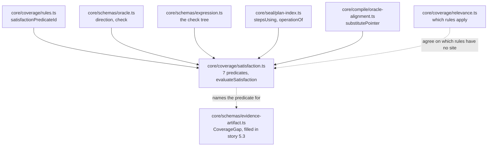
```mermaid
flowchart TD
  RULES["core/coverage/rules.ts<br/>satisfactionPredicateId"]
  REL["core/coverage/relevance.ts<br/>which rules apply"]
  SAT["core/coverage/satisfaction.ts<br/>7 predicates, evaluateSatisfaction"]
  ORACLE["core/schemas/oracle.ts<br/>direction, check"]
  EXPR["core/schemas/expression.ts<br/>the check tree"]
  PLANIDX["core/seal/plan-index.ts<br/>stepsUsing, operationOf"]
  ALIGN["core/compile/oracle-alignment.ts<br/>substitutePointer"]
  GAP["core/schemas/evidence-artifact.ts<br/>CoverageGap, filled in story 5.3"]

  RULES --> SAT
  ORACLE --> SAT
  EXPR --> SAT
  PLANIDX --> SAT
  ALIGN --> SAT
  REL -.agree on which rules have no site.-> SAT
  SAT -.names the predicate for.-> GAP
```
## Step 18 (epic5-story3): the table is generated output

**What:** nineteen hand-written contracts covering all seven rules in all four declaration states, a
pure builder that runs the fourteen predicates over them and renders a markdown document, and a
byte-exact drift check in CI.

**Why:** a table of predicates kept by hand goes stale the day someone renames a predicate, and
nothing notices. Here the document is generated from the same functions the library ships, so a rule
that stops being covered fails the build. The worked example in this repo is the proof: it has
disagreed with the code for months and no check ever said so.

**Rules:**

- Four declaration states: absent, explicitly empty, witnessed, unwitnessed. Seven rules times four
  states is twenty-eight cells.
- Absent and unwitnessed both answer relevant and not satisfied. The reason is what tells them
  apart, so every fixture asserts the reason.
- Not relevant plus not satisfied is impossible. A rule that applies nowhere is satisfied for free,
  so the fourth combination has no contract and the document says so.
- Nineteen contracts fill twenty-eight cells, because two rules can read the same declaration.
- A corpus contract does not have to compile. Two of the nineteen do not: an empty operation list
  means the plan names operations nothing declares.
- The builder throws on an unfilled cell. Four checks: unique ids, every cell resolves, every cell
  filled exactly once, and every cell's contract really produces the verdicts it claims.
- The generator writes bytes; the checker rebuilds and compares. Neither can drift from the other,
  because both call one function.
- CI mutates a predicate name and asserts the check fails. A hand-kept table would survive that.
- Nothing calls the predicates from `compile`. A gap never blocks, so wiring it into a stage that
  throws would read as if it did.

**Read in this order:**

1. `src/core/coverage/coverage.ts`: `evaluateCoverage` pairs the two verdict arrays into gap
   records; `coverageSeverity` takes the highest declared behaviour severity.
2. `src/core/coverage/table.ts`: the four states, the verdict pair each one asserts, the four
   diagnoses, and the renderer.
3. `tests/coverage/fixtures/corpus.ts`: the nineteen contracts and the twenty-eight-cell index.
   Every contract is one small change to the Step 17 seed.
4. `scripts/generate-ad31-table.ts` and `scripts/check-ad31-table.ts`: write, and compare.
5. `docs/ad31-coverage-predicates.generated.md`: the output. 133 matrix rows, 18 gap rows.
6. `tests/coverage/corpus.test.ts`, `coverage.test.ts`, `table.test.ts`: fixtures 151 to 231.

**Watch out:**

- Do not import `core/compile/` into `table.ts`. `core/canonical/scan-json.ts` uses a constructor
  parameter property, which Node's type stripper rejects, so both scripts would die at load.
- `core/` outside `core/schemas/` may not import Zod, not even as a type. The `CoverageGap` and
  `Severity` type aliases live in the schema files for that reason.
- The corpus lives under `tests/`, so it never ships in `dist`. Both scripts import from `tests/`,
  which is new in this repo and allowed.
- Editing `README.md` makes `_bmad-output/shareable/` stale. Run `npm run build:shareable`.
- One conjunct in `evaluateCoverage` cannot be caught by any test, because the case it guards
  cannot happen today. It stays, with a comment saying which fixture would catch a change.

**Story:** `_bmad-output/implementation-artifacts/5-3-the-contract-fixture-corpus-and-the-regenerated-table.md`

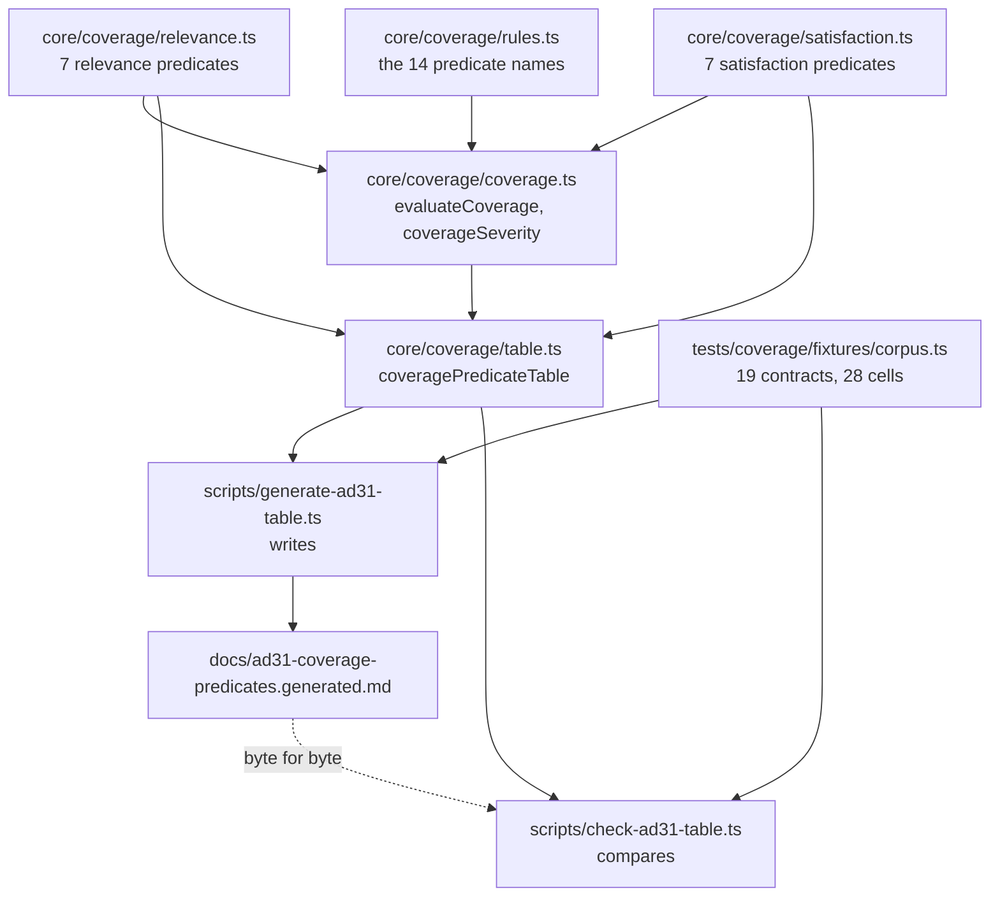
```mermaid
flowchart TD
  REL["core/coverage/relevance.ts<br/>7 relevance predicates"]
  SAT["core/coverage/satisfaction.ts<br/>7 satisfaction predicates"]
  RULES["core/coverage/rules.ts<br/>the 14 predicate names"]
  COV["core/coverage/coverage.ts<br/>evaluateCoverage, coverageSeverity"]
  TABLE["core/coverage/table.ts<br/>coveragePredicateTable"]
  CORPUS["tests/coverage/fixtures/corpus.ts<br/>19 contracts, 28 cells"]
  GEN["scripts/generate-ad31-table.ts<br/>writes"]
  CHECK["scripts/check-ad31-table.ts<br/>compares"]
  DOC["docs/ad31-coverage-predicates.generated.md"]

  REL --> COV
  SAT --> COV
  RULES --> COV
  COV --> TABLE
  REL --> TABLE
  SAT --> TABLE
  CORPUS --> GEN
  CORPUS --> CHECK
  TABLE --> GEN
  TABLE --> CHECK
  GEN --> DOC
  DOC -.byte for byte.-> CHECK
```
## Step 19 (epic6-story1): ports, adapters, and a suite you can run

**What:** four port types, three adapters that implement them, a pure rule deciding which network
address a probe is allowed to reach, and a conformance suite published as
`eval-quality/conformance` that hands an adapter author back a report.

**Why:** someone writing an adapter outside this repo has no way to know if it is right. The prose
says "call the underlying thing exactly once" and nothing checks it. An adapter that quietly retries
once on failure looks the same as a correct one until a probe fires twice at the system under test
and the state-reset check reads a value the first call already changed. Run the suite and that
adapter fails on a named line.

**The shape, in call order.** Solid arrows are the call path; the dotted ones are the suite, which
sits outside that path and drives anything claiming to implement a port. That last part is what a
plain ports-and-adapters drawing has no room for.

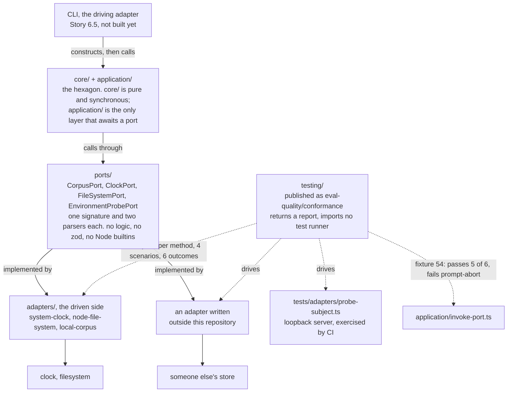
```mermaid
flowchart TD
  CLI["CLI, the driving adapter<br/>Story 6.5, not built yet"]
  CORE["core/ + application/<br/>the hexagon. core/ is pure and synchronous;<br/>application/ is the only layer that awaits a port"]
  PORTS["ports/<br/>CorpusPort, ClockPort, FileSystemPort, EnvironmentProbePort<br/>one signature and two parsers each. no logic, no zod, no Node builtins"]
  SHIPPED["adapters/, the driven side<br/>system-clock, node-file-system, local-corpus"]
  YOURS["an adapter written<br/>outside this repository"]
  OUT1["clock, filesystem"]
  OUT2["someone else's store"]
  SUITE["testing/<br/>published as eval-quality/conformance<br/>returns a report, imports no test runner"]
  SUBJ["tests/adapters/probe-subject.ts<br/>loopback server, exercised by CI"]
  IP["application/invoke-port.ts"]

  CLI -- "constructs, then calls" --> CORE
  CORE -- "calls through" --> PORTS
  PORTS -- "implemented by" --> SHIPPED
  PORTS -- "implemented by" --> YOURS
  SHIPPED --> OUT1
  YOURS --> OUT2
  SUITE -. "4 subjects per method, 4 scenarios, 6 outcomes" .-> SHIPPED
  SUITE -. "drives" .-> YOURS
  SUITE -. "drives" .-> SUBJ
  SUITE -. "fixture 54: passes 5 of 6, fails prompt-abort" .-> IP
```

**Rules:**

- The suite hands back a report. It cannot import the consumer's test runner, so `testing/` may not
  import an external module or a Node builtin at all.
- The suite never sees `core/probe/`. A suite sharing the subject's own decision procedure would
  pass any subject that shared it too.
- Every mechanism returns `unknown`. Give it a precise type and the adapter can build its response
  from a value it already holds, so the response check can never fail.
- Six assertions per port method, each id prefixed by the method name. Two of them count calls,
  because a retry shows up on failure and not on success.
- The adapters race the abort signal and `invokePort` does not. A mechanism that never settles makes
  `invokePort` never settle, and an adapter is the thing that has to fix that.
- Every spelling of one address reduces to a single string before anything is compared. `127.0.0.1`
  and `::ffff:127.0.0.1` are one address; compare the text and you get two.
- Reducing two spellings to one string widens the allowlist, so only the IPv4-mapped form does it.
  `::127.0.0.1` is classified as loopback and still denied against an entry naming `127.0.0.1`.
- `metadata` is decided before `link-local` and `private`. `169.254.169.254` sits inside
  `169.254.0.0/16`, and calling it link-local hides the one denial an operator has to read.
- Seven denial reasons, one fault code. A denied target throws `forbidden-target` and a cap throws
  `budget-exhausted`. One says the contract aimed somewhere forbidden, the other says an allowed
  target answered too much or too slowly.
- A 500 is an observation. Throw on it and every seeded fault the pre-flight watches for goes
  invisible.

**Read in this order:**

1. `src/core/schemas/port-messages.ts`: the request and response shape of every port method.
2. `src/core/schemas/probe-policy.ts`: one authorized target, as data. No field has a default,
   because a missing cap is an unbounded cap.
3. `src/core/probe/target-policy.ts`: `parseAddress` reduces a spelling to one form and names its
   class; `evaluateTarget` walks interface, scheme, host, port, address, method in that order.
4. `src/ports/*.ts`: four port types, each a method signature plus the two parsers its boundary
   needs. `environment-probe-port.ts` carries the four rules an implementation has to follow.
5. `src/adapters/port-boundary.ts`: the five steps every adapter method runs, in one place.
6. `src/adapters/*-adapter.ts`: the three shipped adapters, each a factory over a mechanism you can
   swap out.
7. `src/testing/conformance.ts`: the six shared assertions and the report shape.
8. `src/testing/probe-conformance.ts`: thirteen more, for the probe port only.
9. `tests/adapters/probe-subject.ts`: a real loopback server and the adapter that talks to it.
10. `tests/testing/conformance.test.ts`: one broken subject per assertion, each proving that
    assertion can actually fail.

**Watch out:**

- The probe adapter lives under `tests/`, which `tsconfig-build.json` excludes, so no network
  adapter reaches `dist/`. That is the only reading under which AD-2 and AD-37 both hold.
- `ports/` may not import Zod. The port files pull schema objects from `core/schemas` and use each
  name in both type and value position, so a plain `import` is right there; `import type` breaks the
  parser export.
- A layer may import itself. A cross-layer edge the graph does not draw is still forbidden, so
  nothing may import `cli/` or `testing/`.
- The fixture server binds port 0 and reads the port back. A fixed port collides under parallel
  workers and the failure looks like a policy bug.
- A byte cap counts bytes. `setEncoding('utf8')` and `body.length` count UTF-16 code units, so a
  256-byte cap lets 768 bytes of three-byte characters through.
- Editing `README.md` makes `_bmad-output/shareable/` stale. Run `npm run build:shareable`.

**Story:** `_bmad-output/implementation-artifacts/6-1-ports-and-the-published-conformance-suite.md`

```mermaid
flowchart TD
  MSG["core/schemas/port-messages.ts<br/>request and response shapes"]
  POL["core/schemas/probe-policy.ts<br/>one authorized target"]
  TP["core/probe/target-policy.ts<br/>parseAddress, evaluateTarget"]
  PORT["ports/port.ts<br/>PortMethod, BoundaryParser"]
  PORTS["ports/*-port.ts<br/>4 port types + parser pairs"]
  PB["adapters/port-boundary.ts<br/>the 5 steps"]
  AD["adapters/*-adapter.ts<br/>clock, file system, corpus"]
  CONF["testing/conformance.ts<br/>6 shared assertions"]
  PROBE["testing/probe-conformance.ts<br/>13 AD-35 assertions"]
  IDX["testing/index.ts<br/>eval-quality/conformance"]
  SUBJ["tests/adapters/probe-subject.ts<br/>loopback server + adapter"]

  MSG --> PORTS
  PORT --> PORTS
  POL --> TP
  PORTS --> PB
  PB --> AD
  PORTS --> CONF
  CONF --> PROBE
  CONF --> IDX
  PROBE --> IDX
  PB --> SUBJ
  TP --> SUBJ
  AD --> CONF
  SUBJ --> PROBE
```
