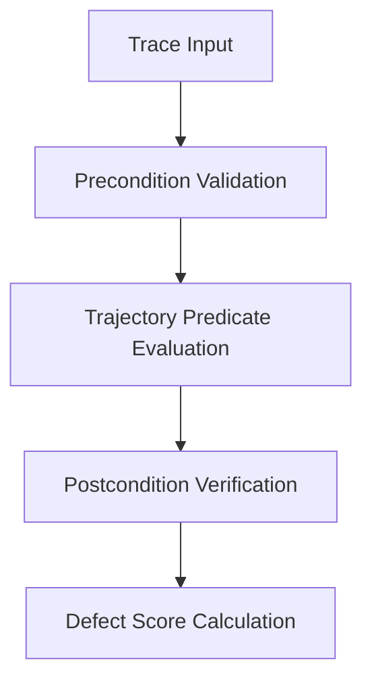

# Behavioral Evaluation Contracts

A **Behavioral Evaluation Contract** is a formal specification that asserts invariants over agent execution traces.

---

## Background

Deterministic unit tests check exact output values. AI agents operate stochastically over unstructured data.

String matching and regex break when agents reformat output while preserving intent. LLM-as-a-judge evaluations introduce flakiness and runtime cost.

Behavioral Evaluation Contracts combine three verification layers:

1. **Preconditions**: Validating input context, token bounds, and prompt integrity.
2. **Trajectory Invariants**: Monitoring intermediate reasoning steps and tool invocations.
3. **Postcondition Oracles**: Evaluating structural, semantic, and boundary predicates.

---

## Contract Verification Lifecycle

---

## Design Principles

- **Execution Separation**: Contracts run independently of execution engines and LLM providers.
- **Reproducibility**: Identical trace corpora produce identical evaluation scores.
- **Lineage Tracing**: Every contract predicate traces back to an Architectural Decision (AD).
