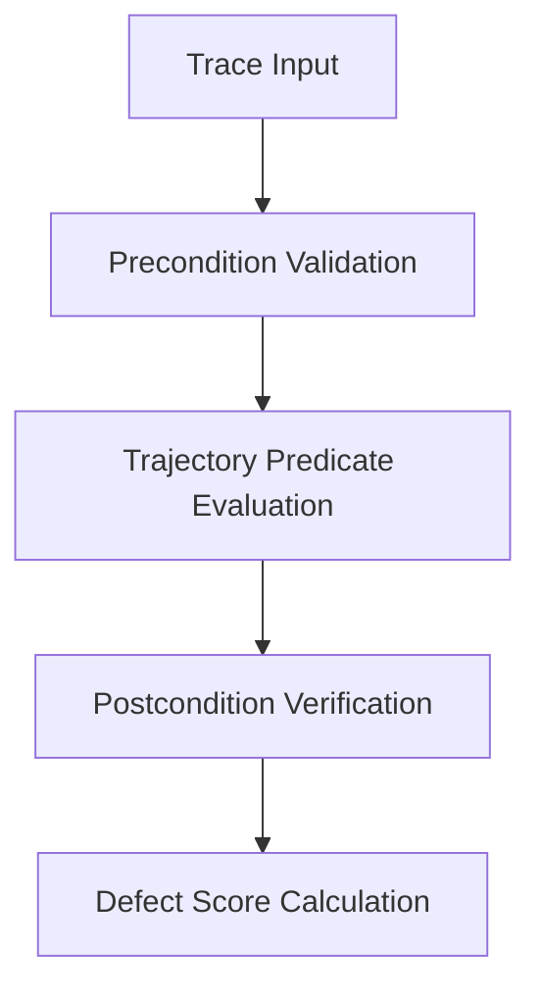

# Behavioral Evaluation Contracts

A **Behavioral Evaluation Contract** is a formal specification that asserts behavioral invariants over agent execution traces.

---

## Why Behavioral Contracts?

Traditional software testing relies on deterministic inputs and static outputs. AI agents, however, operate stochastically over unstructured data.

Standard string matching or regex assertions break down when agents format outputs differently while preserving semantic intent. Conversely, relying solely on LLM-as-a-judge introduces instability and high costs.

Behavioral Evaluation Contracts solve this problem by combining:

1. **Precondition Constraints**: Validating input context, token bounds, and prompt integrity.
2. **Execution Trajectory Invariants**: Monitoring intermediate reasoning steps and tool invocations.
3. **Postcondition Oracles**: Rigorous structural, semantic, and boundary predicates.

---

## Contract Verification Lifecycle

---

## Architectural Principles

- **Separation of Concerns**: Contracts are independent of execution engines or LLM providers.
- **Reproducibility**: Identical trace corpora produce identical evaluation scores.
- **Lineage Transparency**: Every contract predicate traces back to an Architectural Decision (AD).
